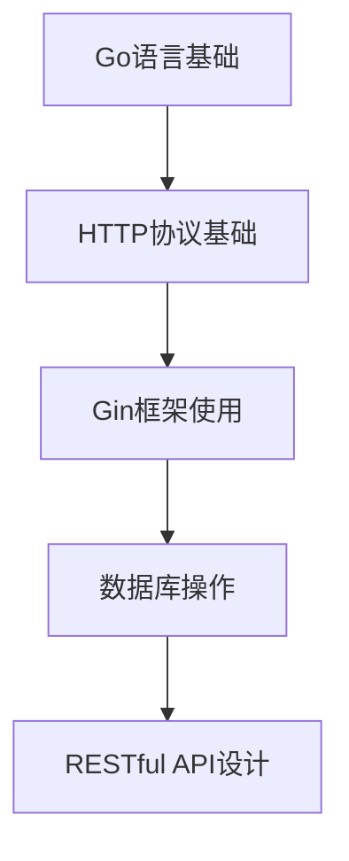
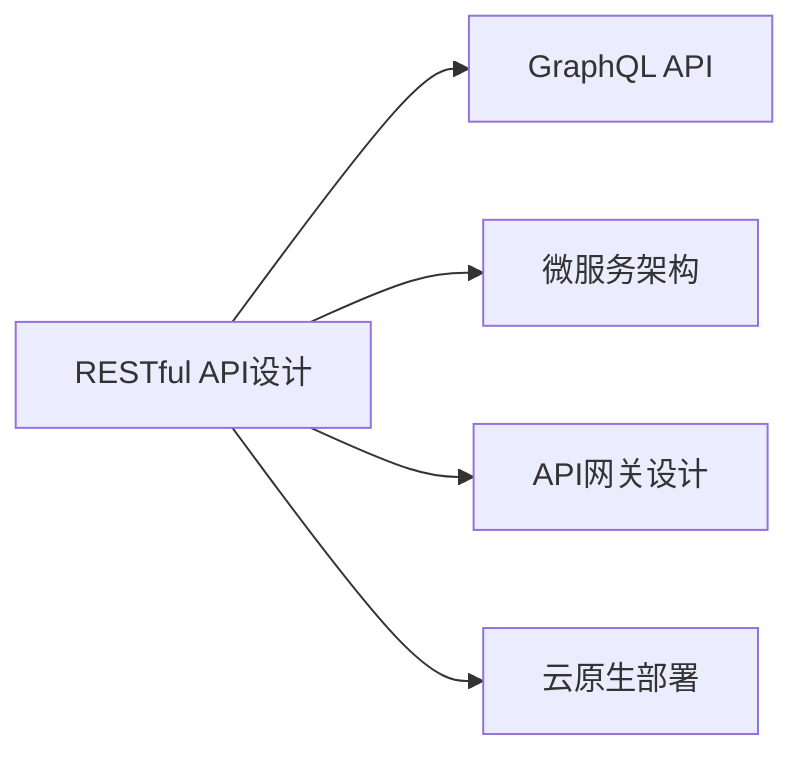

# RESTful API 设计模式

> **文档简介**: 全面介绍RESTful API设计原则、最佳实践和Go语言实现方法，涵盖从基础概念到高级设计模式的完整知识体系

> **目标读者**: 中高级Go开发者，需要设计和实现高质量API的开发者

> **前置知识**: Go语言基础、Gin框架使用、HTTP协议基础

> **预计时长**: 4-6小时学习 + 2-3小时实践

## 📚 文档元数据

| 属性 | 内容 |
|------|------|
| **模块** | `01-go-backend` |
| **分类** | `advanced-topics/api-design` |
| **难度** | ⭐⭐⭐⭐ (4/5) |
| **标签** | `#RESTful` `#API设计` `#设计模式` `#Gin框架` |
| **更新日期** | `2025年10月` |
| **作者** | Dev Quest Team |
| **状态** | ✅ 已完成 |

## 🎯 学习目标

完成本模块后，你将能够：

1. **掌握RESTful设计原则**
   - 理解REST架构的核心概念
   - 掌握资源导向的设计思想
   - 设计符合REST规范的API接口

2. **实践API设计模式**
   - 设计完整的CRUD操作接口
   - 实现复杂的查询和筛选功能
   - 构建可扩展的API架构

3. **应用最佳实践**
   - 实现统一的错误处理机制
   - 设计合理的版本控制策略
   - 构建高效的API安全体系

4. **性能优化与监控**
   - 实现API缓存策略
   - 设计限流和熔断机制
   - 构建API性能监控体系

## 📋 学习内容

### 1. RESTful 基础理论
- REST架构原理
- 资源导向设计
- HTTP方法语义
- 状态码规范
- 无状态设计

### 2. API 设计模式
- CRUD操作设计
- 分页和排序
- 高级查询筛选
- 嵌套资源处理
- 批量操作接口

### 3. 数据传输格式
- JSON数据结构设计
- XML格式支持
- 内容协商机制
- 数据验证规则

### 4. API版本控制
- URL版本控制
- Header版本控制
- 向后兼容策略
- 版本迁移方案

### 5. 安全与认证
- JWT令牌认证
- OAuth 2.0授权
- API密钥管理
- HTTPS安全传输

### 6. 性能优化
- 响应缓存策略
- 数据库查询优化
- 连接池管理
- 异步处理机制

## 🔍 核心概念

### RESTful 架构原则

#### 1. 资源导向设计
**定义**: 将业务实体抽象为资源，通过URI标识资源

**关键特性**:
- 每个资源都有唯一的URI标识
- 资源可以是实体（用户、订单）或概念（搜索结果）
- 资源之间的关系通过链接表达

**示例**:
```go
// 用户资源
GET    /api/v1/users           // 获取用户列表
GET    /api/v1/users/{id}      // 获取特定用户
POST   /api/v1/users           // 创建新用户
PUT    /api/v1/users/{id}      // 更新用户
DELETE /api/v1/users/{id}      // 删除用户

// 嵌套资源
GET    /api/v1/users/{id}/orders     // 获取用户的订单
POST   /api/v1/users/{id}/orders     // 为用户创建订单
```

#### 2. HTTP方法语义
**定义**: 正确使用HTTP动词表达操作意图

**方法对应关系**:
- `GET`: 获取资源（安全、幂等）
- `POST`: 创建资源（非安全、非幂等）
- `PUT`: 完整更新资源（非安全、幂等）
- `PATCH`: 部分更新资源（非安全、幂等）
- `DELETE`: 删除资源（非安全、幂等）

#### 3. 状态码规范
**定义**: 使用HTTP状态码准确表达操作结果

**常用状态码**:
```go
// 成功响应
200 OK                 // 请求成功
201 Created           // 资源创建成功
204 No Content        // 删除成功，无内容返回

// 客户端错误
400 Bad Request       // 请求参数错误
401 Unauthorized      // 未授权
403 Forbidden         // 禁止访问
404 Not Found         // 资源不存在
422 Unprocessable Entity // 请求格式正确但语义错误

// 服务器错误
500 Internal Server Error // 服务器内部错误
503 Service Unavailable   // 服务不可用
```

## 🛠️ 实践指南

### 步骤一：设计API结构

**目标**: 建立清晰的API架构

**操作指南**:
1. **定义资源模型**
```go
type User struct {
    ID        uint      `json:"id"`
    Username  string    `json:"username"`
    Email     string    `json:"email"`
    CreatedAt time.Time `json:"created_at"`
    UpdatedAt time.Time `json:"updated_at"`
}

type CreateUserRequest struct {
    Username string `json:"username" binding:"required,min=3,max=50"`
    Email    string `json:"email" binding:"required,email"`
    Password string `json:"password" binding:"required,min=8"`
}
```

2. **设计路由结构**
```go
func setupUserRoutes(r *gin.Engine) {
    v1 := r.Group("/api/v1")
    {
        users := v1.Group("/users")
        {
            users.GET("", listUsers)
            users.POST("", createUser)
            users.GET("/:id", getUser)
            users.PUT("/:id", updateUser)
            users.DELETE("/:id", deleteUser)

            // 嵌套资源
            users.GET("/:id/orders", listUserOrders)
            users.POST("/:id/orders", createUserOrder)
        }
    }
}
```

**验证方法**: 检查路由是否符合RESTful规范

### 步骤二：实现控制器

**目标**: 实现标准的CRUD操作

**操作指南**:
```go
// 用户控制器
type UserController struct {
    userService *UserService
}

// 获取用户列表
func (c *UserController) ListUsers(ctx *gin.Context) {
    page, _ := strconv.Atoi(ctx.DefaultQuery("page", "1"))
    limit, _ := strconv.Atoi(ctx.DefaultQuery("limit", "10"))
    search := ctx.Query("search")

    users, total, err := c.userService.GetUsers(page, limit, search)
    if err != nil {
        ctx.JSON(http.StatusInternalServerError, gin.H{
            "error": "Failed to fetch users",
        })
        return
    }

    ctx.JSON(http.StatusOK, gin.H{
        "data": users,
        "pagination": gin.H{
            "page":  page,
            "limit": limit,
            "total": total,
        },
    })
}

// 创建用户
func (c *UserController) CreateUser(ctx *gin.Context) {
    var req CreateUserRequest
    if err := ctx.ShouldBindJSON(&req); err != nil {
        ctx.JSON(http.StatusBadRequest, gin.H{
            "error": "Invalid request data",
            "details": err.Error(),
        })
        return
    }

    user, err := c.userService.CreateUser(req)
    if err != nil {
        ctx.JSON(http.StatusInternalServerError, gin.H{
            "error": "Failed to create user",
        })
        return
    }

    ctx.JSON(http.StatusCreated, gin.H{
        "data": user,
    })
}
```

### 步骤三：错误处理机制

**目标**: 建立统一的错误处理体系

**操作指南**:
```go
// 错误响应结构
type ErrorResponse struct {
    Error   string `json:"error"`
    Details string `json:"details,omitempty"`
    Code    string `json:"code,omitempty"`
}

// 全局错误处理中间件
func ErrorHandler() gin.HandlerFunc {
    return func(c *gin.Context) {
        c.Next()

        // 处理错误
        if len(c.Errors) > 0 {
            err := c.Errors.Last().Type

            var statusCode int
            var message string

            switch err {
            case gin.ErrorTypeBind:
                statusCode = http.StatusBadRequest
                message = "Invalid request data"
            case gin.ErrorTypePublic:
                statusCode = http.StatusBadRequest
                message = c.Errors.Last().Error()
            default:
                statusCode = http.StatusInternalServerError
                message = "Internal server error"
            }

            c.JSON(statusCode, ErrorResponse{
                Error: message,
                Details: c.Errors.Last().Error(),
            })
        }
    }
}

// 自定义错误类型
type APIError struct {
    StatusCode int
    Code       string
    Message    string
}

func (e *APIError) Error() string {
    return e.Message
}

// 预定义错误
var (
    ErrUserNotFound = &APIError{
        StatusCode: http.StatusNotFound,
        Code:       "USER_NOT_FOUND",
        Message:    "User not found",
    }

    ErrInvalidCredentials = &APIError{
        StatusCode: http.StatusUnauthorized,
        Code:       "INVALID_CREDENTIALS",
        Message:    "Invalid username or password",
    }
)
```

## 💻 代码示例

### 示例一：基础CRUD API
```go
package main

import (
    "net/http"
    "strconv"

    "github.com/gin-gonic/gin"
    "gorm.io/gorm"
)

type User struct {
    gorm.Model
    Username string `json:"username" gorm:"unique;not null"`
    Email    string `json:"email" gorm:"unique;not null"`
}

type UserService struct {
    db *gorm.DB
}

func NewUserService(db *gorm.DB) *UserService {
    return &UserService{db: db}
}

func (s *UserService) GetUsers(page, limit int, search string) ([]User, int64, error) {
    var users []User
    var total int64

    query := s.db.Model(&User{})

    if search != "" {
        query = query.Where("username ILIKE ? OR email ILIKE ?",
            "%"+search+"%", "%"+search+"%")
    }

    query.Count(&total)

    offset := (page - 1) * limit
    err := query.Offset(offset).Limit(limit).Find(&users).Error

    return users, total, err
}

func (s *UserService) CreateUser(user *User) error {
    return s.db.Create(user).Error
}

func (s *UserService) GetUserByID(id uint) (*User, error) {
    var user User
    err := s.db.First(&user, id).Error
    return &user, err
}

func (s *UserService) UpdateUser(id uint, updates *User) error {
    return s.db.Model(&User{}).Where("id = ?", id).Updates(updates).Error
}

func (s *UserService) DeleteUser(id uint) error {
    return s.db.Delete(&User{}, id).Error
}

// 控制器
type UserController struct {
    userService *UserService
}

func NewUserController(userService *UserService) *UserController {
    return &UserController{userService: userService}
}

func (c *UserController) ListUsers(ctx *gin.Context) {
    page, _ := strconv.Atoi(ctx.DefaultQuery("page", "1"))
    limit, _ := strconv.Atoi(ctx.DefaultQuery("limit", "10"))
    search := ctx.Query("search")

    users, total, err := c.userService.GetUsers(page, limit, search)
    if err != nil {
        ctx.JSON(http.StatusInternalServerError, gin.H{
            "error": "Failed to fetch users",
        })
        return
    }

    ctx.JSON(http.StatusOK, gin.H{
        "data": users,
        "pagination": gin.H{
            "page":  page,
            "limit": limit,
            "total": total,
        },
    })
}

func (c *UserController) CreateUser(ctx *gin.Context) {
    var user User
    if err := ctx.ShouldBindJSON(&user); err != nil {
        ctx.JSON(http.StatusBadRequest, gin.H{
            "error": "Invalid request data",
            "details": err.Error(),
        })
        return
    }

    err := c.userService.CreateUser(&user)
    if err != nil {
        ctx.JSON(http.StatusInternalServerError, gin.H{
            "error": "Failed to create user",
        })
        return
    }

    ctx.JSON(http.StatusCreated, gin.H{
        "data": user,
    })
}

func (c *UserController) GetUser(ctx *gin.Context) {
    id, err := strconv.ParseUint(ctx.Param("id"), 10, 32)
    if err != nil {
        ctx.JSON(http.StatusBadRequest, gin.H{
            "error": "Invalid user ID",
        })
        return
    }

    user, err := c.userService.GetUserByID(uint(id))
    if err != nil {
        if err == gorm.ErrRecordNotFound {
            ctx.JSON(http.StatusNotFound, gin.H{
                "error": "User not found",
            })
            return
        }

        ctx.JSON(http.StatusInternalServerError, gin.H{
            "error": "Failed to fetch user",
        })
        return
    }

    ctx.JSON(http.StatusOK, gin.H{
        "data": user,
    })
}

func (c *UserController) UpdateUser(ctx *gin.Context) {
    id, err := strconv.ParseUint(ctx.Param("id"), 10, 32)
    if err != nil {
        ctx.JSON(http.StatusBadRequest, gin.H{
            "error": "Invalid user ID",
        })
        return
    }

    var updates User
    if err := ctx.ShouldBindJSON(&updates); err != nil {
        ctx.JSON(http.StatusBadRequest, gin.H{
            "error": "Invalid request data",
        })
        return
    }

    err = c.userService.UpdateUser(uint(id), &updates)
    if err != nil {
        ctx.JSON(http.StatusInternalServerError, gin.H{
            "error": "Failed to update user",
        })
        return
    }

    ctx.JSON(http.StatusOK, gin.H{
        "message": "User updated successfully",
    })
}

func (c *UserController) DeleteUser(ctx *gin.Context) {
    id, err := strconv.ParseUint(ctx.Param("id"), 10, 32)
    if err != nil {
        ctx.JSON(http.StatusBadRequest, gin.H{
            "error": "Invalid user ID",
        })
        return
    }

    err = c.userService.DeleteUser(uint(id))
    if err != nil {
        ctx.JSON(http.StatusInternalServerError, gin.H{
            "error": "Failed to delete user",
        })
        return
    }

    ctx.JSON(http.StatusNoContent, nil)
}

// 路由设置
func setupRoutes(userController *UserController) *gin.Engine {
    r := gin.Default()

    // 添加CORS中间件
    r.Use(func(c *gin.Context) {
        c.Header("Access-Control-Allow-Origin", "*")
        c.Header("Access-Control-Allow-Methods", "GET, POST, PUT, DELETE, OPTIONS")
        c.Header("Access-Control-Allow-Headers", "Content-Type, Authorization")

        if c.Request.Method == "OPTIONS" {
            c.AbortWithStatus(http.StatusNoContent)
            return
        }

        c.Next()
    })

    v1 := r.Group("/api/v1")
    {
        users := v1.Group("/users")
        {
            users.GET("", userController.ListUsers)
            users.POST("", userController.CreateUser)
            users.GET("/:id", userController.GetUser)
            users.PUT("/:id", userController.UpdateUser)
            users.DELETE("/:id", userController.DeleteUser)
        }
    }

    return r
}

func main() {
    // 初始化数据库连接
    db, err := gorm.Open("sqlite:///test.db", &gorm.Config{})
    if err != nil {
        panic("Failed to connect to database")
    }

    // 自动迁移
    db.AutoMigrate(&User{})

    // 初始化服务
    userService := NewUserService(db)
    userController := NewUserController(userService)

    // 设置路由
    r := setupRoutes(userController)

    r.Run(":8080")
}
```

### 示例二：高级查询功能
```go
// 高级查询结构
type UserQuery struct {
    Page     int    `form:"page,default=1" binding:"min=1"`
    Limit    int    `form:"limit,default=10" binding:"min=1,max=100"`
    Search   string `form:"search"`
    SortBy   string `form:"sort_by,default=created_at"`
    SortDir  string `form:"sort_dir,default=desc" binding:"oneof=asc desc"`
    Status   string `form:"status"`
    Email    string `form:"email"`
}

// 复杂查询实现
func (s *UserService) GetUsersWithQuery(query *UserQuery) ([]User, int64, error) {
    var users []User
    var total int64

    db := s.db.Model(&User{})

    // 搜索条件
    if query.Search != "" {
        db = db.Where("username ILIKE ? OR email ILIKE ?",
            "%"+query.Search+"%", "%"+query.Search+"%")
    }

    // 精确匹配
    if query.Email != "" {
        db = db.Where("email = ?", query.Email)
    }

    if query.Status != "" {
        db = db.Where("status = ?", query.Status)
    }

    // 排序
    if query.SortBy != "" {
        orderClause := query.SortBy + " " + query.SortDir
        db = db.Order(orderClause)
    }

    // 统计总数
    db.Count(&total)

    // 分页
    offset := (query.Page - 1) * query.Limit
    err := db.Offset(offset).Limit(query.Limit).Find(&users).Error

    return users, total, err
}

// 控制器中使用
func (c *UserController) ListUsersAdvanced(ctx *gin.Context) {
    var query UserQuery
    if err := ctx.ShouldBindQuery(&query); err != nil {
        ctx.JSON(http.StatusBadRequest, gin.H{
            "error": "Invalid query parameters",
            "details": err.Error(),
        })
        return
    }

    users, total, err := c.userService.GetUsersWithQuery(&query)
    if err != nil {
        ctx.JSON(http.StatusInternalServerError, gin.H{
            "error": "Failed to fetch users",
        })
        return
    }

    ctx.JSON(http.StatusOK, gin.H{
        "data": users,
        "pagination": gin.H{
            "page":  query.Page,
            "limit": query.Limit,
            "total": total,
            "pages": (total + int64(query.Limit) - 1) / int64(query.Limit),
        },
        "query": query,
    })
}
```

## 🎨 最佳实践

### ✅ 推荐做法

**统一响应格式**
```go
type APIResponse struct {
    Data       interface{}   `json:"data,omitempty"`
    Pagination *Pagination  `json:"pagination,omitempty"`
    Error      *ErrorInfo   `json:"error,omitempty"`
    Meta       interface{}   `json:"meta,omitempty"`
}

type Pagination struct {
    Page  int   `json:"page"`
    Limit int   `json:"limit"`
    Total int64 `json:"total"`
    Pages int64 `json:"pages"`
}

type ErrorInfo struct {
    Code    string `json:"code"`
    Message string `json:"message"`
    Details string `json:"details,omitempty"`
}
```

**版本控制策略**
```go
// 在URL中包含版本号
v1 := r.Group("/api/v1")
v2 := r.Group("/api/v2")

// 或使用Header
r.Use(func(c *gin.Context) {
    version := c.GetHeader("API-Version")
    if version == "" {
        version = "v1" // 默认版本
    }
    c.Set("version", version)
    c.Next()
})
```

**输入验证**
```go
type CreateUserRequest struct {
    Username string `json:"username" binding:"required,min=3,max=50,alphanum"`
    Email    string `json:"email" binding:"required,email"`
    Password string `json:"password" binding:"required,min=8,containsany=!@#$%^&*"`
    Age      int    `json:"age" binding:"min=18,max=120"`
}

// 自定义验证器
func ValidatePassword(fl validator.FieldLevel) bool {
    password := fl.Field().String()

    hasUpper := regexp.MustCompile(`[A-Z]`).MatchString(password)
    hasLower := regexp.MustCompile(`[a-z]`).MatchString(password)
    hasNumber := regexp.MustCompile(`\d`).MatchString(password)

    return hasUpper && hasLower && hasNumber
}
```

### ❌ 避免陷阱

**不要在GET请求中使用请求体**
```go
// ❌ 错误做法
func getUsers(ctx *gin.Context) {
    var filter UserFilter
    ctx.ShouldBindJSON(&filter) // GET请求不应该有JSON body
}

// ✅ 正确做法
func getUsers(ctx *gin.Context) {
    var filter UserFilter
    ctx.ShouldBindQuery(&filter) // 使用查询参数
}
```

**避免深层嵌套资源**
```go
// ❌ 避免过深的嵌套
/api/v1/users/1/orders/2/items/3/reviews

// ✅ 使用扁平化结构
/api/v1/reviews?order_id=2&item_id=3
```

**不要在URL中包含操作名称**
```go
// ❌ 错误
GET /api/v1/getUser/1
POST /api/v1/createUser
PUT /api/v1/updateUser/1

// ✅ 正确
GET /api/v1/users/1
POST /api/v1/users
PUT /api/v1/users/1
```

## ❓ 常见问题

### Q1: 如何处理复杂的业务逻辑？

**A**: 使用服务层模式，将复杂业务逻辑从控制器中分离：

```go
type OrderService struct {
    userRepo    *UserRepository
    productRepo *ProductRepository
    orderRepo   *OrderRepository
    paymentSvc  *PaymentService
}

func (s *OrderService) CreateOrder(userID uint, items []OrderItem) (*Order, error) {
    // 1. 验证用户
    user, err := s.userRepo.GetByID(userID)
    if err != nil {
        return nil, ErrUserNotFound
    }

    // 2. 验证库存
    for _, item := range items {
        product, err := s.productRepo.GetByID(item.ProductID)
        if err != nil || product.Stock < item.Quantity {
            return nil, ErrInsufficientStock
        }
    }

    // 3. 计算价格
    total := calculateTotal(items)

    // 4. 创建订单
    order := &Order{
        UserID: userID,
        Items:  items,
        Total:  total,
        Status: "pending",
    }

    err = s.orderRepo.Create(order)
    if err != nil {
        return nil, ErrOrderCreationFailed
    }

    // 5. 扣减库存
    for _, item := range items {
        s.productRepo.DecreaseStock(item.ProductID, item.Quantity)
    }

    // 6. 处理支付
    err = s.paymentSvc.ProcessPayment(order)
    if err != nil {
        // 回滚库存
        for _, item := range items {
            s.productRepo.IncreaseStock(item.ProductID, item.Quantity)
        }
        s.orderRepo.Delete(order.ID)
        return nil, ErrPaymentFailed
    }

    return order, nil
}
```

### Q2: 如何实现API缓存？

**A**: 使用Redis实现多层缓存策略：

```go
type CacheService struct {
    redis *redis.Client
}

func (c *CacheService) Get(key string, dest interface{}) error {
    val, err := c.redis.Get(context.Background(), key).Result()
    if err != nil {
        return err
    }

    return json.Unmarshal([]byte(val), dest)
}

func (c *CacheService) Set(key string, value interface{}, expiration time.Duration) error {
    data, err := json.Marshal(value)
    if err != nil {
        return err
    }

    return c.redis.Set(context.Background(), key, data, expiration).Err()
}

// 在服务层使用缓存
func (s *UserService) GetUserByIDWithCache(id uint) (*User, error) {
    cacheKey := fmt.Sprintf("user:%d", id)

    // 尝试从缓存获取
    var user User
    err := s.cache.Get(cacheKey, &user)
    if err == nil {
        return &user, nil
    }

    // 缓存未命中，从数据库获取
    user, err = s.userRepo.GetByID(id)
    if err != nil {
        return nil, err
    }

    // 写入缓存
    s.cache.Set(cacheKey, user, 5*time.Minute)

    return &user, nil
}
```

### Q3: 如何实现API限流？

**A**: 使用令牌桶算法实现限流：

```go
type RateLimiter struct {
    requests chan struct{}
    ticker   *time.Ticker
}

func NewRateLimiter(rate int, burst int) *RateLimiter {
    rl := &RateLimiter{
        requests: make(chan struct{}, burst),
        ticker:   time.NewTicker(time.Second / time.Duration(rate)),
    }

    // 初始填充
    for i := 0; i < burst; i++ {
        rl.requests <- struct{}{}
    }

    go func() {
        for range rl.ticker.C {
            select {
            case rl.requests <- struct{}{}:
            default:
            }
        }
    }()

    return rl
}

func (rl *RateLimiter) Allow() bool {
    select {
    case <-rl.requests:
        return true
    default:
        return false
    }
}

// 中间件
func RateLimitMiddleware(rl *RateLimiter) gin.HandlerFunc {
    return func(c *gin.Context) {
        if !rl.Allow() {
            c.JSON(http.StatusTooManyRequests, gin.H{
                "error": "Rate limit exceeded",
            })
            c.Abort()
            return
        }
        c.Next()
    }
}

// 全局限流器
var globalLimiter = NewRateLimiter(100, 200) // 100 req/s, burst 200

// 按用户限流
var userLimiters = sync.Map{}

func GetUserLimiter(userID string) *RateLimiter {
    if limiter, ok := userLimiters.Load(userID); ok {
        return limiter.(*RateLimiter)
    }

    limiter := NewRateLimiter(10, 20) // 每用户10 req/s
    userLimiters.Store(userID, limiter)
    return limiter
}
```

## 🔗 相关资源

### 📖 延伸阅读
- **REST API设计指南**: [Microsoft REST API Guidelines](https://github.com/Microsoft/api-guidelines/blob/vNext/Guidelines.md) - 企业级API设计标准
- **HTTP协议详解**: [MDN HTTP Docs](https://developer.mozilla.org/en-US/docs/Web/HTTP) - HTTP协议完整参考
- **Go Web开发**: [Gin Framework Documentation](https://gin-gonic.com/docs/) - Gin框架官方文档

### 🛠️ 工具资源
- **API测试工具**: [Postman](https://www.postman.com/) - API开发和测试平台
- **HTTP客户端**: [Insomnia](https://insomnia.rest/) - 现代化HTTP客户端
- **API文档**: [Swagger/OpenAPI](https://swagger.io/) - API文档生成工具

### 📹 学习资源
- **REST API设计**: [REST API Design Course](https://www.udemy.com/course/rest-api-design/) - 系统的REST API设计课程
- **Go Web开发**: [Building Web Apps with Go](https://www.alexedwards.net/) - Go Web开发权威指南
- **微服务架构**: [Microservices with Go](https://microservices.io/) - 微服务架构实践

## 🎯 练习与实践

### 练习一：设计博客API
**目标**: 实现完整的博客系统API

**任务要求**:
1. 设计用户、文章、评论的资源模型
2. 实现完整的CRUD操作
3. 添加分页、搜索、排序功能
4. 实现用户认证和权限控制
5. 添加数据验证和错误处理

**评估标准**:
- API设计符合RESTful规范
- 代码结构清晰，职责分离
- 包含完整的错误处理机制

### 练习二：API性能优化
**目标**: 优化高并发API的性能

**挑战任务**:
- 实现Redis缓存机制
- 添加数据库连接池优化
- 实现API限流和熔断
- 添加性能监控和日志记录
- 优化数据库查询性能

**提示**:
- 使用缓存热点数据
- 合理设置数据库索引
- 实现异步处理机制

## 📊 知识图谱

### 前置知识


### 后续学习


## 🔄 文档交叉引用

### 相关文档
- 📄 **[Gin框架基础]**: [frameworks/01-gin-framework-basics.md](../../frameworks/01-gin-framework-basics.md) - Gin框架详细使用指南
- 📄 **[实战项目]**: [projects/01-rest-api-server.md](../../projects/01-rest-api-server.md) - 完整的REST API项目实现
- 📄 **[安全实践]**: [advanced-topics/security/01-security-best-practices.md](../security/01-security-best-practices.md) - API安全最佳实践

### 参考章节
- 📖 **[GraphQL开发]**: [api-advanced/02-graphql-apis.md](02-graphql-apis.md) - GraphQL API设计与实现
- 📖 **[微服务设计]**: [architecture/01-microservices-design.md](../architecture/01-microservices-design.md) - 微服务架构设计
- 📖 **[性能优化]**: [performance/02-performance-tuning.md](../performance/02-performance-tuning.md) - Go应用性能调优

## 📝 总结

### 核心要点回顾
1. **RESTful原则**: 理解资源导向设计，正确使用HTTP方法和状态码
2. **API设计模式**: 掌握CRUD操作、分页、搜索、嵌套资源等设计模式
3. **最佳实践**: 统一响应格式、版本控制、输入验证、错误处理
4. **性能优化**: 缓存策略、限流机制、数据库优化、异步处理

### 学习成果检查
- [ ] 是否理解RESTful架构的核心原则？
- [ ] 是否能够设计符合规范的API接口？
- [ ] 是否能够实现完整的CRUD操作？
- [ ] 是否掌握了API性能优化技术？
- [ ] 是否具备了构建生产级API的能力？

---

## 🤝 贡献与反馈

### 内容改进
如果你发现本文档有改进空间，欢迎：
- 🐛 **报告问题**: 在Issues中提出具体问题
- 💡 **建议改进**: 提出修改建议和补充内容
- 📝 **参与贡献**: 提交PR完善文档内容

### 学习反馈
分享你的学习体验：
- ✅ **有用内容**: 哪些部分对你最有帮助
- ❓ **疑问点**: 哪些内容需要进一步澄清
- 🎯 **建议**: 希望增加什么内容

---

**文档状态**: ✅ 已完成
**最后更新**: 2025年10月
**版本**: v1.0.0

---

> 💡 **学习建议**:
> - 建议先通读全文，了解整体设计原则
> - 重点练习代码示例，动手实现完整的API
> - 遇到问题时查阅相关资源或提问
> - 在实际项目中应用所学的设计模式
>
> 🎯 **下一步**: 完成本文档学习后，建议继续学习 [GraphQL开发](02-graphql-apis.md) 或 [微服务设计](../architecture/01-microservices-design.md)