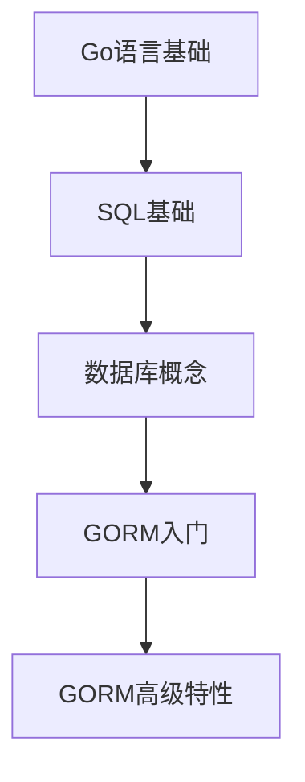

# GORM完整学习指南

> **文档简介**: GORM是Go语言中最流行的ORM框架之一，本文档全面覆盖GORM的核心概念、高级特性和企业级最佳实践，帮助你从入门到精通。

> **目标读者**: 有Go语言基础，希望系统学习ORM和数据库操作的中高级开发者

> **前置知识**: Go语言基础语法、SQL基础、数据库概念

> **预计时长**: 8-12小时（包含所有实践练习）

## 📚 文档元数据

| 属性 | 内容 |
|------|------|
| **模块** | `01-go-backend` |
| **分类** | `frameworks/database` |
| **难度** | ⭐⭐⭐⭐ |
| **标签** | `#gorm` `#orm` `#数据库` `#go` `#postgresql` `#mysql` |
| **更新日期** | `2025年10月` |
| **作者** | Dev Quest Team |
| **状态** | ✅ 已完成 |

## 🎯 学习目标

完成本模块后，你将能够：

- ✅ **掌握GORM核心概念**: 模型定义、字段映射、数据库连接
- ✅ **熟练使用查询构建器**: 复杂查询、关联查询、聚合查询
- ✅ **理解数据库迁移**: 自动迁移、版本控制、回滚策略
- ✅ **掌握高级特性**: 事务处理、性能优化、多数据库支持
- ✅ **具备企业级开发能力**: 错误处理、日志记录、测试策略

## 📋 目录

- [GORM概述](#gorm概述)
- [快速开始](#快速开始)
- [模型定义](#模型定义)
- [数据库连接](#数据库连接)
- [基础操作](#基础操作)
- [查询构建器](#查询构建器)
- [关联关系](#关联关系)
- [数据库迁移](#数据库迁移)
- [事务处理](#事务处理)
- [性能优化](#性能优化)
- [高级特性](#高级特性)
- [最佳实践](#最佳实践)
- [常见问题](#常见问题)

---

## 🔍 GORM概述

### 什么是GORM
GORM（Go Object-Relational Mapping）是Go语言功能最完整的ORM库，提供了友好的API来操作数据库。它支持多种数据库，包括MySQL、PostgreSQL、SQLite、SQL Server等。

### 核心特性
- **全功能ORM**: 关联、事务、回调、预加载等
- **模型关联**: Has One、Has Many、Belongs To、Many To Many、Polymorphism
- **钩子函数**: Before/After Create/Save/Update/Delete/Find
- **预加载**: 预加载和延迟加载
- **事务**: 嵌套事务、保存点、回滚到保存点
- **复合主键**: 支持复合主键
- **数据库迁移**: 自动迁移
- **Logger**: 可配置的日志记录器
- **可扩展性**: 灵活的插件系统
- **开发者友好**: 语法糖、错误处理

### 适用场景
- 快速原型开发
- 中小型Web应用
- 微服务架构
- 需要频繁数据库操作的项目

---

## 🚀 快速开始

### 安装GORM
```bash
go get -u gorm.io/gorm
go get -u gorm.io/driver/mysql    # MySQL驱动
go get -u gorm.io/driver/postgres # PostgreSQL驱动
go get -u gorm.io/driver/sqlite   # SQLite驱动
go get -u gorm.io/driver/sqlserver # SQL Server驱动
```

### 基础示例
```go
package main

import (
    "gorm.io/gorm"
    "gorm.io/driver/mysql"
    "log"
    "time"
)

// 定义模型
type User struct {
    ID        uint           `gorm:"primaryKey"`
    CreatedAt time.Time      `gorm:"autoCreateTime"`
    UpdatedAt time.Time      `gorm:"autoUpdateTime"`
    DeletedAt gorm.DeletedAt `gorm:"index"`
    Name      string         `gorm:"size:100;not null"`
    Email     string         `gorm:"uniqueIndex;size:255"`
    Age       int
    Active    bool           `gorm:"default:true"`
}

func main() {
    // 数据库连接
    dsn := "user:password@tcp(127.0.0.1:3306)/dbname?charset=utf8mb4&parseTime=True&loc=Local"
    db, err := gorm.Open(mysql.Open(dsn), &gorm.Config{})
    if err != nil {
        log.Fatal("连接数据库失败:", err)
    }

    // 自动迁移
    db.AutoMigrate(&User{})

    // 创建用户
    user := User{Name: "张三", Email: "zhangsan@example.com", Age: 25}
    result := db.Create(&user)
    if result.Error != nil {
        log.Fatal("创建用户失败:", result.Error)
    }

    log.Printf("用户创建成功，ID: %d", user.ID)
}
```

---

## 📝 模型定义

### 基础字段定义
```go
type Product struct {
    // 主键
    ID uint `gorm:"primaryKey"`

    // 字符串字段
    Name  string `gorm:"size:100;not null;index"`
    Code  string `gorm:"uniqueIndex;size:50"`
    Desc  string `gorm:"type:text"`

    // 数值字段
    Price       float64 `gorm:"type:decimal(10,2)"`
    Stock       int     `gorm:"default:0"`
    IsActive    bool    `gorm:"default:true"`

    // 时间字段
    CreatedAt   time.Time `gorm:"autoCreateTime"`
    UpdatedAt   time.Time `gorm:"autoUpdateTime"`
    PublishedAt time.Time
    DeletedAt   gorm.DeletedAt `gorm:"index"`

    // 外键
    CategoryID uint `gorm:"index"`

    // 自定义字段名
    SKU string `gorm:"column:product_sku"`
}
```

### 字段标签详解
```go
type User struct {
    // 主键相关
    ID        uint   `gorm:"primaryKey;autoIncrement"`
    UUID      string `gorm:"type:char(36);primaryKey;default:uuid()"`

    // 字符串约束
    Name      string `gorm:"size:50;not null;comment:'用户名称'"`
    Email     string `gorm:"size:100;uniqueIndex;not null"`
    Phone     string `gorm:"size:20;index"`

    // 数值约束
    Age       int    `gorm:"check:age >= 0"`
    Score     float64 `gorm:"type:decimal(5,2);default:0.00"`

    // 时间约束
    BirthDate time.Time `gorm:"type:date"`
    LoginTime time.Time `gorm:"precision:6"`

    // 枚举类型
    Status    string `gorm:"type:enum('active','inactive','pending');default:'pending'"`

    // JSON字段
    Metadata  string `gorm:"type:json"`

    // 嵌入字段
    Address   Address `gorm:"embedded"`
    AddressID uint    `gorm:"index"`
}

type Address struct {
    Street string `gorm:"size:200"`
    City   string `gorm:"size:100"`
    Zip    string `gorm:"size:20"`
}
```

### 模型约定
```go
// 默认表名：users
type User struct {
    // ...
}

// 自定义表名
func (User) TableName() string {
    return "app_users"
}

// 或者使用Table方法
db.Table("custom_users").Find(&users)
```

---

## 🔗 数据库连接

### MySQL连接配置
```go
package database

import (
    "gorm.io/driver/mysql"
    "gorm.io/gorm"
    "gorm.io/plugin/dbresolver"
    "time"
)

type Config struct {
    Host     string
    Port     int
    User     string
    Password string
    DBName   string
    Charset  string
    Loc      string
    Timeout  time.Duration
}

func NewMySQLConnection(config Config) (*gorm.DB, error) {
    dsn := fmt.Sprintf("%s:%s@tcp(%s:%d)/%s?charset=%s&parseTime=True&loc=%s&timeout=%s",
        config.User,
        config.Password,
        config.Host,
        config.Port,
        config.DBName,
        config.Charset,
        url.QueryEscape(config.Loc),
        config.Timeout,
    )

    db, err := gorm.Open(mysql.Open(dsn), &gorm.Config{
        // 禁用外键约束
        DisableForeignKeyConstraintWhenMigrating: true,
        // 启用预编译语句缓存
        PrepareStmt:                              true,
        // 日志级别
        Logger: logger.Default.LogMode(logger.Info),
    })

    if err != nil {
        return nil, err
    }

    // 获取底层sql.DB对象进行连接池配置
    sqlDB, err := db.DB()
    if err != nil {
        return nil, err
    }

    // 连接池配置
    sqlDB.SetMaxIdleConns(10)           // 空闲连接池
    sqlDB.SetMaxOpenConns(100)          // 最大连接数
    sqlDB.SetConnMaxLifetime(time.Hour) // 连接最大生存时间

    return db, nil
}
```

### 读写分离配置
```go
func NewMySQLReplicationConnection(masterConfig, slaveConfig Config) (*gorm.DB, error) {
    masterDSN := buildDSN(masterConfig)
    slaveDSN := buildDSN(slaveConfig)

    db, err := gorm.Open(mysql.Open(masterDSN), &gorm.Config{})
    if err != nil {
        return nil, err
    }

    // 配置读写分离
    err = db.Use(dbresolver.Register(dbresolver.Config{
        Sources:  []gorm.Dialector{mysql.Open(masterDSN)}, // 写库
        Replicas: []gorm.Dialector{mysql.Open(slaveDSN)}, // 读库
        Policy:   dbresolver.RandomPolicy{},                // 负载均衡策略
    }))

    return db, err
}
```

### 多数据库配置
```go
type Database struct {
    Primary *gorm.DB  // 主数据库
    Cache   *gorm.DB  // 缓存数据库
    Log     *gorm.DB  // 日志数据库
}

func NewDatabase() (*Database, error) {
    db := &Database{}

    // 主数据库
    primary, err := NewMySQLConnection(primaryConfig)
    if err != nil {
        return nil, fmt.Errorf("主数据库连接失败: %w", err)
    }
    db.Primary = primary

    // 缓存数据库 (SQLite)
    cache, err := gorm.Open(sqlite.Open("cache.db"), &gorm.Config{})
    if err != nil {
        return nil, fmt.Errorf("缓存数据库连接失败: %w", err)
    }
    db.Cache = cache

    // 日志数据库
    log, err := NewPostgreSQLConnection(logConfig)
    if err != nil {
        return nil, fmt.Errorf("日志数据库连接失败: %w", err)
    }
    db.Log = log

    return db, nil
}
```

---

## 🔧 基础操作

### 创建记录
```go
// 创建单条记录
func CreateUser(db *gorm.DB, user *User) error {
    result := db.Create(user)
    if result.Error != nil {
        return result.Error
    }
    log.Printf("用户创建成功，ID: %d", user.ID)
    return nil
}

// 批量创建
func CreateUsers(db *gorm.DB, users []User) error {
    result := db.CreateInBatches(users, 100) // 每批100条
    if result.Error != nil {
        return result.Error
    }
    log.Printf("批量创建用户成功，影响行数: %d", result.RowsAffected)
    return nil
}

// 使用CreateWithMap
func CreateUserWithMap(db *gorm.DB) error {
    user := map[string]interface{}{
        "name":  "李四",
        "email": "lisi@example.com",
        "age":   30,
    }

    result := db.Model(&User{}).Create(user)
    return result.Error
}

// 使用Select指定字段
func CreateUserWithSelect(db *gorm.DB) error {
    user := User{
        Name:  "王五",
        Email: "wangwu@example.com",
        Age:   28,
        Note:  "这个字段不会被创建", // 不在Select中
    }

    result := db.Select("Name", "Email", "Age").Create(&user)
    return result.Error
}

// 使用Omit忽略字段
func CreateUserWithOmit(db *gorm.DB) error {
    user := User{
        Name:      "赵六",
        Email:     "zhaoliu@example.com",
        Age:       35,
        CreatedAt: time.Now(), // 这个字段会被忽略
    }

    result := db.Omit("CreatedAt").Create(&user)
    return result.Error
}
```

### 查询记录
```go
// 查询第一条记录
func GetFirstUser(db *gorm.DB) (User, error) {
    var user User
    result := db.First(&user) // SELECT * FROM users ORDER BY id LIMIT 1
    return user, result.Error
}

// 根据主键查询
func GetUserByID(db *gorm.DB, id uint) (User, error) {
    var user User
    result := db.First(&user, id) // SELECT * FROM users WHERE id = id
    return user, result.Error
}

// 查询多条记录
func GetAllUsers(db *gorm.DB) ([]User, error) {
    var users []User
    result := db.Find(&users) // SELECT * FROM users
    return users, result.Error
}

// 条件查询
func GetActiveUsers(db *gorm.DB) ([]User, error) {
    var users []User
    result := db.Where("active = ?", true).Find(&users)
    return users, result.Error
}

// 复杂条件查询
func GetUsersByCondition(db *gorm.DB, minAge int, email string) ([]User, error) {
    var users []User
    result := db.Where("age >= ? AND email LIKE ?", minAge, "%"+email+"%").
        Order("age DESC, name ASC").
        Limit(10).
        Find(&users)
    return users, result.Error
}

// 使用Struct条件
func GetUsersByStruct(db *gorm.DB) ([]User, error) {
    var users []User
    condition := User{
        Active: true,
        Age:    25,
    }
    result := db.Where(&condition).Find(&users)
    return users, result.Error
}

// 使用Map条件
func GetUsersByMap(db *gorm.DB) ([]User, error) {
    var users []User
    condition := map[string]interface{}{
        "active": true,
        "age >=": 18,
    }
    result := db.Where(condition).Find(&users)
    return users, result.Error
}

// 使用IN查询
func GetUsersByIDs(db *gorm.DB, ids []uint) ([]User, error) {
    var users []User
    result := db.Where("id IN ?", ids).Find(&users)
    return users, result.Error
}
```

### 更新记录
```go
// 更新单个字段
func UpdateUserEmail(db *gorm.DB, id uint, email string) error {
    result := db.Model(&User{}).Where("id = ?", id).Update("email", email)
    if result.Error != nil {
        return result.Error
    }
    log.Printf("更新影响行数: %d", result.RowsAffected)
    return nil
}

// 更新多个字段
func UpdateUserInfo(db *gorm.DB, id uint, name, email string, age int) error {
    result := db.Model(&User{}).Where("id = ?", id).Updates(map[string]interface{}{
        "name":  name,
        "email": email,
        "age":   age,
    })
    return result.Error
}

// 使用Struct更新
func UpdateUserStruct(db *gorm.DB, id uint, user User) error {
    result := db.Model(&User{}).Where("id = ?", id).Updates(user)
    return result.Error
}

// 使用Select指定更新字段
func UpdateSelectedFields(db *gorm.DB, id uint) error {
    result := db.Model(&User{}).Where("id = ?", id).
        Select("name", "email").
        Updates(User{Name: "新名称", Email: "new@example.com", Age: 99}) // Age不会被更新
    return result.Error
}

// 使用Omit忽略字段
func UpdateWithOmit(db *gorm.DB, id uint) error {
    result := db.Model(&User{}).Where("id = ?", id).
        Omit("updated_at").
        Updates(User{Name: "新名称"})
    return result.Error
}

// 批量更新
func BatchUpdateUsers(db *gorm.DB) error {
    result := db.Model(&User{}).Where("active = ?", false).
        Update("active", true)
    return result.Error
}
```

### 删除记录
```go
// 软删除
func SoftDeleteUser(db *gorm.DB, id uint) error {
    result := db.Delete(&User{}, id)
    return result.Error
}

// 硬删除
func HardDeleteUser(db *gorm.DB, id uint) error {
    result := db.Unscoped().Delete(&User{}, id)
    return result.Error
}

// 批量软删除
func BatchSoftDelete(db *gorm.DB) error {
    result := db.Where("age < ?", 18).Delete(&User{})
    return result.Error
}

// 根据条件删除
func DeleteInactiveUsers(db *gorm.DB) error {
    result := db.Where("active = ? AND last_login < ?", false, time.Now().AddDate(0, -6, 0)).
        Delete(&User{})
    return result.Error
}

// 恢复软删除的记录
func RestoreUser(db *gorm.DB, id uint) error {
    result := db.Unscoped().Model(&User{}).Where("id = ?", id).Update("deleted_at", nil)
    return result.Error
}

// 查询软删除的记录
func GetDeletedUsers(db *gorm.DB) ([]User, error) {
    var users []User
    result := db.Unscoped().Where("deleted_at IS NOT NULL").Find(&users)
    return users, result.Error
}
```

---

## 🔍 查询构建器

### 基础查询
```go
// First, Last, Take
func QueryFirstRecords(db *gorm.DB) {
    var user1, user2, user3 User

    // First - 获取第一条记录（按主键排序）
    db.First(&user1)

    // Last - 获取最后一条记录（按主键排序）
    db.Last(&user2)

    // Take - 获取一条记录（不指定排序）
    db.Take(&user3)
}

// 使用Find查询
func FindUsers(db *gorm.DB) ([]User, error) {
    var users []User
    result := db.Find(&users)
    return users, result.Error
}

// 使用Pluck查询单列
func GetUserEmails(db *gorm.DB) ([]string, error) {
    var emails []string
    result := db.Model(&User{}).Pluck("email", &emails)
    return emails, result.Error
}

// 使用Pluck查询多列
func GetUserNamesAndEmails(db *gorm.DB) ([]map[string]interface{}, error) {
    var results []map[string]interface{}
    result := db.Model(&User{}).Select("name, email").Find(&results)
    return results, result.Error
}
```

### 条件查询
```go
// Where条件查询
func WhereQueries(db *gorm.DB) {
    var users []User

    // 字符串条件
    db.Where("name = ?", "张三").Find(&users)

    // 多条件
    db.Where("name = ? AND age >= ?", "张三", 25).Find(&users)

    // IN条件
    db.Where("name IN ?", []string{"张三", "李四", "王五"}).Find(&users)

    // LIKE条件
    db.Where("email LIKE ?", "%@gmail.com").Find(&users)

    // BETWEEN条件
    db.Where("age BETWEEN ? AND ?", 18, 30).Find(&users)

    // 时间条件
    db.Where("created_at > ?", time.Now().AddDate(0, -1, 0)).Find(&users)
}

// Not条件
func NotQueries(db *gorm.DB) {
    var users []User

    // 简单Not
    db.Not("name = ?", "张三").Find(&users)

    // Not In
    db.Not("name IN ?", []string{"张三", "李四"}).Find(&users)

    // Not Between
    db.Not("age BETWEEN ? AND ?", 18, 25).Find(&users)
}

// Or条件
func OrQueries(db *gorm.DB) {
    var users []User

    db.Where("name = ?", "张三").Or("name = ?", "李四").Find(&users)

    db.Where("age > ?", 30).Or("active = ?", true).Find(&users)
}

// 复杂条件组合
func ComplexConditions(db *gorm.DB) {
    var users []User

    // (name = ? OR email = ?) AND active = ?
    db.Where(
        "(name = ? OR email = ?) AND active = ?",
        "张三", "test@example.com", true,
    ).Find(&users)

    // 使用嵌套条件
    db.Where("age > ?", 25).Where(
        db.Or("name = ?", "张三").Where("email LIKE ?", "%@gmail.com"),
    ).Find(&users)
}
```

### 排序和分页
```go
// Order排序
func OrderQueries(db *gorm.DB) {
    var users []User

    // 单字段排序
    db.Order("age desc").Find(&users)

    // 多字段排序
    db.Order("age desc, name asc").Find(&users)

    // 使用函数排序
    db.Order("LENGTH(name) desc").Find(&users)

    // 优先排序
    db.Order("CASE WHEN age > 30 THEN 0 ELSE 1 END").Find(&users)
}

// Limit和Offset分页
func PaginationQueries(db *gorm.DB, page, pageSize int) ([]User, int64, error) {
    var users []User
    var total int64

    // 获取总数
    if err := db.Model(&User{}).Count(&total).Error; err != nil {
        return nil, 0, err
    }

    // 分页查询
    offset := (page - 1) * pageSize
    result := db.Limit(pageSize).Offset(offset).Find(&users)

    return users, total, result.Error
}

// 使用Scopes可重用查询
func ActiveUsersScope(db *gorm.DB) *gorm.DB {
    return db.Where("active = ?", true)
}

func AdultUsersScope(db *gorm.DB) *gorm.DB {
    return db.Where("age >= ?", 18)
}

func ScopeQueries(db *gorm.DB) {
    var users []User

    // 使用单个Scope
    db.Scopes(ActiveUsersScope).Find(&users)

    // 链式使用多个Scopes
    db.Scopes(ActiveUsersScope, AdultUsersScope).Find(&users)
}
```

### 聚合查询
```go
// Count计数
func CountQueries(db *gorm.DB) {
    var count int64

    // 总数
    db.Model(&User{}).Count(&count)

    // 条件计数
    db.Model(&User{}).Where("active = ?", true).Count(&count)

    // 分组计数
    var results []struct {
        Age   int
        Count int64
    }
    db.Model(&User{}).Select("age, count(*) as count").Group("age").Find(&results)
}

// Sum求和
func SumQueries(db *gorm.DB) {
    var total float64

    // 订单总金额
    db.Model(&Order{}).Select("COALESCE(SUM(amount), 0)").Scan(&total)

    // 按状态分组求和
    var results []struct {
        Status string
        Total  float64
    }
    db.Model(&Order{}).Select("status, SUM(amount) as total").Group("status").Find(&results)
}

// Avg平均
func AvgQueries(db *gorm.DB) {
    var avgAge float64

    db.Model(&User{}).Select("AVG(age)").Scan(&avgAge)

    // 按分类平均价格
    var results []struct {
        CategoryID uint
        AvgPrice   float64
    }
    db.Model(&Product{}).Select("category_id, AVG(price) as avg_price").
        Group("category_id").Find(&results)
}

// Min/Max最值
func MinMaxQueries(db *gorm.DB) {
    var minAge, maxAge int

    db.Model(&User{}).Select("MIN(age)").Scan(&minAge)
    db.Model(&User{}).Select("MAX(age)").Scan(&maxAge)

    // 复合查询
    var stats struct {
        MinAge int
        MaxAge int
        Count  int64
    }
    db.Model(&User{}).Select("MIN(age) as min_age, MAX(age) as max_age, COUNT(*) as count").
        Scan(&stats)
}

// Having分组过滤
func HavingQueries(db *gorm.DB) {
    var results []struct {
        City   string
        Count  int64
    }

    // 查询用户数量大于5的城市
    db.Model(&User{}).Select("city, COUNT(*) as count").
        Group("city").
        Having("count > ?", 5).
        Find(&results)
}
```

### 原生SQL查询
```go
// Raw原生查询
func RawQueries(db *gorm.DB) {
    var users []User

    // 原生SQL查询
    db.Raw("SELECT * FROM users WHERE age > ?", 25).Scan(&users)

    // 复杂原生查询
    db.Raw(`
        SELECT u.*, COUNT(o.id) as order_count
        FROM users u
        LEFT JOIN orders o ON u.id = o.user_id
        WHERE u.active = ?
        GROUP BY u.id
        HAVING order_count > ?
    `, true, 3).Scan(&users)
}

// Exec执行原生SQL
func ExecQueries(db *gorm.DB) {
    // 更新操作
    db.Exec("UPDATE users SET active = ? WHERE age < ?", false, 18)

    // 删除操作
    db.Exec("DELETE FROM users WHERE last_login < ?", time.Now().AddDate(-1, 0, 0))

    // 批量插入
    db.Exec(`
        INSERT INTO users (name, email, age) VALUES
        ('用户1', 'user1@example.com', 25),
        ('用户2', 'user2@example.com', 30)
    `)
}

// 命名参数
func NamedQueries(db *gorm.DB) {
    var user User

    // 使用命名参数
    db.Raw(`
        SELECT * FROM users
        WHERE name = @name AND age >= @min_age
    `, sql.Named("name", "张三"), sql.Named("min_age", 25)).Scan(&user)

    // 使用map参数
    db.Raw(`
        SELECT * FROM users
        WHERE name = @name AND email LIKE @email_pattern
    `, map[string]interface{}{
        "name":          "张三",
        "email_pattern": "%@gmail.com",
    }).Scan(&user)
}
```

---

## 🔗 关联关系

### 一对一关系 (Has One)
```go
type User struct {
    gorm.Model
    Name      string
    Profile   UserProfile   `gorm:"foreignKey:UserID;constraint:OnUpdate:CASCADE,OnDelete:CASCADE"`
}

type UserProfile struct {
    gorm.Model
    UserID    uint     `gorm:"uniqueIndex"`
    Bio       string
    Avatar    string
    Phone     string
    User      User     `gorm:"foreignKey:UserID"`
}

// 创建带关联的记录
func CreateUserWithProfile(db *gorm.DB) error {
    user := User{
        Name: "张三",
        Profile: UserProfile{
            Bio:    "软件开发工程师",
            Avatar: "avatar.jpg",
            Phone:  "13800138000",
        },
    }

    return db.Create(&user).Error
}

// 预加载关联
func GetUserWithProfile(db *gorm.DB, id uint) (User, error) {
    var user User
    result := db.Preload("Profile").First(&user, id)
    return user, result.Error
}

// 关联查询
func FindUsersWithProfileCondition(db *gorm.DB) ([]User, error) {
    var users []User
    result := db.Model(&User{}).
        Joins("Profile").
        Where("Profile.phone LIKE ?", "%138%").
        Find(&users)
    return users, result.Error
}
```

### 一对多关系 (Has Many)
```go
type User struct {
    gorm.Model
    Name    string
    Posts   []Post `gorm:"foreignKey:UserID"`
}

type Post struct {
    gorm.Model
    Title     string
    Content   string
    UserID    uint
    User      User     `gorm:"foreignKey:UserID"`
    Comments  []Comment `gorm:"foreignKey:PostID"`
}

type Comment struct {
    gorm.Model
    Content  string
    PostID   uint
    Post     Post `gorm:"foreignKey:PostID"`
    UserID   uint
    User     User `gorm:"foreignKey:UserID"`
}

// 创建带关联的记录
func CreateUserWithPosts(db *gorm.DB) error {
    user := User{
        Name: "张三",
        Posts: []Post{
            {Title: "第一篇文章", Content: "文章内容1"},
            {Title: "第二篇文章", Content: "文章内容2"},
        },
    }

    return db.Create(&user).Error
}

// 预加载关联
func GetUserWithPosts(db *gorm.DB, id uint) (User, error) {
    var user User
    result := db.Preload("Posts").Preload("Posts.Comments").First(&user, id)
    return user, result.Error
}

// 条件预加载
func GetUserWithPublishedPosts(db *gorm.DB, id uint) (User, error) {
    var user User
    result := db.Preload("Posts", "published = ?", true).
        Preload("Posts.Comments", "approved = ?", true).
        First(&user, id)
    return user, result.Error
}

// 关联查询
func FindUsersWithPostCount(db *gorm.DB) ([]User, error) {
    var users []User
    result := db.Model(&User{}).
        Select("users.*, COUNT(posts.id) as post_count").
        Joins("LEFT JOIN posts ON users.id = posts.user_id").
        Group("users.id").
        Having("post_count > ?", 0).
        Find(&users)
    return users, result.Error
}
```

### 多对多关系 (Many To Many)
```go
type User struct {
    gorm.Model
    Name     string
    Roles    []Role `gorm:"many2many:user_roles;"`
}

type Role struct {
    gorm.Model
    Name        string
    Description string
    Users       []User `gorm:"many2many:user_roles;"`
}

type UserRole struct {
    UserID    uint `gorm:"primaryKey"`
    RoleID    uint `gorm:"primaryKey"`
    CreatedAt time.Time
    CreatedBy uint
}

// 创建多对多关联
func CreateUserWithRoles(db *gorm.DB) error {
    user := User{
        Name: "张三",
        Roles: []Role{
            {Name: "管理员", Description: "系统管理员"},
            {Name: "编辑", Description: "内容编辑"},
        },
    }

    return db.Create(&user).Error
}

// 关联操作
func ManageUserRoles(db *gorm.DB, userID uint) error {
    var user User

    // 添加角色关联
    if err := db.Model(&user).Association("Roles").Append(&Role{Name: "新角色"}); err != nil {
        return err
    }

    // 移除角色关联
    if err := db.Model(&user).Association("Roles").Delete(&Role{Name: "旧角色"}); err != nil {
        return err
    }

    // 替换所有角色
    roles := []Role{{Name: "角色1"}, {Name: "角色2"}}
    if err := db.Model(&user).Association("Roles").Replace(roles); err != nil {
        return err
    }

    // 清空所有关联
    if err := db.Model(&user).Association("Roles").Clear(); err != nil {
        return err
    }

    return nil
}

// 多对多查询
func GetUsersWithRoles(db *gorm.DB) ([]User, error) {
    var users []User
    result := db.Preload("Roles").Find(&users)
    return users, result.Error
}

// 条件关联查询
func GetUsersWithAdminRole(db *gorm.DB) ([]User, error) {
    var users []User
    result := db.Model(&User{}).
        Joins("INNER JOIN user_roles ON users.id = user_roles.user_id").
        Joins("INNER JOIN roles ON user_roles.role_id = roles.id").
        Where("roles.name = ?", "管理员").
        Find(&users)
    return users, result.Error
}
```

### 多态关联
```go
type Comment struct {
    gorm.Model
    Content     string
    Author      string

    // 多态关联
    CommentType string `gorm:"string"` // 'post' or 'video'
    CommentID   uint
}

type Post struct {
    gorm.Model
    Title    string
    Content  string
    Comments []Comment `gorm:"polymorphic:Comment;"`
}

type Video struct {
    gorm.Model
    Title    string
    URL      string
    Comments []Comment `gorm:"polymorphic:Comment;"`
}

// 创建多态关联
func CreateComments(db *gorm.DB) error {
    // 为文章创建评论
    post := Post{Title: "文章标题", Content: "文章内容"}
    db.Create(&post)

    postComment := Comment{
        Content:     "这是一条文章评论",
        Author:      "评论者",
        CommentType: "post",
        CommentID:   post.ID,
    }
    db.Create(&postComment)

    // 为视频创建评论
    video := Video{Title: "视频标题", URL: "http://example.com/video.mp4"}
    db.Create(&video)

    videoComment := Comment{
        Content:     "这是一条视频评论",
        Author:      "评论者",
        CommentType: "video",
        CommentID:   video.ID,
    }
    db.Create(&videoComment)

    return nil
}

// 查询多态关联
func GetPostWithComments(db *gorm.DB, postID uint) (Post, error) {
    var post Post
    result := db.Preload("Comments").First(&post, postID)
    return post, result.Error
}
```

### 关联查询优化
```go
// 使用N+1查询优化
func OptimizedUserQueries(db *gorm.DB) {
    var users []User

    // 不好的做法：N+1查询
    db.Find(&users)
    for _, user := range users {
        db.Model(&user).Association("Posts").Find(&user.Posts)
    }

    // 好的做法：预加载
    db.Preload("Posts").Find(&users)

    // 好的做法：Joins
    db.Model(&User{}).
        Select("users.*, posts.title as post_title").
        Joins("LEFT JOIN posts ON users.id = posts.user_id").
        Find(&users)
}

// 条件预加载
func ConditionalPreload(db *gorm.DB) {
    var users []User

    // 预加载已发布的文章
    db.Preload("Posts", "published = ?", true).Find(&users)

    // 预加载最近的文章
    db.Preload("Posts", "created_at > ?", time.Now().AddDate(0, -1, 0)).Find(&users)

    // 嵌套预加载
    db.Preload("Posts.Comments", "approved = ?", true).Find(&users)
}

// 自定义关联字段
func CustomAssociationFields(db *gorm.DB) {
    type UserWithPostCount struct {
        User
        PostCount int `gorm:"column:post_count"`
    }

    var users []UserWithPostCount
    db.Model(&User{}).
        Select("users.*, COUNT(posts.id) as post_count").
        Joins("LEFT JOIN posts ON users.id = posts.user_id").
        Group("users.id").
        Find(&users)
}
```

---

## 🔄 数据库迁移

### 自动迁移
```go
// 基础自动迁移
func AutoMigrate(db *gorm.DB) error {
    return db.AutoMigrate(
        &User{},
        &Profile{},
        &Post{},
        &Comment{},
        &Category{},
        &Tag{},
        &PostTag{},
    )
}

// 指定表名自动迁移
func AutoMigrateWithTableName(db *gorm.DB) error {
    return db.Table("app_users").AutoMigrate(&User{})
}

// 条件迁移
func ConditionalMigration(db *gorm.DB) error {
    // 检查表是否存在
    if !db.Migrator().HasTable(&User{}) {
        if err := db.AutoMigrate(&User{}); err != nil {
            return err
        }
    }

    // 检查字段是否存在
    if !db.Migrator().HasColumn(&User{}, "avatar") {
        if err := db.Migrator().AddColumn(&User{}, "Avatar"); err != nil {
            return err
        }
    }

    return nil
}
```

### 手动迁移
```go
// 创建表
func CreateTable(db *gorm.DB) error {
    return db.Migrator().CreateTable(&User{})
}

// 删除表
func DropTable(db *gorm.DB) error {
    return db.Migrator().DropTable(&User{})
}

// 重命名表
func RenameTable(db *gorm.DB) error {
    return db.Migrator().RenameTable("users", "app_users")
}

// 添加字段
func AddColumn(db *gorm.DB) error {
    return db.Migrator().AddColumn(&User{}, "Avatar")
}

// 删除字段
func DropColumn(db *gorm.DB) error {
    return db.Migrator().DropColumn(&User{}, "Avatar")
}

// 修改字段类型
func AlterColumnType(db *gorm.DB) error {
    return db.Migrator().AlterColumn(&User{}, "Email")
}

// 重命名字段
func RenameColumn(db *gorm.DB) error {
    return db.Migrator().RenameColumn(&User{}, "name", "username")
}
```

### 索引管理
```go
// 创建索引
func CreateIndexes(db *gorm.DB) error {
    // 单字段索引
    if err := db.Migrator().CreateIndex(&User{}, "Email"); err != nil {
        return err
    }

    // 复合索引
    if err := db.Migrator().CreateIndex(&User{}, "NameEmail"); err != nil {
        return err
    }

    // 唯一索引
    if err := db.Migrator().CreateIndex(&User{}, "EmailIndex"); err != nil {
        return err
    }

    return nil
}

// 删除索引
func DropIndexes(db *gorm.DB) error {
    return db.Migrator().DropIndex(&User{}, "Email")
}

// 检查索引是否存在
func CheckIndexExists(db *gorm.DB) bool {
    return db.Migrator().HasIndex(&User{}, "Email")
}

type User struct {
    gorm.Model
    Name  string `gorm:"size:100;index"`
    Email string `gorm:"size:255;uniqueIndex"`

    // 复合索引
    Age   int    `gorm:"index:idx_name_age,priority:2"` // 优先级2
    Name  string `gorm:"index:idx_name_age,priority:1"` // 优先级1

    // 唯一复合索引
    Code  string `gorm:"uniqueIndex:idx_code_type"`
    Type  string `gorm:"uniqueIndex:idx_code_type"`
}
```

### 外键约束
```go
type User struct {
    gorm.Model
    ProfileID uint
    Profile   Profile `gorm:"foreignKey:ProfileID;constraint:OnUpdate:CASCADE,OnDelete:SET NULL"`
}

// 创建外键
func CreateForeignKey(db *gorm.DB) error {
    return db.Migrator().CreateConstraint(&User{}, "Profile")
}

// 删除外键
func DropForeignKey(db *gorm.DB) error {
    return db.Migrator().DropConstraint(&User{}, "fk_users_profile")
}

// 检查约束是否存在
func CheckConstraintExists(db *gorm.DB) bool {
    return db.Migrator().HasConstraint(&User{}, "Profile")
}
```

### 版本控制迁移
```go
type Migration struct {
    gorm.Model
    Version     string `gorm:"uniqueIndex"`
    Description string
    AppliedAt   time.Time
}

// 迁移管理器
type MigrationManager struct {
    db *gorm.DB
}

func NewMigrationManager(db *gorm.DB) *MigrationManager {
    return &MigrationManager{db: db}
}

// 检查迁移状态
func (m *MigrationManager) IsApplied(version string) bool {
    var count int64
    m.db.Model(&Migration{}).Where("version = ?", version).Count(&count)
    return count > 0
}

// 记录迁移
func (m *MigrationManager) RecordMigration(version, description string) error {
    migration := Migration{
        Version:     version,
        Description: description,
        AppliedAt:   time.Now(),
    }
    return m.db.Create(&migration).Error
}

// 执行迁移
func (m *MigrationManager) Migrate() error {
    // 首先迁移migration表
    if err := m.db.AutoMigrate(&Migration{}); err != nil {
        return err
    }

    // 定义迁移
    migrations := []struct {
        version     string
        description string
        up          func(*gorm.DB) error
    }{
        {
            version:     "202310240001",
            description: "创建用户表",
            up: func(db *gorm.DB) error {
                return db.AutoMigrate(&User{})
            },
        },
        {
            version:     "202310240002",
            description: "添加用户头像字段",
            up: func(db *gorm.DB) error {
                return db.Migrator().AddColumn(&User{}, "Avatar")
            },
        },
        {
            version:     "202310240003",
            description: "创建文章表",
            up: func(db *gorm.DB) error {
                return db.AutoMigrate(&Post{})
            },
        },
    }

    // 执行迁移
    for _, migration := range migrations {
        if !m.IsApplied(migration.version) {
            log.Printf("执行迁移: %s - %s", migration.version, migration.description)

            if err := migration.up(m.db); err != nil {
                return fmt.Errorf("迁移 %s 失败: %w", migration.version, err)
            }

            if err := m.RecordMigration(migration.version, migration.description); err != nil {
                return fmt.Errorf("记录迁移 %s 失败: %w", migration.version, err)
            }

            log.Printf("迁移完成: %s", migration.version)
        }
    }

    return nil
}
```

---

## 💰 事务处理

### 基础事务
```go
// 自动提交事务
func AutoTransaction(db *gorm.DB) error {
    return db.Transaction(func(tx *gorm.DB) error {
        // 在事务中执行操作
        if err := tx.Create(&User{Name: "张三"}).Error; err != nil {
            return err // 返回错误会自动回滚
        }

        if err := tx.Create(&Profile{UserID: 1, Bio: "个人简介"}).Error; err != nil {
            return err // 返回错误会自动回滚
        }

        return nil // 返回nil会自动提交
    })
}

// 手动事务
func ManualTransaction(db *gorm.DB) error {
    // 开始事务
    tx := db.Begin()

    // 确保在函数退出时处理事务
    defer func() {
        if r := recover(); r != nil {
            tx.Rollback()
            panic(r) // 重新抛出panic
        }
    }()

    // 执行操作
    if err := tx.Create(&User{Name: "李四"}).Error; err != nil {
        tx.Rollback()
        return err
    }

    if err := tx.Create(&Profile{UserID: 2, Bio: "个人简介"}).Error; err != nil {
        tx.Rollback()
        return err
    }

    // 提交事务
    return tx.Commit().Error
}
```

### 嵌套事务
```go
// 嵌套事务（保存点）
func NestedTransaction(db *gorm.DB) error {
    return db.Transaction(func(tx *gorm.DB) error {
        // 外层事务操作
        if err := tx.Create(&User{Name: "外层用户"}).Error; err != nil {
            return err
        }

        // 嵌套事务
        err := tx.Transaction(func(nestedTx *gorm.DB) error {
            if err := nestedTx.Create(&User{Name: "内层用户1"}).Error; err != nil {
                return err
            }

            // 模拟错误，这会回滚内层事务
            return errors.New("内层事务错误")
        })

        if err != nil {
            log.Printf("内层事务失败: %v", err)
            // 外层事务继续执行
        }

        // 继续外层事务
        return tx.Create(&User{Name: "外层用户2"}).Error
    })
}

// 手动保存点
func ManualSavepoint(db *gorm.DB) error {
    tx := db.Begin()

    // 第一个操作
    if err := tx.Create(&User{Name: "用户1"}).Error; err != nil {
        tx.Rollback()
        return err
    }

    // 创建保存点
    if err := tx.Exec("SAVEPOINT sp1").Error; err != nil {
        tx.Rollback()
        return err
    }

    // 可能失败的操作
    if err := tx.Create(&User{Name: "用户2"}).Error; err != nil {
        // 回滚到保存点
        tx.Exec("ROLLBACK TO SAVEPOINT sp1")
        log.Printf("操作失败，已回滚到保存点")
    }

    // 继续其他操作
    if err := tx.Create(&User{Name: "用户3"}).Error; err != nil {
        tx.Rollback()
        return err
    }

    return tx.Commit().Error
}
```

### 事务最佳实践
```go
// 事务服务层
type UserService struct {
    db *gorm.DB
}

func NewUserService(db *gorm.DB) *UserService {
    return &UserService{db: db}
}

// 创建用户和档案（事务保证）
func (s *UserService) CreateUserWithProfile(name, email, bio string) error {
    return s.db.Transaction(func(tx *gorm.DB) error {
        // 创建用户
        user := User{Name: name, Email: email}
        if err := tx.Create(&user).Error; err != nil {
            return fmt.Errorf("创建用户失败: %w", err)
        }

        // 创建用户档案
        profile := Profile{
            UserID: user.ID,
            Bio:    bio,
        }
        if err := tx.Create(&profile).Error; err != nil {
            return fmt.Errorf("创建用户档案失败: %w", err)
        }

        // 创建用户统计
        stats := UserStats{
            UserID: user.ID,
        }
        if err := tx.Create(&stats).Error; err != nil {
            return fmt.Errorf("创建用户统计失败: %w", err)
        }

        // 发送欢迎邮件（可能失败，但不影响事务）
        go func(userID uint) {
            if err := sendWelcomeEmail(userID); err != nil {
                log.Printf("发送欢迎邮件失败，用户ID: %d, 错误: %v", userID, err)
            }
        }(user.ID)

        return nil
    })
}

// 转账事务示例
func (s *UserService) TransferBalance(fromUserID, toUserID uint, amount float64) error {
    return s.db.Transaction(func(tx *gorm.DB) error {
        // 检查转账用户余额
        var fromUser User
        if err := tx.First(&fromUser, fromUserID).Error; err != nil {
            return fmt.Errorf("找不到转出用户: %w", err)
        }

        if fromUser.Balance < amount {
            return errors.New("余额不足")
        }

        // 扣除转出用户余额
        if err := tx.Model(&fromUser).Update("balance", gorm.Expr("balance - ?", amount)).Error; err != nil {
            return fmt.Errorf("扣除余额失败: %w", err)
        }

        // 增加转入用户余额
        result := tx.Model(&User{}).Where("id = ?", toUserID).
            Update("balance", gorm.Expr("balance + ?", amount))
        if result.Error != nil {
            return fmt.Errorf("增加余额失败: %w", result.Error)
        }

        if result.RowsAffected == 0 {
            return errors.New("找不到转入用户")
        }

        // 创建转账记录
        transfer := Transfer{
            FromUserID: fromUserID,
            ToUserID:   toUserID,
            Amount:     amount,
            Status:     "completed",
        }
        if err := tx.Create(&transfer).Error; err != nil {
            return fmt.Errorf("创建转账记录失败: %w", err)
        }

        return nil
    })
}
```

### 事务超时和重试
```go
// 带超时的事务
func TransactionWithTimeout(db *gorm.DB, timeout time.Duration, fn func(*gorm.DB) error) error {
    ctx, cancel := context.WithTimeout(context.Background(), timeout)
    defer cancel()

    return db.WithContext(ctx).Transaction(func(tx *gorm.DB) error {
        return fn(tx)
    })
}

// 带重试的事务
func TransactionWithRetry(db *gorm.DB, maxRetries int, fn func(*gorm.DB) error) error {
    var lastErr error

    for i := 0; i < maxRetries; i++ {
        err := db.Transaction(func(tx *gorm.DB) error {
            return fn(tx)
        })

        if err == nil {
            return nil
        }

        lastErr = err

        // 检查是否是可重试的错误
        if !isRetryableError(err) {
            return err
        }

        // 指数退避
        backoff := time.Duration(math.Pow(2, float64(i))) * time.Second
        time.Sleep(backoff)

        log.Printf("事务失败，进行第%d次重试，错误: %v", i+1, err)
    }

    return fmt.Errorf("事务重试%d次后仍失败: %w", maxRetries, lastErr)
}

// 判断是否是可重试的错误
func isRetryableError(err error) bool {
    // 死锁错误
    if strings.Contains(err.Error(), "deadlock") {
        return true
    }

    // 连接错误
    if strings.Contains(err.Error(), "connection") {
        return true
    }

    // 超时错误
    if strings.Contains(err.Error(), "timeout") {
        return true
    }

    return false
}
```

---

## ⚡ 性能优化

### 批量操作优化
```go
// 批量插入优化
func BatchInsertUsers(db *gorm.DB, users []User) error {
    const batchSize = 100

    for i := 0; i < len(users); i += batchSize {
        end := i + batchSize
        if end > len(users) {
            end = len(users)
        }

        batch := users[i:end]
        if err := db.CreateInBatches(batch, len(batch)).Error; err != nil {
            return err
        }
    }

    return nil
}

// 使用CopyIn批量插入（PostgreSQL）
func BatchInsertWithCopyIn(db *gorm.DB, users []User) error {
    valueStrings := make([]string, 0, len(users))
    valueArgs := make([]interface{}, 0, len(users)*4)

    for _, user := range users {
        valueStrings = append(valueStrings, "(?, ?, ?, ?)")
        valueArgs = append(valueArgs, user.Name, user.Email, user.Age, user.Active)
    }

    query := fmt.Sprintf("INSERT INTO users (name, email, age, active) VALUES %s",
        strings.Join(valueStrings, ","))

    return db.Exec(query, valueArgs...).Error
}

// 批量更新优化
func BatchUpdateUsers(db *gorm.DB, userIDs []uint, updates map[string]interface{}) error {
    return db.Model(&User{}).Where("id IN ?", userIDs).Updates(updates).Error
}

// 使用CASE WHEN批量更新
func BatchUpdateWithCase(db *gorm.DB, updates []struct {
    ID    uint
    Name  string
    Email string
}) error {
    if len(updates) == 0 {
        return nil
    }

    var nameCases, emailCases []string
    var ids []interface{}

    for _, update := range updates {
        nameCases = append(nameCases, fmt.Sprintf("WHEN %d THEN ?", update.ID))
        emailCases = append(emailCases, fmt.Sprintf("WHEN %d THEN ?", update.ID))
        ids = append(ids, update.ID)

        // 添加CASE的值
        ids = append(ids, update.Name)
        ids = append(ids, update.Email)
    }

    query := fmt.Sprintf(`
        UPDATE users
        SET name = CASE id %s END,
            email = CASE id %s END,
            updated_at = NOW()
        WHERE id IN (%s)
    `,
        strings.Join(nameCases, " "),
        strings.Join(emailCases, " "),
        strings.Join(strings.Repeat("?", len(updates)), ","),
    )

    return db.Exec(query, ids...).Error
}
```

### 查询优化
```go
// 选择特定字段
func SelectSpecificFields(db *gorm.DB) ([]User, error) {
    var users []User
    result := db.Model(&User{}).
        Select("id, name, email").
        Find(&users)
    return users, result.Error
}

// 使用索引提示
func UseIndexHints(db *gorm.DB) ([]User, error) {
    var users []User
    result := db.Model(&User{}).
        Clause(clause.UseIndex{Index: "idx_name_email"}).
        Find(&users)
    return users, result.Error
}

// 分页优化
func OptimizedPagination(db *gorm.DB, cursor string, limit int) ([]User, string, error) {
    var users []User

    query := db.Model(&User{}).Order("id DESC").Limit(limit + 1)

    if cursor != "" {
        var lastID uint
        if _, err := fmt.Sscanf(cursor, "%d", &lastID); err == nil {
            query = query.Where("id < ?", lastID)
        }
    }

    result := query.Find(&users)
    if result.Error != nil {
        return nil, "", result.Error
    }

    var nextCursor string
    if len(users) > limit {
        nextCursor = fmt.Sprintf("%d", users[limit-1].ID)
        users = users[:limit]
    }

    return users, nextCursor, nil
}

// 预加载优化
func OptimizedPreload(db *gorm.DB) ([]User, error) {
    var users []User

    // 使用Joins代替Preload减少查询次数
    result := db.Model(&User{}).
        Select("users.*, profiles.bio as profile_bio").
        Joins("LEFT JOIN profiles ON users.id = profiles.user_id").
        Find(&users)

    return users, result.Error
}
```

### 连接池优化
```go
// 优化连接池配置
func OptimizeConnectionPool(db *gorm.DB) error {
    sqlDB, err := db.DB()
    if err != nil {
        return err
    }

    // 根据应用负载调整连接池大小
    maxOpenConns := 100          // 最大连接数
    maxIdleConns := 10           // 最大空闲连接数
    connMaxLifetime := time.Hour // 连接最大生存时间
    connMaxIdleTime := time.Minute * 30 // 空闲连接最大存活时间

    sqlDB.SetMaxOpenConns(maxOpenConns)
    sqlDB.SetMaxIdleConns(maxIdleConns)
    sqlDB.SetConnMaxLifetime(connMaxLifetime)
    sqlDB.SetConnMaxIdleTime(connMaxIdleTime)

    return nil
}

// 监控连接池状态
func MonitorConnectionPool(db *gorm.DB) {
    sqlDB, _ := db.DB()

    stats := sqlDB.Stats()
    log.Printf("连接池状态:")
    log.Printf("  打开连接数: %d", stats.OpenConnections)
    log.Printf("  使用中连接数: %d", stats.InUse)
    log.Printf("  空闲连接数: %d", stats.Idle)
    log.Printf("  等待连接数: %d", stats.WaitCount)
    log.Printf("  等待时长: %v", stats.WaitDuration)
    log.Printf("  最大空闲关闭数: %d", stats.MaxIdleClosed)
    log.Printf("  最大生存时间关闭数: %d", stats.MaxLifetimeClosed)
}
```

### 缓存策略
```go
// Redis缓存包装器
type CachedDB struct {
    db    *gorm.DB
    redis *redis.Client
}

func NewCachedDB(db *gorm.DB, redis *redis.Client) *CachedDB {
    return &CachedDB{db: db, redis: redis}
}

// 带缓存的查询
func (c *CachedDB) FindUserWithCache(id uint) (*User, error) {
    cacheKey := fmt.Sprintf("user:%d", id)

    // 尝试从缓存获取
    cached, err := c.redis.Get(context.Background(), cacheKey).Result()
    if err == nil {
        var user User
        if json.Unmarshal([]byte(cached), &user) == nil {
            return &user, nil
        }
    }

    // 从数据库查询
    var user User
    if err := c.db.First(&user, id).Error; err != nil {
        return nil, err
    }

    // 存入缓存
    if data, err := json.Marshal(user); err == nil {
        c.redis.Set(context.Background(), cacheKey, data, time.Minute*30)
    }

    return &user, nil
}

// 缓存失效
func (c *CachedDB) InvalidateUserCache(id uint) {
    cacheKey := fmt.Sprintf("user:%d", id)
    c.redis.Del(context.Background(), cacheKey)
}

// 批量缓存预加载
func (c *CachedDB) PreloadUsersCache(ids []uint) error {
    var missingIDs []uint

    // 检查缓存
    for _, id := range ids {
        cacheKey := fmt.Sprintf("user:%d", id)
        exists, _ := c.redis.Exists(context.Background(), cacheKey).Result()
        if exists == 0 {
            missingIDs = append(missingIDs, id)
        }
    }

    // 批量查询缺失的用户
    if len(missingIDs) > 0 {
        var users []User
        if err := c.db.Where("id IN ?", missingIDs).Find(&users).Error; err != nil {
            return err
        }

        // 批量存入缓存
        pipe := c.redis.Pipeline()
        for _, user := range users {
            cacheKey := fmt.Sprintf("user:%d", user.ID)
            if data, err := json.Marshal(user); err == nil {
                pipe.Set(context.Background(), cacheKey, data, time.Minute*30)
            }
        }
        _, err := pipe.Exec(context.Background())
        return err
    }

    return nil
}
```

---

## 🎯 高级特性

### 钩子函数
```go
type User struct {
    gorm.Model
    Name     string `gorm:"size:100;not null"`
    Email    string `gorm:"size:255;uniqueIndex"`
    Password string `gorm:"size:255;not null"`

    // 计算字段
    PostCount int `gorm:"-"` // 不映射到数据库
}

// 创建前钩子
func (u *User) BeforeCreate(tx *gorm.DB) error {
    // 密码加密
    hashedPassword, err := bcrypt.GenerateFromPassword([]byte(u.Password), bcrypt.DefaultCost)
    if err != nil {
        return err
    }
    u.Password = string(hashedPassword)

    // 设置默认值
    if u.Name == "" {
        u.Name = "默认用户名"
    }

    log.Printf("准备创建用户: %s", u.Name)
    return nil
}

// 创建后钩子
func (u *User) AfterCreate(tx *gorm.DB) error {
    // 发送欢迎邮件
    go func(userID uint) {
        if err := sendWelcomeEmail(userID); err != nil {
            log.Printf("发送欢迎邮件失败，用户ID: %d", userID)
        }
    }(u.ID)

    log.Printf("用户创建成功: %s (ID: %d)", u.Name, u.ID)
    return nil
}

// 更新前钩子
func (u *User) BeforeUpdate(tx *gorm.DB) error {
    // 检查邮箱是否已被其他用户使用
    if u.Email != "" {
        var count int64
        tx.Model(&User{}).Where("email = ? AND id != ?", u.Email, u.ID).Count(&count)
        if count > 0 {
            return errors.New("邮箱已被使用")
        }
    }

    log.Printf("准备更新用户: %s", u.Name)
    return nil
}

// 更新后钩子
func (u *User) AfterUpdate(tx *gorm.DB) error {
    // 清除缓存
    invalidateUserCache(u.ID)

    log.Printf("用户更新成功: %s", u.Name)
    return nil
}

// 删除前钩子
func (u *User) BeforeDelete(tx *gorm.DB) error {
    // 检查用户是否有关联数据
    var postCount int64
    tx.Model(&Post{}).Where("user_id = ?", u.ID).Count(&postCount)
    if postCount > 0 {
        return errors.New("用户还有关联的文章，无法删除")
    }

    log.Printf("准备删除用户: %s", u.Name)
    return nil
}

// 删除后钩子
func (u *User) AfterDelete(tx *gorm.DB) error {
    // 删除相关文件
    go func(userID uint) {
        if err := deleteUserFiles(userID); err != nil {
            log.Printf("删除用户文件失败，用户ID: %d", userID)
        }
    }(u.ID)

    log.Printf("用户删除成功: %s", u.Name)
    return nil
}

// 查询后钩子
func (u *User) AfterFind(tx *gorm.DB) error {
    // 计算文章数量
    tx.Model(&Post{}).Where("user_id = ?", u.ID).Count(int64(&u.PostCount))

    // 隐藏敏感信息
    u.Password = ""

    return nil
}
```

### 自定义数据类型
```go
// JSON字段类型
type JSON json.RawMessage

func (j JSON) Value() (driver.Value, error) {
    if j.IsNull() {
        return nil, nil
    }
    return string(j), nil
}

func (j *JSON) Scan(value interface{}) error {
    if value == nil {
        *j = JSON("null")
        return nil
    }

    switch v := value.(type) {
    case []byte:
        *j = JSON(v)
    case string:
        *j = JSON(v)
    default:
        return fmt.Errorf("cannot scan %T into JSON", value)
    }

    return nil
}

func (j JSON) IsNull() bool {
    return len(j) == 0 || string(j) == "null"
}

func (j JSON) MarshalJSON() ([]byte, error) {
    return json.RawMessage(j).MarshalJSON()
}

func (j *JSON) UnmarshalJSON(data []byte) error {
    *j = JSON(data)
    return nil
}

// 使用JSON字段类型
type Product struct {
    gorm.Model
    Name     string `json:"name"`
    Price    float64 `json:"price"`
    Metadata JSON    `gorm:"type:json" json:"metadata"`
}

// 加密字段类型
type EncryptedString struct {
    string
}

func (e EncryptedString) Value() (driver.Value, error) {
    if e.string == "" {
        return "", nil
    }

    // 加密逻辑
    encrypted, err := encrypt(e.string)
    if err != nil {
        return "", err
    }

    return encrypted, nil
}

func (e *EncryptedString) Scan(value interface{}) error {
    if value == nil {
        e.string = ""
        return nil
    }

    var str string
    switch v := value.(type) {
    case []byte:
        str = string(v)
    case string:
        str = v
    default:
        return fmt.Errorf("cannot scan %T into EncryptedString", value)
    }

    // 解密逻辑
    decrypted, err := decrypt(str)
    if err != nil {
        return err
    }

    e.string = decrypted
    return nil
}

// 使用加密字段
type UserSecret struct {
    gorm.Model
    UserID      uint
    SecretKey   EncryptedString `gorm:"size:500"`
    AccessToken EncryptedString `gorm:"size:1000"`
}
```

### 软删除扩展
```go
// 软删除模型
type SoftDeleteModel struct {
    gorm.Model
    DeletedAt gorm.DeletedAt `gorm:"index"`
    DeletedBy uint           `gorm:"index"` // 删除者ID
    DeleteReason string      `gorm:"size:255"` // 删除原因
}

// 扩展软删除方法
func (db *gorm.DB) SoftDeleteWithReason(model interface{}, userID uint, reason string) error {
    return db.Model(model).Updates(map[string]interface{}{
        "deleted_at":    time.Now(),
        "deleted_by":    userID,
        "delete_reason": reason,
    }).Error
}

// 查询软删除记录
func (db *gorm.DB) FindSoftDeletedRecords(model interface{}, dest interface{}) error {
    return db.Unscoped().Model(model).Where("deleted_at IS NOT NULL").Find(dest).Error
}

// 恢复软删除记录
func (db *gorm.DB) RestoreSoftDeletedRecord(model interface{}, id uint) error {
    return db.Unscoped().Model(model).Where("id = ?", id).Updates(map[string]interface{}{
        "deleted_at":    nil,
        "deleted_by":    nil,
        "delete_reason": "",
    }).Error
}

// 使用示例
type User struct {
    SoftDeleteModel
    Name  string
    Email string
}

// 扩展删除方法
func DeleteUserWithReason(db *gorm.DB, userID, operatorID uint, reason string) error {
    return db.Transaction(func(tx *gorm.DB) error {
        // 软删除用户
        if err := tx.SoftDeleteWithReason(&User{}, operatorID, reason).Error; err != nil {
            return err
        }

        // 记录删除日志
        deleteLog := DeleteLog{
            UserID:      userID,
            OperatorID:  operatorID,
            Reason:      reason,
            DeletedAt:   time.Now(),
        }
        if err := tx.Create(&deleteLog).Error; err != nil {
            return err
        }

        return nil
    })
}
```

### 读写分离和分片
```go
// 读写分离配置
func SetupReadWriteSeparation(masterDB, slaveDB *gorm.DB) *gorm.DB {
    db := masterDB

    // 配置读库
    err := db.Use(dbresolver.Register(dbresolver.Config{
        Replicas: []gorm.Dialector{slaveDB.Dialector},
        Policy:   dbresolver.RandomPolicy{},
        Sources:  []gorm.Dialector{masterDB.Dialector},
    }))

    if err != nil {
        log.Fatal("配置读写分离失败:", err)
    }

    return db
}

// 分片策略
type ShardStrategy interface {
    GetShard(table string, key interface{}) string
}

// 按用户ID分片
type UserIDShardStrategy struct {
    shardCount int
}

func (s *UserIDShardStrategy) GetShard(table string, key interface{}) string {
    userID, ok := key.(uint)
    if !ok {
        return table + "_shard_0"
    }

    shardID := userID % uint(s.shardCount)
    return fmt.Sprintf("%s_shard_%d", table, shardID)
}

// 分片数据库管理器
type ShardDBManager struct {
    shards map[string]*gorm.DB
    strategy ShardStrategy
}

func NewShardDBManager(strategy ShardStrategy) *ShardDBManager {
    return &ShardDBManager{
        shards: make(map[string]*gorm.DB),
        strategy: strategy,
    }
}

func (m *ShardDBManager) AddShard(name string, db *gorm.DB) {
    m.shards[name] = db
}

func (m *ShardDBManager) GetDB(table string, key interface{}) *gorm.DB {
    shardName := m.strategy.GetShard(table, key)
    return m.shards[shardName]
}

// 分片查询示例
func (m *ShardDBManager) FindUser(userID uint) (*User, error) {
    db := m.GetDB("users", userID)

    var user User
    result := db.First(&user, userID)
    if result.Error != nil {
        return nil, result.Error
    }

    return &user, nil
}

// 跨分片查询
func (m *ShardDBManager) FindUsersAcrossShards() ([]User, error) {
    var allUsers []User

    // 并发查询所有分片
    var wg sync.WaitGroup
    var mu sync.Mutex

    for shardName, db := range m.shards {
        wg.Add(1)
        go func(shardName string, db *gorm.DB) {
            defer wg.Done()

            var users []User
            if err := db.Find(&users).Error; err != nil {
                log.Printf("查询分片 %s 失败: %v", shardName, err)
                return
            }

            mu.Lock()
            allUsers = append(allUsers, users...)
            mu.Unlock()
        }(shardName, db)
    }

    wg.Wait()
    return allUsers, nil
}
```

### 自定义Logger
```go
// 自定义GORM Logger
type CustomLogger struct {
    logger *logrus.Logger
    level  logger.LogLevel
}

func NewCustomLogger(level logger.LogLevel) *CustomLogger {
    return &CustomLogger{
        logger: logrus.New(),
        level:  level,
    }
}

func (l *CustomLogger) LogMode(level logger.LogLevel) logger.Interface {
    newLogger := *l
    newLogger.level = level
    return &newLogger
}

func (l *CustomLogger) Info(ctx context.Context, msg string, data ...interface{}) {
    if l.level >= logger.Info {
        l.logger.Infof(msg, data...)
    }
}

func (l *CustomLogger) Warn(ctx context.Context, msg string, data ...interface{}) {
    if l.level >= logger.Warn {
        l.logger.Warnf(msg, data...)
    }
}

func (l *CustomLogger) Error(ctx context.Context, msg string, data ...interface{}) {
    if l.level >= logger.Error {
        l.logger.Errorf(msg, data...)
    }
}

func (l *CustomLogger) Trace(ctx context.Context, begin time.Time, fc func() (sql string, rowsAffected int64), err error) {
    if l.level <= logger.Silent {
        return
    }

    elapsed := time.Since(begin)
    sql, rows := fc()

    fields := logrus.Fields{
        "duration":   elapsed,
        "rows":       rows,
        "sql":        sql,
        "function":   getFunctionName(ctx),
    }

    if err != nil {
        fields["error"] = err
        l.logger.WithFields(fields).Error("SQL执行失败")
    } else if elapsed > 100*time.Millisecond {
        l.logger.WithFields(fields).Warn("慢查询")
    } else if l.level == logger.Info {
        l.logger.WithFields(fields).Info("SQL执行")
    }
}

// 获取函数名
func getFunctionName(ctx context.Context) string {
    if fn, ok := ctx.Value("function").(string); ok {
        return fn
    }
    return "unknown"
}

// 使用自定义Logger
func SetupCustomLogger(db *gorm.DB) *gorm.DB {
    customLogger := NewCustomLogger(logger.Info)

    return db.Session(&gorm.Config{
        Logger: customLogger,
    })
}

// 上下文Logger
func WithContextLogger(db *gorm.DB, functionName string) *gorm.DB {
    ctx := context.WithValue(context.Background(), "function", functionName)
    return db.WithContext(ctx)
}
```

---

## 🎨 最佳实践

### 项目结构
```
project/
├── cmd/
│   └── server/
│       └── main.go              # 应用入口
├── internal/
│   ├── config/
│   │   └── config.go           # 配置管理
│   ├── models/
│   │   ├── user.go
│   │   ├── post.go
│   │   └── base.go             # 基础模型
│   ├── repositories/
│   │   ├── user_repository.go  # 数据访问层
│   │   └── post_repository.go
│   ├── services/
│   │   ├── user_service.go     # 业务逻辑层
│   │   └── post_service.go
│   ├── handlers/
│   │   ├── user_handler.go     # HTTP处理层
│   │   └── post_handler.go
│   └── database/
│       ├── database.go         # 数据库连接
│       └── migrations/         # 数据库迁移
├── pkg/
│   ├── utils/
│   └── middleware/
├── tests/
│   ├── integration/
│   └── unit/
├── docs/
├── configs/
├── scripts/
├── go.mod
├── go.sum
└── README.md
```

### 配置管理
```go
// config/config.go
package config

import (
    "fmt"
    "os"
    "time"

    "github.com/spf13/viper"
)

type Config struct {
    Database DatabaseConfig `mapstructure:"database"`
    Server   ServerConfig   `mapstructure:"server"`
    Redis    RedisConfig    `mapstructure:"redis"`
    Logger   LoggerConfig   `mapstructure:"logger"`
}

type DatabaseConfig struct {
    Host            string        `mapstructure:"host"`
    Port            int           `mapstructure:"port"`
    User            string        `mapstructure:"user"`
    Password        string        `mapstructure:"password"`
    DBName          string        `mapstructure:"dbname"`
    SSLMode         string        `mapstructure:"sslmode"`
    MaxOpenConns    int           `mapstructure:"max_open_conns"`
    MaxIdleConns    int           `mapstructure:"max_idle_conns"`
    ConnMaxLifetime time.Duration `mapstructure:"conn_max_lifetime"`
    LogLevel        string        `mapstructure:"log_level"`
}

type ServerConfig struct {
    Port         int           `mapstructure:"port"`
    ReadTimeout  time.Duration `mapstructure:"read_timeout"`
    WriteTimeout time.Duration `mapstructure:"write_timeout"`
    IdleTimeout  time.Duration `mapstructure:"idle_timeout"`
}

type RedisConfig struct {
    Host     string `mapstructure:"host"`
    Port     int    `mapstructure:"port"`
    Password string `mapstructure:"password"`
    DB       int    `mapstructure:"db"`
}

type LoggerConfig struct {
    Level  string `mapstructure:"level"`
    Format string `mapstructure:"format"`
}

func LoadConfig(path string) (*Config, error) {
    viper.SetConfigName("config")
    viper.SetConfigType("yaml")
    viper.AddConfigPath(path)
    viper.AddConfigPath("./configs")

    // 环境变量覆盖
    viper.AutomaticEnv()
    viper.SetEnvPrefix("APP")

    if err := viper.ReadInConfig(); err != nil {
        return nil, fmt.Errorf("读取配置文件失败: %w", err)
    }

    var config Config
    if err := viper.Unmarshal(&config); err != nil {
        return nil, fmt.Errorf("解析配置文件失败: %w", err)
    }

    return &config, nil
}
```

### 数据库连接管理
```go
// database/database.go
package database

import (
    "fmt"
    "log"
    "time"

    "gorm.io/driver/postgres"
    "gorm.io/gorm"
    "gorm.io/gorm/logger"

    "your-project/internal/config"
    "your-project/internal/models"
)

type Database struct {
    DB *gorm.DB
}

func NewDatabase(cfg *config.DatabaseConfig) (*Database, error) {
    dsn := fmt.Sprintf("host=%s user=%s password=%s dbname=%s port=%d sslmode=%s TimeZone=Asia/Shanghai",
        cfg.Host,
        cfg.User,
        cfg.Password,
        cfg.DBName,
        cfg.Port,
        cfg.SSLMode,
    )

    // 配置GORM
    gormConfig := &gorm.Config{
        Logger: logger.Default.LogMode(getLogLevel(cfg.LogLevel)),
        DisableForeignKeyConstraintWhenMigrating: true,
    }

    db, err := gorm.Open(postgres.Open(dsn), gormConfig)
    if err != nil {
        return nil, fmt.Errorf("连接数据库失败: %w", err)
    }

    // 配置连接池
    sqlDB, err := db.DB()
    if err != nil {
        return nil, fmt.Errorf("获取底层数据库连接失败: %w", err)
    }

    sqlDB.SetMaxOpenConns(cfg.MaxOpenConns)
    sqlDB.SetMaxIdleConns(cfg.MaxIdleConns)
    sqlDB.SetConnMaxLifetime(cfg.ConnMaxLifetime)

    // 自动迁移
    if err := autoMigrate(db); err != nil {
        return nil, fmt.Errorf("数据库迁移失败: %w", err)
    }

    return &Database{DB: db}, nil
}

func getLogLevel(level string) logger.LogLevel {
    switch level {
    case "silent":
        return logger.Silent
    case "error":
        return logger.Error
    case "warn":
        return logger.Warn
    case "info":
        return logger.Info
    default:
        return logger.Info
    }
}

func autoMigrate(db *gorm.DB) error {
    return db.AutoMigrate(
        &models.User{},
        &models.Post{},
        &models.Comment{},
        // 添加其他模型
    )
}
```

### Repository模式
```go
// repositories/user_repository.go
package repositories

import (
    "your-project/internal/models"

    "gorm.io/gorm"
)

type UserRepository interface {
    Create(user *models.User) error
    GetByID(id uint) (*models.User, error)
    GetByEmail(email string) (*models.User, error)
    Update(user *models.User) error
    Delete(id uint) error
    List(limit, offset int) ([]models.User, int64, error)
    FindActive() ([]models.User, error)
}

type userRepository struct {
    db *gorm.DB
}

func NewUserRepository(db *gorm.DB) UserRepository {
    return &userRepository{db: db}
}

func (r *userRepository) Create(user *models.User) error {
    return r.db.Create(user).Error
}

func (r *userRepository) GetByID(id uint) (*models.User, error) {
    var user models.User
    result := r.db.First(&user, id)
    if result.Error != nil {
        return nil, result.Error
    }
    return &user, nil
}

func (r *userRepository) GetByEmail(email string) (*models.User, error) {
    var user models.User
    result := r.db.Where("email = ?", email).First(&user)
    if result.Error != nil {
        return nil, result.Error
    }
    return &user, nil
}

func (r *userRepository) Update(user *models.User) error {
    return r.db.Save(user).Error
}

func (r *userRepository) Delete(id uint) error {
    return r.db.Delete(&models.User{}, id).Error
}

func (r *userRepository) List(limit, offset int) ([]models.User, int64, error) {
    var users []models.User
    var total int64

    if err := r.db.Model(&models.User{}).Count(&total).Error; err != nil {
        return nil, 0, err
    }

    result := r.db.Limit(limit).Offset(offset).Find(&users)
    return users, total, result.Error
}

func (r *userRepository) FindActive() ([]models.User, error) {
    var users []models.User
    result := r.db.Where("active = ?", true).Find(&users)
    return users, result.Error
}
```

### Service层
```go
// services/user_service.go
package services

import (
    "errors"
    "fmt"

    "your-project/internal/models"
    "your-project/internal/repositories"
    "your-project/pkg/utils"
)

type UserService interface {
    RegisterUser(req *RegisterUserRequest) (*models.User, error)
    GetUser(id uint) (*models.User, error)
    UpdateUser(id uint, req *UpdateUserRequest) (*models.User, error)
    DeleteUser(id uint) error
    ListUsers(page, pageSize int) (*ListUsersResponse, error)
}

type userService struct {
    userRepo repositories.UserRepository
}

func NewUserService(userRepo repositories.UserRepository) UserService {
    return &userService{userRepo: userRepo}
}

type RegisterUserRequest struct {
    Name     string `json:"name" validate:"required,min=2,max=100"`
    Email    string `json:"email" validate:"required,email"`
    Password string `json:"password" validate:"required,min=8"`
}

type UpdateUserRequest struct {
    Name  *string `json:"name,omitempty" validate:"omitempty,min=2,max=100"`
    Email *string `json:"email,omitempty" validate:"omitempty,email"`
}

type ListUsersResponse struct {
    Users []models.User `json:"users"`
    Total int64         `json:"total"`
    Page  int           `json:"page"`
}

func (s *userService) RegisterUser(req *RegisterUserRequest) (*models.User, error) {
    // 检查邮箱是否已存在
    existingUser, err := s.userRepo.GetByEmail(req.Email)
    if err == nil && existingUser != nil {
        return nil, errors.New("邮箱已被注册")
    }

    // 密码加密
    hashedPassword, err := utils.HashPassword(req.Password)
    if err != nil {
        return nil, fmt.Errorf("密码加密失败: %w", err)
    }

    // 创建用户
    user := &models.User{
        Name:     req.Name,
        Email:    req.Email,
        Password: hashedPassword,
        Active:   true,
    }

    if err := s.userRepo.Create(user); err != nil {
        return nil, fmt.Errorf("创建用户失败: %w", err)
    }

    // 清除密码
    user.Password = ""

    return user, nil
}

func (s *userService) GetUser(id uint) (*models.User, error) {
    user, err := s.userRepo.GetByID(id)
    if err != nil {
        return nil, fmt.Errorf("获取用户失败: %w", err)
    }

    // 清除密码
    user.Password = ""

    return user, nil
}

func (s *userService) UpdateUser(id uint, req *UpdateUserRequest) (*models.User, error) {
    user, err := s.userRepo.GetByID(id)
    if err != nil {
        return nil, fmt.Errorf("用户不存在: %w", err)
    }

    // 更新字段
    if req.Name != nil {
        user.Name = *req.Name
    }

    if req.Email != nil {
        // 检查新邮箱是否已被使用
        existingUser, err := s.userRepo.GetByEmail(*req.Email)
        if err == nil && existingUser != nil && existingUser.ID != id {
            return nil, errors.New("邮箱已被使用")
        }
        user.Email = *req.Email
    }

    if err := s.userRepo.Update(user); err != nil {
        return nil, fmt.Errorf("更新用户失败: %w", err)
    }

    // 清除密码
    user.Password = ""

    return user, nil
}

func (s *userService) DeleteUser(id uint) error {
    if err := s.userRepo.Delete(id); err != nil {
        return fmt.Errorf("删除用户失败: %w", err)
    }
    return nil
}

func (s *userService) ListUsers(page, pageSize int) (*ListUsersResponse, error) {
    offset := (page - 1) * pageSize

    users, total, err := s.userRepo.List(pageSize, offset)
    if err != nil {
        return nil, fmt.Errorf("获取用户列表失败: %w", err)
    }

    // 清除密码
    for i := range users {
        users[i].Password = ""
    }

    return &ListUsersResponse{
        Users: users,
        Total: total,
        Page:  page,
    }, nil
}
```

### 测试策略
```go
// tests/integration/user_test.go
package integration

import (
    "testing"

    "github.com/stretchr/testify/assert"
    "github.com/stretchr/testify/suite"
    "gorm.io/driver/sqlite"
    "gorm.io/gorm"

    "your-project/internal/models"
    "your-project/internal/repositories"
    "your-project/internal/services"
)

type UserTestSuite struct {
    suite.Suite
    db          *gorm.DB
    userRepo    repositories.UserRepository
    userService services.UserService
}

func (suite *UserTestSuite) SetupSuite() {
    // 使用内存SQLite进行测试
    db, err := gorm.Open(sqlite.Open(":memory:"), &gorm.Config{})
    suite.Require().NoError(err)

    // 自动迁移
    err = db.AutoMigrate(&models.User{})
    suite.Require().NoError(err)

    suite.db = db
    suite.userRepo = repositories.NewUserRepository(db)
    suite.userService = services.NewUserService(suite.userRepo)
}

func (suite *UserTestSuite) SetupTest() {
    // 每个测试前清理数据
    suite.db.Exec("DELETE FROM users")
}

func (suite *UserTestSuite) TestCreateUser() {
    req := &services.RegisterUserRequest{
        Name:     "测试用户",
        Email:    "test@example.com",
        Password: "password123",
    }

    user, err := suite.userService.RegisterUser(req)

    assert.NoError(suite.T(), err)
    assert.Equal(suite.T(), "测试用户", user.Name)
    assert.Equal(suite.T(), "test@example.com", user.Email)
    assert.Empty(suite.T(), user.Password) // 密码应该被清空
    assert.True(suite.T(), user.Active)
}

func (suite *UserTestSuite) TestCreateUserWithDuplicateEmail() {
    // 创建第一个用户
    req1 := &services.RegisterUserRequest{
        Name:     "用户1",
        Email:    "test@example.com",
        Password: "password123",
    }
    _, err := suite.userService.RegisterUser(req1)
    assert.NoError(suite.T(), err)

    // 尝试创建重复邮箱的用户
    req2 := &services.RegisterUserRequest{
        Name:     "用户2",
        Email:    "test@example.com", // 重复邮箱
        Password: "password123",
    }
    _, err = suite.userService.RegisterUser(req2)
    assert.Error(suite.T(), err)
    assert.Contains(suite.T(), err.Error(), "邮箱已被注册")
}

func (suite *UserTestSuite) TestGetUser() {
    // 创建用户
    req := &services.RegisterUserRequest{
        Name:     "测试用户",
        Email:    "test@example.com",
        Password: "password123",
    }
    createdUser, err := suite.userService.RegisterUser(req)
    suite.Require().NoError(err)

    // 获取用户
    user, err := suite.userService.GetUser(createdUser.ID)

    assert.NoError(suite.T(), err)
    assert.Equal(suite.T(), createdUser.ID, user.ID)
    assert.Equal(suite.T(), "测试用户", user.Name)
    assert.Empty(suite.T(), user.Password)
}

func (suite *UserTestSuite) TestUpdateUser() {
    // 创建用户
    req := &services.RegisterUserRequest{
        Name:     "原始名称",
        Email:    "original@example.com",
        Password: "password123",
    }
    createdUser, err := suite.userService.RegisterUser(req)
    suite.Require().NoError(err)

    // 更新用户
    updateReq := &services.UpdateUserRequest{
        Name:  stringPtr("更新名称"),
        Email: stringPtr("updated@example.com"),
    }

    updatedUser, err := suite.userService.UpdateUser(createdUser.ID, updateReq)

    assert.NoError(suite.T(), err)
    assert.Equal(suite.T(), "更新名称", updatedUser.Name)
    assert.Equal(suite.T(), "updated@example.com", updatedUser.Email)
}

func (suite *UserTestSuite) TestDeleteUser() {
    // 创建用户
    req := &services.RegisterUserRequest{
        Name:     "待删除用户",
        Email:    "delete@example.com",
        Password: "password123",
    }
    createdUser, err := suite.userService.RegisterUser(req)
    suite.Require().NoError(err)

    // 删除用户
    err = suite.userService.DeleteUser(createdUser.ID)
    assert.NoError(suite.T(), err)

    // 验证用户已删除
    _, err = suite.userService.GetUser(createdUser.ID)
    assert.Error(suite.T(), err)
}

func TestUserTestSuite(t *testing.T) {
    suite.Run(t, new(UserTestSuite))
}

func stringPtr(s string) *string {
    return &s
}
```

---

## ❓ 常见问题

### Q1: GORM连接池如何配置最佳？
**A**: 连接池配置需要根据应用特点进行调整：

**推荐配置**：
```go
// 中小型应用
sqlDB.SetMaxOpenConns(25)
sqlDB.SetMaxIdleConns(10)
sqlDB.SetConnMaxLifetime(5 * time.Minute)

// 高并发应用
sqlDB.SetMaxOpenConns(100)
sqlDB.SetMaxIdleConns(20)
sqlDB.SetConnMaxLifetime(1 * time.Hour)
```

**监控指标**：
- `OpenConnections`: 当前打开的连接数
- `WaitCount`: 等待连接的次数
- `WaitDuration`: 等待连接的总时间
- `MaxIdleClosed`: 因超过最大空闲时间而被关闭的连接数

### Q2: 如何处理GORM的N+1查询问题？
**A**: N+1查询是ORM常见性能问题，解决方法：

**1. 使用Preload预加载**：
```go
// 一次性加载关联数据
db.Preload("Posts").Preload("Posts.Comments").Find(&users)
```

**2. 使用Joins代替预加载**：
```go
// 减少查询次数
db.Select("users.*, posts.title as post_title").
   Joins("LEFT JOIN posts ON users.id = posts.user_id").
   Find(&users)
```

**3. 选择性预加载**：
```go
// 只预加载需要的关联
db.Preload("Posts", "published = ?", true).Find(&users)
```

### Q3: GORM事务性能如何优化？
**A**: 事务优化策略：

**1. 减少事务持续时间**：
```go
// 好的做法：业务逻辑在事务外
user := User{Name: "张三"}
err := db.Transaction(func(tx *gorm.DB) error {
    return tx.Create(&user).Error
})
sendWelcomeEmail(user.ID) // 在事务外执行

// 避免：长时间事务
err := db.Transaction(func(tx *gorm.DB) error {
    if err := tx.Create(&user).Error; err != nil {
        return err
    }
    // 这个操作可能很慢
    return sendWelcomeEmail(user.ID)
})
```

**2. 批量操作减少事务次数**：
```go
// 使用批量插入
db.CreateInBatches(users, 100)

// 而不是循环单个插入
for _, user := range users {
    db.Create(&user)
}
```

### Q4: 如何进行GORM性能调优？
**A**: 性能调优策略：

**1. 查询优化**：
```go
// 只查询需要的字段
db.Select("id, name, email").Find(&users)

// 使用索引
db.Where("email = ?", email).Find(&user) // 确保email有索引

// 分页查询
db.Limit(20).Offset(0).Find(&users)
```

**2. 批量操作**：
```go
// 批量更新
db.Model(&User{}).Where("active = ?", false).
   Update("active", true)

// 批量插入
db.CreateInBatches(users, 100)
```

**3. 缓存策略**：
```go
// 查询结果缓存
key := "users:active:" + page
cached, err := redis.Get(key).Result()
if err != nil {
    var users []User
    db.Where("active = ?", true).Find(&users)
    redis.Set(key, users, 5*time.Minute)
}
```

### Q5: GORM如何处理大型数据库？
**A**: 大型数据库处理策略：

**1. 分片策略**：
```go
// 按用户ID分片
shardID := userID % 10
db := shards[shardID]
```

**2. 读写分离**：
```go
// 配置读库
db.Use(dbresolver.Register(dbresolver.Config{
    Replicas: []gorm.Dialector{readDB},
    Sources:  []gorm.Dialector{writeDB},
}))
```

**3. 数据归档**：
```go
// 定期归档旧数据
db.Where("created_at < ?", time.Now().AddDate(-1, 0, 0)).
   Delete(&OldRecord{})
```

### Q6: GORM错误处理最佳实践？
**A**: 错误处理策略：

**1. 分类处理**：
```go
result := db.Create(&user)
if result.Error != nil {
    if errors.Is(result.Error, gorm.ErrDuplicatedKey) {
        return errors.New("数据已存在")
    }
    return result.Error
}
```

**2. 自定义错误**：
```go
type ValidationError struct {
    Field string
    Err   string
}

func (e ValidationError) Error() string {
    return fmt.Sprintf("%s: %s", e.Field, e.Err)
}
```

**3. 错误日志**：
```go
if err := db.Create(&user).Error; err != nil {
    log.Printf("创建用户失败: %v, 用户数据: %+v", err, user)
    return err
}
```

---

## 🔗 相关资源

### 📖 官方资源
- **GORM官方文档**: [gorm.io](https://gorm.io/) - 最权威的GORM文档
- **GORM GitHub仓库**: [github.com/go-gorm/gorm](https://github.com/go-gorm/gorm) - 源码和问题反馈
- **GORM中文文档**: [gorm.cn](https://gorm.cn/) - 中文社区维护的文档

### 🛠️ 工具和库
- **GORM工具**: [gorm.io/gen](https://gorm.io/gen/) - 代码生成工具
- **数据库驱动**:
  - [MySQL驱动](https://github.com/go-sql-driver/mysql)
  - [PostgreSQL驱动](https://github.com/lib/pq)
  - [SQLite驱动](https://github.com/mattn/go-sqlite3)
- **连接池监控**: [github.com/prometheus/client_golang](https://github.com/prometheus/client_golang)

### 📹 学习资源
- **视频教程**: [GORM入门到精通](https://example.com/gorm-tutorial) - 系统学习GORM
- **实战项目**: [Go-Web-Example](https://github.com/example/go-web-example) - 使用GORM的Web项目示例
- **最佳实践**: [GORM最佳实践指南](https://example.com/gorm-best-practices)

### 🚀 进阶主题
- **GORM源码分析**: [GORM源码解读](https://example.com/gorm-source-code)
- **性能优化**: [GORM性能调优](https://example.com/gorm-performance)
- **企业级应用**: [大型项目中的GORM使用](https://example.com/gorm-enterprise)

---

## 🎯 练习与实践

### 练习一：基础CRUD操作
**目标**: 掌握GORM的基础操作

**任务要求**:
1. 创建一个用户模型，包含姓名、邮箱、年龄等字段
2. 实现用户的创建、查询、更新、删除功能
3. 添加数据验证和错误处理
4. 编写单元测试验证功能

**评估标准**:
- [ ] 模型定义正确，包含合适的标签
- [ ] CRUD操作功能完整
- [ ] 错误处理完善
- [ ] 单元测试覆盖率达到80%

### 练习二：关联关系实现
**目标**: 理解GORM的关联关系

**任务要求**:
1. 设计用户、文章、评论三个模型
2. 实现一对一、一对多、多对多关系
3. 使用预加载优化查询性能
4. 处理关联数据的创建和更新

**评估标准**:
- [ ] 关联关系设计合理
- [ ] 预加载使用正确
- [ ] 关联操作功能完整
- [ ] 性能优化到位

### 练习三：事务处理实践
**目标**: 掌握GORM的事务处理

**任务要求**:
1. 实现一个银行转账功能
2. 使用事务保证数据一致性
3. 处理并发冲突和死锁
4. 实现事务重试机制

**评估标准**:
- [ ] 事务使用正确
- [ ] 并发处理完善
- [ ] 错误恢复机制到位
- [ ] 性能表现良好

### 练习四：性能优化项目
**目标**: 优化GORM查询性能

**任务要求**:
1. 分析现有查询的N+1问题
2. 实现查询优化方案
3. 添加缓存层减少数据库访问
4. 监控和测量性能改进

**评估标准**:
- [ ] 性能问题识别准确
- [ ] 优化方案有效
- [ ] 缓存策略合理
- [ ] 性能指标明显改善

---

## 📊 知识图谱

### 前置知识


### 学习路径


---

## 🔄 文档交叉引用

### 相关文档
- 📄 **[Go基础知识]**: [链接到基础文档](../basics/03-variables-constants.md) - GORM学习需要Go语言基础
- 📄 **[数据库设计]**: 链接到数据库设计知识 - 数据库设计原则
- 📄 **[Gin框架集成]**: [链接到Gin框架](02-gin-framework-advanced.md) - Web框架集成

### 参考章节
- 📖 **[模型定义]**: [内部链接](#模型定义) - 详细的模型配置
- 📖 **[查询构建器]**: [内部链接](#查询构建器) - 各种查询技巧
- 📖 **[最佳实践]**: [内部链接](#最佳实践) - 企业级开发规范

---

## 📝 总结

### 核心要点回顾
1. **GORM优势**: 提供了完整的ORM功能，支持多种数据库，开发效率高
2. **模型设计**: 合理的模型设计和字段标签是高效开发的基础
3. **查询优化**: 避免N+1查询，合理使用预加载和缓存
4. **事务处理**: 正确使用事务保证数据一致性，注意性能优化
5. **最佳实践**: 遵循Repository模式，做好错误处理和测试

### 学习成果检查
- [ ] 是否理解了GORM的核心概念和优势？
- [ ] 是否能够熟练使用GORM进行数据库操作？
- [ ] 是否掌握了关联关系的处理方法？
- [ ] 是否能够进行性能优化和错误处理？
- [ ] 是否具备了企业级项目开发能力？

---

## 🤝 贡献与反馈

### 内容改进
如果你发现本文档有改进空间，欢迎：
- 🐛 **报告问题**: 在Issues中提出具体问题
- 💡 **建议改进**: 提出修改建议和补充内容
- 📝 **参与贡献**: 提交PR完善文档内容

### 学习反馈
分享你的学习体验：
- ✅ **有用内容**: 哪些部分对你最有帮助
- ❓ **疑问点**: 哪些内容需要进一步澄清
- 🎯 **建议**: 希望增加什么内容

---

**文档状态**: ✅ 已完成 | 🚧 进行中 | 📋 计划中
**最后更新**: 2025年10月
**版本**: v1.0.0

---

> 💡 **学习建议**:
> - 建议先通读全文，了解GORM的整体功能
> - 重点学习模型定义、查询构建和关联关系部分
> - 动手完成所有代码示例和练习项目
> - 在实际项目中应用所学知识
>
> 🎯 **下一步**: 完成本文档学习后，建议继续学习 [Gin框架集成](02-gin-framework-advanced.md) 或 [MongoDB开发](04-mongodb-go-driver.md)