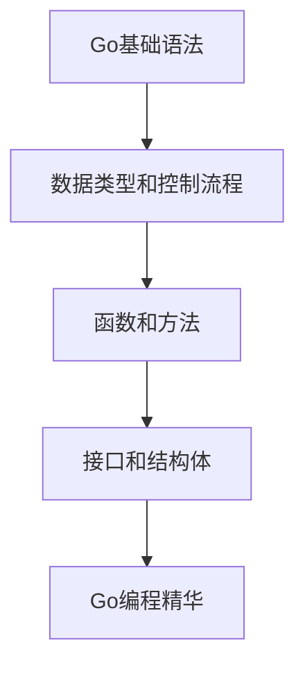

# Go编程精华 - 企业级开发核心技巧

> **文档简介**: 深入Go语言编程的核心技巧和最佳实践，从代码组织到性能优化，帮助你编写高质量、可维护的Go代码

> **目标读者**: 有Go语言基础，希望掌握企业级开发技巧的中高级开发者

> **前置知识**: Go基础语法、数据类型、控制流程、函数定义

> **预计时长**: 6-8小时（包含实践练习）

## 📚 文档元数据

| 属性 | 内容 |
|------|------|
| **模块** | `01-go-backend` |
| **分类** | `language-concepts/core-programming` |
| **难度** | ⭐⭐⭐⭐ |
| **标签** | `#go编程` `#最佳实践` `#代码质量` `#性能优化` |
| **更新日期** | `2025年10月` |
| **作者** | Dev Quest Team |
| **状态** | ✅ 已完成 |

## 🎯 学习目标

完成本模块后，你将能够：

- ✅ **掌握Go语言哲学**: 理解Go的设计哲学和编程范式
- ✅ **编写高质量代码**: 遵循Go的编码规范和最佳实践
- ✅ **优化程序性能**: 掌握性能调优和内存管理技巧
- ✅ **设计优雅架构**: 学会可扩展、可维护的代码组织
- ✅ **处理复杂场景**: 掌握错误处理、并发编程等高级技巧

## 📋 目录

- [Go语言设计哲学](#go语言设计哲学)
- [代码组织与规范](#代码组织与规范)
- [接口设计与抽象](#接口设计与抽象)
- [错误处理最佳实践](#错误处理最佳实践)
- [并发编程模式](#并发编程模式)
- [性能优化技巧](#性能优化技巧)
- [内存管理策略](#内存管理策略)
- [测试与质量保证](#测试与质量保证)
- [包管理与依赖](#包管理与依赖)
- [工具链与工程化](#工具链与工程化)

---

## 🧠 Go语言设计哲学

### 核心设计原则

#### 1. 简洁性 (Simplicity)
```go
// ❌ 过度复杂的实现
func ProcessUsers(users []User) map[string]interface{} {
    result := make(map[string]interface{})
    for i, user := range users {
        if user != nil {
            if user.ID > 0 {
                if user.Name != "" {
                    result[fmt.Sprintf("user_%d", i)] = map[string]interface{}{
                        "id":   user.ID,
                        "name": user.Name,
                        "meta": map[string]interface{}{
                            "created_at": user.CreatedAt,
                            "updated_at": user.UpdatedAt,
                            "status":     user.Status,
                        },
                    }
                }
            }
        }
    }
    return result
}

// ✅ 简洁明了的实现
func ProcessUsers(users []User) map[int]User {
    result := make(map[int]User)
    for _, user := range users {
        if user.IsValid() {
            result[user.ID] = user
        }
    }
    return result
}

func (u *User) IsValid() bool {
    return u != nil && u.ID > 0 && u.Name != ""
}
```

#### 2. 可读性 (Readability)
```go
// ❌ 难以理解的代码
func calc(d []float64) (float64, float64) {
    var s, c float64
    for _, v := range d {
        s += v
        c++
    }
    return s / c, s / float64(c) * s / float64(c)
}

// ✅ 自文档化的代码
func CalculateMeanAndVariance(data []float64) (mean, variance float64) {
    if len(data) == 0 {
        return 0, 0
    }

    mean = calculateMean(data)
    variance = calculateVariance(data, mean)
    return mean, variance
}

func calculateMean(data []float64) float64 {
    sum := 0.0
    for _, value := range data {
        sum += value
    }
    return sum / float64(len(data))
}

func calculateVariance(data []float64, mean float64) float64 {
    sumOfSquares := 0.0
    for _, value := range data {
        diff := value - mean
        sumOfSquares += diff * diff
    }
    return sumOfSquares / float64(len(data))
}
```

#### 3. 组合优于继承 (Composition over Inheritance)
```go
// ❌ 传统继承思维
type Animal struct {
    Name string
}

func (a *Animal) Speak() string {
    return "..."
}

type Dog struct {
    Animal // 继承Animal
    Breed  string
}

func (d *Dog) Speak() string {
    return "Woof!"
}

// ✅ Go的组合方式
type Speaker interface {
    Speak() string
}

type Named interface {
    GetName() string
}

type Animal struct {
    name string
}

func (a *Animal) GetName() string {
    return a.name
}

type Dog struct {
    name  string
    breed string
}

func (d *Dog) GetName() string {
    return d.name
}

func (d *Dog) Speak() string {
    return "Woof!"
}

// 组合使用
type Pet struct {
    speaker Speaker
    named   Named
}

func (p *Pet) Introduce() string {
    return fmt.Sprintf("%s says %s", p.named.GetName(), p.speaker.Speak())
}
```

### Go语言的权衡

#### 显式优于隐式
```go
// ❌ 隐式的魔法
type UserRepository struct {
    // 自动注入数据库连接
    db *Database
}

// ✅ 显式的依赖注入
type UserRepository struct {
    db Database
}

func NewUserRepository(db Database) *UserRepository {
    return &UserRepository{db: db}
}
```

#### 面向接口编程
```go
// 定义小而专注的接口
type Reader interface {
    Read(p []byte) (n int, err error)
}

type Writer interface {
    Write(p []byte) (n int, err error)
}

type Closer interface {
    Close() error
}

// 组合接口
type ReadWriter interface {
    Reader
    Writer
}

type ReadWriteCloser interface {
    Reader
    Writer
    Closer
}
```

---

## 📁 代码组织与规范

### 项目结构最佳实践

#### 标准项目结构
```
my-project/
├── cmd/                    # 应用程序入口点
│   ├── server/
│   │   └── main.go
│   └── cli/
│       └── main.go
├── internal/               # 私有应用程序代码
│   ├── config/
│   ├── models/
│   ├── services/
│   ├── repositories/
│   └── handlers/
├── pkg/                    # 可被外部应用程序使用的库代码
│   ├── auth/
│   ├── utils/
│   └── middleware/
├── api/                    # API定义文件
│   └── openapi/
├── web/                    # Web应用程序特定的组件
│   ├── static/
│   └── templates/
├── build/                  # 构建和打包脚本
├── deployments/            # IaaS、PaaS、系统和容器编排部署配置
├── scripts/                # 各种实用脚本
├── test/                   # 额外的外部测试应用程序和测试数据
├── docs/                   # 设计和用户文档
├── tools/                  # 此项目的支持工具
├── examples/               # 应用程序或公共库的示例
├── third_party/            # 外部辅助工具、分叉代码和其他第三方工具
├── githooks/               # Git钩子
├── assets/                 # 与存储库一起使用的其他资产（图像、徽标等）
├── website/                # 此项目（如果有的话）的网站
└── go.mod                  # Go模块定义
```

#### 包的命名规范
```go
// ✅ 好的包名 - 简短、清晰、描述性
package user          // 处理用户相关功能
package auth          // 认证和授权
package cache         // 缓存操作
package httpserver    // HTTP服务器功能
package stringutils   // 字符串工具函数

// ❌ 避免的包名
package util          // 太通用
package common        // 太通用
package data          // 太通用
package helper        // 太通用
package v1            // 版本号不应该在包名中

// 包级别常量 - 使用PascalCase
package user

const (
    DefaultPageSize = 20
    MaxLoginAttempts = 5
    SessionTimeout = 24 * time.Hour
)

// 包级别变量 - 使用CamelCase
var (
    ErrUserNotFound = errors.New("user not found")
    ErrInvalidPassword = errors.New("invalid password")
)
```

### 函数设计原则

#### 单一职责原则
```go
// ❌ 违反单一职责
func ProcessUserRegistration(name, email, password string) error {
    // 验证输入
    if name == "" || email == "" || password == "" {
        return errors.New("invalid input")
    }
    if !isValidEmail(email) {
        return errors.New("invalid email")
    }
    if len(password) < 8 {
        return errors.New("password too short")
    }

    // 检查邮箱是否已存在
    if userExists(email) {
        return errors.New("email already exists")
    }

    // 密码加密
    hashedPassword, err := bcrypt.GenerateFromPassword([]byte(password), bcrypt.DefaultCost)
    if err != nil {
        return err
    }

    // 创建用户
    user := &User{
        Name: name,
        Email: email,
        Password: string(hashedPassword),
        CreatedAt: time.Now(),
    }

    // 保存到数据库
    return saveUser(user)
}

// ✅ 拆分为多个函数
func ProcessUserRegistration(name, email, password string) error {
    if err := validateRegistrationInput(name, email, password); err != nil {
        return err
    }

    if err := checkEmailAvailability(email); err != nil {
        return err
    }

    hashedPassword, err := hashPassword(password)
    if err != nil {
        return err
    }

    user := createUser(name, email, hashedPassword)
    return saveUser(user)
}

func validateRegistrationInput(name, email, password string) error {
    if name == "" || email == "" || password == "" {
        return errors.New("invalid input")
    }
    if !isValidEmail(email) {
        return errors.New("invalid email")
    }
    if len(password) < 8 {
        return errors.New("password too short")
    }
    return nil
}

func checkEmailAvailability(email string) error {
    if userExists(email) {
        return errors.New("email already exists")
    }
    return nil
}

func hashPassword(password string) (string, error) {
    hashedPassword, err := bcrypt.GenerateFromPassword([]byte(password), bcrypt.DefaultCost)
    if err != nil {
        return "", err
    }
    return string(hashedPassword), nil
}

func createUser(name, email, hashedPassword string) *User {
    return &User{
        Name:      name,
        Email:     email,
        Password:  hashedPassword,
        CreatedAt: time.Now(),
    }
}
```

#### 函数签名设计
```go
// ✅ 良好的函数签名设计
type UserRepository interface {
    // 返回值应该有意义，避免bool
    FindByID(id int) (*User, error)
    FindByEmail(email string) (*User, error)

    // 使用context.Context处理超时和取消
    Create(ctx context.Context, user *User) error
    Update(ctx context.Context, user *User) error

    // 支持分页和过滤
    List(ctx context.Context, opts ListOptions) ([]*User, error)

    // 批量操作
    BatchCreate(ctx context.Context, users []*User) error
    Delete(ctx context.Context, ids []int) error
}

type ListOptions struct {
    Page     int
    PageSize int
    Filter   map[string]interface{}
    SortBy   string
    SortDesc bool
}

// ✅ 选项模式（Options Pattern）
type Server struct {
    host     string
    port     int
    timeout  time.Duration
    tls      bool
    certFile string
    keyFile  string
}

type ServerOption func(*Server)

func WithHost(host string) ServerOption {
    return func(s *Server) {
        s.host = host
    }
}

func WithPort(port int) ServerOption {
    return func(s *Server) {
        s.port = port
    }
}

func WithTimeout(timeout time.Duration) ServerOption {
    return func(s *Server) {
        s.timeout = timeout
    }
}

func WithTLS(certFile, keyFile string) ServerOption {
    return func(s *Server) {
        s.tls = true
        s.certFile = certFile
        s.keyFile = keyFile
    }
}

func NewServer(opts ...ServerOption) *Server {
    server := &Server{
        host:    "localhost",
        port:    8080,
        timeout: 30 * time.Second,
    }

    for _, opt := range opts {
        opt(server)
    }

    return server
}

// 使用方式
server := NewServer(
    WithHost("0.0.0.0"),
    WithPort(443),
    WithTimeout(60*time.Second),
    WithTLS("server.crt", "server.key"),
)
```

---

## 🔌 接口设计与抽象

### 接口设计原则

#### 小而专注的接口
```go
// ❌ 大而全的接口
type UserService interface {
    CreateUser(name, email, password string) error
    GetUser(id int) (*User, error)
    UpdateUser(id int, name, email string) error
    DeleteUser(id int) error
    ValidateUser(user *User) error
    HashPassword(password string) (string, error)
    CheckPassword(hash, password string) bool
    SendWelcomeEmail(user *User) error
    LoginUser(email, password string) (*Session, error)
    LogoutUser(sessionID string) error
}

// ✅ 拆分为小接口
type UserRepository interface {
    Create(ctx context.Context, user *User) error
    FindByID(ctx context.Context, id int) (*User, error)
    Update(ctx context.Context, user *User) error
    Delete(ctx context.Context, id int) error
    FindByEmail(ctx context.Context, email string) (*User, error)
}

type UserValidator interface {
    Validate(user *User) error
}

type PasswordService interface {
    Hash(password string) (string, error)
    Verify(hash, password string) bool
}

type EmailService interface {
    SendWelcomeEmail(user *User) error
    SendPasswordResetEmail(user *User, token string) error
}

type AuthService interface {
    Login(ctx context.Context, email, password string) (*Session, error)
    Logout(ctx context.Context, sessionID string) error
    ValidateSession(ctx context.Context, sessionID string) (*User, error)
}

// 组合使用
type UserService struct {
    repo            UserRepository
    validator       UserValidator
    passwordService PasswordService
    emailService    EmailService
    authService     AuthService
}
```

#### 接口隔离原则
```go
// ❌ 强迫实现不需要的方法
type FileManager interface {
    ReadFile(path string) ([]byte, error)
    WriteFile(path string, data []byte) error
    DeleteFile(path string) error
    ListFiles(dir string) ([]string, error)
    CreateDir(path string) error
    DeleteDir(path string) error
    GetFileInfo(path string) (FileInfo, error)
}

// 如果只需要读取功能，却要实现所有方法
type ReadOnlyFileStorage struct {
    // 必须实现不需要的方法
}

func (s *ReadOnlyFileStorage) ReadFile(path string) ([]byte, error) { /* 实现 */ }
func (s *ReadOnlyFileStorage) WriteFile(path string, data []byte) error {
    return errors.New("operation not supported")
}
func (s *ReadOnlyFileStorage) DeleteFile(path string) error { /* ... */ }
// ...

// ✅ 拆分为细粒度接口
type Reader interface {
    Read(path string) ([]byte, error)
}

type Writer interface {
    Write(path string, data []byte) error
}

type Deleter interface {
    Delete(path string) error
}

type Lister interface {
    List(dir string) ([]string, error)
}

type DirCreator interface {
    CreateDir(path string) error
}

type DirDeleter interface {
    DeleteDir(path string) error
}

type InfoGetter interface {
    GetInfo(path string) (FileInfo, error)
}

// 组合接口
type ReadWriter interface {
    Reader
    Writer
}

type FileManager interface {
    Reader
    Writer
    Deleter
    Lister
    DirCreator
    DirDeleter
    InfoGetter
}

// 现在可以只实现需要的接口
type ReadOnlyFileStorage struct {
    storage Reader
}

func (s *ReadOnlyFileStorage) ReadFile(path string) ([]byte, error) {
    return s.storage.Read(path)
}
```

#### 接口组合
```go
// 基础接口
type Reader interface {
    Read(ctx context.Context, key string) ([]byte, error)
}

type Writer interface {
    Write(ctx context.Context, key string, value []byte) error
}

type Deleter interface {
    Delete(ctx context.Context, key string) error
}

// 组合接口
type ReadWriter interface {
    Reader
    Writer
}

type KeyValueStore interface {
    ReadWriter
    Deleter
}

// 扩展接口
type TTLReader interface {
    Reader
    GetWithTTL(ctx context.Context, key string) ([]byte, time.Duration, error)
}

type TTLWriter interface {
    Writer
    SetWithTTL(ctx context.Context, key string, value []byte, ttl time.Duration) error
}

type TTLKeyValueStore interface {
    TTLReader
    TTLWriter
    Deleter
}

// 实现
type RedisStore struct {
    client *redis.Client
}

func (r *RedisStore) Read(ctx context.Context, key string) ([]byte, error) {
    return r.client.Get(ctx, key).Bytes()
}

func (r *RedisStore) Write(ctx context.Context, key string, value []byte) error {
    return r.client.Set(ctx, key, value, 0).Err()
}

func (r *RedisStore) Delete(ctx context.Context, key string) error {
    return r.client.Del(ctx, key).Err()
}

func (r *RedisStore) GetWithTTL(ctx context.Context, key string) ([]byte, time.Duration, error) {
    cmd := r.client.Get(ctx, key)
    if cmd.Err() != nil {
        return nil, 0, cmd.Err()
    }

    ttl := r.client.TTL(ctx, key).Val()
    return cmd.Bytes(), ttl, nil
}

func (r *RedisStore) SetWithTTL(ctx context.Context, key string, value []byte, ttl time.Duration) error {
    return r.client.Set(ctx, key, value, ttl).Err()
}
```

### 依赖注入模式

#### 构造函数注入
```go
type UserService struct {
    userRepo       UserRepository
    authRepo       AuthRepository
    emailService   EmailService
    passwordHasher PasswordHasher
    logger         Logger
}

func NewUserService(
    userRepo UserRepository,
    authRepo AuthRepository,
    emailService EmailService,
    passwordHasher PasswordHasher,
    logger Logger,
) *UserService {
    return &UserService{
        userRepo:       userRepo,
        authRepo:       authRepo,
        emailService:   emailService,
        passwordHasher: passwordHasher,
        logger:         logger,
    }
}

func (s *UserService) RegisterUser(ctx context.Context, req *RegisterUserRequest) (*User, error) {
    s.logger.Info("开始注册用户", "email", req.Email)

    // 业务逻辑...

    s.logger.Info("用户注册成功", "userID", user.ID)
    return user, nil
}
```

#### 工厂模式
```go
type DatabaseConfig struct {
    Host     string
    Port     int
    User     string
    Password string
    DBName   string
}

type DatabaseType int

const (
    MySQL DatabaseType = iota
    PostgreSQL
    SQLite
)

type DatabaseFactory interface {
    CreateRepository() UserRepository
    CreateConnection() (*sql.DB, error)
}

type MySQLDatabaseFactory struct {
    config DatabaseConfig
}

func (f *MySQLDatabaseFactory) CreateRepository() UserRepository {
    conn, _ := f.CreateConnection()
    return &MySQLUserRepository{db: conn}
}

func (f *MySQLDatabaseFactory) CreateConnection() (*sql.DB, error) {
    dsn := fmt.Sprintf("%s:%s@tcp(%s:%d)/%s?parseTime=true",
        f.config.User, f.config.Password, f.config.Host, f.config.Port, f.config.DBName)
    return sql.Open("mysql", dsn)
}

type PostgreSQLDatabaseFactory struct {
    config DatabaseConfig
}

func (f *PostgreSQLDatabaseFactory) CreateRepository() UserRepository {
    conn, _ := f.CreateConnection()
    return &PostgreSQLUserRepository{db: conn}
}

func (f *PostgreSQLDatabaseFactory) CreateConnection() (*sql.DB, error) {
    dsn := fmt.Sprintf("host=%s port=%d user=%s password=%s dbname=%s sslmode=disable",
        f.config.Host, f.config.Port, f.config.User, f.config.Password, f.config.DBName)
    return sql.Open("postgres", dsn)
}

// 工厂函数
func NewDatabaseFactory(dbType DatabaseType, config DatabaseConfig) DatabaseFactory {
    switch dbType {
    case MySQL:
        return &MySQLDatabaseFactory{config: config}
    case PostgreSQL:
        return &PostgreSQLDatabaseFactory{config: config}
    case SQLite:
        return &SQLiteDatabaseFactory{config: config}
    default:
        panic("unsupported database type")
    }
}

// 使用
factory := NewDatabaseFactory(MySQL, dbConfig)
userRepo := factory.CreateRepository()
```

---

## ⚠️ 错误处理最佳实践

### Go错误处理哲学

#### 显式错误处理
```go
// ❌ 忽略错误
func GetUser(id int) *User {
    user, _ := userRepo.FindByID(id)
    return user
}

// ✅ 处理所有错误
func GetUser(id int) (*User, error) {
    user, err := userRepo.FindByID(id)
    if err != nil {
        return nil, fmt.Errorf("failed to find user %d: %w", id, err)
    }
    return user, nil
}

// ✅ 使用包装错误提供上下文
func (s *UserService) CreateUser(req *CreateUserRequest) error {
    if err := s.validateRequest(req); err != nil {
        return fmt.Errorf("validation failed: %w", err)
    }

    user := &User{
        Name:  req.Name,
        Email: req.Email,
    }

    if err := s.repo.Create(user); err != nil {
        return fmt.Errorf("failed to create user: %w", err)
    }

    return nil
}
```

#### 错误类型设计
```go
// 自定义错误类型
type ValidationError struct {
    Field   string
    Message string
    Value   interface{}
}

func (e *ValidationError) Error() string {
    return fmt.Sprintf("validation failed for field '%s': %s", e.Field, e.Message)
}

type NotFoundError struct {
    Resource string
    ID       interface{}
}

func (e *NotFoundError) Error() string {
    return fmt.Sprintf("%s with id %v not found", e.Resource, e.ID)
}

type ConflictError struct {
    Resource string
    Field    string
    Value    interface{}
}

func (e *ConflictError) Error() string {
    return fmt.Sprintf("conflict: %s with %s '%v' already exists", e.Resource, e.Field, e.Value)
}

// 预定义错误
var (
    ErrUserNotFound     = &NotFoundError{Resource: "user"}
    ErrEmailExists      = &ConflictError{Resource: "user", Field: "email"}
    ErrInvalidCredentials = errors.New("invalid credentials")
)

// 错误检查函数
func IsValidationError(err error) bool {
    var validationErr *ValidationError
    return errors.As(err, &validationErr)
}

func IsNotFoundError(err error) bool {
    var notFoundErr *NotFoundError
    return errors.As(err, &notFoundErr)
}

func IsConflictError(err error) bool {
    var conflictErr *ConflictError
    return errors.As(err, &conflictErr)
}
```

#### 错误包装与上下文
```go
// ❌ 丢失原始错误信息
func (s *UserService) GetUser(id int) (*User, error) {
    if id <= 0 {
        return nil, errors.New("invalid user id")
    }

    user, err := s.repo.FindByID(id)
    if err != nil {
        return nil, errors.New("database error")
    }

    return user, nil
}

// ✅ 保留错误链
func (s *UserService) GetUser(id int) (*User, error) {
    if id <= 0 {
        return nil, &ValidationError{
            Field:   "id",
            Message: "must be positive",
            Value:   id,
        }
    }

    user, err := s.repo.FindByID(id)
    if err != nil {
        return nil, fmt.Errorf("failed to find user %d: %w", id, err)
    }

    return user, nil
}

// ✅ 提供丰富的错误上下文
func (s *UserService) CreateUser(ctx context.Context, req *CreateUserRequest) (*User, error) {
    // 验证请求
    if err := s.validateCreateRequest(req); err != nil {
        return nil, fmt.Errorf("create user request validation failed: %w", err)
    }

    // 检查邮箱唯一性
    if exists, err := s.emailExists(ctx, req.Email); err != nil {
        return nil, fmt.Errorf("failed to check email existence: %w", err)
    } else if exists {
        return nil, &ConflictError{
            Resource: "user",
            Field:    "email",
            Value:    req.Email,
        }
    }

    // 创建用户
    user := &User{
        Name:      req.Name,
        Email:     req.Email,
        CreatedAt: time.Now(),
    }

    if err := s.repo.Create(ctx, user); err != nil {
        return nil, fmt.Errorf("failed to create user in database: %w", err)
    }

    // 发送欢迎邮件
    if err := s.sendWelcomeEmail(ctx, user); err != nil {
        // 记录错误但不中断流程
        log.Printf("failed to send welcome email to user %d: %v", user.ID, err)
    }

    return user, nil
}
```

#### 错误恢复策略
```go
// 重试机制
type RetryConfig struct {
    MaxAttempts int
    Delay       time.Duration
    Backoff     float64
}

func WithRetry(ctx context.Context, config RetryConfig, fn func() error) error {
    var lastErr error

    for attempt := 1; attempt <= config.MaxAttempts; attempt++ {
        if err := fn(); err == nil {
            return nil
        } else {
            lastErr = err

            if attempt < config.MaxAttempts {
                delay := time.Duration(float64(config.Delay) * math.Pow(config.Backoff, float64(attempt-1)))
                select {
                case <-ctx.Done():
                    return ctx.Err()
                case <-time.After(delay):
                    continue
                }
            }
        }
    }

    return fmt.Errorf("failed after %d attempts: %w", config.MaxAttempts, lastErr)
}

// 断路器模式
type CircuitBreaker struct {
    maxFailures  int
    resetTimeout time.Duration
    failures     int
    lastFailTime time.Time
    state        State
    mutex        sync.Mutex
}

type State int

const (
    StateClosed State = iota
    StateOpen
    StateHalfOpen
)

func (cb *CircuitBreaker) Call(fn func() error) error {
    cb.mutex.Lock()
    defer cb.mutex.Unlock()

    switch cb.state {
    case StateOpen:
        if time.Since(cb.lastFailTime) > cb.resetTimeout {
            cb.state = StateHalfOpen
            cb.failures = 0
        } else {
            return errors.New("circuit breaker is open")
        }
    case StateHalfOpen:
        // 允许少量请求通过
    }

    err := fn()
    if err != nil {
        cb.failures++
        cb.lastFailTime = time.Now()

        if cb.failures >= cb.maxFailures {
            cb.state = StateOpen
        }
        return err
    }

    // 成功调用
    cb.failures = 0
    cb.state = StateClosed
    return nil
}

// 使用示例
func (s *UserService) CreateUserWithRetry(ctx context.Context, req *CreateUserRequest) error {
    retryConfig := RetryConfig{
        MaxAttempts: 3,
        Delay:       100 * time.Millisecond,
        Backoff:     2.0,
    }

    return WithRetry(ctx, retryConfig, func() error {
        return s.CreateUser(ctx, req)
    })
}
```

---

## 🚀 并发编程模式

### Goroutine最佳实践

#### 控制Goroutine数量
```go
// ❌ 无限制创建goroutine
func ProcessUsers(users []User) {
    for _, user := range users {
        go func(u User) {
            // 处理用户
            ProcessUser(u)
        }(user)
    }
}

// ✅ 使用worker pool模式
func ProcessUsers(users []User) error {
    const workerCount = 10
    jobs := make(chan User, len(users))
    results := make(chan error, len(users))

    // 启动worker
    var wg sync.WaitGroup
    for i := 0; i < workerCount; i++ {
        wg.Add(1)
        go func() {
            defer wg.Done()
            for user := range jobs {
                if err := ProcessUser(user); err != nil {
                    results <- err
                } else {
                    results <- nil
                }
            }
        }()
    }

    // 发送任务
    go func() {
        defer close(jobs)
        for _, user := range users {
            jobs <- user
        }
    }()

    // 等待完成
    go func() {
        wg.Wait()
        close(results)
    }()

    // 收集结果
    var errors []error
    for err := range results {
        if err != nil {
            errors = append(errors, err)
        }
    }

    if len(errors) > 0 {
        return fmt.Errorf("processing completed with %d errors: %v", len(errors), errors)
    }

    return nil
}
```

#### 优雅关闭
```go
type Server struct {
    httpServer *http.Server
    tasks      []func(context.Context) error
}

func NewServer() *Server {
    return &Server{
        tasks: make([]func(context.Context) error, 0),
    }
}

func (s *Server) AddTask(task func(context.Context) error) {
    s.tasks = append(s.tasks, task)
}

func (s *Server) Start() error {
    // 启动HTTP服务器
    go func() {
        if err := s.httpServer.ListenAndServe(); err != nil && err != http.ErrServerClosed {
            log.Printf("HTTP server error: %v", err)
        }
    }()

    // 启动后台任务
    ctx, cancel := context.WithCancel(context.Background())
    defer cancel()

    for _, task := range s.tasks {
        go func(t func(context.Context) error) {
            if err := t(ctx); err != nil {
                log.Printf("Task error: %v", err)
            }
        }(task)
    }

    return nil
}

func (s *Server) Shutdown(ctx context.Context) error {
    // 创建一个超时context
    shutdownCtx, cancel := context.WithTimeout(ctx, 30*time.Second)
    defer cancel()

    // 关闭HTTP服务器
    if err := s.httpServer.Shutdown(shutdownCtx); err != nil {
        return fmt.Errorf("failed to shutdown HTTP server: %w", err)
    }

    // 取消所有后台任务
    cancel()

    return nil
}

// 使用信号处理优雅关闭
func main() {
    server := NewServer()

    // 添加任务
    server.AddTask(func(ctx context.Context) error {
        ticker := time.NewTicker(1 * time.Minute)
        defer ticker.Stop()

        for {
            select {
            case <-ctx.Done():
                return ctx.Err()
            case <-ticker.C:
                if err := doPeriodicTask(); err != nil {
                    log.Printf("Periodic task error: %v", err)
                }
            }
        }
    })

    if err := server.Start(); err != nil {
        log.Fatal(err)
    }

    // 等待信号
    sigChan := make(chan os.Signal, 1)
    signal.Notify(sigChan, syscall.SIGINT, syscall.SIGTERM)
    <-sigChan

    // 优雅关闭
    ctx, cancel := context.WithTimeout(context.Background(), 30*time.Second)
    defer cancel()

    if err := server.Shutdown(ctx); err != nil {
        log.Printf("Shutdown error: %v", err)
        os.Exit(1)
    }

    log.Println("Server shutdown gracefully")
}
```

### Channel使用模式

#### 扇入模式 (Fan-in)
```go
func fanIn(channels ...<-chan string) <-chan string {
    output := make(chan string)

    var wg sync.WaitGroup
    for _, ch := range channels {
        wg.Add(1)
        go func(ch <-chan string) {
            defer wg.Done()
            for value := range ch {
                output <- value
            }
        }(ch)
    }

    go func() {
        wg.Wait()
        close(output)
    }()

    return output
}

// 使用示例
func main() {
    ch1 := make(chan string)
    ch2 := make(chan string)
    ch3 := make(chan string)

    // 启动生产者
    go func() {
        defer close(ch1)
        for i := 0; i < 5; i++ {
            ch1 <- fmt.Sprintf("ch1-%d", i)
            time.Sleep(100 * time.Millisecond)
        }
    }()

    go func() {
        defer close(ch2)
        for i := 0; i < 5; i++ {
            ch2 <- fmt.Sprintf("ch2-%d", i)
            time.Sleep(150 * time.Millisecond)
        }
    }()

    go func() {
        defer close(ch3)
        for i := 0; i < 5; i++ {
            ch3 <- fmt.Sprintf("ch3-%d", i)
            time.Sleep(200 * time.Millisecond)
        }
    }()

    // 扇入
    output := fanIn(ch1, ch2, ch3)

    for value := range output {
        fmt.Println(value)
    }
}
```

#### 扇出模式 (Fan-out)
```go
func fanOut(input <-chan int, workerCount int) []<-chan int {
    outputs := make([]<-chan int, workerCount)

    for i := 0; i < workerCount; i++ {
        output := make(chan int)
        outputs[i] = output

        go func(ch chan<- int) {
            defer close(ch)
            for value := range input {
                // 处理数据
                result := process(value)
                ch <- result
            }
        }(output)
    }

    return outputs
}

func process(value int) int {
    // 模拟耗时操作
    time.Sleep(time.Duration(rand.Intn(100)) * time.Millisecond)
    return value * value
}
```

#### 限流模式
```go
type RateLimiter struct {
    rate       time.Duration
    burst      int
    tokens     chan struct{}
    lastUpdate time.Time
    mutex      sync.Mutex
}

func NewRateLimiter(rate time.Duration, burst int) *RateLimiter {
    rl := &RateLimiter{
        rate:   rate,
        burst:  burst,
        tokens: make(chan struct{}, burst),
    }

    // 初始填充令牌
    for i := 0; i < burst; i++ {
        rl.tokens <- struct{}{}
    }

    return rl
}

func (rl *RateLimiter) Allow() bool {
    select {
    case <-rl.tokens:
        return true
    default:
        rl.refill()
        select {
        case <-rl.tokens:
            return true
        default:
            return false
        }
    }
}

func (rl *RateLimiter) refill() {
    rl.mutex.Lock()
    defer rl.mutex.Unlock()

    now := time.Now()
    elapsed := now.Sub(rl.lastUpdate)
    if elapsed < rl.rate {
        return
    }

    tokensToAdd := int(elapsed / rl.rate)
    if tokensToAdd <= 0 {
        return
    }

    for i := 0; i < tokensToAdd && len(rl.tokens) < cap(rl.tokens); i++ {
        select {
        case rl.tokens <- struct{}{}:
        default:
            break
        }
    }

    rl.lastUpdate = now
}

// 使用示例
func main() {
    limiter := NewRateLimiter(100*time.Millisecond, 5)

    for i := 0; i < 20; i++ {
        if limiter.Allow() {
            fmt.Printf("Request %d allowed\n", i)
        } else {
            fmt.Printf("Request %d rate limited\n", i)
        }
        time.Sleep(50 * time.Millisecond)
    }
}
```

### Context使用模式

#### 超时控制
```go
func (s *UserService) GetUserWithTimeout(ctx context.Context, id int) (*User, error) {
    // 创建带超时的context
    ctx, cancel := context.WithTimeout(ctx, 5*time.Second)
    defer cancel()

    return s.repo.FindByID(ctx, id)
}

func (s *UserService) BatchProcessUsers(ctx context.Context, users []User) error {
    const batchSize = 10
    const timeout = 30 * time.Second

    for i := 0; i < len(users); i += batchSize {
        end := i + batchSize
        if end > len(users) {
            end = len(users)
        }

        batch := users[i:end]

        // 为每个批次创建独立的超时
        ctx, cancel := context.WithTimeout(ctx, timeout)
        if err := s.processBatch(ctx, batch); err != nil {
            cancel()
            return fmt.Errorf("failed to process batch %d: %w", i/batchSize, err)
        }
        cancel()
    }

    return nil
}
```

#### 取消传播
```go
func (s *Service) ProcessData(ctx context.Context, data []Data) error {
    // 创建子context
    childCtx, cancel := context.WithCancel(ctx)
    defer cancel()

    // 启动多个goroutine
    errChan := make(chan error, 2)

    go func() {
        errChan <- s.step1(childCtx, data)
    }()

    go func() {
        errChan <- s.step2(childCtx, data)
    }()

    // 等待完成或取消
    var errors []error
    for i := 0; i < 2; i++ {
        select {
        case err := <-errChan:
            if err != nil {
                errors = append(errors, err)
                cancel() // 取消其他goroutine
            }
        case <-ctx.Done():
            return ctx.Err()
        }
    }

    if len(errors) > 0 {
        return fmt.Errorf("processing failed: %v", errors)
    }

    return nil
}
```

#### 值传递
```go
type UserIDKey struct{}
type RequestIDKey struct{}

func WithUserID(ctx context.Context, userID int) context.Context {
    return context.WithValue(ctx, UserIDKey{}, userID)
}

func GetUserID(ctx context.Context) (int, bool) {
    userID, ok := ctx.Value(UserIDKey{}).(int)
    return userID, ok
}

func WithRequestID(ctx context.Context, requestID string) context.Context {
    return context.WithValue(ctx, RequestIDKey{}, requestID)
}

func GetRequestID(ctx context.Context) string {
    if requestID, ok := ctx.Value(RequestIDKey{}).(string); ok {
        return requestID
    }
    return ""
}

// 在中间件中使用
func LoggingMiddleware(next http.Handler) http.Handler {
    return http.HandlerFunc(func(w http.ResponseWriter, r *http.Request) {
        requestID := generateRequestID()
        ctx := WithRequestID(r.Context(), requestID)

        logger := logger.With("request_id", requestID)
        ctx = WithLogger(ctx, logger)

        next.ServeHTTP(w, r.WithContext(ctx))
    })
}

func (s *UserService) GetUser(ctx context.Context, id int) (*User, error) {
    logger := GetLogger(ctx)
    requestID := GetRequestID(ctx)

    logger.Info("getting user", "user_id", id, "request_id", requestID)

    user, err := s.repo.FindByID(ctx, id)
    if err != nil {
        logger.Error("failed to get user", "error", err, "user_id", id)
        return nil, err
    }

    return user, nil
}
```

---

## ⚡ 性能优化技巧

### 内存优化

#### 避免内存泄漏
```go
// ❌ 可能导致内存泄漏
func (s *Service) WatchChanges() {
    ticker := time.NewTicker(time.Second)
    defer ticker.Stop()

    for {
        select {
        case <-ticker.C:
            changes := s.getChanges()
            // 如果changes很大且处理很慢，会累积内存
            processChanges(changes)
        case <-s.ctx.Done():
            return
        }
    }
}

// ✅ 使用对象池避免内存泄漏
func (s *Service) WatchChanges() {
    ticker := time.NewTicker(time.Second)
    defer ticker.Stop()

    // 使用对象池
    changePool := &sync.Pool{
        New: func() interface{} {
            return make([]Change, 0, 100)
        },
    }

    for {
        select {
        case <-ticker.C:
            // 从池中获取切片
            changes := changePool.Get().([]Change)
            changes = changes[:0] // 重置长度但保留容量

            changes = s.getChanges()
            processChanges(changes)

            // 归还到池中
            changePool.Put(changes)

        case <-s.ctx.Done():
            return
        }
    }
}
```

#### 字符串优化
```go
// ❌ 字符串拼接性能差
func BuildQuery(params map[string]string) string {
    var query string
    for key, value := range params {
        query += key + "=" + value + "&"
    }
    return query
}

// ✅ 使用strings.Builder
func BuildQuery(params map[string]string) string {
    var builder strings.Builder
    builder.Grow(len(params) * 20) // 预分配容量

    first := true
    for key, value := range params {
        if !first {
            builder.WriteByte('&')
        }
        builder.WriteString(key)
        builder.WriteByte('=')
        builder.WriteString(value)
        first = false
    }

    return builder.String()
}

// ✅ 对于大量拼接，使用更高效的方式
func BuildLargeQuery(params map[string]string) string {
    parts := make([]string, 0, len(params)*2)
    for key, value := range params {
        parts = append(parts, key, value)
    }
    return strings.Join(parts, "=") + "&"
}
```

#### 切片优化
```go
// ❌ 频繁扩容切片
func ProcessData(data []int) []int {
    var result []int
    for _, item := range data {
        if isValid(item) {
            result = append(result, process(item))
        }
    }
    return result
}

// ✅ 预分配容量
func ProcessData(data []int) []int {
    // 估算容量
    estimatedSize := len(data) / 2 // 假设有一半数据有效
    result := make([]int, 0, estimatedSize)

    for _, item := range data {
        if isValid(item) {
            result = append(result, process(item))
        }
    }
    return result
}

// ✅ 复用切片
func (p *Processor) ProcessData(data []int) []int {
    // 复用已有的切片
    p.result = p.result[:0] // 重置长度但保留容量

    if cap(p.result) < len(data) {
        p.result = make([]int, 0, len(data))
    }

    for _, item := range data {
        if isValid(item) {
            p.result = append(p.result, process(item))
        }
    }

    return p.result
}
```

### 并发性能优化

#### 减少锁竞争
```go
// ❌ 粗粒度锁
type Counter struct {
    mutex sync.Mutex
    count int
}

func (c *Counter) Increment() {
    c.mutex.Lock()
    defer c.mutex.Unlock()
    c.count++
}

func (c *Counter) GetValue() int {
    c.mutex.Lock()
    defer c.mutex.Unlock()
    return c.count
}

// ✅ 使用原子操作
type Counter struct {
    count int64
}

func (c *Counter) Increment() {
    atomic.AddInt64(&c.count, 1)
}

func (c *Counter) GetValue() int64 {
    return atomic.LoadInt64(&c.count)
}

// ✅ 分片锁减少竞争
type ShardedMap struct {
    shards []map[string]interface{}
    mutexes []sync.RWMutex
    shardCount int
}

func NewShardedMap(shardCount int) *ShardedMap {
    sm := &ShardedMap{
        shards: make([]map[string]interface{}, shardCount),
        mutexes: make([]sync.RWMutex, shardCount),
        shardCount: shardCount,
    }

    for i := 0; i < shardCount; i++ {
        sm.shards[i] = make(map[string]interface{})
    }

    return sm
}

func (sm *ShardedMap) getShard(key string) (map[string]interface{}, *sync.RWMutex) {
    hash := fnv32(key)
    index := hash % uint32(sm.shardCount)
    return sm.shards[index], &sm.mutexes[index]
}

func (sm *ShardedMap) Set(key string, value interface{}) {
    shard, mutex := sm.getShard(key)
    mutex.Lock()
    defer mutex.Unlock()
    shard[key] = value
}

func (sm *ShardedMap) Get(key string) (interface{}, bool) {
    shard, mutex := sm.getShard(key)
    mutex.RLock()
    defer mutex.RUnlock()
    value, exists := shard[key]
    return value, exists
}

func fnv32(s string) uint32 {
    h := fnv32OffsetBasis
    for i := 0; i < len(s); i++ {
        h ^= uint32(s[i])
        h *= fnv32Prime
    }
    return h
}

const (
    fnv32OffsetBasis = 2166136261
    fnv32Prime       = 16777619
)
```

#### 无锁数据结构
```go
// 使用channel实现无锁队列
type Queue struct {
    input  chan interface{}
    output chan interface{}
}

func NewQueue() *Queue {
    q := &Queue{
        input:  make(chan interface{}),
        output: make(chan interface{}),
    }

    go q.worker()
    return q
}

func (q *Queue) worker() {
    var items []interface{}

    for {
        var output chan interface{}
        var item interface{}

        if len(items) > 0 {
            output = q.output
            item = items[0]
        }

        select {
        case newItem := <-q.input:
            items = append(items, newItem)
        case output <- item:
            items = items[1:]
        }
    }
}

func (q *Queue) Enqueue(item interface{}) {
    q.input <- item
}

func (q *Queue) Dequeue() interface{} {
    return <-q.output
}
```

### 数据库优化

#### 连接池配置
```go
type DatabaseConfig struct {
    MaxOpenConns    int
    MaxIdleConns    int
    ConnMaxLifetime time.Duration
    ConnMaxIdleTime time.Duration
}

func ConfigureDB(db *sql.DB, config DatabaseConfig) error {
    db.SetMaxOpenConns(config.MaxOpenConns)
    db.SetMaxIdleConns(config.MaxIdleConns)
    db.SetConnMaxLifetime(config.ConnMaxLifetime)
    db.SetConnMaxIdleTime(config.ConnMaxIdleTime)

    // 验证连接
    if err := db.Ping(); err != nil {
        return fmt.Errorf("failed to ping database: %w", err)
    }

    return nil
}

// 生产环境配置
func NewProductionDBConfig() DatabaseConfig {
    return DatabaseConfig{
        MaxOpenConns:    100,
        MaxIdleConns:    10,
        ConnMaxLifetime: time.Hour,
        ConnMaxIdleTime: time.Minute * 30,
    }
}

// 开发环境配置
func NewDevelopmentDBConfig() DatabaseConfig {
    return DatabaseConfig{
        MaxOpenConns:    10,
        MaxIdleConns:    5,
        ConnMaxLifetime: time.Minute * 30,
        ConnMaxIdleTime: time.Minute * 5,
    }
}
```

#### 批量操作优化
```go
// ❌ N+1查询问题
func (r *UserRepository) GetUsersWithPosts(userIDs []int) ([]UserWithPosts, error) {
    var results []UserWithPosts

    for _, id := range userIDs {
        user, err := r.FindByID(id)
        if err != nil {
            return nil, err
        }

        posts, err := r.FindPostsByUserID(id)
        if err != nil {
            return nil, err
        }

        results = append(results, UserWithPosts{
            User:  *user,
            Posts: posts,
        })
    }

    return results, nil
}

// ✅ 批量查询优化
func (r *UserRepository) GetUsersWithPosts(userIDs []int) ([]UserWithPosts, error) {
    // 批量查询用户
    users, err := r.FindByIDs(userIDs)
    if err != nil {
        return nil, err
    }

    // 批量查询文章
    posts, err := r.FindPostsByUserIDs(userIDs)
    if err != nil {
        return nil, err
    }

    // 按用户ID分组文章
    postsByUser := make(map[int][]Post)
    for _, post := range posts {
        postsByUser[post.UserID] = append(postsByUser[post.UserID], post)
    }

    // 组装结果
    var results []UserWithPosts
    for _, user := range users {
        userPosts := postsByUser[user.ID]
        results = append(results, UserWithPosts{
            User:  user,
            Posts: userPosts,
        })
    }

    return results, nil
}
```

---

## 💾 内存管理策略

### 垃圾回收优化

#### 减少GC压力
```go
// ❌ 创建大量临时对象
func ProcessData(data []byte) []byte {
    var result []byte

    for _, b := range data {
        // 每次循环都创建新的切片
        temp := make([]byte, 1)
        temp[0] = transform(b)
        result = append(result, temp...)
    }

    return result
}

// ✅ 复用对象，减少GC压力
func ProcessData(data []byte) []byte {
    // 预分配足够大的切片
    result := make([]byte, 0, len(data))

    for _, b := range data {
        result = append(result, transform(b))
    }

    return result
}

// ✅ 使用对象池
var bufferPool = sync.Pool{
    New: func() interface{} {
        return make([]byte, 0, 1024)
    },
}

func ProcessDataWithPool(data []byte) []byte {
    buffer := bufferPool.Get().([]byte)
    defer bufferPool.Put(buffer[:0]) // 归还时重置长度

    buffer = buffer[:0] // 重置长度但保留容量

    for _, b := range data {
        buffer = append(buffer, transform(b))
    }

    // 复制结果，因为buffer会被归还到池中
    result := make([]byte, len(buffer))
    copy(result, buffer)

    return result
}
```

#### 内存逃逸分析
```go
// ❌ 导致内存逃逸
func ProcessLargeData() {
    data := make([]int, 1000000)

    // 匿名函数捕获data，导致data逃逸到堆
    go func() {
        for i := range data {
            data[i] *= 2
        }
    }()

    time.Sleep(time.Second)
}

// ✅ 避免内存逃逸
func ProcessLargeData() {
    data := make([]int, 1000000)

    // 传递指针而不是捕获整个数组
    go func(d []int) {
        for i := range d {
            d[i] *= 2
        }
    }(data)

    time.Sleep(time.Second)
}

// ✅ 使用值类型避免逃逸
type Point struct {
    X, Y int
}

func (p Point) Distance(other Point) int {
    // 值类型不会逃逸
    dx := p.X - other.X
    dy := p.Y - other.Y
    return dx*dx + dy*dy
}

// ❌ 指针类型可能导致逃逸
func (p *Point) Distance(other *Point) int {
    // 指针类型更容易逃逸
    dx := p.X - other.X
    dy := p.Y - other.Y
    return dx*dx + dy*dy
}
```

#### 内存映射文件
```go
type MemoryMappedFile struct {
    data []byte
    file *os.File
}

func NewMemoryMappedFile(filename string) (*MemoryMappedFile, error) {
    file, err := os.Open(filename)
    if err != nil {
        return nil, err
    }

    stat, err := file.Stat()
    if err != nil {
        file.Close()
        return nil, err
    }

    data, err := syscall.Mmap(int(file.Fd()), 0, int(stat.Size()),
        syscall.PROT_READ, syscall.MAP_SHARED)
    if err != nil {
        file.Close()
        return nil, err
    }

    return &MemoryMappedFile{
        data: data,
        file: file,
    }, nil
}

func (m *MemoryMappedFile) Data() []byte {
    return m.data
}

func (m *MemoryMappedFile) Close() error {
    err1 := syscall.Munmap(m.data)
    err2 := m.file.Close()

    if err1 != nil {
        return err1
    }
    return err2
}

// 使用示例
func ProcessLargeFile(filename string) error {
    mmf, err := NewMemoryMappedFile(filename)
    if err != nil {
        return err
    }
    defer mmf.Close()

    data := mmf.Data()

    // 处理数据，无需将整个文件加载到内存
    for i := 0; i < len(data); i += 1024 {
        end := i + 1024
        if end > len(data) {
            end = len(data)
        }

        chunk := data[i:end]
        ProcessChunk(chunk)
    }

    return nil
}
```

### 内存监控与调试

#### 内存统计
```go
func PrintMemStats() {
    var m runtime.MemStats
    runtime.ReadMemStats(&m)

    log.Printf("内存统计信息:")
    log.Printf("  分配的字节数: %d KB", m.Alloc/1024)
    log.Printf("  总分配的字节数: %d KB", m.TotalAlloc/1024)
    log.Printf("  系统内存字节数: %d KB", m.Sys/1024)
    log.Printf("  GC运行次数: %d", m.NumGC)
    log.Printf("  下一次GC目标字节数: %d KB", m.NextGC/1024)
    log.Printf("  堆对象数量: %d", m.HeapObjects)
}

// 内存监控器
type MemoryMonitor struct {
    interval time.Duration
    stopChan chan struct{}
}

func NewMemoryMonitor(interval time.Duration) *MemoryMonitor {
    return &MemoryMonitor{
        interval: interval,
        stopChan: make(chan struct{}),
    }
}

func (m *MemoryMonitor) Start() {
    ticker := time.NewTicker(m.interval)
    defer ticker.Stop()

    for {
        select {
        case <-ticker.C:
            PrintMemStats()
        case <-m.stopChan:
            return
        }
    }
}

func (m *MemoryMonitor) Stop() {
    close(m.stopChan)
}

// 使用示例
func main() {
    monitor := NewMemoryMonitor(10 * time.Second)
    go monitor.Start()
    defer monitor.Stop()

    // 应用程序逻辑
    // ...
}
```

#### pprof内存分析
```go
import (
    _ "net/http/pprof"
    "net/http"
    "os"
    "runtime"
    "runtime/pprof"
)

func StartProfileServer() {
    go func() {
        log.Println("Profile server starting on :6060")
        log.Fatal(http.ListenAndServe(":6060", nil))
    }()
}

func EnableMemoryProfile(filename string) error {
    f, err := os.Create(filename)
    if err != nil {
        return err
    }
    defer f.Close()

    runtime.GC() // 强制GC以获取准确的内存使用情况

    if err := pprof.WriteHeapProfile(f); err != nil {
        return err
    }

    return nil
}

// CPU性能分析
func EnableCPUProfile(filename string) func() {
    f, err := os.Create(filename)
    if err != nil {
        log.Fatal(err)
    }

    pprof.StartCPUProfile(f)

    return func() {
        pprof.StopCPUProfile()
        f.Close()
    }
}

// 使用示例
func main() {
    // 启动profile服务器
    StartProfileServer()

    // 启用CPU分析
    stopCPU := EnableCPUProfile("cpu.prof")
    defer stopCPU()

    // 应用程序逻辑
    // ...

    // 生成内存profile
    if err := EnableMemoryProfile("mem.prof"); err != nil {
        log.Printf("Failed to write memory profile: %v", err)
    }
}
```

---

## 🧪 测试与质量保证

### 测试策略

#### 单元测试
```go
// user_service_test.go
package services

import (
    "context"
    "errors"
    "testing"
    "time"

    "github.com/stretchr/testify/assert"
    "github.com/stretchr/testify/mock"
    "github.com/stretchr/testify/require"
)

// Mock实现
type MockUserRepository struct {
    mock.Mock
}

func (m *MockUserRepository) FindByID(ctx context.Context, id int) (*User, error) {
    args := m.Called(ctx, id)
    if args.Get(0) == nil {
        return nil, args.Error(1)
    }
    return args.Get(0).(*User), args.Error(1)
}

func (m *MockUserRepository) Create(ctx context.Context, user *User) error {
    args := m.Called(ctx, user)
    return args.Error(0)
}

func (m *MockUserRepository) FindByEmail(ctx context.Context, email string) (*User, error) {
    args := m.Called(ctx, email)
    if args.Get(0) == nil {
        return nil, args.Error(1)
    }
    return args.Get(0).(*User), args.Error(1)
}

// 测试用例
func TestUserService_GetUser_Success(t *testing.T) {
    // 准备
    mockRepo := new(MockUserRepository)
    service := NewUserService(mockRepo)

    expectedUser := &User{
        ID:    1,
        Name:  "John Doe",
        Email: "john@example.com",
    }

    ctx := context.Background()
    mockRepo.On("FindByID", ctx, 1).Return(expectedUser, nil)

    // 执行
    user, err := service.GetUser(ctx, 1)

    // 验证
    require.NoError(t, err)
    assert.Equal(t, expectedUser, user)
    mockRepo.AssertExpectations(t)
}

func TestUserService_GetUser_NotFound(t *testing.T) {
    // 准备
    mockRepo := new(MockUserRepository)
    service := NewUserService(mockRepo)

    ctx := context.Background()
    mockRepo.On("FindByID", ctx, 999).Return(nil, errors.New("user not found"))

    // 执行
    user, err := service.GetUser(ctx, 999)

    // 验证
    assert.Error(t, err)
    assert.Nil(t, user)
    assert.Contains(t, err.Error(), "user not found")
    mockRepo.AssertExpectations(t)
}

func TestUserService_CreateUser_EmailExists(t *testing.T) {
    // 准备
    mockRepo := new(MockUserRepository)
    service := NewUserService(mockRepo)

    ctx := context.Background()
    req := &CreateUserRequest{
        Name:  "John Doe",
        Email: "john@example.com",
    }

    existingUser := &User{
        ID:    1,
        Email: "john@example.com",
    }

    mockRepo.On("FindByEmail", ctx, req.Email).Return(existingUser, nil)

    // 执行
    user, err := service.CreateUser(ctx, req)

    // 验证
    assert.Error(t, err)
    assert.Nil(t, user)
    assert.Contains(t, err.Error(), "email already exists")
    mockRepo.AssertExpectations(t)
}

// 表格驱动测试
func TestUserService_ValidateEmail_Valid(t *testing.T) {
    tests := []struct {
        name     string
        email    string
        expected bool
    }{
        {"valid email", "test@example.com", true},
        {"valid email with subdomain", "test@mail.example.com", true},
        {"invalid email - no @", "testexample.com", false},
        {"invalid email - no domain", "test@", false},
        {"invalid email - empty", "", false},
    }

    service := &UserService{}

    for _, tt := range tests {
        t.Run(tt.name, func(t *testing.T) {
            result := service.ValidateEmail(tt.email)
            assert.Equal(t, tt.expected, result)
        })
    }
}
```

#### 集成测试
```go
// integration_test.go
// +build integration

package tests

import (
    "context"
    "testing"
    "time"

    "github.com/testcontainers/testcontainers-go"
    "github.com/testcontainers/testcontainers-go/wait"
)

func TestUserService_Integration(t *testing.T) {
    // 启动测试数据库容器
    ctx := context.Background()
    req := testcontainers.ContainerRequest{
        Image:        "mysql:8.0",
        ExposedPorts: []string{"3306/tcp"},
        Env: map[string]string{
            "MYSQL_ROOT_PASSWORD": "password",
            "MYSQL_DATABASE":      "testdb",
        },
        WaitingFor: wait.ForLog("ready for connections"),
    }

    container, err := testcontainers.GenericContainer(ctx, testcontainers.GenericContainerRequest{
        ContainerRequest: req,
        Started:          true,
    })
    require.NoError(t, err)
    defer container.Terminate(ctx)

    // 获取数据库连接信息
    host, err := container.Host(ctx)
    require.NoError(t, err)

    port, err := container.MappedPort(ctx, "3306")
    require.NoError(t, err)

    // 建立数据库连接
    db, err := setupDatabase(host, port.Port())
    require.NoError(t, err)
    defer db.Close()

    // 创建repository和服务
    userRepo := NewSQLUserRepository(db)
    userService := NewUserService(userRepo, nil, nil, nil, nil)

    // 执行集成测试
    t.Run("Create and Get User", func(t *testing.T) {
        req := &CreateUserRequest{
            Name:  "Integration Test User",
            Email: "integration@test.com",
        }

        // 创建用户
        user, err := userService.CreateUser(ctx, req)
        require.NoError(t, err)
        assert.NotZero(t, user.ID)

        // 获取用户
        retrievedUser, err := userService.GetUser(ctx, user.ID)
        require.NoError(t, err)
        assert.Equal(t, user.Name, retrievedUser.Name)
        assert.Equal(t, user.Email, retrievedUser.Email)
    })

    t.Run("Duplicate Email", func(t *testing.T) {
        req := &CreateUserRequest{
            Name:  "User 1",
            Email: "duplicate@test.com",
        }

        // 创建第一个用户
        _, err := userService.CreateUser(ctx, req)
        require.NoError(t, err)

        // 尝试创建重复邮箱的用户
        req2 := &CreateUserRequest{
            Name:  "User 2",
            Email: "duplicate@test.com",
        }

        _, err = userService.CreateUser(ctx, req2)
        assert.Error(t, err)
        assert.Contains(t, err.Error(), "email already exists")
    })
}

func setupDatabase(host string, port int) (*sql.DB, error) {
    dsn := fmt.Sprintf("root:password@tcp(%s:%d)/testdb?parseTime=true", host, port)

    // 等待数据库就绪
    var db *sql.DB
    var err error

    for i := 0; i < 30; i++ {
        db, err = sql.Open("mysql", dsn)
        if err != nil {
            return nil, err
        }

        if err = db.Ping(); err == nil {
            break
        }

        db.Close()
        time.Sleep(time.Second)
    }

    if err != nil {
        return nil, fmt.Errorf("failed to connect to database: %w", err)
    }

    // 运行迁移
    if err := runMigrations(db); err != nil {
        return nil, fmt.Errorf("failed to run migrations: %w", err)
    }

    return db, nil
}
```

#### 基准测试
```go
func BenchmarkUserRepository_Create(b *testing.B) {
    // 准备测试环境
    db := setupTestDB(b)
    defer db.Close()

    repo := NewSQLUserRepository(db)
    ctx := context.Background()

    // 预热
    for i := 0; i < 100; i++ {
        user := &User{
            Name:  fmt.Sprintf("User %d", i),
            Email: fmt.Sprintf("user%d@test.com", i),
        }
        repo.Create(ctx, user)
    }

    // 重置计时器
    b.ResetTimer()

    // 运行基准测试
    b.RunParallel(func(pb *testing.PB) {
        i := 0
        for pb.Next() {
            user := &User{
                Name:  fmt.Sprintf("BenchUser %d", i),
                Email: fmt.Sprintf("benchuser%d@test.com", i),
            }
            repo.Create(ctx, user)
            i++
        }
    })
}

func BenchmarkUserService_GetUser(b *testing.B) {
    // 准备测试数据
    db := setupTestDB(b)
    defer db.Close()

    repo := NewSQLUserRepository(db)
    service := NewUserService(repo, nil, nil, nil, nil)
    ctx := context.Background()

    // 创建测试用户
    users := make([]*User, 1000)
    for i := 0; i < 1000; i++ {
        user := &User{
            Name:  fmt.Sprintf("User %d", i),
            Email: fmt.Sprintf("user%d@test.com", i),
        }
        repo.Create(ctx, user)
        users[i] = user
    }

    b.ResetTimer()

    b.RunParallel(func(pb *testing.PB) {
        for pb.Next() {
            // 随机选择一个用户ID
            userID := users[rand.Intn(len(users))].ID
            _, err := service.GetUser(ctx, userID)
            if err != nil {
                b.Fatal(err)
            }
        }
    })
}
```

### 测试工具

#### 测试数据生成器
```go
type UserBuilder struct {
    user User
}

func NewUserBuilder() *UserBuilder {
    return &UserBuilder{
        user: User{
            Name:      "Default User",
            Email:     "default@example.com",
            CreatedAt: time.Now(),
            UpdatedAt: time.Now(),
        },
    }
}

func (b *UserBuilder) WithName(name string) *UserBuilder {
    b.user.Name = name
    return b
}

func (b *UserBuilder) WithEmail(email string) *UserBuilder {
    b.user.Email = email
    return b
}

func (b *UserBuilder) WithID(id int) *UserBuilder {
    b.user.ID = id
    return b
}

func (b *UserBuilder) CreatedAt(t time.Time) *UserBuilder {
    b.user.CreatedAt = t
    return b
}

func (b *UserBuilder) Build() User {
    return b.user
}

// 使用示例
func TestUserService_ProcessUser(t *testing.T) {
    user := NewUserBuilder().
        WithName("Test User").
        WithEmail("test@example.com").
        WithID(123).
        CreatedAt(time.Date(2023, 1, 1, 0, 0, 0, 0, time.UTC)).
        Build()

    // 测试逻辑
    // ...
}

// 测试数据工厂
type UserFactory struct {
    counter int
}

func NewUserFactory() *UserFactory {
    return &UserFactory{counter: 0}
}

func (f *UserFactory) CreateUser() User {
    f.counter++
    return User{
        ID:        f.counter,
        Name:      fmt.Sprintf("User %d", f.counter),
        Email:     fmt.Sprintf("user%d@example.com", f.counter),
        CreatedAt: time.Now(),
    }
}

func (f *UserFactory) CreateUsers(count int) []User {
    users := make([]User, count)
    for i := 0; i < count; i++ {
        users[i] = f.CreateUser()
    }
    return users
}
```

#### 测试辅助函数
```go
// 断言辅助函数
func AssertNoError(t *testing.T, err error) {
    t.Helper()
    if err != nil {
        t.Fatalf("unexpected error: %v", err)
    }
}

func AssertError(t *testing.T, err error, expectedMessage string) {
    t.Helper()
    if err == nil {
        t.Fatal("expected error but got nil")
    }
    if !strings.Contains(err.Error(), expectedMessage) {
        t.Fatalf("error message %q does not contain %q", err.Error(), expectedMessage)
    }
}

func AssertEqualTime(t *testing.T, expected, actual time.Time, delta time.Duration) {
    t.Helper()
    diff := expected.Sub(actual)
    if diff < -delta || diff > delta {
        t.Fatalf("times differ by %v, expected diff within %v", diff, delta)
    }
}

// HTTP测试辅助函数
func AssertHTTPStatus(t *testing.T, resp *http.Response, expectedStatus int) {
    t.Helper()
    if resp.StatusCode != expectedStatus {
        t.Fatalf("expected status %d, got %d", expectedStatus, resp.StatusCode)
    }
}

func AssertJSONResponse(t *testing.T, resp *http.Response, expected interface{}) {
    t.Helper()
    defer resp.Body.Close()

    body, err := io.ReadAll(resp.Body)
    if err != nil {
        t.Fatalf("failed to read response body: %v", err)
    }

    var actual interface{}
    if err := json.Unmarshal(body, &actual); err != nil {
        t.Fatalf("failed to unmarshal response body: %v", err)
    }

    assert.Equal(t, expected, actual)
}

// 数据库测试辅助函数
func SetupTestDB(t *testing.T) *sql.DB {
    t.Helper()

    db, err := sql.Open("sqlite3", ":memory:")
    if err != nil {
        t.Fatalf("failed to open test database: %v", err)
    }

    if err := runMigrations(db); err != nil {
        t.Fatalf("failed to run migrations: %v", err)
    }

    return db
}

func CleanupTestDB(t *testing.T, db *sql.DB) {
    t.Helper()

    tables := []string{"users", "posts", "comments"}
    for _, table := range tables {
        _, err := db.Exec(fmt.Sprintf("DELETE FROM %s", table))
        if err != nil {
            t.Fatalf("failed to clean table %s: %v", table, err)
        }
    }
}
```

---

## 📦 包管理与依赖

### Go Modules最佳实践

#### 版本管理策略
```go
// go.mod
module github.com/yourcompany/yourproject

go 1.21

require (
    github.com/gin-gonic/gin v1.9.1
    github.com/golang-jwt/jwt/v5 v5.0.0
    github.com/stretchr/testify v1.8.4
    gorm.io/driver/mysql v1.5.2
    gorm.io/gorm v1.25.5
)

// 间接依赖
require (
    github.com/bytedance/sonic v1.9.1 // indirect
    github.com/chenzhuoyu/base64x v0.0.0-20221115062448-fe3a3abad311 // indirect
    // ...
)
```

#### 依赖版本控制
```bash
# 查看当前依赖
go list -m all

# 查看特定模块的可用版本
go list -m -versions github.com/gin-gonic/gin

# 更新到最新补丁版本
go get -u=patch github.com/gin-gonic/gin

# 更新到最新次版本
go get -u=minor github.com/gin-gonic/gin

# 更新到最新主版本（可能包含破坏性更改）
go get -u=latest github.com/gin-gonic/gin

# 固定版本
go get github.com/gin-gonic/gin@v1.9.1

# 使用commit hash
go get github.com/gin-gonic/gin@da5c9f7
```

#### 依赖清理
```bash
# 添加依赖并自动更新go.mod和go.sum
go get github.com/example/package

# 移除未使用的依赖
go mod tidy

# 验证依赖
go mod verify

# 下载依赖到vendor目录
go mod vendor

# 构建时使用vendor目录
go build -mod=vendor
```

### 私有模块管理

#### 配置私有模块
```bash
# 设置Go模块代理
export GOPRIVATE=github.com/yourcompany/*
export GOPROXY=https://proxy.golang.org,direct

# 或者使用私有代理
export GOPROXY=https://proxy.golang.org,https://your-private-proxy.company.com,direct
```

#### 使用私有模块
```go
// go.mod
module github.com/yourcompany/yourproject

go 1.21

require (
    github.com/yourcompany/internal-auth v1.2.3
    github.com/yourcompany/shared-utils v0.1.0
)
```

### 依赖注入框架

#### 使用Wire
```go
// wire.go
// +build wireinject

package main

import (
    "github.com/google/wire"
    "yourproject/internal/config"
    "yourproject/internal/database"
    "yourproject/internal/handlers"
    "yourproject/internal/repositories"
    "yourproject/internal/services"
)

// 定义Provider Set
var ConfigSet = wire.NewSet(
    config.LoadConfig,
    wire.Bind(new(ConfigInterface), new(*config.Config)),
)

var DatabaseSet = wire.NewSet(
    database.NewConnection,
    database.NewMigrator,
    wire.Bind(new(DatabaseInterface), new(*database.Database)),
)

var RepositorySet = wire.NewSet(
    repositories.NewUserRepository,
    repositories.NewPostRepository,
    wire.Bind(new(UserRepositoryInterface), new(*repositories.UserRepository)),
    wire.Bind(new(PostRepositoryInterface), new(*repositories.PostRepository)),
)

var ServiceSet = wire.NewSet(
    services.NewUserService,
    services.NewPostService,
    wire.Bind(new(UserServiceInterface), new(*services.UserService)),
    wire.Bind(new(PostServiceInterface), new(*services.PostService)),
)

var HandlerSet = wire.NewSet(
    handlers.NewUserHandler,
    handlers.NewPostHandler,
)

var AppSet = wire.NewSet(
    ConfigSet,
    DatabaseSet,
    RepositorySet,
    ServiceSet,
    HandlerSet,
    NewApp,
)

// 注入函数
func InitializeApp(configPath string) (*App, error) {
    wire.Build(AppSet)
    return nil, nil // wire会生成实际的初始化代码
}
```

```go
// main.go
package main

import (
    "log"

    "yourproject"
)

func main() {
    app, err := yourproject.InitializeApp("config.yaml")
    if err != nil {
        log.Fatal(err)
    }

    if err := app.Run(); err != nil {
        log.Fatal(err)
    }
}
```

---

## 🛠️ 工具链与工程化

### 代码质量工具

#### gofmt和goimports
```bash
# 格式化代码
gofmt -w .

# 自动导入和删除未使用的导入
goimports -w .

# 在保存时自动格式化（编辑器配置）
# VSCode settings.json
{
    "go.formatTool": "goimports",
    "editor.formatOnSave": true,
    "editor.codeActionsOnSave": {
        "source.organizeImports": true
    }
}
```

#### staticcheck
```bash
# 安装staticcheck
go install honnef.co/go/tools/cmd/staticcheck@latest

# 运行staticcheck
staticcheck ./...

# 配置staticcheck（.staticcheck.conf)
checks = [
    "all",
    "-ST1000",  // 禁用某些检查
    "-ST1003",
]

# 忽略某些检查
# //staticcheck:ignore ST1000
func unused_function() {
    // ...
}
```

#### golangci-lint
```yaml
# .golangci.yml
run:
  timeout: 5m
  issues-exit-code: 1
  tests: true

linters-settings:
  govet:
    check-shadowing: true
  golint:
    min-confidence: 0
  gocyclo:
    min-complexity: 15
  maligned:
    suggest-new: true
  dupl:
    threshold: 100
  goconst:
    min-len: 2
    min-occurrences: 2

linters:
  disable-all: true
  enable:
    - bodyclose
    - deadcode
    - depguard
    - dogsled
    - dupl
    - errcheck
    - funlen
    - gochecknoinits
    - goconst
    - gocritic
    - gocyclo
    - gofmt
    - goimports
    - golint
    - gomnd
    - goprintffuncname
    - gosec
    - gosimple
    - govet
    - ineffassign
    - interfacer
    - lll
    - misspell
    - nakedret
    - rowserrcheck
    - scopelint
    - staticcheck
    - structcheck
    - stylecheck
    - typecheck
    - unconvert
    - unparam
    - unused
    - varcheck
    - whitespace

issues:
  exclude-rules:
    # 忽略测试文件的某些检查
    - path: _test\.go
      linters:
        - gocyclo
        - errcheck
        - dupl
        - gosec

    # 忽略main函数的某些检查
    - path: main\.go
      linters:
        - funlen
        - gocyclo
```

```bash
# 安装golangci-lint
curl -sSfL https://raw.githubusercontent.com/golangci/golangci-lint/master/install.sh | sh -s -- -b $(go env GOPATH)/bin v1.54.2

# 运行检查
golangci-lint run

# 配置文件
golangci-lint run -c .golangci.yml
```

### 构建与部署

#### Makefile
```makefile
# Makefile
.PHONY: build test clean docker-build docker-run lint fmt vet

# 变量定义
APP_NAME := myapp
VERSION := $(shell git describe --tags --always --dirty)
BUILD_TIME := $(shell date +%Y-%m-%dT%H:%M:%S)
GO_VERSION := $(shell go version | awk '{print $$3}')

# 构建标志
LDFLAGS := -ldflags "-X main.Version=$(VERSION) -X main.BuildTime=$(BUILD_TIME) -X main.GoVersion=$(GO_VERSION)"

# 默认目标
all: fmt vet lint test build

# 代码格式化
fmt:
	go fmt ./...
	goimports -w .

# 静态分析
vet:
	go vet ./...

# 代码检查
lint:
	golangci-lint run

# 运行测试
test:
	go test -v -race -coverprofile=coverage.out ./...

# 查看测试覆盖率
coverage: test
	go tool cover -html=coverage.out -o coverage.html

# 构建
build:
	CGO_ENABLED=0 GOOS=linux go build $(LDFLAGS) -o bin/$(APP_NAME) ./cmd/server

# 交叉编译
build-all:
	CGO_ENABLED=0 GOOS=linux GOARCH=amd64 go build $(LDFLAGS) -o bin/$(APP_NAME)-linux-amd64 ./cmd/server
	CGO_ENABLED=0 GOOS=darwin GOARCH=amd64 go build $(LDFLAGS) -o bin/$(APP_NAME)-darwin-amd64 ./cmd/server
	CGO_ENABLED=0 GOOS=windows GOARCH=amd64 go build $(LDFLAGS) -o bin/$(APP_NAME)-windows-amd64.exe ./cmd/server

# Docker构建
docker-build:
	docker build -t $(APP_NAME):$(VERSION) .
	docker tag $(APP_NAME):$(VERSION) $(APP_NAME):latest

# Docker运行
docker-run:
	docker run -p 8080:8080 $(APP_NAME):latest

# 清理
clean:
	rm -rf bin/
	rm -f coverage.out coverage.html

# 安装工具
install-tools:
	go install github.com/golangci/golangci-lint/cmd/golangci-lint@latest
	go install golang.org/x/tools/cmd/goimports@latest
	go install github.com/securecodewarrior/scc@latest

# 代码统计
stats:
	scc .

# 依赖管理
deps-update:
	go get -u ./...
	go mod tidy

deps-verify:
	go mod verify

# 安全扫描
security:
	gosec ./...

# 性能分析
pprof:
	go tool pprof http://localhost:8080/debug/pprof/profile

# 基准测试
bench:
	go test -bench=. -benchmem ./...
```

#### Dockerfile
```dockerfile
# 多阶段构建
FROM golang:1.21-alpine AS builder

# 安装必要工具
RUN apk add --no-cache git ca-certificates tzdata

# 设置工作目录
WORKDIR /app

# 复制依赖文件
COPY go.mod go.sum ./

# 下载依赖
RUN go mod download

# 复制源代码
COPY . .

# 构建应用
RUN CGO_ENABLED=0 GOOS=linux go build \
    -ldflags='-w -s -extldflags "-static"' \
    -a -installsuffix cgo \
    -o main .

# 最终镜像
FROM scratch

# 从builder阶段复制时区信息和CA证书
COPY --from=builder /usr/share/zoneinfo /usr/share/zoneinfo
COPY --from=builder /etc/ssl/certs/ca-certificates.crt /etc/ssl/certs/

# 复制应用
COPY --from=builder /app/main /main

# 设置时区
ENV TZ=Asia/Shanghai

# 暴露端口
EXPOSE 8080

# 运行应用
ENTRYPOINT ["/main"]
```

#### GitHub Actions CI/CD
```yaml
# .github/workflows/ci.yml
name: CI/CD Pipeline

on:
  push:
    branches: [ main, develop ]
  pull_request:
    branches: [ main ]

env:
  GO_VERSION: '1.21'

jobs:
  test:
    name: Test
    runs-on: ubuntu-latest

    steps:
    - name: Checkout code
      uses: actions/checkout@v3

    - name: Set up Go
      uses: actions/setup-go@v4
      with:
        go-version: ${{ env.GO_VERSION }}

    - name: Cache Go modules
      uses: actions/cache@v3
      with:
        path: |
          ~/.cache/go-build
          ~/go/pkg/mod
        key: ${{ runner.os }}-go-${{ hashFiles('**/go.sum') }}
        restore-keys: |
          ${{ runner.os }}-go-

    - name: Install dependencies
      run: go mod download

    - name: Run tests
      run: make test

    - name: Upload coverage to Codecov
      uses: codecov/codecov-action@v3
      with:
        file: ./coverage.out
        flags: unittests
        name: codecov-umbrella

  lint:
    name: Lint
    runs-on: ubuntu-latest

    steps:
    - name: Checkout code
      uses: actions/checkout@v3

    - name: Set up Go
      uses: actions/setup-go@v4
      with:
        go-version: ${{ env.GO_VERSION }}

    - name: Run golangci-lint
      uses: golangci/golangci-lint-action@v3
      with:
        version: latest
        args: --timeout=5m

  security:
    name: Security Scan
    runs-on: ubuntu-latest

    steps:
    - name: Checkout code
      uses: actions/checkout@v3

    - name: Set up Go
      uses: actions/setup-go@v4
      with:
        go-version: ${{ env.GO_VERSION }}

    - name: Run Gosec Security Scanner
      uses: securecodewarrior/github-action-gosec@master
      with:
        args: '-no-fail -fmt sarif -out results.sarif ./...'

    - name: Upload SARIF file
      uses: github/codeql-action/upload-sarif@v2
      with:
        sarif_file: results.sarif

  build:
    name: Build
    runs-on: ubuntu-latest
    needs: [test, lint, security]

    steps:
    - name: Checkout code
      uses: actions/checkout@v3

    - name: Set up Go
      uses: actions/setup-go@v4
      with:
        go-version: ${{ env.GO_VERSION }}

    - name: Build application
      run: make build

    - name: Build Docker image
      run: make docker-build

    - name: Push to registry
      if: github.ref == 'refs/heads/main'
      run: |
        echo ${{ secrets.DOCKER_PASSWORD }} | docker login -u ${{ secrets.DOCKER_USERNAME }} --password-stdin
        docker push ${{ secrets.DOCKER_REGISTRY }}/myapp:${{ github.sha }}
        docker push ${{ secrets.DOCKER_REGISTRY }}/myapp:latest

  deploy:
    name: Deploy
    runs-on: ubuntu-latest
    needs: build
    if: github.ref == 'refs/heads/main'

    steps:
    - name: Deploy to production
      run: |
        # 部署脚本
        echo "Deploying to production..."
```

---

## ❓ 常见问题

### Q1: Go语言中如何正确处理错误？
**A**: Go的错误处理遵循显式原则：
- **总是检查错误**: 不要忽略返回的错误
- **包装错误**: 使用`fmt.Errorf`和`%w`动词包装错误，保留错误链
- **定义错误类型**: 创建自定义错误类型提供更多上下文
- **错误恢复**: 使用重试、断路器等模式处理可恢复错误

### Q2: 何时应该使用指针而不是值？
**A**: 指针使用场景：
- **需要修改原始值**: 函数需要修改调用者的变量
- **大对象**: 避免复制大结构体
- **可选值**: 表示可能为nil的值
- **接口实现**: 接收者类型选择
- **共享状态**: 多个地方需要访问同一个对象

### Q3: 如何优化Go程序的性能？
**A**: 性能优化策略：
- **使用pprof分析**: 找出性能瓶颈
- **减少内存分配**: 使用对象池、预分配切片
- **优化并发**: 合理使用goroutine和channel
- **数据库优化**: 使用连接池、批量操作
- **避免不必要的类型转换**: 减少运行时开销

### Q4: Go的垃圾回收有什么特点？
**A**: Go GC特点：
- **并发标记清除**: GC与应用程序并发执行
- **分代收集**: 优先回收年轻对象
- **可调参数**: 可以通过GOGC调整GC激进程度
- **低延迟**: 适合延迟敏感的应用

### Q5: 如何避免goroutine泄漏？
**A**: 避免goroutine泄漏的方法：
- **使用context**: 提供取消机制
- **正确关闭channel**: 确保接收方能退出
- **使用sync.WaitGroup**: 等待goroutine完成
- **监控goroutine数量**: 使用runtime统计信息

### Q6: Go模块的最佳实践是什么？
**A**: Go模块最佳实践：
- **语义化版本**: 遵循v2+版本约定
- **最小依赖**: 只依赖真正需要的包
- **固定版本**: 在生产环境中固定依赖版本
- **定期更新**: 定期更新依赖获得安全修复

---

## 🔗 相关资源

### 📖 官方资源
- **Go官方文档**: [go.dev/doc](https://go.dev/doc) - 最权威的Go语言文档
- **Go博客**: [go.dev/blog](https://go.dev/blog) - Go语言最佳实践和设计理念
- **Effective Go**: [go.dev/doc/effective_go](https://go.dev/doc/effective_go) - Go语言编程指南

### 🛠️ 工具和库
- **golangci-lint**: [github.com/golangci/golangci-lint](https://github.com/golangci/golangci-lint) - Go代码检查工具
- **testify**: [github.com/stretchr/testify](https://github.com/stretchr/testify) - 测试工具库
- **Wire**: [github.com/google/wire](https://github.com/google/wire) - 依赖注入工具
- **pprof**: [pkg.go.dev/runtime/pprof](https://pkg.go.dev/runtime/pprof) - 性能分析工具

### 📹 学习资源
- **Go语言之旅**: [tour.go-zh.org](https://tour.go-zh.org) - 交互式Go教程
- **Go by Example**: [gobyexample.com](https://gobyexample.com) - 实例驱动学习
- **Go语言设计与实现**: [draveness.me/golang](https://draveness.me/golang) - 深入理解Go语言

### 🚀 进阶主题
- **Go并发编程**: [blog.golang.org/concurrency-is-not-parallelism](https://blog.golang.org/concurrency-is-not-parallelism)
- **Go性能优化**: [go.dev/doc/diagnostics](https://go.dev/doc/diagnostics)
- **Go内存管理**: [go.dev/doc/gc](https://go.dev/doc/gc)

---

## 🎯 练习与实践

### 练习一：重构遗留代码
**目标**: 应用Go编程最佳实践重构代码

**任务要求**:
1. 找到一个包含重复代码、过长函数、缺乏错误处理的Go代码
2. 应用单一职责原则拆分函数
3. 添加适当的错误处理
4. 使用接口提高代码可测试性
5. 添加单元测试

**评估标准**:
- [ ] 代码结构清晰，职责分离
- [ ] 错误处理完善
- [ ] 接口设计合理
- [ ] 测试覆盖率达标

### 练习二：并发编程实践
**目标**: 掌握Go并发编程模式

**任务要求**:
1. 实现一个worker pool模式处理任务
2. 使用context实现超时控制
3. 实现优雅关闭机制
4. 添加性能监控和指标

**评估标准**:
- [ ] 并发安全
- [ ] 资源泄漏控制
- [ ] 性能表现良好
- [ ] 错误处理完善

### 练习三：性能优化项目
**目标**: 优化Go程序性能

**任务要求**:
1. 使用pprof分析性能瓶颈
2. 优化内存分配
3. 优化并发处理
4. 验证优化效果

**评估标准**:
- [ ] 性能提升明显
- [ ] 内存使用优化
- [ ] 代码可读性保持
- [ ] 优化方案合理

### 练习四：工具链配置
**目标**: 建立完整的Go工程化工具链

**任务要求**:
1. 配置golangci-lint
2. 设置GitHub Actions CI/CD
3. 配置Docker多阶段构建
4. 集成测试和部署流程

**评估标准**:
- [ ] CI/CD流程完整
- [ ] 代码质量检查到位
- [ ] 构建和部署自动化
- [ ] 监控和日志完善

---

## 📊 知识图谱

### 前置知识


### 学习路径


---

## 🔄 文档交叉引用

### 相关文档
- 📄 **[Go关键字详解]**: [01-go-keywords.md](01-go-keywords.md) - 语言基础元素
- 📄 **[Go内置函数]**: [02-go-built-in-functions.md](02-go-built-in-functions.md) - 标准库函数
- 📄 **[数据类型详解]**: [04-go-data-types.md](04-go-data-types.md) - 类型系统深入

### 参考章节
- 📖 **[并发编程模式]**: [内部链接](#并发编程模式) - 并发最佳实践
- 📖 **[错误处理最佳实践]**: [内部链接](#错误处理最佳实践) - 错误处理技巧
- 📖 **[性能优化技巧]**: [内部链接](#性能优化技巧) - 性能调优策略

---

## 📝 总结

### 核心要点回顾
1. **Go设计哲学**: 简洁性、可读性、组合优于继承
2. **代码质量**: 良好的组织结构、清晰的接口设计、完善的错误处理
3. **并发编程**: 合理使用goroutine和channel，避免资源泄漏
4. **性能优化**: 内存管理、减少GC压力、并发优化
5. **工程化实践**: 测试策略、CI/CD流程、代码质量工具

### 学习成果检查
- [ ] 是否理解了Go语言的设计哲学？
- [ ] 是否能够编写高质量的Go代码？
- [ ] 是否掌握了并发编程的最佳实践？
- [ ] 是否能够进行性能调优？
- [ ] 是否具备了企业级Go开发能力？

---

## 🤝 贡献与反馈

### 内容改进
如果你发现本文档有改进空间，欢迎：
- 🐛 **报告问题**: 在Issues中提出具体问题
- 💡 **建议改进**: 提出修改建议和补充内容
- 📝 **参与贡献**: 提交PR完善文档内容

### 学习反馈
分享你的学习体验：
- ✅ **有用内容**: 哪些部分对你最有帮助
- ❓ **疑问点**: 哪些内容需要进一步澄清
- 🎯 **建议**: 希望增加什么内容

---

**文档状态**: ✅ 已完成 | 🚧 进行中 | 📋 计划中
**最后更新**: 2025年10月
**版本**: v1.0.0

---

> 💡 **学习建议**:
> - 建议结合实际项目练习这些编程技巧
> - 重点关注代码组织和错误处理模式
> - 多使用性能分析工具来理解代码行为
> - 遵循Go语言的设计哲学编写地道的Go代码
>
> 🎯 **下一步**: 完成本文档学习后，建议继续学习 [Gin框架高级特性](../../frameworks/02-gin-framework-advanced.md) 或 [GORM完整学习](../../frameworks/03-gorm-orm-complete.md)