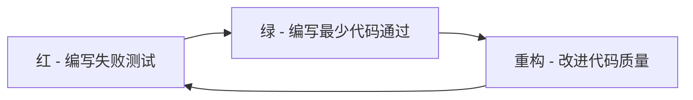

# Go 测试驱动开发(TDD)实战指南

> **文档简介**: 全面介绍Go语言测试驱动开发(TDD)方法论，掌握"红-绿-重构"开发循环，编写高质量的测试驱动代码

> **目标读者**: Go开发者，希望提升代码质量和开发效率的开发者

> **前置知识**: Go语言基础、单元测试基础、测试框架使用

> **预计时长**: 4-5小时完整学习

## 📚 文档元数据

| 属性 | 内容 |
|------|------|
| **模块** | `01-go-backend` |
| **分类** | `testing/quality-assurance` |
| **难度** | ⭐⭐⭐⭐ (4/5) |
| **标签** | `#TDD` `#测试驱动开发` `#重构` `#代码质量` |
| **更新日期** | `2025年10月` |
| **作者** | Dev Quest Team |
| **状态** | ✅ 已完成 |

## 🎯 学习目标

### 核心理念
- **TDD原理**: 理解测试驱动开发的核心理念和价值
- **红绿重构**: 掌握TDD的经典开发循环模式
- **测试设计**: 学会先写测试再写代码的设计思维
- **重构技巧**: 掌握在测试保护下的安全重构方法

### 实践能力
- **TDD流程**: 能够完整执行TDD开发流程
- **测试优先**: 培养先写测试的编程习惯
- **增量开发**: 通过小步快跑的方式构建功能
- **质量保证**: 建立高覆盖率的测试体系

## 📖 TDD基础概念

### 什么是测试驱动开发
测试驱动开发(Test-Driven Development, TDD)是一种软件开发方法论，要求在编写功能代码之前先编写测试代码。

#### TDD核心循环：红-绿-重构


#### TDD的价值
- **设计指导**: 测试驱动设计，产生更清晰的API
- **质量保证**: 确保每个功能都有对应测试
- **重构信心**: 在测试保护下安全重构
- **文档作用**: 测试作为活的使用文档

### Go语言TDD特点
- **内置测试框架**: `testing`包提供完整的测试支持
- **简洁语法**: 简单易读的测试代码语法
- **工具丰富**: testify、gomock等成熟测试工具生态
- **性能优秀**: 快速的测试执行速度

## 🛠️ TDD实战流程

### 1. 红色阶段 - 编写失败测试

#### 示例：字符串反转功能
```go
// 先写测试，预期会失败
func TestStringReverse(t *testing.T) {
    result := ReverseString("hello")
    expected := "olleh"
    if result != expected {
        t.Errorf("Expected %q, got %q", expected, result)
    }
}
```

#### 运行测试（会失败）
```bash
$ go test
# command-line-arguments
undefined: ReverseString
```

#### 测试失败是好事！
- **验证测试有效**: 确保测试能检测到功能缺失
- **明确需求**: 测试描述了期望的功能行为
- **设计指导**: 测试暗示了函数的签名和接口

### 2. 绿色阶段 - 编写最少代码通过测试

#### 最简单的实现
```go
// 最少代码使测试通过
func ReverseString(s string) string {
    // 硬编码解决当前测试
    if s == "hello" {
        return "olleh"
    }
    return ""
}
```

#### 运行测试（通过）
```bash
$ go test
PASS
ok      example.com/stringutils    0.002s
```

#### 绿色阶段原则
- **最快通过**: 用最简单的方式使测试通过
- **不要完美**: 避免过度设计
- **专注目标**: 只解决当前测试的需求

### 3. 重构阶段 - 改进代码质量

#### 泛化实现
```go
// 重构为通用实现
func ReverseString(s string) string {
    runes := []rune(s)
    n := len(runes)

    for i := 0; i < n/2; i++ {
        runes[i], runes[n-1-i] = runes[n-1-i], runes[i]
    }

    return string(runes)
}
```

#### 验证重构
```bash
$ go test
PASS
ok      example.com/stringutils    0.002s
```

#### 重构原则
- **保持绿色**: 重构期间测试必须一直通过
- **小步重构**: 每次只改进一个方面
- **测试保护**: 依赖测试确保重构正确性

## 🎯 TDD实战案例

### 案例1：用户注册功能

#### 第一个测试 - 验证邮箱格式
```go
func TestUserValidator_ValidEmail(t *testing.T) {
    validator := NewUserValidator()

    err := validator.ValidateEmail("user@example.com")
    if err != nil {
        t.Errorf("Expected valid email, got error: %v", err)
    }
}
```

#### 实现验证器基础结构
```go
type UserValidator struct{}

func NewUserValidator() *UserValidator {
    return &UserValidator{}
}

func (uv *UserValidator) ValidateEmail(email string) error {
    // 最简单的实现
    if email == "user@example.com" {
        return nil
    }
    return errors.New("invalid email")
}
```

#### 第二个测试 - 无效邮箱
```go
func TestUserValidator_InvalidEmail(t *testing.T) {
    validator := NewUserValidator()

    testCases := []struct {
        email    string
        expected string
    }{
        {"", "empty email"},
        {"invalid", "invalid format"},
        {"@", "missing domain"},
        {"test@", "missing domain after @"},
    }

    for _, tc := range testCases {
        t.Run(tc.email, func(t *testing.T) {
            err := validator.ValidateEmail(tc.email)
            if err == nil {
                t.Errorf("Expected error for %q", tc.email)
            }
        })
    }
}
```

#### 重构为完整的邮箱验证
```go
func (uv *UserValidator) ValidateEmail(email string) error {
    if email == "" {
        return errors.New("empty email")
    }

    // 简单的邮箱格式验证
    if !strings.Contains(email, "@") {
        return errors.New("invalid format")
    }

    parts := strings.Split(email, "@")
    if len(parts) != 2 || parts[0] == "" || parts[1] == "" {
        return errors.New("invalid format")
    }

    return nil
}
```

#### 第三个测试 - 用户注册
```go
func TestUserService_RegisterUser(t *testing.T) {
    validator := NewUserValidator()
    service := NewUserService(validator)

    user := &User{
        Name:  "John Doe",
        Email: "john@example.com",
    }

    err := service.Register(user)
    if err != nil {
        t.Errorf("Expected successful registration, got error: %v", err)
    }

    if user.ID == "" {
        t.Error("Expected user ID to be generated")
    }
}
```

#### 实现用户服务
```go
type User struct {
    ID    string
    Name  string
    Email string
}

type UserService struct {
    validator *UserValidator
    users     map[string]*User
}

func NewUserService(validator *UserValidator) *UserService {
    return &UserService{
        validator: validator,
        users:     make(map[string]*User),
    }
}

func (us *UserService) Register(user *User) error {
    if err := us.validator.ValidateEmail(user.Email); err != nil {
        return fmt.Errorf("invalid email: %w", err)
    }

    user.ID = generateID()
    us.users[user.ID] = user

    return nil
}

func generateID() string {
    return fmt.Sprintf("user-%d", time.Now().UnixNano())
}
```

### 案例2：购物车系统

#### 测试驱动购物车开发
```go
func TestShoppingCart_AddItem(t *testing.T) {
    cart := NewShoppingCart()

    item := &Item{
        ID:    "item-1",
        Name:  "Product A",
        Price: 10.99,
    }

    err := cart.AddItem(item, 1)
    if err != nil {
        t.Errorf("Expected to add item successfully, got error: %v", err)
    }

    if len(cart.Items()) != 1 {
        t.Errorf("Expected 1 item in cart, got %d", len(cart.Items()))
    }
}

func TestShoppingCart_RemoveItem(t *testing.T) {
    cart := NewShoppingCart()

    item := &Item{
        ID:    "item-1",
        Name:  "Product A",
        Price: 10.99,
    }

    cart.AddItem(item, 1)
    err := cart.RemoveItem("item-1")
    if err != nil {
        t.Errorf("Expected to remove item successfully, got error: %v", err)
    }

    if len(cart.Items()) != 0 {
        t.Errorf("Expected 0 items in cart, got %d", len(cart.Items()))
    }
}
```

## 🔧 TDD高级技巧

### 1. 测试驱动API设计

#### 先写测试定义API
```go
// 测试定义了我们期望的API
func TestAPIClient_GetUser(t *testing.T) {
    client := NewAPIClient("http://api.example.com")

    user, err := client.GetUser("user-123")
    if err != nil {
        t.Errorf("Expected successful request, got error: %v", err)
    }

    if user.ID != "user-123" {
        t.Errorf("Expected user ID %q, got %q", "user-123", user.ID)
    }
}

func TestAPIClient_GetUser_NotFound(t *testing.T) {
    client := NewAPIClient("http://api.example.com")

    user, err := client.GetUser("nonexistent")
    if err == nil {
        t.Error("Expected error for nonexistent user")
    }

    if user != nil {
        t.Error("Expected nil user for nonexistent request")
    }
}
```

#### 实现API客户端
```go
type APIClient struct {
    baseURL string
    client  *http.Client
}

func NewAPIClient(baseURL string) *APIClient {
    return &APIClient{
        baseURL: baseURL,
        client:  &http.Client{Timeout: 30 * time.Second},
    }
}

type User struct {
    ID    string `json:"id"`
    Name  string `json:"name"`
    Email string `json:"email"`
}

func (c *APIClient) GetUser(userID string) (*User, error) {
    url := fmt.Sprintf("%s/users/%s", c.baseURL, userID)

    resp, err := c.client.Get(url)
    if err != nil {
        return nil, fmt.Errorf("request failed: %w", err)
    }
    defer resp.Body.Close()

    if resp.StatusCode == http.StatusNotFound {
        return nil, fmt.Errorf("user not found")
    }

    if resp.StatusCode != http.StatusOK {
        return nil, fmt.Errorf("unexpected status: %d", resp.StatusCode)
    }

    var user User
    if err := json.NewDecoder(resp.Body).Decode(&user); err != nil {
        return nil, fmt.Errorf("decode failed: %w", err)
    }

    return &user, nil
}
```

### 2. 表格驱动测试与TDD结合

#### 使用表格驱动多个测试案例
```go
func TestPasswordValidator_Validate(t *testing.T) {
    validator := NewPasswordValidator()

    testCases := []struct {
        name     string
        password string
        wantErr  bool
    }{
        {"valid password", "SecurePass123!", false},
        {"too short", "123", true},
        {"no uppercase", "securepass123!", true},
        {"no lowercase", "SECUREPASS123!", true},
        {"no numbers", "SecurePass!", true},
        {"no special chars", "SecurePass123", true},
    }

    for _, tc := range testCases {
        t.Run(tc.name, func(t *testing.T) {
            err := validator.Validate(tc.password)
            if (err != nil) != tc.wantErr {
                t.Errorf("Validate() error = %v, wantErr %v", err, tc.wantErr)
            }
        })
    }
}
```

#### 实现密码验证器
```go
type PasswordValidator struct{}

func NewPasswordValidator() *PasswordValidator {
    return &PasswordValidator{}
}

func (pv *PasswordValidator) Validate(password string) error {
    if len(password) < 8 {
        return errors.New("password too short")
    }

    var hasUpper, hasLower, hasDigit, hasSpecial bool

    for _, char := range password {
        switch {
        case unicode.IsUpper(char):
            hasUpper = true
        case unicode.IsLower(char):
            hasLower = true
        case unicode.IsDigit(char):
            hasDigit = true
        case unicode.IsPunct(char) || unicode.IsSymbol(char):
            hasSpecial = true
        }
    }

    if !hasUpper {
        return errors.New("password must contain uppercase letter")
    }
    if !hasLower {
        return errors.New("password must contain lowercase letter")
    }
    if !hasDigit {
        return errors.New("password must contain digit")
    }
    if !hasSpecial {
        return errors.New("password must contain special character")
    }

    return nil
}
```

### 3. Mock与TDD结合

#### 使用Mock进行TDD
```go
// 先定义接口
type EmailSender interface {
    Send(to, subject, body string) error
}

// Mock实现
type MockEmailSender struct {
    mock.Mock
}

func (m *MockEmailSender) Send(to, subject, body string) error {
    args := m.Called(to, subject, body)
    return args.Error(0)
}

// 测试用户通知服务
func TestNotificationService_SendWelcomeEmail(t *testing.T) {
    // 创建Mock
    mockSender := new(MockEmailSender)
    service := NewNotificationService(mockSender)

    // 设置Mock期望
    mockSender.
        On("Send", "user@example.com", "Welcome!", "Welcome to our service!").
        Return(nil)

    // 执行测试
    user := &User{Email: "user@example.com", Name: "John"}
    err := service.SendWelcomeEmail(user)

    // 验证结果
    if err != nil {
        t.Errorf("Expected successful email sending, got error: %v", err)
    }

    // 验证Mock调用
    mockSender.AssertExpectations(t)
}
```

## 🚨 TDD常见陷阱和解决方案

### 1. 测试过多细节

#### ❌ 错误：测试实现细节
```go
func TestUserRepository_Store(t *testing.T) {
    repo := NewInMemoryUserRepository()

    user := &User{Name: "John"}
    err := repo.Store(user)

    // 测试内部存储细节 - 错误
    if len(repo.users) != 1 {
        t.Error("Repository should have 1 user")
    }
    if repo.users["user-1"] != user {
        t.Error("User not stored correctly")
    }
}
```

#### ✅ 正确：测试行为和结果
```go
func TestUserRepository_StoreAndRetrieve(t *testing.T) {
    repo := NewInMemoryUserRepository()

    user := &User{Name: "John"}
    err := repo.Store(user)
    if err != nil {
        t.Errorf("Failed to store user: %v", err)
    }

    // 测试可观察的行为
    retrieved, err := repo.FindByID(user.ID)
    if err != nil {
        t.Errorf("Failed to retrieve user: %v", err)
    }

    if retrieved.Name != user.Name {
        t.Errorf("Expected name %q, got %q", user.Name, retrieved.Name)
    }
}
```

### 2. 跳过红色阶段

#### ❌ 错误：先写代码后写测试
```go
// 先写实现 - 违反TDD原则
func Calculator() {
    result := 2 + 2
    fmt.Println(result)
}

// 后写测试 - 不是真正的TDD
func TestCalculator(t *testing.T) {
    // 测试已经知道的实现
    result := calculate()
    expected := 4
    if result != expected {
        t.Errorf("Expected %d, got %d", expected, result)
    }
}
```

#### ✅ 正确：先写测试
```go
// 先写测试描述期望行为
func TestCalculator_Add(t *testing.T) {
    calc := NewCalculator()

    result := calc.Add(2, 2)
    expected := 4
    if result != expected {
        t.Errorf("Expected %d, got %d", expected, result)
    }
}

// 然后实现最小代码通过测试
type Calculator struct{}

func NewCalculator() *Calculator {
    return &Calculator{}
}

func (c *Calculator) Add(a, b int) int {
    return a + b  // 最简单的实现
}
```

### 3. 过度设计

#### ❌ 错误：在绿色阶段过度设计
```go
func Add(a, b int) int {
    // 绿色阶段不应该这样复杂
    logger := NewLogger()
    metrics := NewMetrics()
    cache := NewCache()

    logger.Info("Adding numbers")
    metrics.Increment("add_calls")

    key := fmt.Sprintf("add:%d:%d", a, b)
    if cached, exists := cache.Get(key); exists {
        return cached.(int)
    }

    result := a + b
    cache.Set(key, result, time.Hour)
    return result
}
```

#### ✅ 正确：绿色阶段保持简单
```go
func Add(a, b int) int {
    return a + b  // 简单直接
}

// 后续在重构阶段添加复杂功能
```

## 📊 TDD工作流程优化

### 1. 小步快跑策略

#### 分解复杂功能
```go
// 不一次性实现复杂功能，而是分解为小步骤

// 步骤1：基础加法
func TestCalculator_Add(t *testing.T) {
    calc := NewCalculator()
    result := calc.Add(2, 3)
    expected := 5
    if result != expected {
        t.Errorf("Expected %d, got %d", expected, result)
    }
}

// 步骤2：处理负数
func TestCalculator_AddNegativeNumbers(t *testing.T) {
    calc := NewCalculator()
    result := calc.Add(-2, 3)
    expected := 1
    if result != expected {
        t.Errorf("Expected %d, got %d", expected, result)
    }
}

// 步骤3：处理大数
func TestCalculator_AddLargeNumbers(t *testing.T) {
    calc := NewCalculator()
    result := calc.Add(1000000, 2000000)
    expected := 3000000
    if result != expected {
        t.Errorf("Expected %d, got %d", expected, result)
    }
}
```

### 2. 持续重构

#### 在测试保护下持续改进
```go
// 初始实现
func Add(a, b int) int {
    return a + b
}

// 重构1：添加参数验证
func (c *Calculator) Add(a, b int) (int, error) {
    if a < 0 || b < 0 {
        return 0, errors.New("negative numbers not supported")
    }
    return a + b, nil
}

// 重构2：支持更多数值类型
func (c *Calculator) Add(a, b interface{}) (interface{}, error) {
    switch a := a.(type) {
    case int:
        if b, ok := b.(int); ok {
            return a + b, nil
        }
    case float64:
        if b, ok := b.(float64); ok {
            return a + b, nil
        }
    }
    return nil, errors.New("unsupported types")
}
```

### 3. 测试覆盖率监控

#### 设置覆盖率目标
```bash
# 生成覆盖率报告
go test -coverprofile=coverage.out ./...

# 查看覆盖率
go tool cover -func=coverage.out

# 生成HTML报告
go tool cover -html=coverage.out -o coverage.html

# 设置覆盖率阈值
go test -coverprofile=coverage.out -covermode=count ./...
go tool cover -func=coverage.out | grep "total:" | awk '{print $3}' | sed 's/%//'
```

#### 集成到CI/CD
```yaml
# .github/workflows/test.yml
name: Test and Coverage

on: [push, pull_request]

jobs:
  test:
    runs-on: ubuntu-latest
    steps:
    - uses: actions/checkout@v4
    - uses: actions/setup-go@v4
      with:
        go-version: '1.21'

    - name: Run tests with coverage
      run: go test -v -race -coverprofile=coverage.out ./...

    - name: Check coverage threshold
      run: |
        COVERAGE=$(go tool cover -func=coverage.out | grep "total:" | awk '{print $3}' | sed 's/%//')
        echo "Coverage: $COVERAGE%"
        if (( $(echo "$COVERAGE < 80" | bc -l) )); then
          echo "Coverage is below 80%"
          exit 1
        fi

    - name: Upload coverage to Codecov
      uses: codecov/codecov-action@v3
      with:
        file: ./coverage.out
```

## 🔗 文档交叉引用

### 相关文档
- 📄 **[单元测试]**: [testing/01-unit-testing.md](01-unit-testing.md) - Go单元测试基础
- 📄 **[Mock测试]**: [testing/02-mocking-stubbing.md](02-mocking-stubbing.md) - Mock和桩测试技术
- 📄 **[集成测试]**: [testing/03-integration-testing.md](03-integration-testing.md) - 系统集成测试
- 📄 **[基准测试]**: [testing/04-benchmarking.md](04-benchmarking.md) - 性能基准测试

### 参考章节
- 📖 **[重构技巧]**: [advanced-topics/performance/02-performance-tuning.md](../advanced-topics/performance/02-performance-tuning.md) - 代码重构和性能优化
- 📖 **[API设计]**: [advanced-topics/api-advanced/01-restful-patterns.md](../advanced-topics/api-advanced/01-restful-patterns.md) - RESTful API设计模式

## 📝 总结

### 核心要点回顾
1. **TDD理念**: 理解红-绿-重构的开发循环
2. **测试先行**: 培养先写测试的开发习惯
3. **小步快跑**: 通过增量迭代构建功能
4. **重构安全**: 在测试保护下进行代码重构

### 学习成果检查
- [ ] 是否理解TDD的核心理念和价值？
- [ ] 是否能够熟练执行红-绿-重构循环？
- [ ] 是否掌握测试驱动的设计思维？
- [ ] 是否能够在项目中实践TDD？

---

**文档状态**: ✅ 已完成
**最后更新**: 2025年10月
**版本**: v1.0.0

---

> 💡 **实践建议**:
> - 从小功能开始实践TDD，逐步积累经验
> - 不要追求完美的测试，关注核心功能覆盖
> - 定期回顾和重构测试代码，保持测试质量
> - 团队协作时建立TDD规范和代码审查标准