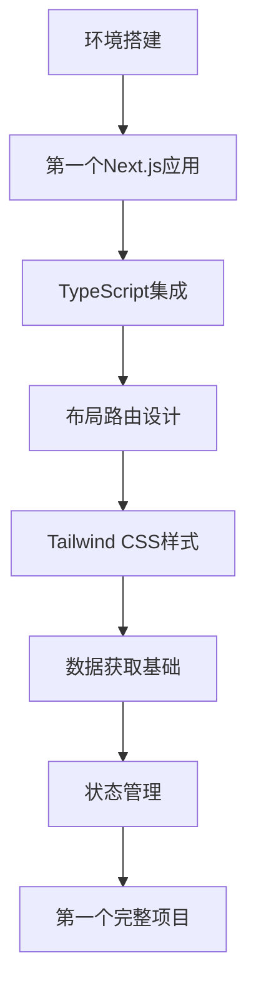

# Next.js 全栈开发学习模块

> **本轮增强与版本核对**：学习路径及正文增强范围见 [逐文件台账](../shared-resources/tools/document-quality/reports/coverage.md)。下方技术基线中的旧核对日期属于历史记录，不表示这次已重跑所有平台；安装与升级以官方兼容要求、项目锁文件和实际构建结果为准。


第一次学习请从[理解地图与学习规划](LEARNING_GUIDE.md)开始，按其中的阶段任务和验收条件推进。先完成两个能直接访问的页面和一个可点击的组件，再加入数据读取与提交。HTML/CSS、JavaScript 和 React 的具体补课项见导读；电商、支付与 SaaS 项目属于后续选题。

查语法、函数或库时使用下方参考目录；JavaScript 基础分别从共享的[关键词](../shared-resources/javascript-keywords.md)、[内置能力](../shared-resources/javascript-builtins.md)和[标准库与宿主能力](../shared-resources/javascript-standard-library.md)进入。文件数量与目录中的完成标记表示内容组织情况，不能替代示例运行证据；具体交付按[知识库质量基线](../shared-resources/standards/knowledge-delivery-baseline.md)验收。

> **文档简介**: 从 React 页面与交互出发，逐步学习 Next.js 路由、服务端执行、数据提交与应用交付
>
> **目标读者**: Web前端开发者、全栈开发者、React开发者
>
> **前置知识**: HTML/CSS基础、JavaScript ES6+基础、React基础概念
>
> **预计时长**: 3-6个月（根据学习进度和投入时间）

## 🧭 技术基线

> 以下版本信息于 **2026-09-16** 依据官方发布页核实（[Next.js Blog](https://nextjs.org/blog)、[React Blog](https://react.dev/blog)、[TypeScript Releases](https://www.typescriptlang.org/)）。

| 技术 | 当前版本 | 说明 | 核实日期 |
|------|----------|------|----------|
| Next.js | **16.3** | Turbopack 为默认打包器；Async Request APIs 全面异步；Cache Components / `"use cache"` 显式缓存；`middleware.ts` 弃用改为 `proxy.ts` | 2026-09-11 |
| React | **19.3** | View Transitions 与 Fragment Refs 转正；React Compiler v1.0（2025-10 发布）稳定可用 | 2026-09-11 |
| TypeScript | **7.0**（7.0.2） | Go 原生编译器 GA（microsoft/typescript-go，2026-07-08 发布；[官方发布说明](https://devblogs.microsoft.com/typescript/announcing-typescript-7-0/)）；6.x JS 线并行维护过渡 | 2026-09-16 |
| TanStack Query | **v5** | 服务端状态管理（本模块状态管理/数据获取文档提及） | 2026-09-11 |
| Turbopack | **默认打包器** | `next dev` 与 `next build` 默认使用；Webpack 需 `--webpack` 显式回退 | 2026-09-11 |

<details>
<summary>文档信息（用途、难度与维护记录）</summary>

## 📚 文档元数据

| 属性 | 内容 |
|------|------|
| **模块** | `02-nextjs-frontend` |
| **分类** | `module-overview` |
| **难度** | ⭐⭐⭐ |
| **标签** | `#模块概述` `#学习路线` `#nextjs16` `#全栈开发` |
| **更新日期** | 2026年9月 |
| **作者** | Dev Quest Team |
| **状态** | ✅ 已完成 |

</details>

## 🎯 学习目标

完成本模块后，你将能够：

- 根据 URL 组织页面与布局，直接打开或刷新详情页也能获得正确结果。
- 判断代码运行在服务端还是浏览器，正确安排数据读取、交互状态和秘密配置。
- 实现一次包含校验、成功反馈和失败恢复的表单提交，并用测试验证行为。
- 用构建产物验证部署；出现性能问题时记录测量条件，再比较优化前后结果。

## 📋 目录

- [模块概览](#️-模块概览)
- [学习路径](#-学习路径)
- [技术栈](#️-技术栈)
- [文档结构](#-目录结构)
- [学习建议](#-学习建议)
- [相关资源](#-相关资源)

---

## 🏗️ 模块概览

### 核心特色
- 教程按依赖关系推进，参考目录用于查语法和 API。
- 项目从展示页面逐步扩展到商品与后台；支付、身份权限和多租户属于单独验收的扩展。
- 版本采用上方声明的基线，实际安装以练习工程的依赖和锁文件为准。

### 学习成果
- **基础阶段**：能从空工程完成页面、导航、数据读取和错误显示。
- **应用阶段**：能提交数据、验证输入、保存结果并为关键路径编写测试。
- **专题阶段**：能解释缓存与渲染取舍，用测量结果支持性能或架构调整。

---

## 🎓 学习路径

### 📖 系统学习路径（初学者推荐）

```mermaid
graph TD
    A[环境搭建] --> B[第一个Next.js应用]
    B --> C[TypeScript集成]
    C --> D[布局路由设计]
    D --> E[Tailwind CSS样式]
    E --> F[数据获取基础]
    F --> G[状态管理]
    G --> H[第一个完整项目]
```

**适用对象**: 从零开始的学习者
**学习特点**: 渐进式教学，注重基础理解和实践练习
**建议时长**: 4-6周

> **难度注记**：星级用于提示前置知识和练习复杂度，不是学习完成证明。时间有限时先完成导读中的“两页导航”任务，再逐步接入数据与提交；只安装环境还没有完成入门。

### 🔍 快速参考路径（有经验开发者）

```mermaid
graph LR
    A[React语法速查] --> B[Next.js API参考]
    B --> C[框架实战模式]
    C --> D[开发工具]
    D --> E[性能优化]
```

**适用对象**: 有React基础的开发者
**学习特点**: 速查导向，快速上手现代Next.js开发
**建议时长**: 1-2周

---

## 🛠️ 技术栈

### 核心技术
- **Next.js 16**: React全栈框架，支持App Router和Server Components
- **React 19.3**: 最新React版本，并发特性、Suspense、View Transitions与Fragment Refs
- **TypeScript 7**: 类型安全的JavaScript超集
- **Tailwind CSS 4**: 原子化CSS框架

### 开发工具
- **Vitest**: 现代单元测试框架
- **Playwright**: 端到端测试框架
- **ESLint/Prettier**: 代码质量和格式化工具
- **Turbopack**: 默认打包器（next dev / next build），Webpack 可 --webpack 回退

### 部署运维
- **Vercel**: Next.js官方云平台
- **Docker**: 容器化部署
- **GitHub Actions**: CI/CD自动化
- **Sentry**: 错误监控和性能分析

---

## 📁 目录结构

```
02-nextjs-frontend/
├── README.md                           # 模块总览（本文档）
├── 📚 reference/           # 字典：全量参考（32个文件）
│   ├── 📖 language-concepts/      # 语言核心概念（10个文件）
│   │   ├── 01-react-syntax-cheatsheet.md       # ⚛️ React语法速查表 ✅
│   │   ├── 02-nextjs-api-reference.md          # 🚀 Next.js API参考 ✅
│   │   ├── 03-typescript-types.md              # 📘 TypeScript类型速查 ✅
│   │   ├── 04-javascript-modern.md             # 💎 现代JS语法 ✅
│   │   ├── 05-css-patterns.md                  # 🎨 CSS-in-JS模式 ✅
│   │   ├── 06-react-19-hooks.md                # ⚛️ React 19关键Hooks ✅
│   │   ├── 07-type-narrowing-guards.md         # 🛡️ 类型收窄与类型守卫 ✅
│   │   ├── 08-ts-declarations-modules.md       # 📦 枚举、环境声明与模块系统 ✅
│   │   ├── 09-js-core-semantics.md             # 🧠 JS 核心语义（事件循环/闭包/原型链/this） ✅
│   │   └── 10-web-platform-apis.md             # 🌐 Web 平台 API 速查 ✅
│   ├── 🛠️ framework-patterns/    # 框架应用模式（14个文件）
│   │   ├── 01-app-router-patterns.md           # 🗺️ App Router实战模式 ✅
│   │   ├── 02-server-components-patterns.md    # 🔄 服务端组件模式 ✅
│   │   ├── 03-client-components-patterns.md    # 📱 客户端组件模式 ✅
│   │   ├── 04-data-fetching-patterns.md        # 📡 数据获取模式 ✅
│   │   ├── 05-state-management-patterns.md     # 🗄️ 状态管理模式 ✅
│   │   ├── 06-form-validation-patterns.md      # 📝 表单验证模式 ✅
│   │   ├── 07-authentication-flows.md          # 🔐 认证流程模式 ✅
│   │   ├── 08-caching-patterns.md              # 💾 Cache Components与"use cache" ✅
│   │   ├── 09-async-request-apis.md            # ⏳ 异步请求APIs ✅
│   │   ├── 10-proxy-patterns.md                # 🌉 网络代理（proxy.ts） ✅
│   │   ├── 11-error-loading-patterns.md        # 🚨 错误与加载状态约定 ✅
│   │   ├── 12-metadata-and-script.md           # 🏷️ Metadata API 与 next/script ✅
│   │   ├── 13-route-segment-config.md          # 🧭 路由段配置（Route Segment Config） ✅
│   │   └── 14-env-vars.md                      # 🔑 环境变量（.env/NEXT_PUBLIC_） ✅
│   ├── 📦 library-guides/         # 常用库指南（1个文件）
│   │   └── 03-ecosystem-map.md                 # 🗺️ 生态依赖地图（第三方库导览） ✅
│   ├── 🔧 development-tools/     # 开发工具生态（4个文件）
│   │   ├── 01-testing-tools.md                 # 🧪 测试工具指南 ✅
│   │   ├── 02-styling-tools.md                 # 🎨 样式工具 ✅
│   │   ├── 03-package-managers.md                   # ⚙️ 构建工具 ✅
│   │   └── 04-debugging-tools.md               # 🔍 调试工具 ✅
│   └── ⚡ performance-optimization/ # 性能优化专题（3个文件）
│       ├── 01-rendering-optimization.md        # 📈 渲染优化 ✅
│       ├── 02-bundle-optimization.md           # 📦 打包优化 ✅
│       └── 03-image-font-optimization.md       # 🖼️ 图片与字体优化 ✅
├── 📖 basics/                     # 渐进式学习路径（8个文件）
│   ├── 01-environment-setup.md                # 🛠️ 开发环境搭建 ✅
│   ├── 02-first-nextjs-app.md                 # 🚀 创建第一个Next.js应用 ✅
│   ├── 03-typescript-integration.md           # 📘 TypeScript集成配置 ✅
│   ├── 04-layouts-routing.md                  # 🗺️ 布局和路由设计 ✅
│   ├── 05-styling-with-tailwind.md            # 🎨 Tailwind CSS样式 ✅
│   ├── 06-data-fetching-basics.md             # 📡 基础数据获取 ✅
│   ├── 07-state-management.md                 # 🗄️ 状态管理基础 ✅
│   └── 08-first-project.md                    # 🎯 第一个完整项目 ✅
├── 🏗️ frameworks/                  # 框架深度学习（4个文件）
│   ├── 01-nextjs-16-complete.md               # 🚀 Next.js 16完整指南 ✅
│   ├── 02-react-19-integration.md             # ⚛️ React 19深度集成 ✅
│   ├── 03-full-stack-patterns.md              # 🌐 全栈开发模式 ✅
│   └── 04-performance-optimization.md         # ⚡ 性能优化最佳实践 ✅
├── 🚀 projects/                   # 实战项目（4个文件）
│   ├── 01-corporate-landing.md                # 🏢 企业官网项目 ✅
│   ├── 02-ecommerce-store.md                  # 🛒 电商应用项目 ✅
│   ├── 03-dashboard-analytics.md              # 📊 数据仪表板项目 ✅
│   └── 04-saas-platform.md                   # 💼 SaaS平台项目 ✅
├── 🧪 testing/                    # 现代测试工程（4个文件）
│   ├── 01-unit-testing.md                     # 🔬 单元测试（Vitest） ✅
│   ├── 02-component-testing.md                # 🧩 组件测试（Testing Library） ✅
│   ├── 03-e2e-testing.md                      # 🎭 端到端测试（Playwright） ✅
│   └── 04-performance-testing.md              # ⚡ 性能测试（Lighthouse） ✅
├── 🚀 deployment/                 # 现代应用部署（4个文件）
│   ├── 01-vercel-deployment.md                # ☁️ Vercel云端部署 ✅
│   ├── 02-docker-containerization.md          # 🐳 Docker容器化部署 ✅
│   ├── 03-ci-cd-pipelines.md                 # 🔄 CI/CD自动化流水线 ✅
│   └── 04-monitoring-analytics.md             # 📊 监控和分析（Sentry） ✅
└── 🎓 advanced-topics/            # 高级主题（6个文件）
    ├── ⚡ performance/            # 性能优化主题（2个文件）
    │   ├── 01-core-web-vitals.md              # 📈 Core Web Vitals优化 ✅
    │   └── 02-advanced-optimization.md        # 🚀 高级性能调优 ✅
    ├── 🔒 security/               # 安全实践主题（1个文件）
    │   └── 01-security-best-practices.md      # 🛡️ Web安全最佳实践 ✅
    ├── 🏛️ architecture/           # 架构设计主题（2个文件）
    │   ├── 01-scaling-patterns.md             # 📈 应用扩展模式 ✅
    │   └── 02-micro-frontends.md              # 🧩 微前端架构 ✅
    └── 🌐 api-integration/         # API集成主题（1个文件）
        └── 01-graphql-apollo.md               # 🔗 GraphQL + Apollo ✅
```

### 📚 Reference - 知识字典（32个文件）
**定位**: 快速查找和理解核心概念，适合日常查阅
**特点**: 严格差异化设计，与basics无内容重叠

#### 📖 Language Concepts - 语言概念（10个文件）
- [`01-react-syntax-cheatsheet.md`](reference/language-concepts/01-react-syntax-cheatsheet.md) - ⚛️ React语法速查表
- [`02-nextjs-api-reference.md`](reference/language-concepts/02-nextjs-api-reference.md) - 🚀 Next.js API参考
- [`03-typescript-types.md`](reference/language-concepts/03-typescript-types.md) - 📘 TypeScript类型速查
- [`04-javascript-modern.md`](reference/language-concepts/04-javascript-modern.md) - 💎 现代JS语法
- [`05-css-patterns.md`](reference/language-concepts/05-css-patterns.md) - 🎨 CSS-in-JS模式
- [`06-react-19-hooks.md`](reference/language-concepts/06-react-19-hooks.md) - ⚛️ React 19关键Hooks
- [`07-type-narrowing-guards.md`](reference/language-concepts/07-type-narrowing-guards.md) - 🛡️ TypeScript类型收窄与类型守卫
- [`08-ts-declarations-modules.md`](reference/language-concepts/08-ts-declarations-modules.md) - 📦 TypeScript枚举、环境声明与模块系统
- [`09-js-core-semantics.md`](reference/language-concepts/09-js-core-semantics.md) - 🧠 JavaScript核心语义（事件循环/闭包/原型链/this）
- [`10-web-platform-apis.md`](reference/language-concepts/10-web-platform-apis.md) - 🌐 Web平台API速查

#### 🛠️ Framework Patterns - 框架模式（14个文件）
- [`01-app-router-patterns.md`](reference/framework-patterns/01-app-router-patterns.md) - 🗺️ App Router实战模式
- [`02-server-components-patterns.md`](reference/framework-patterns/02-server-components-patterns.md) - 🔄 服务端组件模式
- [`03-client-components-patterns.md`](reference/framework-patterns/03-client-components-patterns.md) - 📱 客户端组件模式
- [`04-data-fetching-patterns.md`](reference/framework-patterns/04-data-fetching-patterns.md) - 📡 数据获取模式
- [`05-state-management-patterns.md`](reference/framework-patterns/05-state-management-patterns.md) - 🗄️ 状态管理模式
- [`06-form-validation-patterns.md`](reference/framework-patterns/06-form-validation-patterns.md) - 📝 表单验证模式
- [`07-authentication-flows.md`](reference/framework-patterns/07-authentication-flows.md) - 🔐 认证流程模式
- [`08-caching-patterns.md`](reference/framework-patterns/08-caching-patterns.md) - 💾 Cache Components与"use cache"
- [`09-async-request-apis.md`](reference/framework-patterns/09-async-request-apis.md) - ⏳ 异步请求APIs
- [`10-proxy-patterns.md`](reference/framework-patterns/10-proxy-patterns.md) - 🌉 网络代理（proxy.ts）
- [`11-error-loading-patterns.md`](reference/framework-patterns/11-error-loading-patterns.md) - 🚨 错误与加载状态约定
- [`12-metadata-and-script.md`](reference/framework-patterns/12-metadata-and-script.md) - 🏷️ Metadata API与next/script
- [`13-route-segment-config.md`](reference/framework-patterns/13-route-segment-config.md) - 🧭 路由段配置
- [`14-env-vars.md`](reference/framework-patterns/14-env-vars.md) - 🔑 环境变量加载与内联

#### 📦 Library Guides - 常用库指南（1个文件）
- [`03-ecosystem-map.md`](reference/library-guides/03-ecosystem-map.md) - 🗺️ 生态依赖地图

#### 🔧 Development Tools - 开发工具（4个文件）
- [`01-testing-tools.md`](reference/development-tools/01-testing-tools.md) - 🧪 测试工具指南
- [`02-styling-tools.md`](reference/development-tools/02-styling-tools.md) - 🎨 样式工具
- [`03-package-managers.md`](reference/development-tools/03-package-managers.md) - ⚙️ 构建工具
- [`04-debugging-tools.md`](reference/development-tools/04-debugging-tools.md) - 🔍 调试工具

#### ⚡ Performance Optimization - 性能优化（3个文件）
- [`01-rendering-optimization.md`](reference/performance-optimization/01-rendering-optimization.md) - 📈 渲染优化
- [`02-bundle-optimization.md`](reference/performance-optimization/02-bundle-optimization.md) - 📦 打包优化
- [`03-image-font-optimization.md`](reference/performance-optimization/03-image-font-optimization.md) - 🖼️ 图片与字体优化

### 📖 Basics - 渐进式学习路径（8个文件）
**定位**: 从零开始的完整学习体验，注重基础理解和实践

- [`01-environment-setup.md`](basics/01-environment-setup.md) - 🛠️ 开发环境搭建
- [`02-first-nextjs-app.md`](basics/02-first-nextjs-app.md) - 🚀 创建第一个Next.js应用
- [`03-typescript-integration.md`](basics/03-typescript-integration.md) - 📘 TypeScript集成配置
- [`04-layouts-routing.md`](basics/04-layouts-routing.md) - 🗺️ 布局和路由设计
- [`05-styling-with-tailwind.md`](basics/05-styling-with-tailwind.md) - 🎨 Tailwind CSS样式
- [`06-data-fetching-basics.md`](basics/06-data-fetching-basics.md) - 📡 基础数据获取
- [`07-state-management.md`](basics/07-state-management.md) - 🗄️ 状态管理基础
- [`08-first-project.md`](basics/08-first-project.md) - 🎯 第一个完整项目

### 🏗️ Frameworks - 框架深度学习（4个文件）
**定位**: 深入掌握框架和生态系统，专业能力提升

- [`01-nextjs-16-complete.md`](frameworks/01-nextjs-16-complete.md) - 🚀 Next.js 16完整指南
- [`02-react-19-integration.md`](frameworks/02-react-19-integration.md) - ⚛️ React 19深度集成
- [`03-full-stack-patterns.md`](frameworks/03-full-stack-patterns.md) - 🌐 全栈开发模式
- [`04-performance-optimization.md`](frameworks/04-performance-optimization.md) - ⚡ 性能优化最佳实践

### 🚀 Projects - 实战项目（4个文件）
**定位**: 通过真实项目巩固知识，积累实战经验

- [`01-corporate-landing.md`](projects/01-corporate-landing.md) - 🏢 企业官网项目
- [`02-ecommerce-store.md`](projects/02-ecommerce-store.md) - 🛒 电商应用项目
- [`03-dashboard-analytics.md`](projects/03-dashboard-analytics.md) - 📊 数据仪表板项目
- [`04-saas-platform.md`](projects/04-saas-platform.md) - 💼 SaaS平台项目

### 🧪 Testing - 现代测试工程（4个文件）
**定位**: 掌握测试方法，建立质量保证体系

- [`01-unit-testing.md`](testing/01-unit-testing.md) - 🔬 单元测试（Vitest）
- [`02-component-testing.md`](testing/02-component-testing.md) - 🧩 组件测试（Testing Library）
- [`03-e2e-testing.md`](testing/03-e2e-testing.md) - 🎭 端到端测试（Playwright）
- [`04-performance-testing.md`](testing/04-performance-testing.md) - ⚡ 性能测试（Lighthouse）

### 🚀 Deployment - 现代应用部署（4个文件）
**定位**: 掌握部署方法，具备生产环境运维能力

- [`01-vercel-deployment.md`](deployment/01-vercel-deployment.md) - ☁️ Vercel云端部署
- [`02-docker-containerization.md`](deployment/02-docker-containerization.md) - 🐳 Docker容器化部署
- [`03-ci-cd-pipelines.md`](deployment/03-ci-cd-pipelines.md) - 🔄 CI/CD自动化流水线
- [`04-monitoring-analytics.md`](deployment/04-monitoring-analytics.md) - 📊 监控和分析（Sentry）

### 🎓 Advanced Topics - 高级主题（6个文件）
**定位**: 深入理解高级概念，提升技术深度

#### ⚡ Performance - 性能优化（2个文件）
- [`01-core-web-vitals.md`](advanced-topics/performance/01-core-web-vitals.md) - 📈 Core Web Vitals优化
- [`02-advanced-optimization.md`](advanced-topics/performance/02-advanced-optimization.md) - 🚀 高级性能调优

#### 🔒 Security - 安全实践（1个文件）
- [`01-security-best-practices.md`](advanced-topics/security/01-security-best-practices.md) - 🛡️ Web安全最佳实践

#### 🏛️ Architecture - 架构设计（2个文件）
- [`01-scaling-patterns.md`](advanced-topics/architecture/01-scaling-patterns.md) - 📈 应用扩展模式
- [`02-micro-frontends.md`](advanced-topics/architecture/02-micro-frontends.md) - 🧩 微前端架构

#### 🌐 API Integration - API集成（1个文件）
- [`01-graphql-apollo.md`](advanced-topics/api-integration/01-graphql-apollo.md) - 🔗 GraphQL + Apollo

---

## 💡 学习建议

### 学习策略

#### 🎯 明确学习目标
- **初级目标**: 掌握基础开发，能完成简单项目
- **中级目标**: 理解框架原理，能独立开发
- **高级目标**: 具备架构能力，能指导团队

#### 📚 合理选择路径
- **零基础**: 推荐 `basics/` → `frameworks/` → `projects/` 顺序
- **有经验**: 可直接从 `reference/` 开始，结合 `projects/` 实践
- **专项提升**: 根据需要重点学习特定领域

#### 🛠️ 实践优先
- 每学完一个概念立即动手实践
- 跟随项目教程完成完整项目
- 在自己的项目中应用所学知识

### 时间安排

#### 📅 学习计划建议
- **每日投入**: 1-2小时
- **周目标**: 完成1-2个文档学习
- **月目标**: 完成一个主要领域（如basics或frameworks）
- **总体目标**: 3-6个月内完成整个模块

#### ⏰ 时间分配建议
- **理论学习**: 30%时间
- **代码实践**: 50%时间
- **项目练习**: 15%时间
- **复习总结**: 5%时间

---

## 🔗 相关资源

### 📖 官方文档
- **[Next.js 16 Docs](https://nextjs.org/docs)**: 官方权威文档
- **[React 19 Docs](https://react.dev/)**: React最新版本文档
- **[TypeScript 7 Docs](https://www.typescriptlang.org/docs/)**: TypeScript官方文档
- **[Tailwind CSS 4 Docs](https://tailwindcss.com/docs)**: CSS框架文档

### 🛠️ 开发工具
- **[Vercel Platform](https://vercel.com)**: Next.js部署平台
- **[VS Code Extensions](https://marketplace.visualstudio.com)**: 推荐扩展
- **[Chrome DevTools](https://developer.chrome.com/docs/devtools)**: 调试工具
- **[React DevTools](https://react.dev/learn/react-developer-tools)**: React调试工具

### 📹 学习资源
- **[Next.js 16 Course](https://nextjs.org/learn)**: 官方免费课程
- **[React 19 Tutorial](https://react.dev/learn)**: React官方教程
- **[TypeScript Handbook](https://www.typescriptlang.org/handbook)**: TypeScript手册
- **[Tailwind CSS Tutorial](https://tailwindcss.com/course)**: 样式框架教程

### 🌐 社区资源
- **[Next.js GitHub](https://github.com/vercel/next.js)**: 源码和问题讨论
- **[React GitHub](https://github.com/facebook/react)**: React源码仓库
- **[Stack Overflow](https://stackoverflow.com/questions/tagged/next.js)**: 问题解答
- **[Reddit r/nextjs](https://reddit.com/r/nextjs)**: 社区讨论

---

## 🤝 贡献与反馈

### 📝 内容贡献
欢迎参与文档完善：
- 🐛 **报告问题**: 发现错误或过时内容
- 💡 **建议改进**: 提出内容优化建议
- 📝 **参与贡献**: 提交PR完善文档

### 🎓 学习反馈
分享你的学习体验：
- ✅ **有用内容**: 哪些部分对你最有帮助
- ❓ **疑问点**: 哪些内容需要进一步澄清
- 🎯 **建议**: 希望增加什么内容

---

## 📊 模块统计

| 类别 | 文档数量 | 预计学习时长 |
|------|----------|--------------|
| Knowledge Points | 32个 | 30-40小时 |
| Basics | 8个 | 40-60小时 |
| Frameworks | 4个 | 30-40小时 |
| Projects | 4个 | 60-80小时 |
| Testing | 4个 | 20-30小时 |
| Deployment | 4个 | 15-25小时 |
| Advanced Topics | 6个 | 25-35小时 |
| **总计** | **62个** | **220-310小时** |

---

---

## 🔄 文档交叉引用

### 📚 核心学习资源
- 📄 **[React语法速查表](reference/language-concepts/01-react-syntax-cheatsheet.md)**: React核心语法和Hooks快速参考
- 📄 **[Next.js API参考](reference/language-concepts/02-nextjs-api-reference.md)**: Next.js完整API文档
- 📄 **[企业级认证流程](reference/framework-patterns/07-authentication-flows.md)**: 完整的认证实现指南
- 📄 **[第一个Next.js应用](basics/02-first-nextjs-app.md)**: 零基础入门指南

### 🎯 项目实践资源
- 🚀 **[企业官网项目](projects/01-corporate-landing.md)**: Next.js基础应用实践
- 🛒 **[电商应用项目](projects/02-ecommerce-store.md)**: 全栈电商开发实战
- 📊 **[数据仪表板项目](projects/03-dashboard-analytics.md)**: 数据可视化应用开发
- 💼 **[SaaS平台项目](projects/04-saas-platform.md)**: 企业级SaaS架构实践

### 🧪 质量保证体系
- 🔬 **[单元测试指南](testing/01-unit-testing.md)**: Vitest测试框架使用
- 🧩 **[组件测试指南](testing/02-component-testing.md)**: React Testing Library实践
- 🎭 **[E2E测试指南](testing/03-e2e-testing.md)**: Playwright端到端测试
- ⚡ **[性能测试指南](testing/04-performance-testing.md)**: Lighthouse性能测试

### ☁️ 部署运维资源
- ☁️ **[Vercel部署指南](deployment/01-vercel-deployment.md)**: 云端部署最佳实践
- 🐳 **[Docker容器化](deployment/02-docker-containerization.md)**: 容器化部署方案
- 🔄 **[CI/CD流水线](deployment/03-ci-cd-pipelines.md)**: 自动化部署流程
- 📊 **[监控分析](deployment/04-monitoring-analytics.md)**: 生产环境监控和分析

### 🎓 高级进阶主题
- 📈 **[Core Web Vitals优化](advanced-topics/performance/01-core-web-vitals.md)**: 性能指标优化
- 🛡️ **[Web安全最佳实践](advanced-topics/security/01-security-best-practices.md)**: 安全防护策略
- 📈 **[应用扩展模式](advanced-topics/architecture/01-scaling-patterns.md)**: 系统扩展架构
- 🔗 **[GraphQL + Apollo](advanced-topics/api-integration/01-graphql-apollo.md)**: 现代API集成

---

## 📝 总结

### 用这份模块入口做什么

1. **第一次学习走教程路径**：按 `basics/` 顺序完成环境、首应用、类型、路由、样式、数据、状态和首项目。每篇的验收记录应至少包含命令或测试输出、一个成功结果和一个失败边界，不要跳到项目后再回头猜前提。
2. **带着问题查字典**：遇到 Hooks、路由、TypeScript、缓存或 CSS 术语时进入 `reference/`；速查页回答“它是什么、输入输出和边界”，教程页回答“下一步怎样做”。查阅不要求从头读完一个目录。
3. **项目按风险递增选择**：先做能独立交付页面和表单的企业官网，再选择电商、仪表板或 SaaS。开始前读项目的前置、范围和非目标；完成后保存用户流程、权限或数据错误、测试和部署四类证据。
4. **质量工作在项目中插入**：当首项目已有关键交互时加入组件测试；跨路由和浏览器流程稳定后加入 E2E；准备发布时进入部署和监控章节。测试或部署目录不是“学完全部基础后才允许看”的奖励。
5. **高级主题按实际问题进入**：性能、安全、扩展和 GraphQL 都有成本和前置条件。先写出当前项目的瓶颈、威胁或 API 契约，再选择对应主题，不把高级名词当作项目成熟度标签。

### 学习路径完成信号

- [ ] 能从干净环境启动一个最小 Next.js 应用，解释其目录、URL 与服务端/客户端边界。
- [ ] 能为一个读取和写入流程处理加载、空、成功、失败和无权限状态，且不会把另一用户或旧请求的数据显示出来。
- [ ] 能从 `reference/` 找到一个术语的定义与限制，再把它应用到自己的小页面并用实际输入验证。
- [ ] 完成一个递进项目的范围内功能，保留至少一条单元或组件测试、一次用户流程检查和一份部署或本地运行记录。
- [ ] 能说明下一篇高级或框架文章解决的是当前哪一个问题，以及不采用它时的替代方案与代价。

### 🚀 下一步行动
1. **首次走通**: 从 [环境搭建](basics/01-environment-setup.md) 开始，逐篇完成 `basics/`，每篇先做最小验收再继续。
2. **带问题查阅**: 从 [语言与框架参考](reference/) 找到当前报错、API 或概念的定义、边界与反例，再回到自己的代码验证。
3. **第一次项目**: 先阅读 [企业官网项目](projects/01-corporate-landing.md) 的范围和验收，再进入更复杂的业务项目。
4. **按项目风险补课**: 交互开始复杂时看 [测试](testing/)；准备发布时看 [部署](deployment/)；遇到可测量的瓶颈或安全问题再看 [高级主题](advanced-topics/)。

---

## 🤝 贡献与反馈

### 内容改进
如果你发现本文档有改进空间，欢迎：
- 🐛 **报告问题**: 在Issues中提出具体问题
- 💡 **建议改进**: 提出修改建议和补充内容
- 📝 **参与贡献**: 提交PR完善文档内容

### 学习反馈
分享你的学习体验：
- ✅ **有用内容**: 哪些部分对你最有帮助
- ❓ **疑问点**: 哪些内容需要进一步澄清
- 🎯 **建议**: 希望增加什么内容

---

## 🔗 外部资源

### 📖 官方文档
- 📚 **[Next.js 16 官方文档](https://nextjs.org/docs)**: 完整的框架文档
- ⚛️ **[React 19 官方文档](https://react.dev/)**: React最新版本指南
- 📘 **[TypeScript 7 官方文档](https://www.typescriptlang.org/docs/)**: 类型系统文档
- 🎨 **[Tailwind CSS 4 文档](https://tailwindcss.com/docs)**: CSS框架指南

### 🛠️ 开发工具
- ☁️ **[Vercel 平台](https://vercel.com)**: Next.js官方部署平台
- 🔧 **[VS Code](https://code.visualstudio.com/)**: 推荐的开发环境
- 🧪 **[Playwright](https://playwright.dev/)**: 现代端到端测试工具
- 📊 **[Chrome DevTools](https://developer.chrome.com/docs/devtools)**: 浏览器调试工具

---

**模块状态**: ✅ 重构完成
**最后更新**: 2026年9月
**版本**: v2.0.0

> 💡 **重构说明**:
> 本模块已于2026年9月完成重构并于2026年9月完成技术基线刷新（Next.js 16.3 / React 19.3），采用现代化的双轴学习体系：字典参考（reference）+ 渐进式学习路径，围绕Next.js 16 + React 19 + TypeScript 7最新技术栈，消除冗余内容，大幅提升学习效率和质量。

---

> 💡 **学习建议**:
> - 建议先浏览整个文档结构，了解学习路径
> - 根据自身基础选择合适的学习路径
> - 重视实践项目，理论结合实践
> - 遇到问题时积极查阅官方文档和社区资源
>
> 🎯 **下一步**: 根据你的学习目标，选择从 [basics/](basics/) 或 [reference/](reference/) 开始学习！
