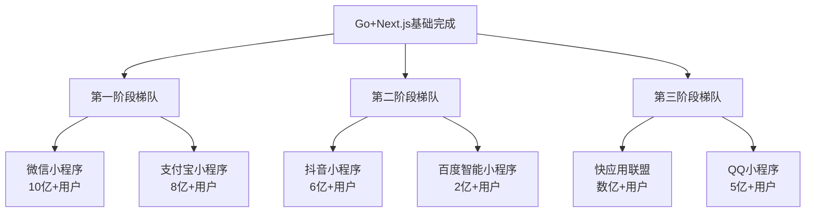

# Taro 小程序+快应用全覆盖学习路线 - 流量优先渐进策略

> **难度**: ⭐⭐⭐⭐ | **学习方式**: 流量驱动 | **目标**: 全平台流量获取
>
> **简介**: 基于你已有的Go+Next.js全栈基础，学习Taro框架实现小程序+快应用全覆盖，按照用户规模循序渐进掌握高流量平台开发。

## 🎯 学习策略总览

### 流量优先平台分层


### 核心学习理念
1. **流量获取优先**: 按用户规模选择学习平台
2. **商业化导向**: 重点学习支付、电商、生活服务等商业化功能
3. **渐进式扩展**: 从核心平台到细分市场
4. **全平台思维**: 一套代码，多端部署，最大化覆盖

## 📊 技术栈架构

### 核心技术栈 (基于已有基础)
```javascript
// Taro 3.x 核心 (2025年推荐版本)
"@tarojs/core": "^3.6.0",
"@tarojs/plugin-platform-weapp": "^3.6.0",
"@tarojs/plugin-platform-alipay": "^3.6.0",
"@tarojs/plugin-platform-tt": "^3.6.0",
"@tarojs/plugin-platform-baidu": "^3.6.0",
"@tarojs/plugin-platform-qq": "^3.6.0",
"@tarojs/plugin-platform-quickapp": "^3.6.0",

// React 18 (已有经验)
"react": "^18.2.0",
"react-dom": "^18.2.0",

// TypeScript 5.x (已有经验)
"typescript": "^5.0.0",

// 状态管理 (基于Next.js经验)
"zustand": "^4.4.0",  // 轻量级，与Next.js项目保持一致
"swr": "^2.2.0",     // 数据获取，与后端API配合

// UI组件库
"@nutui/nutui-react-taro": "^2.0.0", // 京东风格，适合电商
"@tarojs/taro-ui": "^3.1.0",         // Taro官方
"@antmjs/vantui": "^3.1.0",           // 有赞风格，适合商业

// 网络请求 (基于Go后端API)
"axios": "^1.6.0",
"@tarojs/taro": "^3.6.0",

// 商业化功能库
"taro-js-payment": "^1.0.0",    // 统一支付封装
"taro-share": "^2.0.0",         // 社交分享
"taro-analytics": "^1.5.0",     // 数据分析
```

### Go后端API集成 (已有基础)
```go
// 基于你已掌握的Go后端技术栈
- Gin框架提供RESTful API
- GORM进行数据库操作
- JWT用户认证系统
- Redis缓存和会话管理
- 支付回调处理
- 文件上传和存储
- WebSocket实时通信
```

## 🚀 第一阶段梯队：核心大流量平台 (微信+支付宝)

### 1. 微信小程序深度开发 (10亿+用户)

#### 环境配置和基础
**学习目标**: 掌握微信小程序开发环境
**重点内容**:
- 微信开发者工具深度使用
- Taro微信平台适配配置
- 微信小程序API调用机制
- 微信小程序审核规则和发布流程
- 与现有Go后端API的对接

**实践项目**:
- 创建第一个微信小程序
- 实现用户微信登录
- 集成Go后端用户系统

#### 微信生态核心功能
**学习目标**: 掌握微信生态特色功能
**重点内容**:
- **微信支付**: JSAPI支付、Native支付、小程序支付
- **社交裂变**: 分享到朋友圈、好友分享、群分享
- **公众号整合**: 公众号菜单跳转、用户关联
- **视频号集成**: 短视频内容展示、直播功能
- **微信客服**: 客服消息、自动回复
- **会员体系**: 会员卡、积分、优惠券

**实战项目**: 社交电商小程序
```javascript
// 核心功能模块
- 用户微信授权登录
- 商品展示和搜索
- 微信支付集成
- 社交分享功能
- 购物车和订单管理
- 会员积分系统
```

#### 微信商业化高级功能
**学习目标**: 掌握微信商业化变现功能
**重点内容**:
- **小程序直播**: 直播带货、商品管理
- **微信广告**: 激励视频广告、Banner广告
- **小程序云开发**: 云函数、云数据库、云存储
- **企业微信集成**: 企业服务场景
- **数据分析**: 微信小程序数据助手、自定义统计

### 2. 支付宝小程序商务功能 (8亿+用户)

#### 支付宝环境配置
**学习目标**: 掌握支付宝小程序开发
**重点内容**:
- 支付宝开发者工具使用
- 支付宝小程序IDE配置
- Taro支付宝平台适配
- 支付宝小程序审核规范
- 支付宝生态特色功能

#### 支付宝核心商务功能
**学习目标**: 掌握支付宝商务功能开发
**重点内容**:
- **支付宝支付**: 当面付、App支付、小程序支付
- **芝麻信用**: 信用授权、信用免押、信用评分
- **花呗分期**: 分期支付、账单管理
- **生活服务**: 到店付、口碑商家、本地生活
- **金融服务**: 理财产品、保险服务、信贷服务
- **企业服务**: 考勤、报销、企业支付

**实战项目**: B2B服务平台小程序
```javascript
// 商务功能模块
- 企业认证和管理
- 支付宝支付集成
- 芝麻信用服务
- 生活服务预订
- 财务管理工具
- 数据分析报表
```

## 🌟 第二阶段梯队：高增长潜力平台 (抖音+百度)

### 1. 抖音小程序内容电商 (6亿+用户)

#### 抖音生态入门
**学习目标**: 掌握抖音小程序开发
**重点内容**:
- 抖音开发者工具配置
- 抖音小程序审核规范
- Taro抖音平台适配
- 抖音算法推荐机制
- 内容审核规范

#### 短视频内容集成
**学习目标**: 掌握短视频内容功能
**重点内容**:
- **视频播放器**: 视频列表、播放控制、弹幕互动
- **直播功能**: 直播间、弹幕互动、礼物打赏
- **内容创作**: 视频上传、剪辑、特效
- **达人经济**: 达人合作、分佣机制
- **算法推荐**: 个性化推荐、热门推荐

#### 抖音电商功能
**学习目标**: 掌握抖音电商开发
**重点内容**:
- **直播带货**: 商品管理、直播购物车、订单处理
- **短视频带货**: 视频商品链接、购买转化
- **达人合作**: 达人橱窗、分销系统
- **内容营销**: 话题挑战、品牌活动
- **数据分析**: 播放量、转化率、用户画像

**实战项目**: 内容电商小程序
```javascript
// 内容电商模块
- 短视频内容展示
- 直播带货功能
- 商品橱窗管理
- 达人合作系统
- 营销活动工具
- 数据分析面板
```

### 2. 百度智能小程序AI功能 (2亿+用户)

#### 百度生态开发
**学习目标**: 掌握百度智能小程序
**重点内容**:
- 百度智能小程序开发者工具
- Taro百度平台适配
- 百度搜索入口优化
- AI功能集成

#### AI能力集成
**学习目标**: 掌握AI功能开发
**重点内容**:
- **语音识别**: 语音输入、语音搜索
- **图像识别**: OCR识别、图像搜索
- **自然语言处理**: 智能客服、文本分析
- **推荐算法**: 个性化推荐、智能搜索
- **百度地图**: LBS服务、导航功能

## 🎯 第三阶段梯队：细分市场平台 (快应用+QQ)

### 1. 快应用联盟系统级覆盖 (数亿+用户)

#### 快应用开发基础
**学习目标**: 掌握快应用开发
**重点内容**:
- 华为、小米、OPPO、vivo快应用开发
- Taro快应用平台适配
- 快应用联盟审核规范
- 系统级API调用

#### 厂商生态特色功能
**学习目标**: 掌握厂商合作功能
**重点内容**:
- **系统预装**: 应用商店推荐、开机启动
- **硬件集成**: 摄像头、传感器、NFC
- **厂商服务**: 华为HMS、小米MIUI、OPPO ColorOS
- **渠道合作**: 应用商店推广、厂商合作资源

### 2. QQ小程序年轻化市场 (5亿+用户)

#### QQ生态开发
**学习目标**: 掌握QQ小程序开发
**重点内容**:
- QQ小程序开发环境
- Taro QQ平台适配
- QQ年轻用户特点
- 社交娱乐功能

#### 年轻化功能开发
**学习目标**: 掌握年轻化功能
**重点内容**:
- **社交游戏**: 互动游戏、排行榜、成就系统
- **娱乐内容**: 音乐、视频、表情包
- **游戏化运营**: 积分系统、签到奖励、任务系统
- **社群功能**: 兴趣社群、话题讨论

## 📈 全平台商业化实战项目

### 项目1: 全平台社交电商矩阵
**目标**: 建立跨平台电商生态
**技术栈**: Taro + Go后端 + 多平台支付

**平台覆盖**:
- 微信小程序 (主阵地): 社交裂变、会员体系
- 支付宝小程序 (商务): B端服务、企业支付
- 抖音小程序 (内容): 短视频带货、直播电商
- 快应用 (系统级): 厂商合作、系统级曝光

**核心功能**:
```javascript
// 全平台统一功能
- 用户身份统一认证
- 商品和订单数据同步
- 多平台支付集成
- 社交分享和裂变
- 数据分析和运营工具
- 客服和售后服务
```

### 项目2: 本地生活服务平台
**目标**: 打通线上线下服务
**技术栈**: Taro + Go后端 + LBS服务

**平台特色**:
- 微信: 社交分享、位置服务
- 支付宝: 支付宝支付、芝麻信用
- 百度: AI搜索、地图导航
- 快应用: 系统级集成、硬件调用

### 项目3: 内容创作平台
**目标**: 多平台内容分发
**技术栈**: Taro + CDN + 内容管理

**平台功能**:
- 抖音: 短视频创作、直播功能
- 微信: 内容分享、公众号联动
- QQ: 年轻化内容、游戏化运营
- 百度: AI内容推荐、搜索优化

## 🛠️ 开发工具和环境配置

### 开发环境配置
```bash
# Taro CLI 安装
npm install -g @tarojs/cli

# 各平台开发者工具
- 微信开发者工具: wechatdevtool
- 支付宝小程序IDE: mini-ide
- 抖音开发者工具: bytedanceide
- 百度开发者工具: baiduide
- 快应用调试器: quickapp-debugger
```

### 项目配置示例
```javascript
// config/index.js
const config = {
  projectName: 'miniapp-matrix',
  date: '2025-10-10',
  designWidth: 750,
  deviceRatio: {
    640: 2.34 / 2,
    750: 1,
    828: 1.81 / 2
  },
  sourceRoot: 'src',
  outputRoot: 'dist',
  plugins: [
    '@tarojs/plugin-platform-weapp',
    '@tarojs/plugin-platform-alipay',
    '@tarojs/plugin-platform-tt',
    '@tarojs/plugin-platform-baidu',
    '@tarojs/plugin-platform-qq',
    '@tarojs/plugin-platform-quickapp'
  ],
  defineConstants: {
    'process.env.TARO_ENV': process.env.TARO_ENV
  },
  mini: {
    postcss: {
      pxtransform: {
        enable: true,
        config: {}
      },
      url: {
        enable: true,
        config: {
          limit: 10240
        }
      },
      cssModules: {
        enable: false,
        config: {
          namingPattern: 'module',
          generateScopedName: '[name]__[local]___[hash:base64:5]'
        }
      }
    }
  }
}

module.exports = function (merge) {
  if (process.env.NODE_ENV === 'development') {
    return merge({}, config, require('./dev'))
  }
  return merge({}, config, require('./prod'))
}
```

## 📊 商业化策略和增长黑客

### 用户增长策略
1. **社交裂变**: 微信分享、拼团、砍价
2. **内容营销**: 短视频内容、直播带货
3. **平台推广**: 厂商合作、应用商店推荐
4. **数据分析**: 用户画像、行为分析、转化优化

### 商业化变现模式
1. **电商变现**: 商品销售、佣金分成
2. **服务收费**: 订阅制、会员服务
3. **广告收入**: 信息流广告、激励视频
4. **数据服务**: 用户数据、行业报告

### 平台运营策略
- **微信**: 社交运营、会员体系、公众号联动
- **支付宝**: 商务服务、企业客户、金融服务
- **抖音**: 内容运营、达人合作、直播电商
- **快应用**: 厂商合作、系统级推广

## 🎯 学习成果评估

### 技术能力指标
- [ ] 全平台开发能力 (6个平台)
- [ ] 商业化功能集成 (支付、电商、社交)
- [ ] 性能优化能力 (加载速度、转化率)
- [ ] 运营数据分析能力

### 项目成果指标
- [ ] 完成全平台电商项目
- [ ] 实现商业化变现功能
- [ ] 获得实际用户和收入
- [ ] 建立持续增长机制

### 商业价值指标
- [ ] 用户获取成本控制
- [ ] 用户留存率优化
- [ ] 转化率提升
- [ ] 收入增长实现

## 💡 学习建议

### 利用已有优势
1. **Go后端经验**: 快速构建API服务和数据处理
2. **Next.js经验**: React开发、状态管理、工程化实践
3. **全栈思维**: 端到端的产品开发能力
4. **商业意识**: 技术服务于商业目标

### 学习路径建议
1. **先微信后其他**: 先掌握微信生态，再扩展到其他平台
2. **先通用后特定**: 先掌握通用功能，再学习平台特性
3. **先简单后复杂**: 先实现基础功能，再添加高级特性
4. **项目驱动**: 每个阶段都要有实际项目输出

### 商业化思维培养
1. **用户思维**: 从用户需求出发设计功能
2. **数据驱动**: 基于数据分析优化产品
3. **流量思维**: 关注用户获取和增长
4. **变现思维**: 考虑商业模式和盈利方式

---

**文档版本**: v2.0.0
**最后更新**: 2025年10月
**维护团队**: Dev Quest Team

> 💡 **学习提示**:
> 小程序+快应用开发的核心价值在于流量获取和商业变现。建议按照用户规模循序渐进，先在微信+支付宝建立商业化基础，然后通过抖音获取内容流量，最后通过快应用占领系统级入口。记住，流量思维比技术实现更重要！📱💰