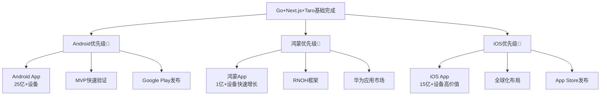

# React Native 三端原生应用学习路线 - Android+iOS+鸿蒙全覆盖

> **难度**: ⭐⭐⭐⭐⭐ | **学习方式**: MVP优先+原生为辅 | **目标**: 三端原生App全覆盖
>
> **简介**: 基于Go+Next.js+Taro的全栈基础，学习React Native跨平台原生开发，按照Android→鸿蒙→iOS的优先级，实现"React Native为主，原生为辅"的架构，快速验证MVP并占领移动端市场。

## 🎯 学习策略总览

### 平台优先级 (基于设备约束和市场策略)


### "React Native为主，原生为辅"架构理念
1. **RN为主**: 使用TypeScript + React Native开发90%功能
2. **原生为辅**: 仅在性能瓶颈、系统级功能时使用原生开发
3. **源码共存**: TypeScript与Kotlin/Swift源码在一个项目中
4. **JSI桥接**: 通过JavaScript Interface实现高性能原生调用

## 📊 技术栈架构

### 核心技术栈 (基于已有基础)
```javascript
// React Native 核心 (2025年推荐版本)
"react": "^18.2.0",
"react-native": "^0.73.0",
"@react-native-async-storage/async-storage": "^1.21.0",
"@react-native-community/netinfo": "^9.4.0",
"@react-navigation/native": "^6.1.0",
"@react-navigation/stack": "^6.3.0",
"@react-navigation/bottom-tabs": "^6.5.0",

// TypeScript 5.x (已有经验)
"typescript": "^5.0.0",
"@types/react": "^18.0.0",
"@types/react-native": "^0.72.0",

// 状态管理 (与Next.js项目保持一致)
"zustand": "^4.4.0",
"@tanstack/react-query": "^5.0.0",

// UI组件库
"react-native-elements": "^3.4.0",
"react-native-vector-icons": "^10.0.0",
"react-native-paper": "^5.11.0",

// 网络请求 (与Go后端集成)
"axios": "^1.6.0",
"@react-native-community/axios": "^1.0.0",

// 原生功能桥接
"react-native-permissions": "^3.10.0",
"react-native-camera": "^4.2.0",
"react-native-geolocation-service": "^5.3.0",

// 开发工具
"@react-native-community/cli": "^12.0.0",
"metro-react-native-babel-preset": "^0.77.0",
"flipper": "^0.207.0"
```

### 平台特定技术栈
```kotlin
// Android 原生模块 (Kotlin)
// build.gradle (Module: app)
dependencies {
    implementation "org.jetbrains.kotlin:kotlin-stdlib:1.9.10"
    implementation "androidx.core:core-ktx:1.12.0"
    implementation "androidx.appcompat:appcompat:1.6.1"
    implementation "com.google.android.material:material:1.11.0"
    implementation "androidx.constraintlayout:constraintlayout:2.1.4"

    // React Native 集成
    implementation "com.facebook.react:react-native:+"
    implementation "com.reactnativecommunity:asyncstorage:+"
}
```

```swift
// iOS 原生模块 (Swift)
// Podfile
pod 'React-Core', :path => '../node_modules/react-native/React'
pod 'React-DevSupport', :path => '../node_modules/react-native/React'
pod 'React-RCTActionSheet', :path => '../node_modules/react-native/Libraries/ActionSheetIOS'
pod 'React-RCTAnimation', :path => '../node_modules/react-native/Libraries/NativeAnimation'
pod 'React-RCTBlob', :path => '../node_modules/react-native/Libraries/Blob'
```

```typescript
// 鸿蒙原生模块 (ArkTS)
// @ohos/rnoh - React Native for OpenHarmony
import { RNOHCore } from '@ohos/rnoh';
```

## 🚀 第一阶段：React Native基础掌握

### 1. 环境搭建和基础配置
**学习目标**: 建立React Native开发环境
**重点内容**:
- React Native CLI vs Expo CLI对比选择
- Android Studio + Android SDK配置 (你的优势)
- 模拟器和真机调试环境
- Metro构建系统理解
- 调试工具Flipper配置
- 与Go后端API的初步对接

**实践项目**:
- 创建第一个React Native项目
- 实现基础的UI界面
- 连接Go后端用户认证API

### 2. React Native核心概念
**学习目标**: 掌握RN开发核心概念
**重点内容**:
- React 18在RN中的应用 (已有经验)
- 组件系统和Props/State管理
- Flexbox布局系统 (与CSS的对比)
- StyleSheet和样式处理
- 生命周期和Hooks使用
- 与Web React开发的异同

**实践项目**:
- 开发完整的用户界面
- 实现导航和路由系统
- 集成状态管理 (Zustand)

### 3. 导航系统和调试
**学习目标**: 掌握移动端导航和调试技巧
**重点内容**:
- React Navigation 6.x深度使用
- Stack Navigator、Tab Navigator、Drawer Navigator
- 深度链接和导航参数传递
- Flipper调试工具使用
- React Native Debugger
- 性能监控和优化

**实践项目**:
- 实现复杂的多页面导航
- 添加底部标签导航
- 集成深度链接功能

## 🥇 第二阶段：Android深度开发 - MVP优先

### 1. Android原生开发环境
**学习目标**: 掌握Android原生开发环境 (你的优势领域)
**重点内容**:
- Android Studio深度使用
- Android SDK和Build Tools配置
- Gradle构建系统理解
- Android应用签名和发布准备
- Google Play开发者账号配置

### 2. React Native Android特性
**学习目标**: 掌握RN在Android平台的功能
**重点内容**:
- Android权限系统 (Camera、Location、Storage)
- Android特有的UI组件和样式
- Android推送通知集成
- Android分享功能实现
- Android后台任务处理
- 与系统应用的深度集成

### 3. 原生模块开发 (Kotlin)
**学习目标**: 开发Android原生模块
**重点内容**:
- **JSI桥接技术**: JavaScript Interface高性能调用
- **TurboModules**: 新一代原生模块架构
- **Kotlin原生模块**: Camera、Bluetooth、Sensors
- **自定义View开发**: 性能关键UI组件
- **系统集成**: 联系人、日历、文件系统

**实践项目**: 原生相机模块
```kotlin
// android/app/src/main/java/com/yourapp/CameraModule.kt
class CameraModule(reactContext: ReactApplicationContext) : ReactContextBaseJavaModule(reactContext) {

    override fun getName() = "CameraModule"

    @ReactMethod
    fun openCamera(promise: Promise) {
        // 调用Android Camera API
        val intent = Intent(MediaStore.ACTION_IMAGE_CAPTURE)
        // 通过JSI返回结果给JavaScript
    }

    @ReactMethod
    fun requestCameraPermission(promise: Promise) {
        // 动态权限请求
    }
}
```

### 4. MVP项目开发和验证
**学习目标**: 快速验证产品商业模式
**实战项目**: 社交/电商/工具类App
**核心功能**:
- 用户注册登录系统 (Go后端集成)
- 核心业务功能 (根据你的产品方向)
- Android支付集成 (Google Pay)
- 推送通知系统
- 数据分析和用户行为追踪
- Google Play商店发布流程

## 🥈 第三阶段：鸿蒙生态适配开发

### 1. 鸿蒙开发环境配置
**学习目标**: 掌握鸿蒙开发环境
**重点内容**:
- DevEco Studio安装和配置
- HarmonyOS SDK下载和配置
- RNOH (React Native for OpenHarmony)框架
- 鸿蒙模拟器和真机调试
- 华为应用市场开发者账号

### 2. RNOH框架深度学习
**学习目标**: 掌握React Native在鸿蒙平台的实现
**重点内容**:
- RNOH架构原理和实现
- React Native组件到鸿蒙组件的映射
- 性能优化和内存管理
- 与原生鸿蒙API的桥接
- 多设备适配 (手机、平板、手表)

### 3. 鸿蒙特有功能集成
**学习目标**: 利用鸿蒙系统特色功能
**重点内容**:
- **分布式能力**: 多设备协同开发
- **华为生态**: HMS服务集成
- **系统级功能**: 鸿蒙特有API调用
- **厂商合作**: 华为应用商店推广资源
- **新兴市场**: 鸿蒙生态布局策略

**实践项目**: 鸿蒙版本适配
- 将Android MVP项目适配到鸿蒙平台
- 集成华为推送和支付服务
- 实现鸿蒙特有的分布式功能
- 华为应用市场上架发布

## 🥉 第四阶段：iOS扩展和三端统一

### 1. iOS开发环境配置
**学习目标**: 建立iOS开发能力
**重点内容**:
- Xcode安装和配置 (需要macOS)
- iOS SDK和Simulator使用
- CocoaPods依赖管理
- iOS开发者账号和证书配置
- App Store发布流程

### 2. React Native iOS特性
**学习目标**: 掌握RN在iOS平台的功能
**重点内容**:
- iOS权限系统和隐私保护
- iOS特有的UI组件和设计规范
- Apple Pay支付集成
- iOS推送通知 (APNs)
- iOS后台应用刷新
- 与iOS系统应用的集成

### 3. iOS原生模块开发 (Swift)
**学习目标**: 开发iOS原生模块
**重点内容**:
- **Swift原生模块**: Camera、HealthKit、CoreMotion
- **自定义组件**: 性能优化的原生UI
- **系统集成**: Contacts、Calendar、Photos
- **安全功能**: Face ID、Touch ID集成
- **苹果生态**: iCloud、Apple Music集成

### 4. 三端架构优化和统一
**学习目标**: 实现三端体验统一
**重点内容**:
- **跨平台代码架构**: 最大化代码复用
- **平台差异化处理**: 优雅的平台适配
- **性能优化**: 三端性能调优
- **UI/UX统一**: 设计系统和组件库
- **数据同步**: 三端数据一致性保证

## 🛠️ 高级开发和工程化

### 1. 原生模块高级开发
**学习目标**: 深度掌握原生模块开发
**重点内容**:
- **TurboModules架构**: 新一代原生模块系统
- **Fabric渲染**: React Native新渲染架构
- **Codegen**: 类型安全的桥接代码生成
- **Hermes引擎**: JavaScript引擎优化
- **性能调试**: 原生代码性能分析

### 2. 跨平台状态管理
**学习目标**: 统一三端状态管理
**技术实现**:
```typescript
// 与Next.js项目保持一致的状态管理
import { create } from 'zustand';
import { persist, createJSONStorage } from 'zustand/middleware';

interface AppState {
  user: User | null;
  theme: 'light' | 'dark';
  language: string;
  setUser: (user: User | null) => void;
  toggleTheme: () => void;
  setLanguage: (lang: string) => void;
}

export const useAppStore = create<AppState>()(
  persist(
    (set, get) => ({
      user: null,
      theme: 'light',
      language: 'zh-CN',
      setUser: (user) => set({ user }),
      toggleTheme: () => set(state => ({
        theme: state.theme === 'light' ? 'dark' : 'light'
      })),
      setLanguage: (language) => set({ language }),
    }),
    {
      name: 'app-storage',
      storage: createJSONStorage(() => AsyncStorage),
    }
  )
);
```

### 3. CI/CD和自动化发布
**学习目标**: 建立三端自动化发布流程
**重点内容**:
- **GitHub Actions**: 自动化构建和测试
- **Fastlane**: iOS和Android自动化发布
- **华为AppGallery Connect**: 鸿蒙应用发布
- **版本管理**: 语义化版本和发布策略
- **监控分析**: 崩溃监控和性能分析

## 📈 三端实战项目

### 项目1: 社交网络App (Android+iOS+鸿蒙)
**技术栈**: React Native + Go后端 + WebSocket
**核心功能**:
- 三端统一的用户界面
- 实时聊天和消息推送
- 原生相机和相册集成
- 社交分享功能 (微信、微博等)
- 三端数据同步和一致性

### 项目2: 生产力工具App
**技术栈**: React Native + 原生功能集成
**核心功能**:
- 日历和任务管理 (集成系统日历)
- 文件管理和云同步
- 原生通知和提醒
- 离线数据同步
- 跨设备协作功能

### 项目3: 电商App
**技术栈**: React Native + 支付集成 + LBS
**核心功能**:
- 商品展示和搜索
- 多平台支付集成 (支付宝、微信支付、Apple Pay)
- 地理位置和地图服务
- 订单管理和物流跟踪
- 推送营销和用户运营

## 🔧 开发工具和环境配置

### 统一开发环境
```bash
# React Native CLI 安装
npm install -g @react-native-community/cli

# 核心依赖安装
npx react-native init MyApp --template react-native-template-typescript

# Android开发 (你的优势)
# Android Studio + Android SDK已配置

# iOS开发 (需要macOS)
# Xcode from App Store
# CocoaPods: sudo gem install cocoapods

# 鸿蒙开发
# DevEco Studio from Huawei Developer website
# HarmonyOS SDK配置
```

### 项目结构示例
```
MyCrossPlatformApp/
├── src/
│   ├── components/          # 跨平台组件
│   │   ├── common/         # 通用组件
│   │   ├── android/        # Android特定组件
│   │   ├── ios/           # iOS特定组件
│   │   └── harmony/       # 鸿蒙特定组件
│   ├── screens/            # 页面组件
│   ├── navigation/         # 导航配置
│   ├── services/          # API服务 (Go后端集成)
│   ├── stores/            # 状态管理
│   ├── utils/             # 工具函数
│   └── types/             # TypeScript类型定义
├── android/               # Android原生代码
│   ├── app/src/main/java/
│   │   └── com/yourapp/
│   │       ├── MainActivity.kt
│   │       ├── modules/      # 原生模块
│   │       └── services/     # 原生服务
│   └── build.gradle
├── ios/                   # iOS原生代码
│   ├── MyApp/
│   │   ├── Modules/       # 原生模块
│   │   └── Services/      # 原生服务
│   └── MyApp.xcodeproj/
├── harmony/               # 鸿蒙原生代码
│   ├── entry/
│   │   ├── src/main/ets/
│   │   │   ├── pages/     # 鸿蒙页面
│   │   │   └── modules/   # 鸿蒙模块
│   └── build-profile.json5
├── package.json
├── tsconfig.json
├── metro.config.js
└── babel.config.js
```

## 💡 学习建议和最佳实践

### 利用你的Android设备优势
1. **真机调试优先**: 充分利用你的Android设备进行开发调试
2. **Android平台深耕**: 成为Android开发专家，建立技术优势
3. **用户体验优化**: 基于真实设备体验优化产品细节

### "React Native为主，原生为辅"实践建议
1. **90% RN原则**: 90%功能用React Native实现，仅10%使用原生
2. **性能优先**: 仅在性能瓶颈、系统级功能时考虑原生
3. **源码共存管理**: 建立清晰的项目结构，管理多语言源码

### 学习路径优化
1. **Android深度优先**: 先成为Android平台专家
2. **鸿蒙新兴机会**: 抓住鸿蒙生态发展红利期
3. **iOS全球化扩展**: 最后进军iOS实现全球化布局

### 商业化思维培养
1. **MVP快速验证**: 快速开发验证商业模式
2. **数据驱动决策**: 基于用户数据优化产品
3. **三端市场策略**: 不同平台采用不同的市场策略

---

**文档版本**: v2.0.0
**最后更新**: 2025年10月
**维护团队**: Dev Quest Team

> 💡 **学习提示**:
> React Native三端开发的核心价值在于用一套代码服务全球移动用户。建议按照Android→鸿蒙→iOS的顺序循序渐进，充分利用你的Android设备优势，同时抓住鸿蒙生态的新兴机遇。记住，跨平台思维和平台特质的平衡是成功的关键！📱🚀