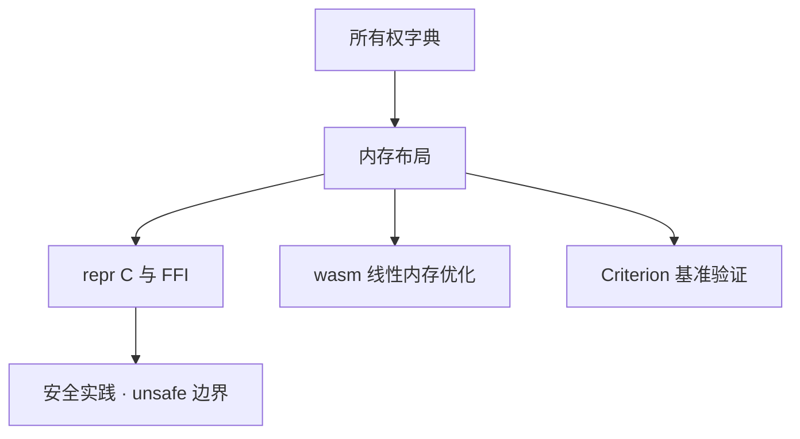

# 内存布局与性能：从 repr 到零成本抽象

> **文档简介**: 用 `size_of`/`align_of` 的可复现测量方法拆解 Rust 的内存布局规则——repr(Rust) 的重排自由、repr(C) 的确定性、栈堆句柄的尺寸、String/&str/Cow 的分配取舍，以及迭代器零成本抽象的实证视角
>
> **目标读者**: 想理解「性能从哪来」而非只背结论的 Rust 学习者（高级）
>
> **前置知识**: [所有权字典](../reference/language-concepts/01-ownership-dictionary.md)；[单元与集成测试](../testing/01-unit-integration-tests.md) 与 [Criterion 基准](../testing/02-criterion-benchmarks.md) 的测量意识

<details>
<summary>文档信息（用途、难度与维护记录）</summary>

## 📚 文档元数据

| 属性 | 内容 |
|------|------|
| **模块** | `11-rust-cross-platform` |
| **象限** | 解释 |
| **难度** | ⭐⭐⭐ |
| **标签** | `#rust` `#advanced` `#memory-layout` `#performance` |
| **更新日期** | `2026年9月` |

</details>

> 文中的数字是针对 x86_64 Linux、`rustc --edition 2024` 的**示例测量格式**，不是跨平台常量。请用模块 README 的 Rust 基线在自己的目标平台运行代码后记录输出；ABI、目标三元组和编译器版本都可能改变尺寸或优化结果。

## 🎯 学习目标

完成本篇后，你将能够：

- ✅ **掌握核心概念**: 解释对齐、填充与字段重排如何决定 struct 的真实大小
- ✅ **实践能力**: 用 `size_of`/`align_of` 验证布局假设，按场景选对 `String`/`&str`/`Cow`
- ✅ **解决问题**: 判断一个 struct 是否需要 `repr(C)`，估算容器常驻内存
- ✅ **进阶方向**: 为 [FFI](./02-ffi-bindgen.md) 的跨界布局与 [wasm](./03-wasm32-target.md) 的线性内存优化打底

## 📋 目录

- [核心概念](#-核心概念)
- [实践指南](#️-实践指南)
- [代码示例](#-代码示例)
- [最佳实践](#-最佳实践)
- [常见问题](#-常见问题)
- [相关资源](#-相关资源)

---

## 🔍 核心概念

### 概念一：repr(Rust) 与 repr(C)

**定义**: 默认的 `repr(Rust)` 只保证语义正确（每个字段对齐到自己的对齐要求），**不保证字段顺序与任何 ABI**；`repr(C)` 则承诺按声明顺序布局、按 C 规则填充。

**关键特性**:

- `repr(Rust)` 下编译器可以（且通常会）**重排字段**，把对齐要求高的放前面、塞紧空隙，让 padding 最小
- `repr(C)` 下字段永远按声明顺序排，缺的对齐用填充补——布局对 C 可预测，这是 FFI 的前提（见 [FFI 篇](./02-ffi-bindgen.md)）
- 两个「字段完全相同」的 struct，因此可能大小不同

**使用场景**:

- 场景1：纯 Rust 内部数据结构 → 保持默认，让编译器优化布局
- 场景2：与 C 互操作、按字节序列化、解析二进制格式 → 显式 `repr(C)`

### 概念二：对齐与填充

**定义**: 每个类型有对齐要求（align，2 的幂）：其实例的起始地址必须被 align 整除。struct 的对齐取所有字段的最大值；字段之间与末尾的空隙即填充（padding）。

**一次测量的示例输出格式**（请在目标平台重跑）:

```text
repr(Rust): size = 16, align = 8
repr(C):    size = 24, align = 8
```

同一组字段 `u8 + u64 + u16`：

- `repr(C)`：a(0..1) → 填 7 字节 → b(8..16) → c(16..18) → 末尾补 6 字节凑齐 8 的倍数 = **24**
- `repr(Rust)`：重排为 b(0..8) → c(8..10) → a(10..11) → 补 5 字节 = **16**

同一份数据，33% 的空间差距，仅仅来自布局策略。

---

## 🛠️ 实践指南

### 步骤一：用 size_of 建立布局直觉

**目标**: 把「句柄在栈上、数据在堆上」变成可验证的数字。

```rust
use std::mem::size_of;

struct Point {
    x: f64,
    y: f64,
}

fn main() {
    println!("usize:        {}", size_of::<usize>());
    println!("Point:        {}", size_of::<Point>());
    println!("Box<u64>:     {}", size_of::<Box<u64>>());
    println!("Box<[u64;8]>: {}", size_of::<Box<[u64; 8]>>());
    println!("Vec<u64>:     {}", size_of::<Vec<u64>>());
    println!("String:       {}", size_of::<String>());
    println!("&str:         {}", size_of::<&str>());
    println!("Box<Point>:   {}", size_of::<Box<Point>>());

    // Box 把数据搬到堆，栈上只留一个指针宽度的句柄
    let on_heap = Box::new(Point { x: 1.0, y: 2.0 });
    println!("堆上数据: ({}, {})", on_heap.x, on_heap.y);
}
```

**示例输出格式**（请在目标平台重跑）:

```text
usize:        8
Point:        16
Box<u64>:     8
Box<[u64;8]>: 8
Vec<u64>:     24
String:       24
&str:         16
Box<Point>:   8
堆上数据: (1, 2)
```

**解读**:

- `Box<Point>` 恒为一个机器字——**内容多大都搬去堆**，栈上只剩指针
- `Vec`/`String` 是三机器字（指针 + 容量 + 长度），元素本体全在堆上
- `&str` 与 `Box<[u64;8]>` 的对比很说明问题：切片引用是「胖指针」（指针 + 长度，16 字节），而 `Box` 指向定长数组时长度编码在类型里，指针保持「瘦」（8 字节）

### 步骤二：String vs &str vs Cow 的取舍

**目标**: 按所有权与分配需求选字符串类型。

| 类型 | 所有权 | 分配时机 | 典型用途 |
|------|--------|----------|----------|
| `&str` | 无（借用视图） | 永不分配 | 只读参数、切片引用 |
| `String` | 有 | 构造/增长时 | 需要持有与修改的数据 |
| `Cow<str>` | 有或借用 | **仅修改时**（写时克隆） | 大多数时候原样返回、偶尔改写的路径 |

```rust
use std::borrow::Cow;

// 接收借用视图 &str：只读，不获得所有权
fn count_vowels(s: &str) -> usize {
    s.bytes().filter(|b| b"aeiouAEIOU".contains(b)).count()
}

// Cow：仅当确实需要修改时才分配（写时克隆）
fn normalize_path(input: &str) -> Cow<'_, str> {
    if input.contains('\\') {
        Cow::Owned(input.replace('\\', "/")) // 需要修改 → 堆分配
    } else {
        Cow::Borrowed(input) // 零分配，直接借用
    }
}

fn owned_string() -> String {
    let mut s = String::from("hello");
    s.push_str(", world"); // 需要增长且持有所有权 → String
    s
}

fn main() {
    assert_eq!(count_vowels("hello"), 2);
    assert!(matches!(normalize_path("a/b/c"), Cow::Borrowed(_)));
    assert!(matches!(normalize_path("a\\b\\c"), Cow::Owned(_)));
    assert_eq!(normalize_path("a\\b\\c").as_ref(), "a/b/c");
    assert_eq!(owned_string(), "hello, world");
    println!("三种形态断言全部通过");
}
```

**解读**: `normalize_path` 的分支就是 `Cow` 的全部意义——热路径上绝大多数输入无需修改时，`Cow::Borrowed` 一字节的分配都不发生；枚举变体只是把「是否拥有」编码进类型。

### 步骤三：零成本抽象的实证视角

**目标**: 用测量代替信仰——「迭代器抽象 ≈ 手写循环」是可以验证的命题。

```rust
use std::time::Instant;

fn sum_manual(v: &[u64]) -> u64 {
    let mut acc = 0u64;
    for i in 0..v.len() {
        if v[i] % 2 == 0 {
            acc += v[i] * 2;
        }
    }
    acc
}

fn sum_iterators(v: &[u64]) -> u64 {
    v.iter().filter(|x| *x % 2 == 0).map(|x| x * 2).sum()
}

fn main() {
    let data: Vec<u64> = (0..1_000_000u64).collect();

    // 多轮取最小值，降低调度噪音
    let mut t_manual = u64::MAX;
    let mut t_iter = u64::MAX;
    for _ in 0..5 {
        let t = Instant::now();
        let a = sum_manual(&data);
        let d = t.elapsed().as_micros() as u64;
        t_manual = t_manual.min(d);
        assert!(a > 0);

        let t = Instant::now();
        let b = sum_iterators(&data);
        let d = t.elapsed().as_micros() as u64;
        t_iter = t_iter.min(d);
        assert_eq!(a, b); // 两条路径结果一致
    }
    println!("手写循环: {t_manual} µs / 迭代器链: {t_iter} µs");
}
```

**示例测量格式**（使用 `rustc -O`；两次运行只用于展示记录方式）:

```text
手写循环: 314 µs / 迭代器链: 270 µs
手写循环: 369 µs / 迭代器链: 373 µs
```

**解读**:

- 同量级、无系统性差距，且差距方向会随机器翻转——这就是「零成本」：抽象层在编译期被单态化并内联掉，产物与手写循环同构
- 注意前提：`-O`。debug 构建下迭代器与手写循环都慢一个量级，且比例失真——**性能结论只出自优化构建**（严谨对比用 [Criterion](../testing/02-criterion-benchmarks.md)）
- 想看「证据的来源」：`cargo asm`、`rustc --emit=llvm-ir` 或 [godbolt](https://godbolt.org/) 都能展示迭代器链与手写循环编译出的近似机器码

---

## 💻 代码示例

### 示例一：查一个类型的对齐并预判填充

```rust
use std::mem::{align_of, size_of};

#[allow(dead_code)]
struct LogRecord {
    level: u8, // 1 字节
    code: u64, // 8 字节对齐
    tag: u16,  // 2 字节
}

fn main() {
    println!("align = {}", align_of::<LogRecord>());
    println!("size  = {}", size_of::<LogRecord>());
}
```

**在示例目标上的输出格式**: `align = 8, size = 16`。你的目标平台必须以实际运行结果为准。

**关键点解析**:

- 对齐 = 最大字段对齐 = 8；先按对齐心算一遍，再用输出验证——这个习惯比背结论更抗过时
- `repr(Rust)` 允许编译器为了布局而重排字段，不能把示例中的 16 字节当作稳定 ABI；若要按声明顺序与 C 互操作，使用 `#[repr(C)]`，再在目标平台测量大小与对齐

---

## 🎨 最佳实践

size_of 测量类型本身的存储大小，不包含 Vec/String 指向的全部堆分配。定位热点后同时考虑访问局部性、分配次数和实际数据规模，不能只以少几个字节判断整体更快。

repr(C) 适合需要约定 C 布局的边界，但不自动成为跨平台二进制协议：字节序、指针、填充和尺寸仍需明确。packed 字段可能未对齐，访问方式必须满足对齐规则。用发布构建和相同输入测量，debug 仍是编译后的机器码，不能称为解释器执行。

---

## ❓ 常见问题

### Q1: 为什么 struct 大小 ≠ 字段大小之和？

**A**: 对齐填充。每个字段都要落在自己 align 的倍数地址上，struct 总大小还要凑齐整个 struct 对齐的倍数。这就是「同一组字段，repr(Rust) 16 字节、repr(C) 24 字节」的原因——不是浪费，是对齐契约的代价，而重排自由让它可以最小化。

### Q2: String 为什么是 24 字节？&str 为什么是 16？

**A**: `String` 拥有堆缓冲区，需要三机器字：指针、容量、长度（支持原地增长与 O(1) 的 len）；`&str` 是借用视图，两机器字：指针 + 长度（视图不可增长，容量无从谈起）。`Vec<T>` 与 `&[T]`、`Box<[T]>` 是同一组关系。

### Q3: 什么时候必须写 repr(C)？

**A**: 三种情形：① 与 C 互操作（结构跨界，见 [FFI 篇](./02-ffi-bindgen.md)）；② 按确定字节序手工序列化/反序列化；③ 依赖布局的 unsafe 代码（如按偏移解释内存）。除此之外默认 repr(Rust) 更优。

---

## 🔗 相关资源

### 📖 延伸阅读

- **官方文档**: [The Rust Reference · Type Layout](https://doc.rust-lang.org/reference/type-layout.html) - repr 各变体的规范定义
- **官方文档**: [std::borrow::Cow](https://doc.rust-lang.org/std/borrow/enum.Cow.html) - 写时克隆枚举的完整语义
- **在线工具**: [Compiler Explorer (godbolt)](https://godbolt.org/) - 直接查看零成本抽象的汇编证据

### 🛠️ 工具资源

- **开发工具**: [cargo-asm](https://github.com/gnzlbg/cargo-asm) - 就地查看某函数的汇编输出
- **开发工具**: [Cargo 文档 · Profiles](https://doc.rust-lang.org/cargo/reference/profiles.html) - release/bench 档位的优化配置

---

## 🎯 练习与实践

### 练习一：填充侦探

**任务要求**:

1. 定义 `struct { a: u8, b: u32, c: u8, d: u64 }`，先手算 repr(C) 的大小
2. 用 `size_of` 验证；再调整声明顺序让 repr(C) 的填充最小

**评估标准**: 手算结果与目标平台的测量一致；记录重排前后的填充字节，并解释差异。不要把某一台机器的尺寸推广为所有 ABI。

### 练习二：给热路径省钱

**挑战任务**:

- 找到自己工程里一个「接收 String」的只读函数，改成 `&str` 参数并统计调用点改动量
- 把一个「多数不改、偶尔归一化」的转换函数改成 `Cow` 返回，用 `matches!` 断言两种分支

**提示**: 第二个任务可直接复用本篇 `normalize_path` 的模式。

---

## 📊 知识图谱



---

## 🔄 文档交叉引用

### 相关文档

- 📄 **[所有权字典](../reference/language-concepts/01-ownership-dictionary.md)** - 布局背后的移动/借用语义
- 📄 **[FFI 与 bindgen](./02-ffi-bindgen.md)** - repr(C) 的第一个用武之地
- 📄 **[wasm32 target](./03-wasm32-target.md)** - 线性内存中的布局与体积优化
- 📄 **[Criterion 基准](../testing/02-criterion-benchmarks.md)** - 本篇观测手段的统计学升级

---

## 📝 总结

### 核心要点回顾

1. **布局是契约不是玄学**: repr(Rust) 换重排自由，repr(C) 换互操作确定性，`size_of` 随时可验证
2. **句柄固定、数据在堆**: Box 一个字、Vec/String 三个字、&str 两个字——容器常驻内存可心算
3. **零成本抽象可实证**: 优化构建下迭代器链与手写循环同量级，这是编译器干活的证据而非信仰

### 学习成果检查

- [ ] 能对任意 struct 心算 repr(C) 的填充并实测验证
- [ ] 能按「是否拥有、是否修改」为字符串 API 选对 String/&str/Cow
- [ ] 能解释为什么性能结论必须出自 release/bench 档位

---

**文档版本**: v1.0.0
**最后更新**: 2026年9月
**维护团队**: Dev Quest Team


<!-- learning-navigation -->
## 阅读导航

[本模块理解地图](../LEARNING_GUIDE.md) · [完整目录与版本](../README.md) · [通用术语](../../shared-resources/glossary.md)
