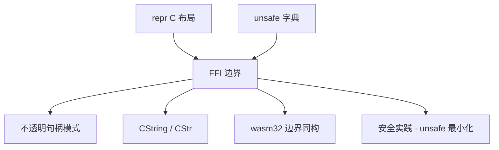

# FFI 与 bindgen：Rust 与 C 的边界工程

> **文档简介**: 一次讲透 Rust ↔ C 的双向边界——导出 C ABI 函数、声明外部符号、bindgen/cbindgen 的分工、内存所有权跨界规则、CString/CStr 转换，以及「panic 禁止穿越边界」的工程化处理
>
> **目标读者**: 需要把 Rust 嵌入 C 工程、或给 Rust 包一层 C 库的开发者（高级）
>
> **前置知识**: [unsafe 字典](../reference/language-concepts/06-unsafe.md)；[内存布局](./01-memory-layout-performance.md) 的 repr(C) 部分

## 📚 文档元数据

| 属性 | 内容 |
|------|------|
| **模块** | `11-rust-cross-platform` |
| **象限** | 解释 |
| **难度** | ⭐⭐⭐ |
| **标签** | `#rust` `#advanced` `#ffi` `#bindgen` |
| **更新日期** | `2026年9月` |

> 语法基线：edition 2024（Rust 1.98.1，见模块 README）。注意 edition 2024 对本文两处关键语法的强制要求：`#[unsafe(no_mangle)]` 与 `unsafe extern` 块——本文代码已按此编写并经 `rustc --edition 2024` 实测。

## 🎯 学习目标

完成本篇后，你将能够：

- ✅ **掌握核心概念**: 双向 FFI 的符号导出/导入模型与两个代码生成工具的分工
- ✅ **实践能力**: 编写可被 C 调用的 Rust 库，安全处理字符串与内存所有权移交
- ✅ **解决问题**: 把 panic 拦在 ABI 边界内；判断一个结构体能否安全跨界
- ✅ **进阶方向**: 理解 [wasm32](./03-wasm32-target.md) 边界的同构思维

## 📋 目录

- [核心概念](#核心概念)
- [实践指南](#实践指南)
- [代码示例](#代码示例)
- [最佳实践](#最佳实践)
- [常见问题](#常见问题)
- [相关资源](#相关资源)

---

## 🔍 核心概念

### 概念一：两个方向，两个工具

**定义**: FFI 是双向的——「导出」把 Rust 函数暴露成 C 符号，「导入」在 Rust 里声明并调用 C 符号。每个方向各有一个主流的绑定代码生成器。

| 方向 | 手写部分 | 生成器 | 产物 |
|------|----------|--------|------|
| Rust → C（导出） | `#[unsafe(no_mangle)]` + `extern "C"` 函数 | **cbindgen**（扫 Rust 源码生成 `.h`） | C 头文件 |
| C → Rust（导入） | `unsafe extern "C" { … }` 块 | **bindgen**（扫 C 头文件生成 Rust 绑定） | `bindings.rs` |

**关键特性**:

- 生成器只负责「声明翻译」，所有权与生命周期约定永远靠人写文档与测试
- `cbindgen` 与 `bindgen` 名字易混，记方向即可：bindgen 让**Rust 绑定**（bindings）被生成出来

### 概念二：ABI 边界的两条铁律

**定义**: C ABI 之下没有 Rust 的类型系统——跨界的东西必须在 ABI 层面无歧义。

**铁律一：布局要确定**。跨界结构体一律 `#[repr(C)]`（对齐与填充规则见 [内存布局篇](./01-memory-layout-performance.md)）；默认 `repr(Rust)` 的布局无保证，跨界即未定义行为。

**铁律二：panic 禁止穿越**。Rust 的展开（unwind）对 C 无意义。当前 stable 的 ABI 语义下，panic 试图穿出 `extern "C"` 函数边界时进程**立即 abort**——不是未定义行为，但等于整个宿主进程陪葬。正确姿势：边界函数内部用 `catch_unwind` 把 panic 转成错误码。

---

## 🛠️ 实践指南

### 步骤一：导出可被 C 调用的 Rust 库

**目标**: 写一组覆盖「计算 / 字符串移交 / 释放 / panic 拦截」四类边界的导出函数（已实测编译运行通过）:

```rust
// FFI 导出边界全景：C ABI / 所有权移交 / CString-CStr / panic 拦截
use std::ffi::{c_char, CStr, CString};
use std::panic::catch_unwind;

/// 最简单的 C ABI 导出。
#[unsafe(no_mangle)]
pub extern "C" fn add(a: i32, b: i32) -> i32 {
    a + b
}

/// 生成问候语：Rust 侧分配，调用方用完必须调用 `free_greeting` 归还。
///
/// 返回 NULL 表示内部错误（输入含 NUL 或指针为空）。
#[unsafe(no_mangle)]
pub extern "C" fn make_greeting(name: *const c_char) -> *mut c_char {
    if name.is_null() {
        return std::ptr::null_mut();
    }
    let name = unsafe { CStr::from_ptr(name) }; // 只借用 C 字符串，不接管所有权
    let name = name.to_string_lossy();
    match CString::new(format!("你好，{name}")) {
        Ok(s) => s.into_raw(), // 所有权移交调用方
        Err(_) => std::ptr::null_mut(),
    }
}

/// 释放 `make_greeting` 返回的字符串：谁分配，谁释放。
#[unsafe(no_mangle)]
pub extern "C" fn free_greeting(ptr: *mut c_char) {
    if !ptr.is_null() {
        unsafe { drop(CString::from_raw(ptr)) }; // 接管所有权并析构
    }
}

/// panic 禁止穿越 C ABI 边界：用 catch_unwind 把 panic 转成错误码。
#[unsafe(no_mangle)]
pub extern "C" fn checked_div(a: i32, b: i32) -> i32 {
    catch_unwind(|| a / b).unwrap_or(0)
}

fn main() {
    // 仅验证本文件可独立编译运行；真实场景中这些函数由 C/其他语言调用。
    let cs = CString::new("Dev Quest").unwrap();
    let ptr = make_greeting(cs.as_ptr());
    assert!(!ptr.is_null());
    let back = unsafe { CStr::from_ptr(ptr) }.to_string_lossy().into_owned();
    assert_eq!(back, "你好，Dev Quest");
    free_greeting(ptr);

    assert_eq!(add(2, 3), 5);
    assert_eq!(checked_div(6, 3), 2);
    assert_eq!(checked_div(1, 0), 0); // 除零 panic 被拦在边界内
    println!("FFI 边界用例全部通过");
}
```

**关键点解析**:

- `#[unsafe(no_mangle)]`：edition 2024 起，`no_mangle` 是必须显式标 `unsafe(...)` 的属性——它关闭名字修饰，本来就是高危操作
- `into_raw()` / `from_raw()` 是**成对**的所有权移交原语：`into_raw` 放弃 Rust 的自动析构（否则返回后 CString 被 drop，指针悬空）；`from_raw` 把所有权接回来重新接管析构
- `checked_div` 实测时会在 stderr 看到 `attempt to divide by zero` 的打印——那是**默认 panic hook** 的输出，它先于 `catch_unwind` 生效；边界库可用 `std::panic::set_hook` 定制它，避免污染宿主的日志

### 步骤二：从 Rust 调用 C

**目标**: 声明并调用外部 C 符号。

```rust
// edition 2024：extern 块必须标 unsafe（对导入符号的信任要显式声明）
use std::os::raw::c_int;

unsafe extern "C" {
    // C 标准库的 abs
    fn abs(x: c_int) -> c_int;
}

fn main() {
    let x: c_int = -42;
    // SAFETY: abs 对任意 c_int 输入都有定义且无副作用
    let r = unsafe { abs(x) };
    assert_eq!(r, 42);
    println!("abs(-42) = {r}");
}
```

**关键点解析**:

- edition 2024 把 extern 块统一为 `unsafe extern`：对「符号签名是否真实、约定是否成立」的信任必须显式写出；块内个别函数确属安全的，可再标 `safe fn` 收窄
- 链接什么符号由构建系统决定（`println!("cargo:rustc-link-lib=…")` 或 build script）；本例的 `abs` 在 glibc 中默认可见

### 步骤三：用生成器消灭手写声明

**目标**: 大规模绑定交给工具。

```bash
# bindgen：由 C 头文件生成 Rust 绑定（C → Rust 方向）
bindgen src/wrapper.h -o src/bindings.rs

# cbindgen：由 Rust crate 生成 C 头文件（Rust → C 方向）
cbindgen --crate mylib --output include/mylib.h
```

**关键点解析**:

- 生成器输出的声明**仍然受铁律约束**：结构体要 `#[repr(C)]`，所有权要靠配对的 create/free 函数
- 工程化时通常把 bindgen 挂进 `build.rs`（对头文件变化重生成），cbindgen 挂进 CI 产物步骤——具体接线随工具版本演进，以各自 User Guide 为准

---

## 💻 代码示例

### 示例一：不透明句柄（opaque handle）模式

C 侧不关心 Rust 对象的内部布局，只握着指针。这是暴露复杂类型的标准形态：

```rust
pub struct Database {
    // 内部字段对 C 完全不可见
    // cache: HashMap<String, Vec<u8>>,
}

// 构造：返回不透明指针，布局永不出境
#[unsafe(no_mangle)]
pub extern "C" fn db_new() -> *mut Database {
    Box::into_raw(Box::new(Database {}))
}

// 使用：Rust 引用只活在调用期间
// SAFETY: 前置条件由 C 调用方保证——指针来自 db_new 且未重复释放
#[unsafe(no_mangle)]
pub unsafe extern "C" fn db_ping(db: *mut Database) -> bool {
    !db.is_null()
}

// 析构：与 db_new 严格配对
// SAFETY: 指针必须来自 db_new，且只释放一次
#[unsafe(no_mangle)]
pub unsafe extern "C" fn db_free(db: *mut Database) {
    if !db.is_null() {
        unsafe { drop(Box::from_raw(db)) };
    }
}

#[allow(dead_code)]
fn main() {} // 真实场景为 cdylib：crate-type = ["cdylib"]
```

**关键点解析**:

- `Box::into_raw`/`from_raw` 对任意 Rust 类型成立——类型布局从不出境，C 只见指针
- 构造/使用/析构三函数的 SAFETY 注释就是跨界契约的文档化；C 侧的重复释放、悬空使用都无法被 Rust 编译器拦截，只能靠契约与测试（见 [安全实践](./04-security-practices.md)）

### 示例二：结构体跨界的最小形态

```rust
// 库片段（crate-type = ["cdylib"] 的一部分，无 main）
#[repr(C)]
pub struct Vec2 {
    pub x: f64,
    pub y: f64,
}

#[unsafe(no_mangle)]
pub extern "C" fn vec2_dot(a: Vec2, b: Vec2) -> f64 {
    a.x * b.x + a.y * b.y
}
```

**关键点解析**:

- 小型 POD（纯数据）结构体按值传参是安全的——前提是 `#[repr(C)]`，且 cbindgen 能为它生成同构的 C 定义
- 含 `String`/`Vec`/引用的结构体**永不**直接跨界；拆成不透明句柄 + 显式函数

---

## 🎨 最佳实践

### ✅ 推荐做法

- **边界函数「薄」**: 导出层只做类型转换与错误码映射，业务逻辑留在安全 Rust 内部（可单元测试）
- **成对设计 API**: `xxx_new`/`xxx_free`、`into_raw`/`from_raw`——谁分配谁释放，分配器不跨边
- **错误码 + 空指针表达失败**: 用 `NULL`、非零错误码、out 参数；不要指望 C 理解 `Result`

### ❌ 避免陷阱

- **让 C 直接 `free()` Rust 分配的内存**: 分配器可能不同（不同堆实现、不同调试钩子），释放必须回到 Rust 提供的 `_free` 函数
- **裸 `no_mangle` / 裸 extern 块（edition 2024）**: 编译不过不是刁难，而是提醒你这两处本来就属高危，显式认领
- **panic 直接穿出边界**: 进程 abort；每一条可能 panic 的跨界路径都要 `catch_unwind` + 错误码

---

## ❓ 常见问题

### Q1: CString::new 什么时候会失败？

**A**: 输入内部含 NUL 字节时——C 字符串以 NUL 结尾，中间的 NUL 无法表达。`new` 返回 `Err` 原样还你数据；边界函数应把它转成错误码/NULL，而不是 `unwrap` 起爆。

### Q2: CStr::from_ptr 的 unsafe 里到底在信什么？

**A**: 三件事：指针非空且指向合法 NUL 结尾的缓冲区、内存生命周期覆盖本次调用、期间无并发写。`from_ptr` 只是「贴标签」不拷贝——要拥有数据请 `to_owned()`/`into_string()`。

### Q3: extern "C-unwind" 是干什么的？

**A**: 显式声明「允许 Rust panic 展开穿出此边界」的 ABI 变体，用于确定宿主能处理 unwind 的场景（如 C++ 异常互操作框架）。不确定时保持 `extern "C"`：panic 在边界 abort，语义清晰。

---

## 🔗 相关资源

### 📖 延伸阅读

- **官方文档**: [The Rustonomicon · FFI](https://doc.rust-lang.org/nomicon/ffi.html) - 外部函数接口的规范叙述
- **官方文档**: [std::ffi 模块](https://doc.rust-lang.org/std/ffi/) - CString/CStr/OsString 的权威定义
- **工具文档**: [bindgen User Guide](https://rust-lang.github.io/rust-bindgen/) / [cbindgen User Guide](https://github.com/mozilla/cbindgen/blob/master/docs.md) - 两个生成器的方向与配置

### 🛠️ 工具资源

- **开发工具**: [cbindgen](https://github.com/mozilla/cbindgen) - Rust → C 头文件生成
- **开发工具**: [bindgen](https://github.com/rust-lang/rust-bindgen) - C 头文件 → Rust 绑定生成

---

## 🎯 练习与实践

### 练习一：补全错误码通道

**任务要求**:

1. 把 `make_greeting` 的 NULL 约定升级为「返回 int 错误码 + out 参数回传指针」的形态
2. 为含 NUL 的输入、空指针输入各写一条 C 视角的用例

**评估标准**: 错误路径全部返回非零错误码，成功路径指针可被 `free_greeting` 正确回收。

### 练习二：给 FFI 层做测试

**挑战任务**:

- 用 [单元与集成测试](../testing/01-unit-integration-tests.md) 的手法给导出层写 Rust 侧测试（C 调用方视角）
- 故意在 `checked_div` 里去掉 `catch_unwind`，观察进程 abort 的形态，再恢复

**提示**: 后半段的「破坏性实验」会让你对铁律二的印象深过一个章节的阅读。

---

## 📊 知识图谱



---

## 🔄 文档交叉引用

### 相关文档

- 📄 **[内存布局与性能](./01-memory-layout-performance.md)** - repr(C) 与对齐的实测基础
- 📄 **[unsafe 字典](../reference/language-concepts/06-unsafe.md)** - 本文每个 unsafe 块的语义出处
- 📄 **[wasm32 target](./03-wasm32-target.md)** - 另一种 ABI 边界：wasm 与 JS 的互操作
- 📄 **[安全实践](./04-security-practices.md)** - 把 FFI 层纳入 unsafe 最小化与审计范围

---

## 📝 总结

### 核心要点回顾

1. **两方向两工具**: cbindgen 生成 C 头文件（导出向），bindgen 生成 Rust 绑定（导入向），所有权契约永远手写
2. **所有权成对移交**: `into_raw`/`from_raw`、`xxx_new`/`xxx_free`，分配器不跨边
3. **panic 拦在边界内**: `extern "C"` 边界 + `catch_unwind` + 错误码；edition 2024 的 `#[unsafe(no_mangle)]` 与 `unsafe extern` 是显式认领高危的语法

### 学习成果检查

- [ ] 能解释 `#[unsafe(no_mangle)]` 为什么是 unsafe 属性
- [ ] 能为「Rust 分配、C 使用、Rust 释放」画出完整所有权时序
- [ ] 能说出 panic 穿越 `extern "C"` 边界的确切后果

---

**文档版本**: v1.0.0
**最后更新**: 2026年9月
**维护团队**: Dev Quest Team
