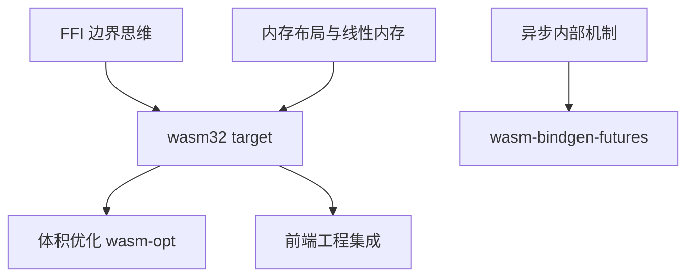

# wasm32 target：Rust 编译到 Web

> **文档简介**: 理解 wasm32-unknown-unknown 这个编译目标的本质与边界——wasm-pack/wasm-bindgen 的工具链分工、与 Web 交互的数据规则、以及 wasm 产物的体积优化路径
>
> **目标读者**: 想把 Rust 库带进浏览器/Node、或评估 WASM 方案的 Rust 学习者（高级）
>
> **前置知识**: [FFI 边界](./02-ffi-bindgen.md) 的「边界思维」；[异步内部机制](../reference/language-concepts/08-async-internals.md)（理解 wasm-bindgen-futures 时需要）

## 📚 文档元数据

| 属性 | 内容 |
|------|------|
| **模块** | `11-rust-cross-platform` |
| **象限** | 解释 |
| **难度** | ⭐⭐⭐ |
| **标签** | `#rust` `#advanced` `#wasm` `#web` |
| **更新日期** | `2026年9月` |

> wasm-bindgen/wasm-pack 是第三方工具，**不在模块技术基线表内**，本篇不落具体版本号；Rust 工具链基线见模块 README（Rust 1.98.1）。

## 🎯 学习目标

完成本篇后，你将能够：

- ✅ **掌握核心概念**: 解释 wasm32-unknown-unknown 中「unknown-unknown」意味着什么，及其能力边界
- ✅ **实践能力**: 走通 rustup target → wasm-pack build → JS 消费的完整链路
- ✅ **解决问题**: 判断哪些数据类型可以跨界、哪些必须经 wasm-bindgen 桥接；定位产物体积问题
- ✅ **进阶方向**: 把本模块的核心库复用到前端工程（对照 [02-nextjs-frontend](../../02-nextjs-frontend/README.md)）

## 📋 目录

- [核心概念](#核心概念)
- [实践指南](#实践指南)
- [代码示例](#代码示例)
- [最佳实践](#最佳实践)
- [常见问题](#常见问题)
- [相关资源](#相关资源)

---

## 🔍 核心概念

### 概念一：target 三元组与 unknown-unknown 的含义

**定义**: `wasm32-unknown-unknown` 是一个编译目标三元组：wasm32 架构、unknown 厂商、unknown 操作系统——**没有操作系统**。

**关键特性**:

- 没有 OS，就没有文件系统、网络 socket、进程线程这些系统调用；依赖它们的标准库路径直接不可用
- 可用的部分依然可观：集合、迭代器、`String`/UTF-8 处理、数学函数、`serde` 序列化——纯计算型库几乎无痛迁移
- 需要 OS 抽象（文件、时钟、随机数等 POSIX 面）时，编译目标是它的兄弟 **`wasm32-wasip1`**（WASI 系列）；面向浏览器的库通常不需要
- 与 FFI 篇对照：这里的「对面」不是 C，而是 JavaScript 宿主；边界思维同构——布局要约定、所有权要成对、panic 不能飞

### 概念二：wasm-bindgen 与 wasm-pack 的分工

**定义**: 裸 `cargo build --target wasm32-unknown-unknown` 只产出 `.wasm` 二进制；把它变成「JS 能舒服调用的模块」需要两层工具。

| 工具 | 角色 | 产出 |
|------|------|------|
| **wasm-bindgen**（库 + 过程宏） | 边界桥接层：`#[wasm_bindgen]` 标注生成 JS↔Rust 的粘合代码 | JS 胶水模块 + 更新的 `.wasm` |
| **wasm-pack**（CLI） | 一站式构建器：调 cargo + wasm-bindgen，按目标打包 | `pkg/` 目录（`.wasm` + `.js` + `.d.ts`） |

**关键特性**:

- `#[wasm_bindgen]` 宏把 Rust 的函数/结构体翻译成 JS 可见的 API，并处理字符串等复杂数据的双向搬运
- wasm-pack 的 `--target` 决定胶水代码的消费形态：`web`（浏览器原生 ESM）、`bundler`（webpack/vite 等）、`nodejs`、`no-modules`
- 类型定义（`.d.ts`）自动生成——Rust 的类型信息直接变成了前端的补全

---

## 🛠️ 实践指南

### 步骤一：搭一个最小 wasm crate

**目标**: 建一个能被 JS 消费的 Rust 库。

```toml
# Cargo.toml
[package]
name = "hello-wasm"
version = "0.1.0"
edition = "2024"

[lib]
crate-type = ["cdylib"] # 只导出动态符号，产物最小

[dependencies]
# 版本由 wasm-pack / cargo add 解析最新 stable，本篇不落具体版本号
wasm-bindgen = "*"
```

```rust
// src/lib.rs —— wasm-bindgen 桥接的最小全景
use wasm_bindgen::prelude::*;

#[wasm_bindgen]
pub fn add(a: i32, b: i32) -> i32 {
    a + b // 数字：跨边界按值拷贝，最便宜
}

#[wasm_bindgen]
pub struct Counter {
    value: i64,
}

#[wasm_bindgen]
impl Counter {
    #[wasm_bindgen(constructor)]
    pub fn new() -> Self {
        Self { value: 0 }
    }

    pub fn increment(&mut self) {
        self.value += 1;
    }

    pub fn value(&self) -> i64 {
        self.value // JS 侧表现为只读属性
    }
}

#[wasm_bindgen]
pub fn normalize(input: &str) -> String {
    input.to_lowercase() // 字符串：经线性内存拷贝 + 桥接层转换
}
```

### 步骤二：构建与消费

```bash
# 1. 添加编译目标（一次性）
rustup target add wasm32-unknown-unknown

# 2. 裸 cargo 构建：得到 .wasm，但没有 JS 胶水，手工 FFI 才能调用
cargo build --release --target wasm32-unknown-unknown

# 3. wasm-pack：构建 + 生成胶水代码 + 按目标打包（需先 cargo install wasm-pack）
wasm-pack build --target web     # 浏览器 <script type="module"> 直接用
wasm-pack build --target bundler # 走 vite/webpack 等打包器
wasm-pack build --target nodejs  # Node.js
```

```js
// index.js —— wasm-pack --target web 的消费方式
import init, { add, Counter, normalize } from './pkg/hello_wasm.js';

await init(); // web target：加载 .wasm 并初始化线性内存

console.log(add(2, 3)); // 5

const counter = new Counter();
counter.increment();
console.log(counter.value); // 1 —— 注意是属性访问，不是方法调用

console.log(normalize('Dev Quest')); // dev quest
```

**验证方法**: `pkg/` 目录出现 `hello_wasm.js`/`hello_wasm.d.ts`/`hello_wasm_bg.wasm` 三件套；`node index.js` 输出三行预期值。

### 步骤三：看清与 Web 交互的边界规则

**目标**: 知道什么数据能直接过界，什么必须经过桥接层。

| 数据形态 | 过界方式 | 成本 |
|----------|----------|------|
| 数字（`i32`/`f64` 等） | 按值拷贝，直接过 | 最低 |
| 布尔/简单枚举 | 桥接层转换为数字 | 低 |
| `String`/`&str` | 在 wasm 线性内存分配/借用 + 桥接层编解码 UTF-8 | 中，注意拷贝 |
| 自定义结构体 | `#[wasm_bindgen]` 生成 JS 包装类，Rust 对象留在堆上，JS 持句柄 | 中 |
| 大块二进制数据 | 共享线性内存切片（`Uint8Array` 视图）而非逐个拷贝 | 可控 |

**关键点解析**:

- 字符串跨界必经拷贝与编解码——高频小字符串调用会积累成瓶颈；批量处理比逐个调用划算
- Rust 引用/生命周期**不过界**：JS 拿到的永远是句柄或拷贝，这与 FFI 篇的不透明句柄是同一个思想
- DOM 无法从 Rust 直接触碰（unknown-unknown 没有 DOM）——通过 wasm-bindgen 生态的 web-sys/js-sys 调用浏览器 API，或干脆把 DOM 操作留在 JS 侧

---

## 💻 代码示例

### 示例一：体积优化的标准动作

```bash
# release 构建是一切优化的前提
wasm-pack build --release --target web

# wasm-opt（Binaryen 工具链）做最后一轮体积/速度优化
# -Oz 面向极致体积；wasm-pack release 模式会在可用时自动调用它
wasm-opt -Oz -o pkg/hello_wasm_bg.wasm pkg/hello_wasm_bg.wasm

# 体积分析：找出 .wasm 里占空间的大头
# twiggy —— 面向 wasm 的体积剖析器（工具名通用，按需安装）
twiggy top pkg/hello_wasm_bg.wasm
```

**关键点解析**:

- 体积大头通常是：未裁剪的 panic 格式化信息、意外拖入的依赖、debug 信息——先分析再动手
- `panic = "abort"`（或 wasm 生态的对应配置）与去掉 `format!`/`unwrap` 的错误信息能显著缩体积，但以牺牲诊断信息为代价——按用途权衡

### 示例二：异步函数过界（概念示意）

```rust
// 异步 Rust 过界需要 futures 桥：wasm-bindgen-futures 把 Rust Future
// 接到 JS 的 Promise/microtask 队列上（语义细节见异步内部机制篇）
//
// #[wasm_bindgen]
// pub async fn fetch_summary(url: String) -> Result<JsValue, JsValue> {
//     // 只能用 wasm 可用的 IO（fetch 绑定/web-sys），不能用 std::net
//     // 返回的 Promise 由 JS 侧 await
// }
```

**关键点解析**:

- `async fn` + `#[wasm_bindgen]` 的组合产物是 JS Promise；运行时不是 Tokio，而是浏览器事件循环——CPU 密集任务留在 Rust 侧同步算完，IO 交给宿主

---

## 🎨 最佳实践

### ✅ 推荐做法

- **核心逻辑做成纯 Rust 库，wasm 壳单独一个 crate**: 同一套逻辑还能出 CLI/cdylib 形态（本模块多端复用的关键）
- **粗粒度跨界**: 一次传一批数据/一次算一大段，摊薄桥接与拷贝成本
- **用 `.d.ts` 当契约**: 前端 TS 工程直接享受 Rust 类型推论，重构时两边的断点一致

### ❌ 避免陷阱

- **把 std::net/std::fs 相关代码编进来**: unknown-unknown 下链接期就报错；IO 永远走宿主能力（web-sys/WASI）
- **逐元素循环跨界传数组**: 千万级数据逐个 JS↔Rust 调用会慢到失去意义；走线性内存批量视图
- **无 release 直接发 `.wasm`**: debug 产物可能大一个数量级且慢数倍

---

## ❓ 常见问题

### Q1: 为什么 `.wasm` 不能像 JS 文件一样直接 `<script src>` 引入？

**A**: `.wasm` 是二进制模块格式，不是脚本。浏览器需要 JS 胶水（wasm-bindgen 产物）负责 `WebAssembly.instantiate`、线性内存与导入导出的接线——这正是 wasm-pack 替你生成的部分。

### Q2: panic 在 wasm 里会发生什么？

**A**: 会中止实例（无法像原生 Rust 那样 unwind 捕获再继续）。与 FFI 边界的纪律一致：对外暴露的 wasm API 不让 panic 飞出去，返回 `Result<JsValue, JsValue>` 或错误码。

### Q3: 该选 wasm32-unknown-unknown 还是 wasm32-wasip1？

**A**: 跑在浏览器里、和 JS 互操作 → unknown-unknown；要跑在服务端/CLI 等 wasm 运行时并需要文件、时钟等 POSIX 面能力 → wasip1 系列。两者可以共存于同一工作区的不同 target 构建。

---

## 🔗 相关资源

### 📖 延伸阅读

- **官方文档**: [Rust and WebAssembly Book](https://rustwasm.github.io/docs/book/) - 官方工作流教程
- **官方文档**: [wasm-bindgen Guide](https://rustwasm.github.io/docs/wasm-bindgen/) - 类型映射与互操作细节
- **官方文档**: [wasm-pack Book](https://rustwasm.github.io/docs/wasm-pack/) - 构建目标与 pkg 产物说明

### 🛠️ 工具资源

- **开发工具**: [Binaryen (wasm-opt)](https://github.com/WebAssembly/binaryen) - 体积与速度优化器
- **开发工具**: [twiggy](https://github.com/rustwasm/twiggy) - wasm 体积剖析
- **在线平台**: [WebAssembly — MDN](https://developer.mozilla.org/docs/WebAssembly) - 浏览器侧概念参考

---

## 🎯 练习与实践

### 练习一：核心库三形态

**任务要求**:

1. 把一个纯计算函数（如 JSON 统计、文本分析）放进 `core` crate
2. 分别构建 CLI 形态与 wasm-pack `--target web` 形态
3. 在 Node 里验证 wasm 产物与 CLI 输出一致

**评估标准**: 同一输入两形态结果一致；`pkg/` 里有完整 `.d.ts`。

### 练习二：体积瘦身实验

**挑战任务**:

- 记录默认 debug 构建的 `.wasm` 体积作为基线
- 依次应用：release 构建 → 清理依赖 → `wasm-opt -Oz`，每步记录体积
- 用 twiggy 找出剩余体积的最大贡献者并写一句判断

**提示**: 体积优化的方法论与 [Criterion 基准](../testing/02-criterion-benchmarks.md) 的性能优化同源——先测量，再动手，最后复测。

---

## 📊 知识图谱



---

## 🔄 文档交叉引用

### 相关文档

- 📄 **[FFI 与 bindgen](./02-ffi-bindgen.md)** - 边界纪律的原始形态：所有权、布局、panic
- 📄 **[内存布局与性能](./01-memory-layout-performance.md)** - 线性内存中的数据表示
- 📄 **[异步内部机制](../reference/language-concepts/08-async-internals.md)** - Future 模型与 JS 事件循环的对接
- 📄 **[02-nextjs-frontend 模块](../../02-nextjs-frontend/README.md)** - wasm 产物在前端工程中的集成位

---

## 📝 总结

### 核心要点回顾

1. **unknown-unknown = 无 OS**: 纯计算库直接迁移；IO 一律走宿主（web-sys/WASI）
2. **两层工具**: wasm-bindgen 管桥接语义，wasm-pack 管构建打包；`.d.ts` 是免费的类型契约
3. **体积优化三步**: release 构建 → 依赖清理 → wasm-opt，全程用 twiggy 类工具测量

### 学习成果检查

- [ ] 能说出 wasm-bindgen 与 wasm-pack 的职责边界
- [ ] 能按数据形态表判断一个 API 的跨界成本
- [ ] 能完成一次从基线到优化后 `.wasm` 体积的完整记录

---

**文档版本**: v1.0.0
**最后更新**: 2026年9月
**维护团队**: Dev Quest Team
