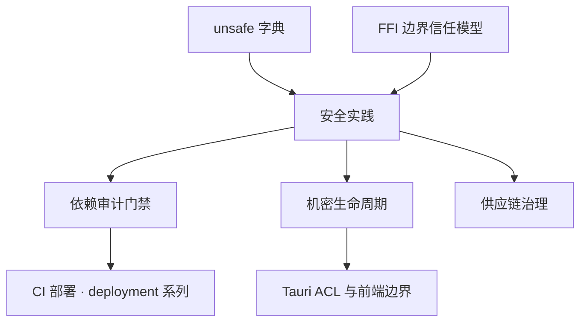

# 安全实践：从依赖审计到 unsafe 边界

> **文档简介**: 把 Rust 的内存安全红利兑现成工程安全实践——依赖审计与供应链治理、unsafe 边界最小化、机密的内存生命周期管理，文末附本篇的模式不变量小结
>
> **目标读者**: 对发布质量负责的 Rust 工程师（高级）
>
> **前置知识**: [unsafe 字典](../reference/language-concepts/06-unsafe.md)；[FFI 边界](./02-ffi-bindgen.md) 的信任模型；[测试工程](../testing/01-unit-integration-tests.md)

<details>
<summary>文档信息（用途、难度与维护记录）</summary>

## 📚 文档元数据

| 属性 | 内容 |
|------|------|
| **模块** | `11-rust-cross-platform` |
| **象限** | 解释 |
| **难度** | ⭐⭐⭐ |
| **标签** | `#rust` `#advanced` `#security` `#supply-chain` |
| **更新日期** | `2026年9月` |

</details>

> cargo-audit/cargo-deny 是第三方工具，**不在模块技术基线表内**，本篇不落具体版本号；工具链基线见模块 README（Rust 1.98.1）。

## 🎯 学习目标

完成本篇后，你将能够：

- ✅ **掌握核心概念**: 区分 Rust 类型系统「已消灭」与「仍然存在」的两类风险
- ✅ **实践能力**: 搭建 cargo audit/cargo deny 的审计门禁，应用 unsafe 最小化与机密清零模式
- ✅ **解决问题**: 评估一个依赖该不该进 Cargo.lock；设计机密数据「如何离开内存」
- ✅ **进阶方向**: 把安全门禁接入 CI（deployment 系列）；理解 [Tauri E2E](../testing/03-tauri-e2e-webdriver.md) 中的 ACL 面向

## 📋 目录

- [核心概念](#-核心概念)
- [实践指南](#️-实践指南)
- [代码示例](#-代码示例)
- [最佳实践](#-最佳实践)
- [常见问题](#-常见问题)
- [相关资源](#-相关资源)
- [模式不变量](#模式不变量)

---

## 🔍 核心概念

### 概念一：类型系统解决了什么，没解决什么

**定义**: Rust 在编译期消灭了**内存损坏**与**数据竞争**两大类漏洞（use-after-free、越界、迭代器失效、无锁数据竞争等）——这是语言的承诺。剩下的风险面需要工程流程兜底。

**Rust 没有替你解决的**:

- **依赖风险**: 第三方 crate 带着已披露漏洞（CVE）、语义化版本陷阱、维护者消失一起进仓库
- **unsafe 逻辑错误**: unsafe 块内的不变量违反编译器照单全收——类型系统的豁免区
- **机密生命周期**: 内存安全 ≠ 机密安全；`String` 会被拷贝、被 swap 进分区文件、被日志意外打印
- **供应链**: 构建机被污染、依赖被替换、构建不可复现

### 概念二：安全通告库与策略即代码

**定义**: RustSec Advisory Database 是 Rust 生态的安全通告库；`cargo audit` 把它与你的 `Cargo.lock` 比对。`cargo deny` 在此之上做**策略检查**——而策略本身写成版本化的配置文件（`deny.toml`），即「策略即代码」。

**关键特性**:

- audit 回答「有没有已知漏洞」；deny 回答「合不符合我们声明的规矩」
- deny 的四类检查：`advisories`（漏洞通告）、`bans`（禁用/重复依赖）、`licenses`（许可证白名单）、`sources`（来源白名单）
- 配置进 git、结论进 CI：人的记忆不参与日常门禁

---

## 🛠️ 实践指南

### 步骤一：建立依赖审计门禁

```bash
# 安装审计工具（版本随安装解析，本篇不写死）
cargo install cargo-audit --locked
cargo install cargo-deny --locked

# 对当前 Cargo.lock 与 RustSec 安全通告库比对
cargo audit

# 自动尝试升级到无漏洞版本（会动 Cargo.lock，谨慎并在之后跑全量测试）
cargo audit fix

# 四合一策略检查：advisories / bans / licenses / sources
cargo deny check

# 依赖树审计：找出同一 crate 的多版本共存
cargo tree --duplicates
```

```toml
# deny.toml —— cargo deny 策略配置（最小可用集）
[advisories]
yanked = "deny" # 拉黑已被 yank 的版本

[licenses]
allow = ["MIT", "Apache-2.0", "BSD-3-Clause", "Unicode-3.0"]

[bans]
multiple-versions = "warn" # 同一 crate 多版本共存时告警

[sources]
unknown-registry = "deny" # 禁止非 crates.io 来源的注册表
unknown-git = "warn"
allow-registry = ["https://github.com/rust-lang/crates.io-index"]
```

**验证方法**: `cargo deny check` 全绿后，故意引入一个许可证不符的依赖，确认门禁会红——门禁没红过的门禁等于没有。

### 步骤二：unsafe 边界最小化

**目标**: 让 unsafe 的存在面积可审计、可问责。原则与细则见 [unsafe 字典](../reference/language-concepts/06-unsafe.md)，本节讲工程面。

```rust
// 安全封装：把裸指针访问收窄到唯一切片，调用方看不到裸指针语义。
//
/// # Safety
///
/// 调用方必须保证 `ptr` 指向至少 `len` 个已初始化的 `u8`，
/// 且返回的切片存活期间该内存保持有效。
unsafe fn slice_from_raw<'a>(ptr: *const u8, len: usize) -> &'a [u8] {
    // SAFETY: 契约由调用方保证（见上方 # Safety 节）
    unsafe { std::slice::from_raw_parts(ptr, len) }
}

fn main() {
    let data = [10u8, 20, 30];
    // SAFETY: data 存活至 main 结束，长度匹配
    let s = unsafe { slice_from_raw(data.as_ptr(), data.len()) };
    assert_eq!(s, &[10, 20, 30]);
    println!("安全封装边界通过: {s:?}");
}
```

**关键点解析**:

- **crate 根部 `#![forbid(unsafe_code)]`** 是默认姿态：整个 crate 禁写 unsafe，需要底层的模块显式 `#[allow(unsafe_code)]`（对该模块单独豁免并写明理由）——豁免点即审计点
- `unsafe fn` 的 `# Safety` 文档节写**调用方义务**，unsafe 块旁的 `// SAFETY:` 注释写**本次为何成立**——两层缺一不可，都是代码评审的硬检查项
- FFI 边界是天然的 unsafe 集中区（见 [FFI 篇](./02-ffi-bindgen.md)）：把它们集中到独立的边界 crate，其余 crate 保持 forbid

### 步骤三：机密的内存生命周期

**目标**: 从「机密进入内存」那一刻就规划「它如何离开」。

```rust
/// 机密载体：Drop 时原地清零（zeroize 思想的最小示意实现）。
struct Secret {
    bytes: Vec<u8>,
}

impl Secret {
    fn new(s: &str) -> Self {
        Self {
            bytes: s.as_bytes().to_vec(),
        }
    }

    fn reveal(&self) -> &[u8] {
        &self.bytes
    }
}

impl Drop for Secret {
    fn drop(&mut self) {
        // 生产中请用 zeroize 类 crate：以防编译器把这段清零优化掉
        for b in self.bytes.iter_mut() {
            *b = 0;
        }
    }
}

fn main() {
    let secret = Secret::new("hunter2");
    assert_eq!(secret.reveal(), b"hunter2");
    drop(secret); // Drop 钩子执行清零
    println!("机密载体构造与清零路径通过");
}
```

**关键点解析**:

- 这个示意实现有两个生产级缺陷，恰是 zeroize 类 crate 存在的理由：① 简单清零循环可能被编译器判定为死代码删除，crate 内部用易失写等手段阻止优化；② `Vec` 扩容时旧缓冲区里的机密副本不受 Drop 管——crate 对分配策略有更细的处理
- 比清零更优先的三件事：**机密不进日志**（`Debug`/`Display` 派生要审）、**不进错误信息**、**不用普通 `String` 长存**（不可清零的拷贝会散布各处）

### 步骤四：供应链治理

**目标**: 让「这个依赖为什么在、是不是它、能不能信」三个问题随时有据可查。

**实践清单**:

1. **`Cargo.lock` 提交**（应用工程必做）：构建可复现的锚点；库 crate 则提交 + 容忍语义化更新
2. **精准升级**: `cargo update -p <crate>` 逐个升，不做全量 `cargo update` 后再排查
3. **`--locked` 进 CI**: 构建失败即说明有人改了锁文件没走评审
4. **依赖树瘦身**: `cargo tree` 定期审读；能自己写 50 行的不要引一个 crate
5. **来源与信任**: deny 的 `sources` 白名单管住「从哪来」；cargo-vet/cargo-crev 这类「人审背书」机制为关键依赖补上「谁看过」——按工程规模渐进采用
6. **报告对接**: audit/deny 的输出可转换为标准报告格式（如 SARIF）供安全平台聚合——格式对接属于易变层细节，以工具当时文档为准

---

## 💻 代码示例

上节三个代码块即核心模式。这里给一个**把机密挡在前端之外**的 Tauri 场景判断清单（本模块旗舰方向）:

### 示例一：Tauri 应用的机密面检查

```text
前端 bundle 中的机密  → 一票否决：JS 产物对用户与打包器全透明
机密的使用位置        → Rust 侧（src-tauri）内持有，前端只拿能力句柄
长期凭证的存放        → OS 钥匙串 / 加密存储（如 stronghold 类插件），非明文配置文件
IPC 权限面            → Tauri ACL capability 按需最小授权（capabilities/*.json）
机密进日志/错误信息    → 禁止；错误上抛前脱敏
```

**关键点解析**: 这份清单的每一行都是「不变量」——不依赖 Tauri 具体版本的架构原则，版本升级时只需重核 API 层。

---

## 🎨 最佳实践

依赖扫描发现已知漏洞，测试验证已声明行为，unsafe 审查核对编译器无法证明的条件；三者不能互相替代。unsafe 风险也可能来自未修改关键字的调用方和数据结构变化，评审必须沿不变量追踪上下文。

Rust 的内存安全保障不解决资源授权和秘密泄漏。用隔离实验检查路径越界、跨用户访问等业务边界，记录依赖告警的影响判断与修复证据。升级依赖后执行相关回归，不能以扫描不再报警作为唯一成功条件。

---

## ❓ 常见问题

### Q1: audit 报了一个没有补丁版本的漏洞，怎么办？

**A**: 三步走：读通告的受影响条件（很多 CVE 只在特定特性组合下触发）→ 不受影响则记录豁免理由（deny 的 ignore 配置支持带注释与过期时间）→ 受影响则评估替换依赖或临时下线功能。安全决策要留下书面痕迹。

### Q2: 我们的 unsafe 已经归零，还有必要做依赖审计吗？

**A**: 必要。你的 100% 安全 Rust 代码，链接的是依赖里的 unsafe 与逻辑。RustSec 通告的对象大多是普通 crate 的普通缺陷（如反序列化越界），与你自己写不写 unsafe 无关。

### Q3: 机密清零做了，为什么还是要谨慎用 String 存机密？

**A**: String 不可控的拷贝点太多：格式化、日志、错误包装、克隆……每一份拷贝都是一份需要清零的义务，而它们都逃出了你的 Drop 钩子。机密载体的纪律是「受控类型 + 最小暴露面」，清零只是最后一道工序。

---

## 🔗 相关资源

### 📖 延伸阅读

- **官方文档**: [RustSec Advisory Database](https://github.com/RustSec/advisory-db) - 生态安全通告的权威来源
- **官方文档**: [cargo-deny Book](https://embarkstudios.github.io/cargo-deny/) - 四类检查的配置全集
- **官方文档**: [The Rustonomicon](https://doc.rust-lang.org/nomicon/) - unsafe 契约的规范叙述

### 🛠️ 工具资源

- **开发工具**: [cargo-audit](https://github.com/rustsec/rustsec/tree/main/cargo-audit) - 漏洞比对与 fix 建议
- **开发工具**: [cargo-deny](https://github.com/EmbarkStudios/cargo-deny) - 策略即代码的四合一门禁
- **开发工具**: [cargo-vet](https://github.com/mozilla/cargo-vet) - 依赖人审背书机制

---

## 🎯 练习与实践

### 练习一：给现有工程装门禁

**任务要求**:

1. 任选一个含依赖的工程，接入 `deny.toml` 并跑通 `cargo deny check`
2. 把 `allow` 许可证列表删到只剩 MIT，观察报告如何指认违规项
3. 恢复配置，把整个过程记成一条可复现的命令序列

**评估标准**: 门禁的「红 → 绿」各出现一次，且红灯信息能定位到具体 crate。

### 练习二：设计一个机密类型

**挑战任务**:

- 为 API token 设计 `Token` 类型：禁止 `Debug` 直出明文、暴露 `as_str` 之外的最小接口、Drop 清零
- 写测试断言：`format!("{:?}")` 不含明文、drop 后（用自定义分配器或调试手段）内存不再含明文

**提示**: 第一个断言用「手动实现 Debug 打印掩码」即可验证；第二个断言是 zeroize 类 crate 的测试思路——先测量，再引入。

---

## 📊 知识图谱



---

## 🔄 文档交叉引用

### 相关文档

- 📄 **[unsafe 字典](../reference/language-concepts/06-unsafe.md)** - 本篇所有 unsafe 契约的语义出处
- 📄 **[FFI 与 bindgen](./02-ffi-bindgen.md)** - unsafe 最集中的区域与边界纪律
- 📄 **[单元与集成测试](../testing/01-unit-integration-tests.md)** - 安全修复的回归验证手段
- 📄 **[Tauri E2E 测试](../testing/03-tauri-e2e-webdriver.md)** - ACL capability 的行为验证
- 📄 **[文档规范 · 模式不变量](../../shared-resources/standards/documentation-guidelines.md)** - 本篇文末小结的规范出处

---

## 📝 总结

### 核心要点回顾

1. **风险面重新划界**: 类型系统管内存与并发，工程流程管依赖、unsafe、机密、供应链
2. **策略即代码**: `deny.toml` 版本化 + CI 门禁化，安全决策留下可评审的痕迹
3. **机密的生命周期设计**: 从进内存就规划出内存——受控载体、最小暴露、Drop 清零点是三位一体的生命周期设计，而非事后补丁

### 学习成果检查

- [ ] 能说出 RustSec 通告与 cargo deny 四类检查各自回答的问题
- [ ] 能为一段 unsafe 代码写出合格的 `# Safety` 与 `// SAFETY:` 两层文档
- [ ] 能列举机密数据的五个「不得」并解释原因

---

## 模式不变量

> 与正文中的版本绑定工具用法形成对照——以下原则独立于具体框架与版本，版本升级时只需重核工具层。

1. **能在编译期排除的风险，绝不留给运行时检查**——类型系统覆盖内存与并发的部分要全用满，运行时防线只对付剩余面。
2. **unsafe 的信任不扩散**——unsafe 必须封装在安全 API 之后，任何调用方都不需要理解裸指针语义就能正确使用你的接口。
3. **机密自进入内存起就要规划离开内存的方式**——受控载体、最小暴露面、Drop 清零点是三位一体的生命周期设计，而非事后补丁。
4. **依赖即代码**——供应链风险在引入时审计（锁文件 + 通告库 + 来源白名单），而不是在事故后补课。
5. **门禁的价值在于它失败过**——没红过的安全检查等于摆设；每次门禁拦截都应可追溯（配置、理由、豁免期三位一体）。

---

**文档版本**: v1.0.0
**最后更新**: 2026年9月
**维护团队**: Dev Quest Team


<!-- learning-navigation -->
## 阅读导航

[本模块理解地图](../LEARNING_GUIDE.md) · [完整目录与版本](../README.md) · [通用术语](../../shared-resources/glossary.md)
