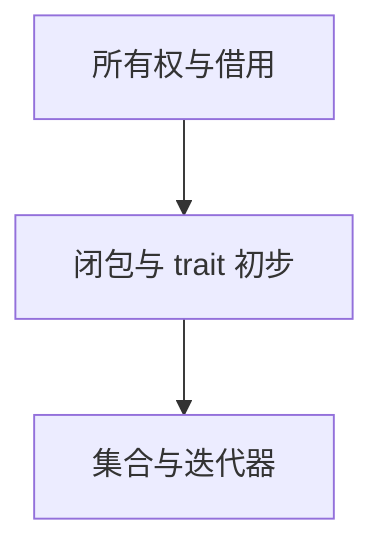
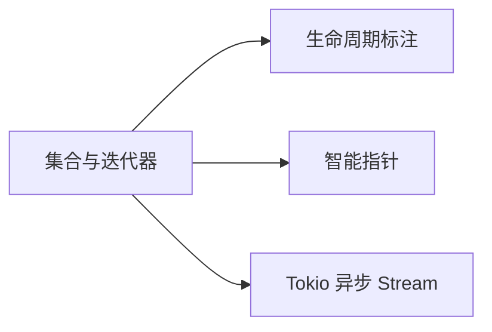

# 集合与迭代器：零抽象成本的数据流水线

## 先理解，再动手

迭代器适配器描述处理步骤，消费操作才真正取值。iter 借用元素，into_iter 的所有权行为取决于接收者。

**本节自测**：对 Vec 用 iter 过滤求和后继续打印原集合，再比较消费 Vec 的 into_iter。

<details>
<summary>预期结果与参考思路（先尝试再展开）</summary>

借用迭代后集合仍可用；按值消费后不能继续用原 Vec，除非先复制或重建。

</details>

> **文档简介**: 讲透 Rust 标准库三大集合（Vec / HashMap / String）与迭代器体系——适配器链、消费器、惰性求值，理解为什么 Rust 敢承诺"抽象不掏性能"
>
> **目标读者**: 已掌握所有权与借用（basics 02）、了解 trait 与泛型（basics 04）的 Rust 初学者
>
> **前置知识**: 所有权与借用、闭包基础、trait 初步

<details>
<summary>文档信息（用途、难度与维护记录）</summary>

## 📚 文档元数据

| 属性 | 内容 |
|------|------|
| **模块** | `11-rust-cross-platform` |
| **象限** | 教程（按序入门） |
| **难度** | ⭐⭐ |
| **标签** | `#rust` `#collections` `#iterators` `#lazy-evaluation` |
| **更新日期** | 2026年9月 |

</details>

## 🎯 学习目标

完成本文档后，你将能够：

- ✅ **掌握核心概念**: 理解 Vec / HashMap 的增删改查语义，以及"迭代器 = 适配器 + 消费器"的两段式模型
- ✅ **实践能力**: 用适配器链（filter / map / collect）替换手写 for 循环，完成数据处理流水线
- ✅ **解决问题**: 分清 `iter()` / `into_iter()` / `iter_mut()` 三种遍历方式的所有权差异，避免"借完就废"的坑
- ✅ **进阶方向**: 为学习 trait 对象（Iterator 是 trait）、async Stream（异步迭代器）打下基础

## 📋 目录

- [核心概念](#-核心概念)
- [实践指南](#️-实践指南)
- [代码示例](#-代码示例)
- [最佳实践](#-最佳实践)
- [常见问题](#-常见问题)
- [相关资源](#-相关资源)
- [练习与实践](#-练习与实践)

---

## 🔍 核心概念

### 概念一：集合类型按"内存布局"选型

**定义**: 标准库集合按数据在内存中的组织方式分为连续型（Vec）、哈希型（HashMap）、树型（BTreeMap）等，选型本质是选择访问模式的代价。

**关键特性**:
- **`Vec<T>`**：连续内存、O(1) 下标访问、尾部增删 O(1)——99% 场景的默认选择
- **`HashMap<K, V>`**：按键哈希定位，平均 O(1) 查找，但**遍历顺序不确定**
- **`BTreeMap<K, V>`**：有序树，O(log n) 查找，遍历按键排序（需要确定顺序时用它）
- **`String`**：本质是 `Vec<u8>` 的保证 UTF-8 包装，不支持 `s[i]` 下标取字符（字节偏移 ≠ 字符序号）

**使用场景**:
- 收集结果、遍历处理 → Vec
- 按键查值、去重计数 → HashMap
- 需要按序遍历键 → BTreeMap

### 概念二：迭代器是"惰性的两段式流水线"

**定义**: 任何实现 `Iterator` trait 的类型都产出元素序列；适配器（adapter）返回新的迭代器、什么都不计算，消费器（consumer）才真正驱动计算并产出最终值。

**关键特性**:
- **适配器**：`map` / `filter` / `take` / `enumerate` / `zip` / `skip` 等，返回迭代器本身，可链式叠加
- **消费器**：`collect` / `sum` / `count` / `max` / `any` / `fold` / `for` 循环等，触发实际计算
- **惰性求值**：只构造适配器链而不调用消费器，不会执行任何一行处理逻辑；配合无限序列（`1..`）可写"按需取量"的代码
- **零抽象成本**：适配器链在编译期被内联展开，性能与手写循环相当，代价是编译期类型推导更复杂

**使用场景**:
- 场景1：过滤-变换-收集一条龙（filter → map → collect）
- 场景2：从无限/大数据源按需取前 N 条（take）
- 场景3：聚合统计（sum / count / max / fold）

### 概念三：三种遍历方式的所有权语义

**定义**: `iter()` 借用、`iter_mut()` 可变借用、`into_iter()` 消费——三种方法对应三种所有权转移策略。

**关键特性**:
- `for x in &v` ≡ `v.iter()`：拿到 `&T`，集合保留
- `for x in &mut v` ≡ `v.iter_mut()`：拿到 `&mut T`，可原地修改
- `for x in v` ≡ `v.into_iter()`：拿到 `T`，集合被消费，之后不可再用

所有权细节回顾见 [02-所有权与借用](./02-ownership-borrowing.md)。

---

## 🛠️ 实践指南

### 步骤一：用 Vec 完成增删改查

**目标**: 建立对 Vec API 与所有权行为的肌肉记忆。

**操作指南**:
1. 用 `vec![]` 宏初始化，`push` / `pop` / `remove` / `insert` 增删
2. 下标 `v[0]` 越界会 panic，安全读取用 `v.get(i)` 拿 `Option`
3. 遍历时优先 `&v`，确认不再需要集合本身时才 `v` 直接消费

**验证方法**: `cargo run` 观察输出；故意越界触发 panic 观察报错信息。

### 步骤二：用 HashMap 处理"键值问题"

**目标**: 掌握 `entry` 惯用法，这是 HashMap 最有 Rust 特色的 API。

**操作指南**:
1. `get` 返回 `Option`，用 `match` 或 `if let` 处理
2. "不存在才插入、存在则修改"一律用 `entry(k).or_insert(v)`
3. 注意：`HashMap` 键必须实现 `Eq + Hash`；自定义类型加 `#[derive(PartialEq, Eq, Hash)]`

**验证方法**: 运行下方代码示例二，确认词频统计输出。

### 步骤三：把手写循环重写为适配器链

**目标**: 体验"声明式流水线"的写法。

**操作指南**:
1. 找一段"循环 + if 判断 + 逐个 push"的代码
2. 拆成三段：数据源 → 适配器（filter/map）→ 消费器（collect/sum）
3. 编译器若报"类型标注不足"，在 `let` 右侧补目标类型或用 turbofish `::<>`

**验证方法**: 两种写法输出一致，且适配器链版本无临时 `Vec` 中间变量。

---

## 💻 代码示例

### 示例一：Vec 的增删改查与所有权

```rust
// 块1：Vec 增删改查
fn main() {
    // 创建：vec! 宏初始化
    let mut v: Vec<i32> = vec![1, 2, 3];
    // 增
    v.push(4);
    // 删：移除下标 0，返回被移除的元素
    let removed = v.remove(0);
    // 改：下标越界会 panic，需要安全访问时用 get
    v[0] = 10;
    // 查：get 返回 Option<&i32>，越界安全
    let third = v.get(2);
    println!("removed = {removed}, v = {v:?}, third = {:?}", third);

    // 遍历：for x in &v 只借用，v 之后还能用
    for x in &v {
        print!("{x} ");
    }
    println!();
    // for x in v 会消费（move）v，此后 v 不可再用
    let consumed: Vec<String> = v.iter().map(|x| x.to_string()).collect();
    println!("{consumed:?}");
}
```

**关键点解析**:
- `remove(0)` 返回被移除的元素（所有权交还给你），`get` 返回借用（`Option<&i32>`）
- `v[0] = 10` 与 `v.get(0)` 的区别是"panic vs Option"——库代码里永远倾向后者
- `consumed` 收集时是 `map` 产出新 `String`，原 `v` 未被消费

### 示例二：HashMap 与 entry 惯用法

```rust
// 块2：HashMap 基础与 entry 惯用法
use std::collections::HashMap;

fn main() {
    let mut scores: HashMap<String, i32> = HashMap::new();
    scores.insert(String::from("Alice"), 92);
    scores.insert(String::from("Bob"), 85);

    // 查询：返回 Option，强制调用方处理"键不存在"
    match scores.get("Alice") {
        Some(s) => println!("Alice: {s}"),
        None => println!("查无此人"),
    }

    // entry：不存在才插入，存在则原值保留
    scores.entry(String::from("Carol")).or_insert(0);
    *scores.entry(String::from("Bob")).or_insert(0) += 5;
    println!("{scores:?}");

    // 词频统计：entry 的经典场景
    let text = "rust is fast rust is safe";
    let mut freq: HashMap<&str, i32> = HashMap::new();
    for word in text.split_whitespace() {
        *freq.entry(word).or_insert(0) += 1;
    }
    println!("{freq:?}");
}
```

**关键点解析**:
- `entry` 一次哈希定位完成"查 + 插 + 改"，比先 `contains_key` 再操作少一次查找
- `or_insert` 返回 `&mut V`，`*` 解引用后可直接累加
- 词频里的键是 `&str`（借用 text），数据不必复制进 HashMap

### 示例三：适配器链替换手写循环

```rust
// 块3：适配器链
fn main() {
    let nums = vec![1, 2, 3, 4, 5, 6];

    // 适配器链：filter -> map -> sum
    // sum 是消费器，驱动整条链执行并产出结果
    let total: i32 = nums
        .iter()
        .filter(|&&x| x % 2 == 0) // 只留偶数
        .map(|x| x * 10)          // 每个乘 10
        .sum();
    println!("{total}"); // 20 + 40 + 60 = 120

    // collect：把迭代器收回到集合
    let names = vec!["  alice ", " bob", "carol "];
    let cleaned: Vec<String> = names
        .iter()
        .map(|s| s.trim().to_uppercase())
        .collect();
    println!("{cleaned:?}");

    // collect 也能产出 HashMap / String 等任何实现了 FromIterator 的类型
    let by_len: std::collections::HashMap<&str, usize> =
        names.iter().map(|s| (s.trim(), s.trim().len())).collect();
    println!("{by_len:?}");
}
```

**关键点解析**:
- `collect` 的目标类型靠 `let` 标注或 turbofish 指定，否则编译器无法推断
- `filter` 闭包参数是 `&&T`（迭代器产出 `&T`，filter 再借一层），模式 `&&x` 直接解到值

### 示例四：惰性求值与消费器速览

```rust
// 块4：惰性求值与消费器
fn main() {
    // 惰性求值：不写消费器，适配器什么也不做
    let _no_op = [1, 2, 3].iter().map(|x| x * 2); // 仅构造，零计算

    // 无限序列 + take：消费器要多少，才算多少
    let squares: Vec<i64> = (1..).map(|x| x * x).take(5).collect();
    println!("{squares:?}"); // [1, 4, 9, 16, 25]

    // enumerate：携带下标
    let names = ["a", "b", "c"];
    for (i, n) in names.iter().enumerate() {
        println!("{i}: {n}");
    }

    // 常用消费器速览
    let v = vec![3, 1, 4, 1, 5];
    let max = v.iter().max();
    let count_even = v.iter().filter(|&&x| x % 2 == 0).count();
    let any_negative = v.iter().any(|&x| x < 0);
    let joined: String = v
        .iter()
        .map(|x| x.to_string())
        .collect::<Vec<_>>()
        .join("-");
    println!("{max:?} {count_even} {any_negative} {joined}");
}
```

**关键点解析**:
- `(1..)` 是上界不设限的 RangeFrom，只有 `take(5)` 这样的消费器能终止它
- 惰性意味着"适配器链 = 计划，消费器 = 执行"，这与函数式语言（Haskell/Scala）的流一致
- `any` / `all` 是短路消费器：找到答案立即停止

### 示例五：适配器 + 单元测试

```rust
// 块5：迭代器 + 单元测试
fn normalize(text: &str) -> Vec<String> {
    text.split_whitespace()
        .map(|w| w.trim_matches(|c: char| !c.is_alphanumeric()).to_lowercase())
        .filter(|w| !w.is_empty())
        .collect()
}

#[cfg(test)]
mod tests {
    use super::*;

    #[test]
    fn 提取并小写化() {
        assert_eq!(normalize("Rust, is FAST!"), vec!["rust", "is", "fast"]);
    }

    #[test]
    fn 纯标点被过滤() {
        assert!(normalize("... !!!").is_empty());
    }
}
```

测试工程化的完整介绍见 [10-Cargo 工程化与单元测试](./10-cargo-testing.md)。

---

## 🎨 最佳实践

根据是否保留集合选择借用遍历或消费遍历，两者成本取决于元素与后续使用，并非 iter 永远更便宜。迭代器适配器通常按需执行，只有实际消费才处理元素；也可以返回迭代器让调用方稍后消费。

HashMap 的 entry 适合“存在就修改、不存在就插入”，单纯查存在仍可用 contains_key。字符串按字节和 Unicode 标量值遍历含义不同，不能用整数下标当字符定位。需要稳定输出时显式排序或选有序结构，不依赖哈希遍历顺序。

---

## ❓ 常见问题

### Q1: `iter()`、`into_iter()`、`iter_mut()` 到底选哪个？
**A**: 看"之后还要不要用这个集合"。还要用 → `iter()`；要原地改 → `iter_mut()`；集合就是为这次遍历而生的 → `into_iter()`（顺便转移元素所有权，如把 `Vec<String>` 拆成一个个 `String`）。借用与移动的完整规则见 [02-所有权与借用](./02-ownership-borrowing.md)。

### Q2: 为什么 `filter` 的闭包参数是 `&&T`？
**A**: `v.iter()` 产出 `&T`，`filter` 的谓词接收的是"对元素的引用"再借一层，所以是 `&&T`。用模式 `|&&x|` 一次解两层即可；记不住时先写 `|x|` 让编译器报错提示类型，再补解引用层数。

### Q3: `collect` 总报类型推断失败怎么办？
**A**: 两种补救：① 在 `let` 左侧写明类型 `let v: Vec<String> = ...collect();`；② turbofish 就地指定 `collect::<Vec<String>>()`。本质是 `collect` 太通用（任何 `FromIterator` 类型都是候选），必须给编译器一个目标。

---

## 🔗 相关资源

### 📖 延伸阅读
- **官方文档**: [std::vec::Vec](https://doc.rust-lang.org/std/vec/struct.Vec.html) - Vec 全量 API
- **官方文档**: [std::iter](https://doc.rust-lang.org/std/iter/) - 迭代器 trait 与全部适配器/消费器
- **书籍**: 《The Rust Programming Language》ch.8 / ch.13 - 集合与迭代器闭包的官方教程

### 🛠️ 工具资源
- **开发工具**: [Rust Playground](https://play.rust-lang.org/) - 快速验证适配器链行为
- **在线平台**: [Rust By Example](https://doc.rust-lang.org/rust-by-example/std.html) - 标准库逐例演示

---

## 🎯 练习与实践

### 练习一：词频统计升级
**目标**: 综合 HashMap + 迭代器。

**任务要求**:
1. 输入一段英文文本，输出按出现次数降序的前 5 个单词
2. 只用迭代器适配器链（`entry` 统计 + `sort_by` / `sort_unstable_by` + `take`）
3. 为核心函数写至少 2 个单元测试

**评估标准**: 不出现手写下标循环；测试覆盖"并列次数"与"空输入"。

### 练习二：惰性流水线
**目标**: 体会按需计算。

**挑战任务**:
- 用 `(1..)` 生成前 10 个质数（`filter` + `is_prime` 闭包 + `take`）
- 挑战：把同一适配器链分别 `take(10)` 与 `take(1000)`，确认无需改写中间逻辑

**提示**: 质数判断用 `2..=(n 的平方根)` 的 `all` 消费器。

---

## 📊 知识图谱

### 前置知识


### 后续学习


---

## 🔄 文档交叉引用

### 相关文档
- 📄 **[所有权与借用](./02-ownership-borrowing.md)**: 三种遍历方式的所有权根源
- 📄 **[结构体、枚举与模式匹配](./03-structs-enums-patterns.md)**: `match` 处理 `get` 返回的 `Option`
- 📄 **[trait 与泛型](./04-traits-generics.md)**: Iterator 本身就是一个 trait
- 📄 **[Cargo 工程化与单元测试](./10-cargo-testing.md)**: 本篇测试代码的组织方式

### 参考章节
- 📖 **[所有权字典](../reference/language-concepts/01-ownership-dictionary.md)**: 借用细则的单一事实来源
- 📖 **[模块 README](../README.md)**: 技术基线与模块路径图

---

## 📝 总结

### 核心要点回顾
1. **集合选型看访问模式**: Vec 是默认，按键查值上 HashMap，要有序用 BTreeMap
2. **迭代器两段式**: 适配器搭流水线（惰性、零成本），消费器触发执行
3. **entry 是 HashMap 惯用法**: 一次哈希完成"查缺补漏改"

### 学习成果检查
- [ ] 能说清 `iter` / `into_iter` / `iter_mut` 的所有权差异？
- [ ] 能把一段手写循环重写为适配器链？
- [ ] 能用 `entry` 完成词频统计？
- [ ] 能解释"惰性求值"并写出无限序列取前 N 项？

---

## 🤝 贡献与反馈

发现本文档有改进空间？欢迎在 Issues 报告问题、提出改进建议，或直接提交 PR 完善内容。

---

**文档版本**: v1.0.0
**最后更新**: 2026年9月
**维护团队**: Dev Quest Team

---

> 💡 **学习建议**: 每个示例亲手敲一遍并 `cargo run`，迭代器的类型推导错误是最好的老师。
>
> 🎯 **下一步**: 返回值里的引用如何保证不悬垂？继续学习 [07-生命周期标注](./07-lifetimes.md)。


<!-- learning-navigation -->
## 阅读导航

[本模块理解地图](../LEARNING_GUIDE.md) · [完整目录与版本](../README.md) · [通用术语](../../shared-resources/glossary.md)
