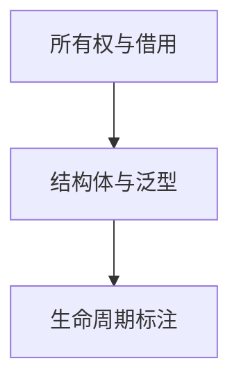
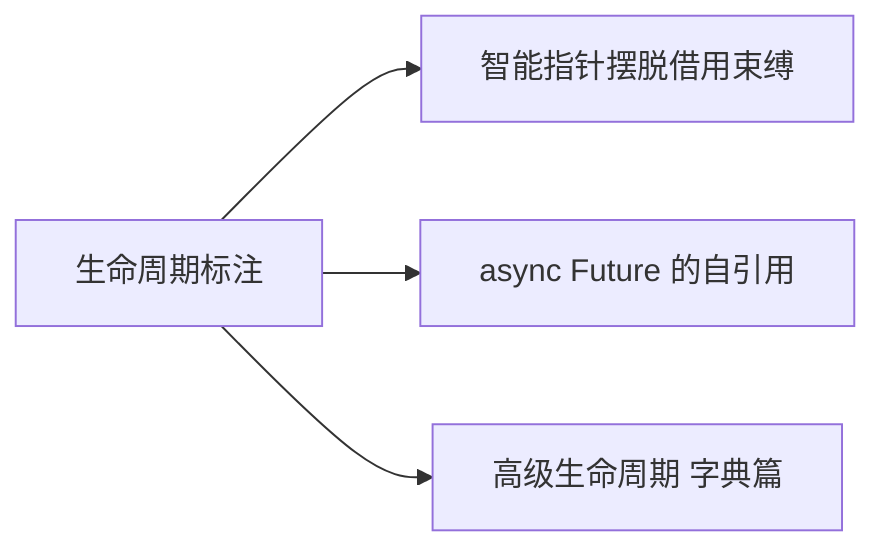

# 生命周期标注：让引用的合法性成为编译期契约

## 先理解，再动手

生命周期标注描述引用之间的约束，不创造存储空间。返回引用必须能追到在调用方使用期间仍有效的数据。

**本节自测**：尝试返回函数内部 String 的 &str，再改为返回 String。

<details>
<summary>预期结果与参考思路（先尝试再展开）</summary>

前者数据离开函数即被释放，添加任意生命周期名字也不能修好；返回拥有的值让调用者接管数据。

</details>

> **文档简介**: 讲清 Rust 生命周期的本质——它不改变任何引用的实际存活时间，只描述引用之间的存活关系；掌握三条省略规则、显式标注 `'a`、结构体生命周期与 `'static`
>
> **目标读者**: 已理解所有权与借用的 Rust 初学者，正被生命周期报错困扰的开发者
>
> **前置知识**: 所有权与借用（basics 02）、结构体与方法（basics 03）、泛型初步（basics 04）

<details>
<summary>文档信息（用途、难度与维护记录）</summary>

## 📚 文档元数据

| 属性 | 内容 |
|------|------|
| **模块** | `11-rust-cross-platform` |
| **象限** | 教程（按序入门） |
| **难度** | ⭐⭐ |
| **标签** | `#rust` `#lifetimes` `#borrow-checker` `#memory-safety` |
| **更新日期** | 2026年9月 |

</details>

## 🎯 学习目标

完成本文档后，你将能够：

- ✅ **掌握核心概念**: 理解生命周期标注是"引用存活关系的描述"而非"存活时间的控制"
- ✅ **实践能力**: 运用三条省略规则判断何时无需标注；为多引用函数与持有引用的结构体写出正确的 `'a` 标注
- ✅ **解决问题**: 看懂编译器的生命周期报错（E0106/E0597），并按提示补标注或调整数据结构
- ✅ **进阶方向**: 为阅读标准库签名（如 `str::split`）与理解 async 的 Future 自引用结构铺路

## 📋 目录

- [核心概念](#-核心概念)
- [实践指南](#️-实践指南)
- [代码示例](#-代码示例)
- [最佳实践](#-最佳实践)
- [常见问题](#-常见问题)
- [相关资源](#-相关资源)
- [练习与实践](#-练习与实践)

---

## 🔍 核心概念

### 概念一：生命周期是"描述"不是"控制"

**定义**: 生命周期标注（`'a` 等）不延长也不缩短任何值的存活时间——值的存活由作用域和所有权决定；标注只是把"这些引用必须满足怎样的存活关系"写成编译器可验证的契约。

**关键特性**:
- 生命周期的存在目的：**防止悬垂引用**（引用的数据比引用先销毁）
- 编译器（借用检查器）在编译期比较所有引用与数据的存活范围，无需运行时开销
- 标注是**泛型参数**：`fn longest<'a>(...)` 声明了一个叫 `'a` 的抽象存活范围，调用时由实参具体化

**使用场景**:
- 函数返回引用且来源可能有歧义（多个引用输入）
- 结构体持有引用（成员的存活不能超过被引用数据）
- 泛型约束 `T: 'a`（T 不能内含短命引用）

### 概念二：三条生命周期省略（elision）规则

**定义**: 编译器按固定规则为常见签名自动推断标注，规则确定时无需手写。

**关键特性**:
1. **规则一**：每个作为输入的引用参数各获得独立的生命周期（`fn f(x: &str)` → `x: &'1 str`）
2. **规则二**：若只有一个输入生命周期，它被赋给所有输出引用（`fn first_word(s: &str) -> &str` 无需标注）
3. **规则三**：若参数中有 `&self` / `&mut self`，`self` 的生命周期被赋给所有输出引用（方法返回 `&str` 通常无需标注）

**使用场景**:
- 规则覆盖不了时（两个引用输入 + 一个引用输出），编译器报 E0106 "missing lifetime specifier"，此时才手写标注

### 概念三：`'static` 与结构体生命周期

**定义**: `'static` 表示引用在程序整个运行期间有效；结构体上的 `<'a>` 表示"该实例的存活不能超过 `'a` 所指的数据"。

**关键特性**:
- 所有字符串字面量都是 `&'static str`（编译进二进制）
- `T: 'static` 约束常见于 `thread::spawn` 与 async 任务——跨线程/跨 await 的数据必须**拥有**（或 `'static`），不能依赖别人的栈帧
- `Box::leak` 可把堆数据受控转换为 `&'static`（如全局配置表），代价是这块内存不再归还

**使用场景**:
- 结构体解析一段文本并保存其切片（如日志解析器的 `LogLine<'a>`）
- 需要程序级单例数据时用 `Box::leak` 或 `LazyLock`

---

## 🛠️ 实践指南

### 步骤一：识别"省略规则够用"的签名

**目标**: 避免"见到引用就加 `'a`"的过度标注。

**操作指南**:
1. 数一数函数签名里有几个引用输入、有没有引用输出
2. 只有一个引用输入、或有 `&self` → 直接写，编译器按规则二/三推断
3. 两个引用输入 + 引用输出 → 必须手写 `'a`（并想清楚：返回值到底跟谁同生共死？）

**验证方法**: 先不加标注编译，报 E0106 再补；补上后读一遍签名自问"'a' 的含义说得通吗"。

### 步骤二：给"返回两者中较长者"补标注

**目标**: 体验生命周期错误信息的读法。

**操作指南**:
1. 写 `fn longest(a: &str, b: &str) -> &str`，编译报 E0106
2. 按编译器建议改为 `fn longest<'a>(a: &'a str, b: &'a str) -> &'a str`
3. 造一个"短命实参 + 长命 result"的用例，观察 E0597（borrowed value does not live long enough）

**验证方法**: 取消下方示例二注释行，确认编译器在 `println!("{result}")` 处拦截悬垂。

### 步骤三：把生命周期搬到结构体上

**目标**: 掌握 `struct Excerpt<'a>` 与 `impl<'a>` 的固定写法。

**操作指南**:
1. 结构体持有 `&'a str` 成员时，在结构体名后声明 `<'a>`
2. `impl` 块同样声明 `impl<'a> Excerpt<'a>`
3. 记住语义：**不是 Excerpt 活得久，而是 Excerpt 活不过它引用的数据**

**验证方法**: 尝试让 Excerpt 的数据源提前离开作用域，确认编译器拦截。

---

## 💻 代码示例

### 示例一：省略规则生效的典型场景

```rust
// 块1：生命周期省略规则
fn main() {
    let novel = String::from("call me ishmael some years ago");
    let first = first_word(&novel); // 省略规则自动生效，无需标注
    println!("{first}");
}

// 单引用输入 => 输出生命周期自动跟随输入（省略规则第 1 条）
fn first_word(s: &str) -> &str {
    s.split_whitespace().next().unwrap_or("")
}
```

**关键点解析**:
- `s: &str` 是唯一引用输入，规则二把它的生命周期赋给返回值——签名无需任何标注
- 返回的是 `novel` 的切片，`novel` 活着，`first` 就合法

### 示例二：显式 `'a` 与悬垂拦截

```rust
// 块2：显式标注 'a
fn main() {
    let s1 = String::from("long string is long");
    let result;
    {
        let s2 = String::from("xyz");
        result = longest(s1.as_str(), s2.as_str());
        println!("{result}"); // OK：s2 在 result 使用期间仍存活
    }
    // println!("{result}"); // 编译错误：s2 已销毁，result 可能悬垂
}

// 'a 是两个输入与输出共同遵守的约束：
// 返回值的存活时间不得超过 a、b 中较短的那个
fn longest<'a>(a: &'a str, b: &'a str) -> &'a str {
    if a.len() > b.len() { a } else { b }
}
```

**关键点解析**:
- `'a` 不要求 a、b 生命周期完全相同，只要求**两者的交集覆盖**返回值的使用期
- 在内层作用域内 `result` 合法；出了作用域编译器用 E0597 拒绝——这正是悬垂防护的现场演示

### 示例三：持有引用的结构体

```rust
// 块3：持有引用的结构体
fn main() {
    let novel = String::from("很久很久以前有一座山。山里有一座庙。");
    let first_sentence = novel.split('。').next().unwrap_or("");
    let excerpt = Excerpt { part: first_sentence };
    excerpt.announce("摘录如下");
    println!("正文：{}", excerpt.part);
}

// 持有引用的结构体必须标注生命周期：
// Excerpt 实例的存活时间不得超过 part 引用的数据
struct Excerpt<'a> {
    part: &'a str,
}

impl<'a> Excerpt<'a> {
    // 方法返回 &str 时省略规则第 1 条生效：输出跟随 &self
    fn announce(&self, msg: &str) -> &str {
        println!("提示：{msg}");
        self.part
    }
}
```

**关键点解析**:
- `announce` 返回 `&str` 时规则三（`&self` 优先）生效，无需再写 `'a`
- `Excerpt` 是"零复制"设计：只存指针不复制文本，代价是必须与数据源绑定生命周期

### 示例四：`'static` 的三个来源

```rust
// 块4：'static 生命周期
fn main() {
    // 字符串字面量的类型是 &'static str：从程序启动活到结束
    let s: &'static str = "我活在程序的整个生命周期";
    println!("{s}");

    // Box::leak：受控地把堆数据"泄漏"成 'static 引用
    let leaked: &'static str =
        Box::leak(String::from("泄漏到 static").into_boxed_str());
    println!("{leaked}");

    // 泛型约束：T 必须活得和 'static 一样久（拥有数据，而非借用）
    fn describe<T: std::fmt::Display + 'static>(item: T) -> String {
        format!("{item}")
    }
    println!("{}", describe(s));
    println!("{}", describe(String::from("拥有的 String 天然满足 'static")));
}
```

**关键点解析**:
- `T: 'static` 是"最严格"的约束，因为拥有所有权的类型（`String`、`Vec<i32>`）天然满足
- `Box::leak` 适合程序级常量表；普通业务代码出现 `'static` 引用前先想想是不是该直接拥有数据

### 示例五：泛型 + 生命周期组合（含测试）

```rust
// 块5：泛型 + 生命周期组合 + 测试
fn longest_of_all<'a>(items: &'a [&'a str]) -> Option<&'a str> {
    items.iter().copied().max_by_key(|s| s.len())
}

#[cfg(test)]
mod tests {
    use super::*;

    #[test]
    fn 取最长词() {
        let words = vec!["hi", "rust", "collection"];
        assert_eq!(longest_of_all(&words), Some("collection"));
    }

    #[test]
    fn 空切片返回_none() {
        let empty: Vec<&str> = Vec::new();
        assert_eq!(longest_of_all(&empty), None);
    }
}
```

**关键点解析**:
- 签名读作：输入是"字符串切片数组"的借用，返回其中某一切片，返回值存活不超过数组与其元素
- `Option<&str>` 把"空输入"显式化——生命周期与 Option 的组合是标准库高频形态

---

## 🎨 最佳实践

生命周期标注描述引用之间必须满足的关系，不会延长被引用数据的存在时间。函数返回局部 String 的引用无论怎样改标注都无效，应返回所有权或让调用方提供活得足够久的存储。

先利用省略规则，确实无法表达关联时再标注；不以未经统计的百分比判断是否需要。借用型结构体适合视图或解析结果，拥有型更独立但可能复制。区分 &'static T 与 T: 'static：后者不要求值实际活到进程结束，而是限制其中借用。

---

## ❓ 常见问题

### Q1: 生命周期标注到底检查什么？会影响性能吗？
**A**: 只在编译期做区间比较——"引用的使用范围是否落在数据存活范围内"。零运行时开销，这就是"无 GC 但内存安全"的实现机制。更多借用检查细节见 [02-所有权与借用](./02-ownership-borrowing.md) 与 [所有权字典](../reference/language-concepts/01-ownership-dictionary.md)。

### Q2: 为什么两个引用输入必须手写 `'a`？
**A**: 编译器无法替你做业务决策：返回值跟 `a` 还是 `b` 同生共死？规则一给两个输入各分配了独立生命周期，输出引用无法归属，E0106 就是"请明示"的信号。写出 `<'a>(a: &'a str, b: &'a str) -> &'a str` 的瞬间，你声明了"取交集"这一业务语义。

### Q3: 报错建议我加 `+ 'static`，一定要照做吗？
**A**: 先想数据从哪来。若函数要 `spawn` 线程或把值装进 async 任务，被移动的值确实不能借用当前栈帧——此时 `T: 'static`（或直接拥有数据）是正解。但若是误报（比如你只想临时借用），考虑把作用域保持在同一线程内，或用 `Arc` 共享（见 [08-智能指针](./08-smart-pointers.md)）。

---

## 🔗 相关资源

### 📖 延伸阅读
- **官方文档**: [The Rustbook ch.10 - Validating References with Lifetimes](https://doc.rust-lang.org/book/ch10-03-lifetime-syntax.html) - 生命周期官方章节
- **官方文档**: [Rustonomicon - Lifetimes](https://doc.rust-lang.org/nomicon/lifetimes.html) - 不安全视角下的生命周期细节
- **技术博客**: [Common Rust Lifetime Misconceptions](https://github.com/pretzelhammer/rust-blog/blob/master/posts/common-rust-lifetime-misconceptions.md) - 逐条破除常见误解

### 🛠️ 工具资源
- **开发工具**: [Rust Playground](https://play.rust-lang.org/) - 复现 E0106/E0597 报错现场
- **在线平台**: [Compiler Explorer](https://godbolt.org/) - 观察生命周期检查不产生任何运行时代码

---

## 🎯 练习与实践

### 练习一：省略规则判读
**目标**: 巩固三条规则的适用判断。

**任务要求**:
1. 判断以下签名是否需要手写标注：`fn last(s: &str) -> &str`、`fn max(a: &i32, b: &i32) -> &i32`、`fn echo(&self) -> &str`
2. 为需要标注的那个补上 `'a` 并解释语义
3. 编译验证你的判断

**评估标准**: 只给 `max` 补了标注且能说清"两个引用输入、无 `&self`"的原因。

### 练习二：零复制解析器
**目标**: 综合结构体生命周期。

**挑战任务**:
- 实现 `struct LogLine<'a>`，从 `"2026-09-16 INFO boot"` 形式的日志行切片出 `level` 与 `message` 两个 `&'a str` 字段
- 为解析函数写单元测试，覆盖空行与格式错误（返回 `Result` 或 `Option`）

**提示**: `splitn` + `str::trim` 产出的都是源字符串的切片，天然满足 `'a`。

---

## 📊 知识图谱

### 前置知识


### 后续学习


---

## 🔄 文档交叉引用

### 相关文档
- 📄 **[所有权与借用](./02-ownership-borrowing.md)**: 生命周期的地基——借用检查
- 📄 **[trait 与泛型](./04-traits-generics.md)**: `'a` 本质是泛型参数
- 📄 **[智能指针](./08-smart-pointers.md)**: 用 `Rc`/`Box` 彻底绕开复杂生命周期
- 📄 **[并发与 async](./09-concurrency-async.md)**: `thread::spawn` 要求 `T: 'static` 的原因

### 参考章节
- 📖 **[所有权字典](../reference/language-concepts/01-ownership-dictionary.md)**: 借用与悬垂细则
- 📖 **[高级生命周期（字典）](../reference/language-concepts/04-advanced-lifetimes.md)**: HRTB、invariance 等进阶主题
- 📖 **[模块 README](../README.md)**: 技术基线与模块路径图

---

## 📝 总结

### 核心要点回顾
1. **生命周期描述关系而非控制时间**: 值的存活由作用域决定，标注只是编译契约
2. **三条省略规则覆盖大多数场景**: 单引用输入、`&self` 方法返回引用都无需手写
3. **`'static` 是约束不是目标**: 优先拥有数据（`String`），借用 `'static` 只留给字面量与受控泄漏

### 学习成果检查
- [ ] 能复述三条省略规则？
- [ ] 能解释 `longest<'a>` 中 `'a` 的"取交集"语义？
- [ ] 能读懂 E0106 与 E0597 报错并正确修复？
- [ ] 能写出持有 `&'a str` 的结构体及其 `impl` 块？

---

## 🤝 贡献与反馈

发现本文档有改进空间？欢迎在 Issues 报告问题、提出改进建议，或直接提交 PR 完善内容。

---

**文档版本**: v1.0.0
**最后更新**: 2026年9月
**维护团队**: Dev Quest Team

---

> 💡 **学习建议**: 生命周期报错是"设计审核"而非"指责"——每次修复都值得想一秒：数据到底该被谁拥有？
>
> 🎯 **下一步**: 当借用关系复杂到标注写不动时，就该请出智能指针了。继续学习 [08-智能指针](./08-smart-pointers.md)。


<!-- learning-navigation -->
## 阅读导航

[本模块理解地图](../LEARNING_GUIDE.md) · [完整目录与版本](../README.md) · [通用术语](../../shared-resources/glossary.md)
