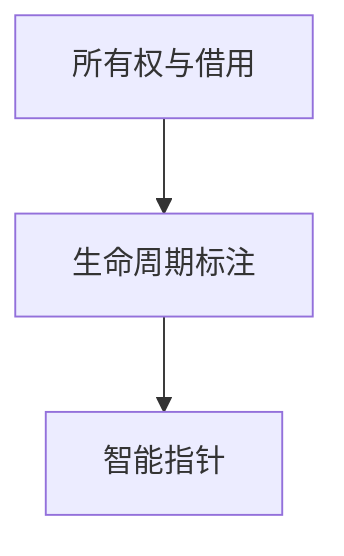
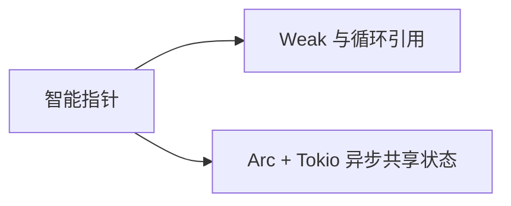

# 智能指针：当所有权与借用不够用的时候

## 先理解，再动手

Box 提供堆上的唯一所有权，Rc/Arc 共享所有权，RefCell/Mutex 提供不同的内部可变机制。共享所有权不自动使内容可安全修改。

**本节自测**：比较克隆 String 与克隆 Rc<String> 后谁拥有内容、何时释放。

<details>
<summary>预期结果与参考思路（先尝试再展开）</summary>

String 得到独立内容，Rc 共享原内容且最后一个强引用释放时才清理；跨线程不能直接用 Rc。

</details>

> **文档简介**: 系统讲解 Rust 智能指针家族——Box 解决递归与堆分配、Rc/RefCell 实现单线程共享与内部可变、Arc/Mutex 走向多线程，以及 Deref/Drop 两大 trait 的机制
>
> **目标读者**: 已掌握所有权、借用与生命周期，需要共享数据或绕开复杂借用关系的 Rust 学习者
>
> **前置知识**: 所有权与借用（basics 02）、生命周期标注（basics 07）、泛型与 trait（basics 04）

<details>
<summary>文档信息（用途、难度与维护记录）</summary>

## 📚 文档元数据

| 属性 | 内容 |
|------|------|
| **模块** | `11-rust-cross-platform` |
| **象限** | 教程（按序入门） |
| **难度** | ⭐⭐ |
| **标签** | `#rust` `#smart-pointers` `#rc` `#arc` `#interior-mutability` |
| **更新日期** | 2026年9月 |

</details>

## 🎯 学习目标

完成本文档后，你将能够：

- ✅ **掌握核心概念**: 建立"智能指针 = 拥有数据的结构体 + Deref/Drop 行为"的心智模型，区分单一所有权与共享所有权
- ✅ **实践能力**: 按场景选对指针——递归类型用 Box、单线程共享用 Rc/RefCell、多线程共享用 Arc/Mutex
- ✅ **解决问题**: 理解 RefCell "把借用检查从编译期挪到运行时"的代价与 panic 条件；解释为什么需要 `Arc` 而不是 `Rc` 跨线程
- ✅ **进阶方向**: 为理解 Weak 防循环引用、异步任务共享状态（Tokio 场景）打基础

## 📋 目录

- [核心概念](#-核心概念)
- [实践指南](#️-实践指南)
- [代码示例](#-代码示例)
- [最佳实践](#-最佳实践)
- [常见问题](#-常见问题)
- [相关资源](#-相关资源)
- [练习与实践](#-练习与实践)

---

## 🔍 核心概念

### 概念一：智能指针是"带行为的所有者"

**定义**: 智能指针是实现了 `Deref`（自动解引用）与 `Drop`（自动清理）的结构体，在拥有数据的同时附加额外元数据与行为——引用计数就是最典型的附加元数据。

**关键特性**:
- **`Box<T>`**：唯一所有权 + 堆分配，最简单也最常用
- **`Rc<T>`**（单线程）/ **`Arc<T>`**（多线程）：共享所有权，`clone` 只加计数不复制数据
- **`RefCell<T>`**：把"同一时刻最多一个可变借用"的检查从编译期挪到运行期（内部可变性）
- **`Mutex<T>`**：RefCell 的线程安全版，加锁才能访问

**使用场景**:
- 递归类型、大对象转移、trait 对象（`Box<dyn Trait>`）→ Box
- 多个线程累积统计、共享配置 → Arc<Mutex<T>>

### 概念二：组合拳的三种典型形态

**定义**: 智能指针很少单独登场，按"共享 × 可变"两轴组合。

**关键特性**:
- **`Rc<T>`**：共享 + 只读（单线程）
- **`Rc<RefCell<T>>`**：共享 + 内部可变（单线程），编译期让位、运行期付检查成本
- **`Arc<Mutex<T>>`**：共享 + 互斥可变（多线程），运行期付锁成本

**使用场景**:
- 线程池 worker 共享任务队列 → `Arc<Mutex<VecDeque<T>>>`
- 多线程只读配置 → `Arc<T>`（无需 Mutex）

### 概念三：Deref 强制转换与 Drop 语义

**定义**: `Deref` 让 `&Box<String>` 自动一路转成 `&str`（编译器的 deref coercion）；`Drop` 让资源在离开作用域时确定性释放——这是 Rust 无 GC 却能自动管理内存的关键。

**关键特性**:
- Deref 是**方法调用与传参的隐形转换链**：`MyBox<String> → String → str`
- Drop 按变量声明的**逆序**执行（栈式清理），`std::mem::drop` 可提前释放
- `MutexGuard` 正是靠 Drop 实现解锁——离开作用域即释放锁，忘记解锁是编译不过的代码设计

**使用场景**:
- 包装类型希望"用起来像内部类型" → 实现 Deref
- 文件句柄、锁、网络连接等需要确定性清理的资源 → 实现 Drop

---

## 🛠️ 实践指南

### 步骤一：用 Box 打通递归类型

**目标**: 理解"编译期确定大小"约束与间接化方案。

**操作指南**:
1. 尝试定义 `enum List { Cons(i32, List), Nil }`，观察递归大小报错
2. 把递归分支改为 `Box<List>`，编译通过
3. 用 `println!("{list:?}")` 验证 Debug 输出

**验证方法**: 编译无错；把 Box 去掉复现 `recursive without indirection` 报错。

### 步骤二：观察 Rc 的计数变化

**目标**: 建立引用计数的直觉。

**操作指南**:
1. `Rc::strong_count(&a)` 在 clone 前后打印计数
2. 在内层作用域再 clone 一次，观察计数上升与回落
3. 尝试对 `Rc<T>` 里的数据调用可变方法，确认编译拒绝

**验证方法**: 计数输出与预期一致（1 → 2 → 3 → 2）。

### 步骤三：体验 RefCell 的运行时检查

**目标**: 分清编译期借用检查与运行期借用检查的边界。

**操作指南**:
1. 正常流程：`borrow_mut()` 修改、`borrow()` 读取
2. 取消示例三中 `b2` 注释行，运行观察 panic（而不是编译报错）
3. 用 `drop(b1)` 显式释放后再借用，恢复正常

**验证方法**: `should_panic` 测试通过（见示例六）。

### 步骤四：升级到 Arc<Mutex<T>>

**目标**: 把单线程共享模式平移到多线程。

**操作指南**:
1. `Rc` 换成 `Arc`，`RefCell` 换成 `Mutex`，其余结构不变
2. 注意 `Arc::clone(&counter)` 必须**每次循环都做**（move 闭包带走自己的计数）
3. `lock()` 返回 `Result`，unwrap 是最直接的毒化策略；MutexGuard 离开作用域自动解锁

**验证方法**: 10 个线程各加 1，结果恒为 10（无数据竞争）。

---

## 💻 代码示例

### 示例一：Box 与递归类型

```rust
// 块1：Box 与递归类型
fn main() {
    // Box：堆分配的唯一所有权智能指针
    let b = Box::new(5);
    println!("b = {b}"); // Deref 自动解引用，像用 i32 一样用 Box<i32>

    // 递归类型：编译期无法确定大小，必须经过指针间接化
    #[derive(Debug)]
    #[allow(dead_code)] // 教学示例：字段仅用于展示结构，不参与读取
    enum List {
        Cons(i32, Box<List>),
        Nil,
    }
    use List::{Cons, Nil};

    let list = Cons(1, Box::new(Cons(2, Box::new(Nil))));
    println!("{list:?}");
}
```

**关键点解析**:
- `Box<List>` 大小固定（一个指针），递归得以终止计算
- Box 也常用于 `Box<dyn Trait>`（trait 对象，动态分发）与搬运大结构体避免栈拷贝

### 示例二：Rc 引用计数

```rust
// 块2：Rc 引用计数
use std::rc::Rc;

fn main() {
    // Rc：单线程引用计数，多个所有者共享只读数据
    let a = Rc::new(String::from("共享配置"));
    println!("初始计数 = {}", Rc::strong_count(&a));

    let b = Rc::clone(&a); // 只增加计数，不复制数据
    println!("clone 后 = {}", Rc::strong_count(&a));
    {
        let c = Rc::clone(&a);
        println!("内层 = {}", Rc::strong_count(&a));
        println!("b 与 c 看到同一份数据：{b} / {c}");
    } // c 离开作用域，计数回落
    println!("离开作用域后 = {}", Rc::strong_count(&a));
}
```

**关键点解析**:
- `Rc::clone(&a)` 与 `a.clone()` 等价，但前一种写法明确表达"这是引用计数操作，不是数据复制"
- 计数归零时数据才释放——多个所有者共享同一次堆分配

### 示例三：`Rc<RefCell<T>>` 内部可变性

```rust
// 块3：Rc<RefCell<T>> 内部可变性
use std::cell::RefCell;
use std::rc::Rc;

fn main() {
    // Rc<RefCell<T>>：多所有者共享 + 单线程内部可变
    let shared = Rc::new(RefCell::new(vec![1, 2, 3]));

    let writer = Rc::clone(&shared);
    writer.borrow_mut().push(4); // 可变借用

    let reader = Rc::clone(&shared);
    println!("reader 看到 {:?}", reader.borrow()); // 不可变借用

    // 运行时规则：同一时刻不能有两个可变借用
    let b1 = shared.borrow_mut();
    // let b2 = shared.borrow_mut(); // 取消注释即 panic：already borrowed
    drop(b1); // 显式释放，恢复可借用状态
    println!("drop 后可再次借用: {:?}", shared.borrow());
}
```

**关键点解析**:
- 编译期规则"多个 `&` 或一个 `&mut`"在 RefCell 场景下变成**运行期检查**：违规即 panic，错误推迟到运行时
- `drop(b1)` 提前释放借用是避免 panic 的常用手段；更稳的写法是缩小借用所在的作用域

### 示例四：`Arc<Mutex<T>>` 多线程共享

```rust
// 块4：Arc<Mutex<T>> 多线程共享
use std::sync::{Arc, Mutex};
use std::thread;

fn main() {
    // Arc<Mutex<T>>：跨线程共享 + 互斥可变
    let counter = Arc::new(Mutex::new(0));
    let mut handles = vec![];

    for _ in 0..10 {
        let counter = Arc::clone(&counter);
        let handle = thread::spawn(move || {
            let mut num = counter.lock().unwrap(); // 锁毒化时 unwrap 快速失败
            *num += 1;
        }); // MutexGuard 在此自动释放（RAII），无需手动 unlock
        handles.push(handle);
    }

    for h in handles {
        h.join().unwrap();
    }

    println!("结果 = {}", *counter.lock().unwrap()); // 恒为 10，无数据竞争
}
```

**关键点解析**:
- `Rc` 不是 `Send`，跨线程编译直接报错——`Arc` 的原子计数就是为多线程准备的
- 没有 Mutex 的 `Arc<i32>` 无法在子线程里 `+=`：共享可变性必须有锁（或原子类型）

### 示例五：自定义智能指针（Deref 与 Drop）

```rust
// 块5：Deref 与 Drop
use std::ops::Deref;

// 自定义智能指针：实现 Deref 获得自动解引用与方法穿透
struct MyBox<T>(T);

impl<T> MyBox<T> {
    fn new(x: T) -> Self {
        MyBox(x)
    }
}

impl<T> Deref for MyBox<T> {
    type Target = T;
    fn deref(&self) -> &T {
        &self.0
    }
}

fn greet(name: &str) {
    println!("你好，{name}");
}

// Drop：离开作用域时自动执行清理
struct Resource(String);

impl Drop for Resource {
    fn drop(&mut self) {
        println!("释放资源：{}", self.0);
    }
}

fn main() {
    let m = MyBox::new(String::from("Rust"));
    // Deref 强制转换链：&MyBox<String> -> &String -> &str
    greet(&m);

    let _r1 = Resource(String::from("文件句柄"));
    let _r2 = Resource(String::from("网络连接"));
    println!("main 即将结束，Drop 按声明逆序执行");
}
```

**关键点解析**:
- `greet(&m)` 无需任何显式转换：编译器沿 Deref 链自动走到 `&str`
- Drop 逆序输出（"网络连接"先于"文件句柄"）——栈式清理保证资源依赖正确

### 示例六：共享句柄 + 单元测试

```rust
// 块6：共享句柄 + 单元测试
use std::cell::RefCell;
use std::rc::Rc;

fn push_shared(shared: &Rc<RefCell<Vec<i32>>>, v: i32) {
    shared.borrow_mut().push(v);
}

#[cfg(test)]
mod tests {
    use super::*;

    #[test]
    fn 两个句柄看到同一份数据() {
        let shared = Rc::new(RefCell::new(vec![]));
        push_shared(&shared, 1);
        push_shared(&shared, 2);
        assert_eq!(shared.borrow().len(), 2);
    }

    #[test]
    #[should_panic]
    fn 双重可变借用运行时_panic() {
        let shared = Rc::new(RefCell::new(0));
        let _b1 = shared.borrow_mut();
        let _b2 = shared.borrow_mut(); // 运行时 panic，而非编译错误
    }
}
```

测试的组织方式详见 [10-Cargo 工程化与单元测试](./10-cargo-testing.md)。

---

## 🎨 最佳实践

Box 表达独占堆分配，Rc/Arc 表达共享所有权，RefCell/Mutex 等解决不同环境中的内部可变性，不能简单当作逐层升级的工具。Rc::clone 复制持有句柄，需与数据类型自己的 Clone 行为区分。

RefCell 冲突在运行时检查，问题是同时存在不兼容借用，而不是遇到问号操作符就危险。缩短借用与锁 guard 的作用域，避免回调重入或长 I/O。共享引用形成环时用 Weak 等设计打破所有权环，并验证释放行为。

---

## ❓ 常见问题

### Q1: Box、Rc、Arc 的 clone 有什么区别？
**A**: `Box<T>` 在 T: Clone 时通过 T::clone 复制内部值；是否深度复制取决于 T 的 Clone 契约；`Rc`/`Arc` 的 clone 只增加引用计数，数据不复制。这正是 `Rc::clone(&a)` 写法被推荐的原因——语义自解释。

### Q2: RefCell 和 Mutex 是什么关系？
**A**: 同一思想的两个实现：`RefCell<T>` 单线程（非原子计数，性能更好），`Mutex<T>` 跨线程（原子操作 + 内核级锁）。API 形态对应：`borrow/borrow_mut` 对 `lock`，运行期违规前者 panic、后者死锁风险。所以模式可以从 `Rc<RefCell<T>>` 机械平移到 `Arc<Mutex<T>>`。

### Q3: 什么时候必须用 Box<dyn Trait> 而不是泛型？
**A**: 需要"同一集合里放多种实现"或"编译期未知的具体类型"时。泛型是编译期单态化（每种类型一份代码），trait 对象是运行期动态分发（虚表）。深入对比见 [trait 对象与动态分发](../reference/language-concepts/02-trait-objects.md)（字典篇）。

---

## 🔗 相关资源

### 📖 延伸阅读
- **官方文档**: [The Rustbook ch.15 - Smart Pointers](https://doc.rust-lang.org/book/ch15-00-smart-pointers.html) - 智能指针官方章节
- **官方文档**: [std::cell](https://doc.rust-lang.org/std/cell/) 与 [std::sync](https://doc.rust-lang.org/std/sync/) - 内部可变性与线程同步全量 API

### 🛠️ 工具资源
- **开发工具**: [Rust Playground](https://play.rust-lang.org/) - 复现 Rc 循环引用与 RefCell panic

---

## 🎯 练习与实践

### 练习一：共享计数器双版本
**目标**: 同一逻辑的单线程/多线程实现。

**任务要求**:
1. 用 `Rc<RefCell<i32>>` 实现单线程计数器函数，任意次调用累计
2. 用 `Arc<Mutex<i32>>` + 8 线程实现并行版本，结果可预测
3. 为两个版本各写 2 个单元测试

**评估标准**: 并行版结果恒正确；单线程版若尝试跨线程使用，编译器能给出 Send 相关报错。

---

## 📊 知识图谱

### 前置知识


### 后续学习


---

## 🔄 文档交叉引用

### 相关文档
- 📄 **[所有权与借用](./02-ownership-borrowing.md)**: RefCell 是编译期规则的运行期版本
- 📄 **[生命周期标注](./07-lifetimes.md)**: 生命周期写不动时的替代方案
- 📄 **[集合与迭代器](./06-collections-iterators.md)**: MutexGuard 借助迭代器思想理解 RAII
- 📄 **[Cargo 工程化与单元测试](./10-cargo-testing.md)**: 示例六测试的组织方式

### 参考章节
- 📖 **[trait 对象与动态分发（字典）](../reference/language-concepts/02-trait-objects.md)**: `Box<dyn Trait>` 的机制细节
- 📖 **[所有权字典](../reference/language-concepts/01-ownership-dictionary.md)**: 借用检查细则
- 📖 **[模块 README](../README.md)**: 技术基线与模块路径图

---

## 📝 总结

### 核心要点回顾
1. **按"共享 × 可变"两轴选型**: Box→Rc→Rc<RefCell>→Arc<Mutex>，能力递增、成本递增
2. **RefCell 把检查挪到运行时**: 换来更灵活的共享可变，代价是 panic 风险
3. **Deref/Drop 是智能指针的行为契约**: 自动解引用让包装透明，Drop 让清理确定且逆序

### 学习成果检查
- [ ] 能说出 Box/Rc/Arc 各自解决的问题？
- [ ] 能解释 RefCell 违规借用何时 panic、如何用 drop 避免？
- [ ] 能把 Rc<RefCell<T>> 版本代码机械改写为 Arc<Mutex<T>>？
- [ ] 能实现一个自定义 Deref/Drop 类型并预测其输出顺序？

---

## 🤝 贡献与反馈

发现本文档有改进空间？欢迎在 Issues 报告问题、提出改进建议，或直接提交 PR 完善内容。

---

**文档版本**: v1.0.0
**最后更新**: 2026年9月
**维护团队**: Dev Quest Team

---

> 💡 **学习建议**: 智能指针是"为所有权规则付费"的方式——每次用到先自问：这个复杂度能不能用更简单的所有权结构避免？
>
> 🎯 **下一步**: Arc<Mutex> 正是多线程共享状态的核心工具。继续学习 [09-并发与 async](./09-concurrency-async.md)。


<!-- learning-navigation -->
## 阅读导航

[本模块理解地图](../LEARNING_GUIDE.md) · [完整目录与版本](../README.md) · [通用术语](../../shared-resources/glossary.md)
