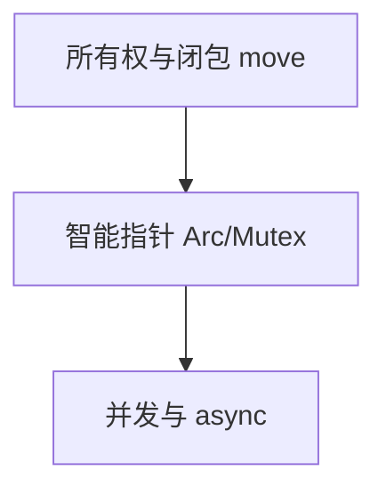
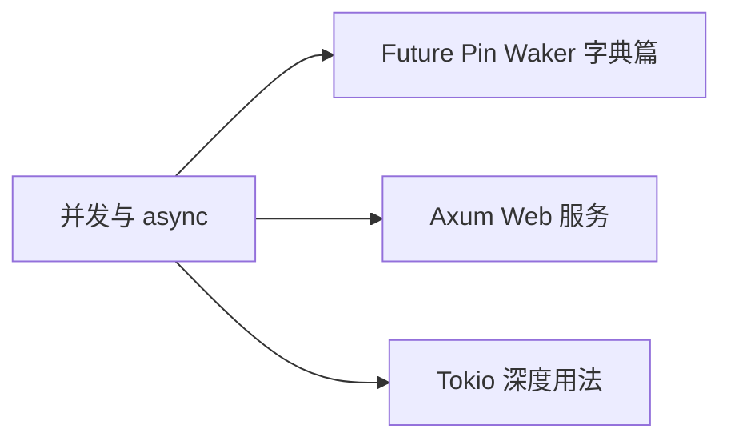

# 并发与 async：无畏并发的两条路线

## 先理解，再动手

线程与异步任务都可表达并发，但资源成本、阻塞影响与调度不同。共享值是否能跨线程由 Send/Sync 等约束检查。

**本节自测**：启动两个异步等待任务，等待它们结束；再解释不等待就退出运行时的结果。

<details>
<summary>预期结果与参考思路（先尝试再展开）</summary>

完成顺序可能变化；必须保留任务完成与失败处理，不能把 spawn 当作必定执行完的承诺。

</details>

> **文档简介**: 一篇打通 Rust 并发双路线——OS 线程 + 通道的同步模型，与 async/.await + Tokio 的异步模型，讲清 Send/Sync 如何在编译期消灭数据竞争
>
> **目标读者**: 已掌握所有权、智能指针（basics 08），想理解 Rust"无畏并发"卖点的学习者
>
> **前置知识**: 所有权与借用（basics 02）、闭包与 move（basics 02）、Arc/Mutex（basics 08）

<details>
<summary>文档信息（用途、难度与维护记录）</summary>

## 📚 文档元数据

| 属性 | 内容 |
|------|------|
| **模块** | `11-rust-cross-platform` |
| **象限** | 教程（按序入门） |
| **难度** | ⭐⭐ |
| **标签** | `#rust` `#concurrency` `#async` `#tokio` `#send-sync` |
| **更新日期** | 2026年9月 |

</details>

## 🎯 学习目标

完成本文档后，你将能够：

- ✅ **掌握核心概念**: 理解线程与 async 的适用边界，以及 Send/Sync 两个标记 trait 的编译期契约
- ✅ **实践能力**: 用 `thread::spawn` + mpsc 通道编写同步并发程序；用 `#[tokio::main]` + `join!` 编写异步并发程序
- ✅ **解决问题**: 看懂"closure may outlive"、"`Rc<T>` cannot be sent between threads"两类高频报错并正确选型
- ✅ **进阶方向**: 为 Axum Web 服务（每请求一个任务）与 Tokio 深度用法打基础

## 📋 目录

- [核心概念](#-核心概念)
- [实践指南](#️-实践指南)
- [代码示例](#-代码示例)
- [最佳实践](#-最佳实践)
- [常见问题](#-常见问题)
- [相关资源](#-相关资源)
- [练习与实践](#-练习与实践)

---

## 🔍 核心概念

### 概念一：线程是"编译期把关的并行"

**定义**: `thread::spawn` 把闭包交给 OS 线程执行；编译器用 `Send`/`Sync` 检查所有跨界数据，数据竞争在编译期直接报错，而非运行期偶发崩溃。

**关键特性**:
- **`Send`**：类型的所有权可以安全地转移到另一个线程（绝大多数类型自动满足）
- **`Sync`**：类型的引用 `&T` 可以安全地在多个线程间共享（`T: Sync` ⇔ `&T: Send`）
- **`move` 闭包**：跨线程必须转移所有权，杜绝"借用别人栈帧"的悬垂
- **JoinHandle**：`join()` 是同步等待点，子线程 panic 会在此重新抛出

**使用场景**:
- CPU 密集型任务并行（每核一线程）
- 长驻后台工作线程（配合通道收发消息）

### 概念二：async/.await 是"编译期状态机"

**定义**: `async fn` 把函数体编译成一个 `Future`——一段"可以暂停、可以恢复"的状态机；`.await` 是让出点，运行时（如 Tokio）负责在 IO 就绪时唤醒它。

**关键特性**:
- **惰性**：`async fn` 调用只构造 Future，被 await（或 spawn）才会执行
- **`async`/`await` 只是语法**：标准库只定义 `Future` trait，执行需要运行时（Tokio 是生态事实标准，基线见模块 README）
- **并发 ≠ 并行**：单线程上多个任务交错让出（并发），多核执行才是并行；`tokio::join!` 是"同时等待"而非"顺序 await"
- **`.await` 会让出整个线程**：Future 里的同步长计算会阻塞同一线程上的其他任务

**使用场景**:
- IO 密集型：成百上千并发连接（Web 服务、爬虫、网关）
- OS 线程栈内存大、切换成本高，高并发 IO 下 async 更省资源

### 概念三：Send/Sync 是"无畏并发"的基石

**定义**: 这两个 auto trait 由编译器为所有类型自动推导（组合规则传递），唯一的任务是：在 `thread::spawn`（要求 `F: Send + 'static`）等跨界边界处拦截不安全的类型。

**关键特性**:
- `Rc<T>` 既非 Send 也非 Sync（非原子计数），跨线程直接编译错误 → 换 `Arc<T>`
- `RefCell<T>` 非 Sync（运行期借用检查不是线程安全）→ 换 `Mutex<T>`
- `Mutex<T>: Sync` 当且仅当 `T: Send`——锁保证了"同一时刻只有一个线程碰数据"
- 与生命周期（basics 07）的 `'static` 约束配合：线程可能活得比创建它的函数久，所以数据必须拥有

---

## 🛠️ 实践指南

### 步骤一：跑通第一个多线程程序

**目标**: 建立 spawn / join / move 三件套的肌肉记忆。

**操作指南**:
1. `thread::spawn(|| {...})` 启动线程，返回 JoinHandle
2. 子线程要用外部数据时，闭包前加 `move`
3. `handle.join().unwrap()` 等待并取回返回值

**验证方法**: 运行示例一，观察主/子线程输出交错；删掉 join 再跑，确认主线程不等子线程。

### 步骤二：用通道替代共享内存

**目标**: 体会 Rust 社区名言"不要通过共享内存来通信，而要通过通信来共享内存"。

**操作指南**:
1. `mpsc::channel()` 得到（发送端, 接收端）对
2. `tx.clone()` 给多个生产者，每个线程 move 走一个克隆
3. 接收端把 `rx` 当迭代器用：所有发送端 drop 后 `for` 循环自然结束

**验证方法**: 运行示例二，确认两条消息都收到且循环正常终止。

### 步骤三：搭建最小 Tokio 异步程序

**目标**: 建立"async fn → Future → await"的执行模型认知。

**操作指南**:
1. 新建 crate，在 `Cargo.toml` 加入 Tokio 依赖（版本基线见模块 README）
2. `main` 标记 `#[tokio::main]`（把 async main 包装成运行时上的普通 main）
3. 顺序 `.await` 与 `tokio::join!` 并发各写一次，对比总耗时

**验证方法**: 示例三中 `join!` 版本耗时约等于单个任务耗时，而非两者之和。

### 步骤四：读懂 Send/Sync 报错

**目标**: 把"编译器拦截"转化为选型指引。

**操作指南**:
1. 故意把 `Rc<RefCell<i32>>` 移进 `thread::spawn`，读报错中 `Send` 不满足的推导链
2. 按报错提示换成 `Arc<Mutex<i32>>`（对照 basics 08 示例四）
3. 总结口诀：单线程 Rc+RefCell，多线程 Arc+Mutex

**验证方法**: 编译通过且测试结果可预测（见示例五）。

---

## 💻 代码示例

### 示例一：线程三件套（spawn / move / join）

```rust
// 块1：线程基础
use std::thread;
use std::time::Duration;

fn main() {
    // spawn：返回 JoinHandle，join 是同步等待点
    let handle = thread::spawn(|| {
        for i in 1..4 {
            println!("工作线程：第 {i} 轮");
            thread::sleep(Duration::from_millis(10));
        }
        42 // 闭包返回值可通过 join 取回
    });

    println!("主线程不阻塞，继续自己的工作");
    let result = handle.join().unwrap(); // panic 会在 join 处重新抛出
    println!("工作线程返回 {result}");

    // move：把所有权转移进线程（默认借用会因生命周期报错）
    let data = vec![1, 2, 3];
    let worker = thread::spawn(move || data.iter().sum::<i32>());
    println!("sum = {}", worker.join().unwrap());
}
```

**关键点解析**:
- 无 `move` 时闭包默认借用 `data`——但子线程可能活得比 `main` 的栈帧久，编译器直接拒绝
- `join` 返回 `Result`：子线程 panic 会在这里变成 `Err`，错误不会悄悄吞掉

### 示例二：mpsc 通道

```rust
// 块2：mpsc 通道
use std::sync::mpsc;
use std::thread;

fn main() {
    let (tx, rx) = mpsc::channel();

    // clone 发送端给多个生产者
    let tx2 = tx.clone();
    thread::spawn(move || tx.send("来自线程 A").unwrap());
    thread::spawn(move || tx2.send("来自线程 B").unwrap());

    // rx 是迭代器：所有发送端 drop 后循环自然结束
    for msg in rx {
        println!("收到：{msg}");
    }
    println!("通道已关闭");
}
```

**关键点解析**:
- mpsc = multi-producer, single-consumer：发送端可克隆多个，接收端只有一个
- `rx` 实现 Iterator，天然衔接迭代器生态（basics 06）；消息所有权随通道转移，无锁无竞争

### 示例三：Tokio 最小异步程序（不实测执行，写码即可）

> 以下为 Tokio 代码与依赖片段；`Tokio` 版本基线见模块 README 技术基线表。

```toml
# Cargo.toml
[dependencies]
tokio = { version = "1.53", features = ["full"] }
```

```rust
// 块3：Tokio async/.await 入门
use std::time::Duration;

#[tokio::main]
async fn main() {
    // async fn 返回 Future，await 驱动执行到完成
    let value = fetch("user/42").await;
    println!("{value}");

    // 并发：join! 同时等待多个 Future，而非顺序 await
    let (a, b) = tokio::join!(fetch("a"), fetch("b"));
    println!("{a} {b}");

    // 超时：包装任意 Future，超时返回 Err
    let r = tokio::time::timeout(Duration::from_millis(50), slow_task()).await;
    println!("结果 = {:?}", r.err()); // Some(Elapsed)
}

async fn fetch(path: &str) -> String {
    // 模拟 IO：真实场景是网络/磁盘，此处只让出线程
    tokio::time::sleep(Duration::from_millis(20)).await;
    format!("响应[{path}]")
}

async fn slow_task() -> String {
    tokio::time::sleep(Duration::from_millis(200)).await;
    "太慢了".to_string()
}
```

**关键点解析**:
- 两个 20ms 的 `fetch` 顺序 await 需要 40ms，`join!` 并发只需约 20ms——这就是"并发等待"的价值
- `timeout` 是"组合器包装 Future"的典型样例，任何 Future 都可以这样叠加能力
- async 内部机制（Future/Pin/Waker）属进阶主题，见 [async 内部机制（字典）](../reference/language-concepts/08-async-internals.md)

### 示例四：Send/Sync 与跨线程共享

```rust
// 块4：Send / Sync 与 Arc<Mutex<T>>
use std::sync::{Arc, Mutex};
use std::thread;

fn main() {
    // Send：所有权可跨线程转移；Sync：&T 可跨线程共享
    // Arc<T> 仅当 T: Send + Sync 时自身才满足 Send + Sync
    let shared = Arc::new(Mutex::new(vec![String::from("初始")]));

    let handle = {
        let shared = Arc::clone(&shared);
        thread::spawn(move || {
            shared.lock().unwrap().push(String::from("来自子线程"));
            shared.lock().unwrap().len()
        })
    };

    println!("子线程报告长度 = {}", handle.join().unwrap());
    println!("主线程看到 {:?}", shared.lock().unwrap());
}
```

**关键点解析**:
- 编译器逐层推导：`String` 满足 Send + Sync → `Vec<String>` 满足 → `Mutex<Vec<_>>` 满足 → `Arc<Mutex<_>>` 满足，跨界检查通过
- 把 `Arc` 的克隆限制在块内再 move，是最常见的所有权收窄手法

### 示例五：并行分段求和 + 单元测试

```rust
// 块5：并行分段求和 + 单元测试
use std::sync::{Arc, Mutex};
use std::thread;

fn parallel_sum(n: u32) -> u32 {
    let total = Arc::new(Mutex::new(0u32));
    let mut handles = vec![];

    for i in 0..4 {
        let total = Arc::clone(&total);
        handles.push(thread::spawn(move || {
            let start = i * n / 4 + 1;
            let end = (i + 1) * n / 4;
            *total.lock().unwrap() += (start..=end).sum::<u32>();
        }));
    }

    for h in handles {
        h.join().unwrap();
    }
    *total.lock().unwrap()
}

#[cfg(test)]
mod tests {
    use super::*;

    #[test]
    fn 四线程求和正确() {
        assert_eq!(parallel_sum(100), 5050);
        assert_eq!(parallel_sum(8), 36);
    }
}
```

测试组织方式详见 [10-Cargo 工程化与单元测试](./10-cargo-testing.md)。

---

## 🎨 最佳实践

async 适合让等待中的任务让出执行权，CPU 工作与阻塞调用仍占用执行线程。通道便于表达所有权转移，共享状态在明确同步协议下也合理；依据数据流选择，不把一种方式宣称永远更安全。

tokio::spawn 要求其约束范围内的 Future 满足 Send 等条件，本地任务也可以使用不跨线程的状态，不能把所有 async 一概要求 Arc/Mutex。保存任务管理句柄，定义失败、取消与关闭时如何等待；丢弃句柄不等于任务已经停止。

---

## ❓ 常见问题

### Q1: 线程和 async 到底选哪个？
**A**: 看瓶颈。等待外部（网络、磁盘、定时）占大头 → async，任务数可到数万；CPU 计算占大头 → 线程（或 async + `spawn_blocking`），数量 ≈ 核数。中小规模且全是 CPU 工作时，线程模型更简单直观。

### Q2: `.await` 会不会阻塞线程？
**A**: 不会——`.await` 是"让出"而不是"阻塞"：Future 未就绪时线程转去跑其他任务。真正阻塞线程的是 Future 里混入的同步长操作（大循环、`std::thread::sleep`、同步文件 IO），这也是"async 里不要写阻塞代码"警告的来源。

### Q3: 为什么 `thread::spawn` 要求闭包 `'static`？
**A**: 线程可能比创建它的函数活得久，若闭包借用了局部变量，函数返回后栈帧销毁，引用悬垂。`'static` 约束强制"线程只拥有数据（move）或引用 `'static` 数据"。同理，Tokio 任务要求 `Send + 'static`——它可能在线程池中迁移。生命周期回顾见 [07-生命周期标注](./07-lifetimes.md)。

---

## 🔗 相关资源

### 📖 延伸阅读
- **官方文档**: [The Rustbook ch.16 - Fearless Concurrency](https://doc.rust-lang.org/book/ch16-00-concurrency.html) - 线程/通道/共享状态官方教程
- **官方文档**: [Async Book](https://rust-lang.github.io/async-book/) - async/.await 官方异步书
- **官方文档**: [Tokio Tutorial](https://tokio.rs/tokio/tutorial) - Tokio 官方入门教程

### 🛠️ 工具资源
- **开发工具**: [Tokio Console](https://github.com/tokio-rs/console) - 异步任务级观测面板
- **在线平台**: [Rust Playground](https://play.rust-lang.org/) - 复现 Send/Sync 编译错误

---

## 🎯 练习与实践

### 练习一：多线程单词计数
**目标**: 综合 move + Arc<Mutex> + 迭代器。

**任务要求**:
1. 把一段文本按行分给 4 个线程，各自统计词频（HashMap）
2. 汇总到主线程的 `Arc<Mutex<HashMap>>`，输出总词频前 5 名
3. 用 2 个测试验证：单行输入、空输入

**评估标准**: 无锁粒度问题（每线程局部统计、最后一次加锁合并更优者加分）。

### 练习二：并发抓取模拟器
**目标**: Tokio 并发组合器。

**挑战任务**:
- 用 `tokio::join!` 并发"抓取"3 个模拟 URL（`tokio::time::sleep` 模拟延迟），打印各自耗时
- 挑战：改用 `tokio::spawn` + 收集 JoinHandle，支持任意数量 URL 列表

**提示**: 动态数量的并发等待用 `futures::future::join_all` 或循环 spawn。

---

## 📊 知识图谱

### 前置知识


### 后续学习


---

## 🔄 文档交叉引用

### 相关文档
- 📄 **[智能指针](./08-smart-pointers.md)**: Arc/Mutex 的机制与组合拳
- 📄 **[生命周期标注](./07-lifetimes.md)**: `'static` 约束的来源
- 📄 **[集合与迭代器](./06-collections-iterators.md)**: 通道接收端就是迭代器
- 📄 **[Cargo 工程化与单元测试](./10-cargo-testing.md)**: feature 与测试组织

### 参考章节
- 📖 **[async 内部机制（字典）](../reference/language-concepts/08-async-internals.md)**: Future / Pin / Waker
- 📖 **[Tokio 指南（字典）](../reference/library-guides/12-tokio-guide.md)**: 运行时全量用法
- 📖 **[模块 README](../README.md)**: 技术基线（Tokio 1.53）与模块路径图

---

## 📝 总结

### 核心要点回顾
1. **两条路线按瓶颈选**: IO 密集 async、CPU 密集线程，边界处 `spawn_blocking` 桥接
2. **Send/Sync 把数据竞争挡在编译期**: Rc/RefCell 单线程、Arc/Mutex 多线程的选型是编译器逼出来的
3. **async 是编译期状态机**: `.await` 让出不阻塞，`join!` 并发等待，运行时负责调度

### 学习成果检查
- [ ] 能解释 `move` 在跨线程闭包中为何必需？
- [ ] 能说清 mpsc 通道"发送端 drop 后接收循环结束"的机制？
- [ ] 能把 `Rc<RefCell<T>>` 报错代码改写为 `Arc<Mutex<T>>` 版本？
- [ ] 能用 `tokio::join!` 写出并发的最小异步程序？

---

## 🤝 贡献与反馈

发现本文档有改进空间？欢迎在 Issues 报告问题、提出改进建议，或直接提交 PR 完善内容。

---

**文档版本**: v1.0.0
**最后更新**: 2026年9月
**维护团队**: Dev Quest Team

---

> 💡 **学习建议**: 把示例四中 `Arc<Mutex<...>>` 换成 `Rc<RefCell<...>>` 编译一次——读一遍 Send 报错的推导链，胜过十篇博客。
>
> 🎯 **下一步**: 学会并发之后，把工程交给 Cargo 管理。继续学习 [10-Cargo 工程化与单元测试](./10-cargo-testing.md)。


<!-- learning-navigation -->
## 阅读导航

[本模块理解地图](../LEARNING_GUIDE.md) · [完整目录与版本](../README.md) · [通用术语](../../shared-resources/glossary.md)
