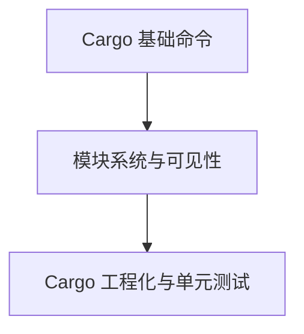
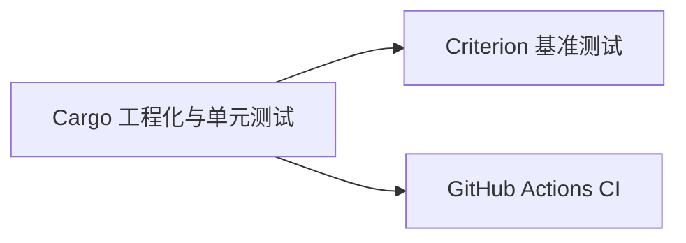

# Cargo 工程化与单元测试：从单文件到可维护的仓库

> **文档简介**: 讲透 Cargo 的工程化能力——workspace 多 crate 管理、profiles 构建档位、features 条件编译，以及 `#[test]` 单元测试 / 集成测试 / doctest 三层测试体系
>
> **目标读者**: 已掌握 Rust 语言基础（basics 01-09），准备组织多模块真实项目的学习者
>
> **前置知识**: Cargo 基本命令（basics 01）、模块系统初步、前九篇的代码示例

## 📚 文档元数据

| 属性 | 内容 |
|------|------|
| **模块** | `11-rust-cross-platform` |
| **象限** | 教程（按序入门） |
| **难度** | ⭐ |
| **标签** | `#rust` `#cargo` `#testing` `#workspace` `#engineering` |
| **更新日期** | 2026年9月 |

## 🎯 学习目标

完成本文档后，你将能够：

- ✅ **掌握核心概念**: 理解 Cargo.toml 各分区职责、profiles 与 features 的作用层次、三类测试的边界
- ✅ **实践能力**: 写出带 `#[cfg(test)]` 的单元测试与 Result 风格测试；搭建 workspace 并用 `[workspace.dependencies]` 统一依赖版本
- ✅ **解决问题**: 用 `cargo test` 的过滤/输出参数定位失败用例；用 profiles 区分开发/发布构建
- ✅ **进阶方向**: 为 CI（GitHub Actions）、基准测试（Criterion）、发布流程打基础

## 📋 目录

- [核心概念](#核心概念)
- [实践指南](#实践指南)
- [代码示例](#代码示例)
- [最佳实践](#最佳实践)
- [常见问题](#常见问题)
- [相关资源](#相关资源)
- [练习与实践](#练习与实践)

---

## 🔍 核心概念

### 概念一：Cargo 是构建器 + 包管理器 + 测试运行器

**定义**: 一个 `Cargo.toml` 声明元数据与依赖，Cargo 负责解析依赖图、增量编译、跑测试、生成文档——Rust 生态没有"构建脚本碎片化"问题，因为只有一个 Cargo。

**关键特性**:
- **`[dependencies]`**：运行时依赖；**`[dev-dependencies]`**：仅测试/示例/基准可用，不进发布产物
- **`Cargo.lock`**：锁定精确版本，应用项目应提交入库，保证团队与 CI 构建一致
- **`cargo check`**：只做类型检查不生成代码，是最快的反馈回路

**使用场景**:
- 任何 Rust 项目从 `cargo new` 开始，团队以 `Cargo.lock` 保证构建一致

### 概念二：workspace 与 features 是"规模化的两把钥匙"

**定义**: workspace 把多个 crate 组成一个仓库统一管理（共享 lock 文件与 target 目录）；features 让同一个 crate 按需裁剪功能（条件编译）。

**关键特性**:
- **workspace**：根 `Cargo.toml` 列 `members`，子 crate 通过 `path` 互相依赖；`[workspace.dependencies]` 统一版本，避免依赖漂移
- **features**：`#[cfg(feature = "json")]` 门控代码；feature 之间可传递（`json = ["serde/json"]`）
- **profiles**：`[profile.dev]` 与 `[profile.release]` 控制优化等级、LTO 等，同一份代码两种构建档位

**使用场景**:
- CLI + 核心库 + 服务器拆成三个 crate（本模块 projects 路线即此形态）
- 默认精简、按需开启重依赖（如 TLS、序列化）

### 概念三：测试金字塔的三层

**定义**: Rust 内建三层测试——单元测试（与代码同文件）、集成测试（`tests/` 独立 crate）、文档测试（doc comment 里的代码块），`cargo test` 一次全跑。

**关键特性**:
- **单元测试**：`#[cfg(test)] mod tests`，可测私有函数，编译进测试二进制、不进发布产物
- **集成测试**：`tests/*.rs` 每个文件是独立 crate，只能走公共 API——测的是"用户视角"
- **doctest**：文档里的示例代码会被提取编译运行——**示例即测试**，文档永不腐烂的关键机制

**使用场景**:
- 逻辑分支多 → 单元测试铺密度
- 公共函数带示例 → doctest 一石二鸟

---

## 🛠️ 实践指南

### 步骤一：为已有函数补测试

**目标**: 掌握 `#[cfg(test)]` 三种断言形态。

**操作指南**:
1. 在源文件底部加 `#[cfg(test)] mod tests { use super::*; }`
2. `#[test]` 标记用例；普通断言 `assert_eq!`、预期 panic 用 `#[should_panic]`、可失败场景返回 `Result`
3. `cargo test` 运行，`cargo test <名称片段>` 过滤

**验证方法**: 示例一 4 个用例全部 `ok`。

### 步骤二：给公共 API 配 doctest

**目标**: 让文档示例成为可执行契约。

**操作指南**:
1. 在 `///` 文档注释里写 ` ``` ` 包裹的代码块
2. doctest 中直接使用 crate 名访问公共 API（rustdoc 自动包 `fn main`）
3. `cargo test` 时 doctest 单独计一组

**验证方法**: 示例二的 doctest 在 `cargo test` 输出中显示为 `myapp::add` 用例。

### 步骤三：拆 workspace

**目标**: 多 crate 仓库的标准布局。

**操作指南**:
1. 根目录 `Cargo.toml` 声明 `[workspace]` 与 `members`
2. 子 crate 的依赖引用统一走 `[workspace.dependencies]` + `workspace = true`
3. 根目录执行 `cargo test` / `cargo check` 会作用于全部成员

**验证方法**: `cargo build` 一次产出多个 crate，`target/` 只有一份。

### 步骤四：调 profiles 与 features

**目标**: 开发快编译、发布高性能。

**操作指南**:
1. `[profile.release]` 开 LTO 与 `strip`，对比 `cargo build --release` 前后产物体积
2. 定义 `features`，用 `cargo run --features json` 切换功能面
3. CI 里固定 `--locked` 使用 lock 文件

**验证方法**: 未开启 feature 时门控代码不参与编译（`cargo build` 无该符号）。

---

## 💻 代码示例

### 示例一：单元测试三形态（assert / should_panic / Result）

```rust
// 块1：单元测试三形态（assert / should_panic / Result）
pub struct Stats {
    pub values: Vec<f64>,
}

impl Stats {
    pub fn mean(&self) -> Option<f64> {
        if self.values.is_empty() {
            return None;
        }
        Some(self.values.iter().sum::<f64>() / self.values.len() as f64)
    }

    // 约定"调用方保证非空"：违反约定属于程序性 bug，用 panic 表达
    pub fn first(&self) -> f64 {
        self.values[0]
    }
}

#[cfg(test)]
mod tests {
    use super::*;

    #[test]
    fn 空序列均值返回_none() {
        assert_eq!(Stats { values: vec![] }.mean(), None);
    }

    #[test]
    fn 均值计算正确() {
        let s = Stats { values: vec![1.0, 2.0, 3.0] };
        assert!((s.mean().unwrap() - 2.0).abs() < 1e-9);
    }

    #[test]
    #[should_panic(expected = "index out of bounds")]
    fn 空集合取首元素应_panic() {
        let s = Stats { values: vec![] };
        let _ = s.first();
    }

    #[test]
    fn 结果风格测试() -> Result<(), String> {
        let s = Stats { values: vec![1.0, 2.0, 3.0] };
        let m = s.mean().ok_or("均值不可用")?;
        assert!((m - 2.0).abs() < 1e-9);
        Ok(())
    }
}
```

**关键点解析**:
- `#[cfg(test)]` 让测试代码只在 `cargo test` 时编译，发布产物零负担
- 三种形态对应三种失败语义：值错误（assert）、程序 bug（should_panic）、环境/输入失败（Result）
- 测试函数名可直接用中文，`cargo test` 按名过滤时同样有效

### 示例二：文档测试（doctest）

```rust
// 块2：文档测试（doctest）——示例即测试
/// 计算两数之和。
///
/// # 示例
///
/// ```
/// assert_eq!(myapp::add(2, 3), 5);
/// ```
pub fn add(a: i64, b: i64) -> i64 {
    a + b
}

#[cfg(test)]
mod tests {
    use super::*;

    #[test]
    fn 单元测试走同一逻辑() {
        assert_eq!(add(-1, 1), 0);
    }
}
```

**关键点解析**:
- doctest 由 rustdoc 提取为独立小程序编译运行——文档示例错了，`cargo test` 直接红
- 不希望执行的示例（如 `ignore`/`no_run` 标注）可按需控制，但默认"示例必须能跑"

### 示例三：Cargo.toml 分区详解

```toml
# Cargo.toml（单个 crate）
[package]
name = "myapp"
version = "0.1.0"
edition = "2024"          # 当前 edition，基线见模块 README

[dependencies]
serde = { version = "1.0", features = ["derive"] }

[dev-dependencies]        # 仅测试/示例/基准可用，不进发布产物
# 例如：pretty_assertions = "1"（版本以 crates.io 当前为准）

[profile.dev]
opt-level = 0             # 开发构建：最快编译

[profile.release]
opt-level = 3
lto = true                # 链接期优化：运行更快、编译更慢

[features]
default = []
json = ["serde/json"]     # feature 可传递开启依赖的 feature
```

**关键点解析**:
- edition 是编译方言开关而非版本号——同一份依赖可各自选择 edition
- profiles 只在"构建方"的 Cargo.toml 生效，作为库发布时不携带

### 示例四：workspace 布局

```toml
# 根 Cargo.toml —— workspace 成员共享 Cargo.lock 与 target/
[workspace]
resolver = "2"
members = [
    "crates/core",
    "crates/cli",
    "crates/server",
]

[workspace.dependencies]  # 统一管理依赖版本，子 crate 用 workspace = true 引用
tokio = { version = "1.53", features = ["full"] }
serde = { version = "1.0", features = ["derive"] }

[workspace.package]      # 统一元数据，子 crate 继承
version = "0.1.0"
edition = "2024"
```

```text
myapp/
├── Cargo.toml            # 根：仅 [workspace]，无 [package]
├── Cargo.lock            # 全仓库唯一 lock
├── crates/
│   ├── core/             # 纯逻辑库：单元测试放 src/lib.rs
│   ├── cli/              # 命令行入口：依赖 core
│   └── server/           # 服务入口：依赖 core
└── tests/                # （可选）跨 crate 集成场景放这里或各 crate 的 tests/
```

**关键点解析**:
- 子 crate 的 `Cargo.toml` 写 `tokio = { workspace = true }`，版本只在根定义一处
- workspace 不发布任何东西，发布的是各子 crate

### 示例五：集成测试的边界

```rust
// tests/api_test.rs —— 独立 crate，只能访问 myapp 的公共 API
use myapp::Stats;

#[test]
fn 公共_api_从外部视角可用() {
    let s = Stats { values: vec![1.0, 2.0, 4.0] };
    let mean = s.mean().expect("非空集合必有均值");
    assert!((mean - 7.0 / 3.0).abs() < 1e-9);
}
```

**关键点解析**:
- 集成测试看不到私有项——这是特性不是限制，它强制"公共 API 自洽"
- 每个集成测试文件是独立 crate，共享的辅助代码放 `tests/common/mod.rs` 再 `mod common;` 引入

### 示例六：高频命令速查

```bash
# 测试相关
cargo test                    # 运行全部测试（单元 + 集成 + doctest）
cargo test divide             # 按名称过滤
cargo test -- --nocapture     # 显示 println! 输出

# 构建与运行
cargo check                   # 只查类型不生成代码，最快反馈
cargo build --release         # 优化构建（profile.release）
cargo doc --open              # 生成并打开文档（doctest 源头）

# 质量工具
cargo fmt                     # 格式化
cargo clippy                  # lint 检查
```

**关键点解析**:
- `--` 之后是传给测试二进制的参数（libtest 参数），之前是 cargo 自己的参数

---

## 🎨 最佳实践

### ✅ 推荐做法
- **提交 `Cargo.lock`**: 应用与 workspace 项目锁定依赖，可复现构建
- **测试函数名写成句子**: "空序列均值返回_none" 直接说明行为预期，失败输出即文档
- **公共 API 至少一个 doctest**: 示例保活 + 使用教学一石二鸟

### ❌ 避免陷阱
- **profile 当功能开关**: profiles 管优化不管行为，条件能力一律走 features
- **feature 爆炸**: `2^n` 组合无人测得动；feature 只切"依赖有无"，不切"行为分支"
- **忽略 doctest 失败**: 示例腐烂从"先 ignore 掉"开始，宁可改示例也不注掉测试

---

## ❓ 常见问题

### Q1: 单元测试放哪？`tests/` 还是源文件里？
**A**: 默认源文件内 `#[cfg(test)] mod tests`（可访问私有项）；跨模块、走公共 API 的场景放 `tests/*.rs`。判断口诀："测内部实现细节 → 单元测试；测别人怎么用我 → 集成测试"。

### Q2: workspace 与多仓库（各自独立）怎么选？
**A**: 代码同生命周期、同发布节奏 → workspace 一体化；独立演进、跨团队 → 多仓库。workspace 的隐含代价是"牵一发动全身"（lock 文件共享），收益是一次原子提交改全部成员。

---

## 🔗 相关资源

### 📖 延伸阅读
- **官方文档**: [The Rustbook ch.11 - Writing Automated Tests](https://doc.rust-lang.org/book/ch11-00-testing.html) - 测试体系官方章节
- **官方文档**: [The Cargo Book](https://doc.rust-lang.org/cargo/) - profiles / features / workspace 全量手册

### 🛠️ 工具资源
- **开发工具**: [cargo-nextest](https://nexte.st/) - 更快的测试运行器（进阶可选）
- **在线平台**: [crates.io](https://crates.io/) - 依赖版本查证（基线核实来源）

---

## 🎯 练习与实践

### 练习一：测试驱动的 Stats 扩展
**目标**: 巩固三层测试。

**任务要求**:
1. 给示例一的 `Stats` 补 `variance()`（方差）方法，先写测试后写实现
2. 空集合行为自定（panic 或 Result），并在测试名中说明
3. 为 `mean` 补一个 doctest

**评估标准**: `cargo test` 全绿；方差实现未使用 `unwrap` 于可失败路径。

### 练习二：三 crate workspace
**目标**: 工程化布局实战。

**挑战任务**:
- 把前九篇任一练习改造为 `core + cli + server` workspace
- 在根 `[workspace.dependencies]` 管理全部第三方依赖
- 加一个 `json` feature：开启时 core 提供 `to_json()`（用 serde）

**提示**: 子 crate 继承 `[workspace.package]` 的 edition；feature 门控写 `#[cfg(feature = "json")]`。

---

## 📊 知识图谱

### 前置知识


### 后续学习


---

## 🔄 文档交叉引用

### 相关文档
- 📄 **[集合与迭代器](./06-collections-iterators.md)**: 示例一使用的迭代器聚合
- 📄 **[智能指针](./08-smart-pointers.md)**: 测试 `should_panic` 验证的 RefCell 行为
- 📄 **[并发与 async](./09-concurrency-async.md)**: workspace 三 crate 的 server 成员走向
- 📄 **[环境搭建](./01-environment-setup.md)**: cargo 安装与工具链管理

### 参考章节
- 📖 **[模块 README](../README.md)**: 技术基线与模块路径图
- 🛠️ **[单元与集成测试（指南）](../testing/01-unit-integration-tests.md)**: 测试工程深入篇

---

## 📝 总结

### 核心要点回顾
1. **Cargo 一体化消除构建碎片化**: lock 锁版本、check 快反馈、test 跑三层
2. **workspace + features 支撑规模化**: 版本一处声明，能力按需编译
3. **测试金字塔内建于语言**: 单元测私有、集成测契约、doctest 保示例——`cargo test` 一键全跑

### 学习成果检查
- [ ] 能说清 `[dependencies]` 与 `[dev-dependencies]` 的边界？
- [ ] 能写出 assert / should_panic / Result 三种测试？
- [ ] 能搭起带 `[workspace.dependencies]` 的三成员 workspace？
- [ ] 能解释 doctest 为什么让文档示例"永不腐烂"？

---

## 🤝 贡献与反馈

发现本文档有改进空间？欢迎在 Issues 报告问题、提出改进建议，或直接提交 PR 完善内容。

---

**文档版本**: v1.0.0
**最后更新**: 2026年9月
**维护团队**: Dev Quest Team

---

> 💡 **学习建议**: 本篇是 basics 的收官——回到 [模块 README](../README.md) 查看三路径视图，按自己的目标选择 frameworks / projects 路线继续。
>
> 🎯 **下一步**: 基础已备，进入实战：从 [projects/](../projects/) 的 CLI 工具项目开始，或跳转 [frameworks/](../frameworks/) 进入 Tauri 2 旗舰线。
