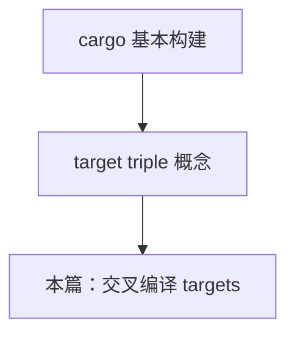
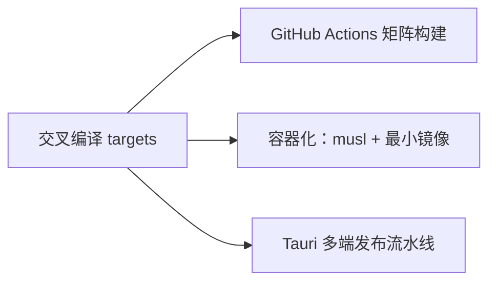

# Rust 交叉编译 Targets 指南

> **文档简介**: 讲解 Rust 交叉编译的核心概念与操作流程——如何用 `rustup target add` 安装目标平台、配置 linker、启用 musl 静态链接，以及 Tauri 2 多端打包对各 target 的要求。
>
> **目标读者**: 已能熟练使用 cargo 构建单平台程序的中级开发者，需要把产物送达 Windows / macOS / Linux / Android / iOS 多端的工程师。
>
> **前置知识**: cargo 基本用法（`cargo build`）、对编译产物与系统库的初步认识；工具链安装见 [环境搭建](../basics/01-environment-setup.md)。

## 📚 文档元数据

| 属性 | 内容 |
|------|------|
| **模块** | `11-rust-cross-platform` |
| **象限** | 操作指南 |
| **难度** | ⭐⭐ |
| **标签** | `#rust` `#deployment` `#cross-compilation` `#tauri` |
| **更新日期** | `2026年9月` |

## 🎯 学习目标

完成本篇后，你将能够：

- ✅ **掌握核心概念**: 读懂 target triple 的四段结构，区分 host 与 target
- ✅ **实践能力**: 用 `rustup target add` 安装目标平台并在 CI 中产出多平台二进制
- ✅ **解决问题**: 处理 linker 缺失、glibc 版本不匹配、C 依赖无法静态链接等典型故障
- ✅ **进阶方向**: 理解 Tauri 多端打包对 host OS 与 target 的硬性约束，为 [多端发布流水线](../projects/05-multiplatform-release.md) 打基础

## 📋 目录

- [核心概念](#核心概念)
- [实践指南](#实践指南)
- [Tauri 多端打包对 target 的要求](#tauri-多端打包对-target-的要求)
- [代码示例](#代码示例)
- [最佳实践](#最佳实践)
- [常见问题](#常见问题)
- [相关资源](#相关资源)

---

## 🔍 核心概念

### 概念一：target triple

**定义**: 形如 `x86_64-unknown-linux-musl` 的目标平台标识符，四段格式为 `<架构>-<厂商>-<操作系统>-<ABI/工具链>`。

**关键特性**:

- 架构段决定指令集：`x86_64`、`aarch64`（ARM64）、`armv7`（32 位 ARM）等
- 操作系统段决定系统调用接口：`linux`、`darwin`（macOS/iOS）、`windows`、`android`
- 末段决定 C 运行库与 ABI：`gnu`（glibc 动态链接）、`musl`（musl 静态链接）、`msvc`（Windows MSVC 工具链）
- vendor 段常为 `unknown` 或 `apple`/`pc`，多数场景可忽略其细节

**使用场景**:

- 场景 1：在一台 Linux 机器上产出 Windows `.exe`
- 场景 2：在 Apple Silicon Mac 上同时产出 Intel 架构产物

### 概念二：host 与 target

**定义**: **host** 是执行编译的机器，**target** 是产物要运行的机器。默认构建即 host 构建；加上 `--target <triple>` 即为交叉编译。

**关键特性**:

- 纯 Rust 代码交叉编译通常零阻力——rustc 自带各 target 的 std 预编译产物
- 一旦依赖含 C 代码的 crate（如 `ring`、`openssl-sys`），就需要为目标平台准备 C 工具链或 linker
- 操作系统绑定约束无法绕过：macOS 产物（含签名/打包环节）只能在 macOS 上完成，见下文 Tauri 一节

### 概念三：平台分层（Tier）

**定义**: Rust 官方按支持程度将 target 分为 Tier 1（每夜全量测试）、Tier 2（保证能构建出 std）、Tier 3（不提供 std 产物）。

**关键特性**:

- 主流桌面 triple 属 Tier 1/2；Android triple 属 Tier 2
- Tier 3 target 需要 `-Z build-std`，普通业务开发不会碰到
- 具体分层随版本演进，以官方 [Platform Support](https://doc.rust-lang.org/rustc/platform-support.html) 页为准

---

## 🛠️ 实践指南

### 步骤一：安装并验证 target

**目标**: 为本机工具链添加目标平台的标准库。

**操作指南**:

```bash
# 查看已安装的 target
rustup target list --installed

# 查看全部可用 target（配合 grep 过滤）
rustup target list | grep darwin

# 安装目标平台（示例：Apple Silicon macOS）
rustup target add aarch64-apple-darwin

# 以该 target 构建（不切换 host 工具链）
cargo build --release --target aarch64-apple-darwin
```

**验证方法**: 构建成功后用 `file target/aarch64-apple-darwin/release/<二进制名>` 确认产物架构（需在对应 host 上执行，Linux 交叉编译 macOS 场景见常见问题 Q3）。

### 步骤二：常用 target 一览

| target triple | 目标平台 | 典型产物 | 备注 |
|---------------|---------|---------|------|
| `x86_64-pc-windows-msvc` | Windows x64 | `.exe` / `.msi` / `.nsis` | Windows 官方主推工具链 |
| `aarch64-pc-windows-msvc` | Windows ARM64 | `.exe` | ARM64 设备原生产物 |
| `x86_64-apple-darwin` | macOS Intel | `.app` / `.dmg` | 需在 macOS 上链接打包 |
| `aarch64-apple-darwin` | macOS Apple Silicon | `.app` / `.dmg` | 同上 |
| `x86_64-unknown-linux-gnu` | Linux x64 (glibc) | ELF 二进制 | 服务器最常用，产物依赖目标机 glibc |
| `aarch64-unknown-linux-gnu` | Linux ARM64 (glibc) | ELF 二进制 | 树莓派 4+/云服务器 ARM 实例 |
| `x86_64-unknown-linux-musl` | Linux x64 (musl) | 静态 ELF | 容器/`scratch` 镜像首选，见步骤三 |
| `aarch64-linux-android` | Android ARM64 | `.so`（经 Tauri 打为 APK） | Android 四件套之一 |
| `aarch64-apple-ios` | iOS 真机 | `.a`/静态库（经 Tauri/Xcode 打包） | 仅 macOS host |

### 步骤三：musl 静态链接

**目标**: 产出不依赖目标机 glibc 的自包含 Linux 二进制，直接跑在 `scratch`/distroless/alpine 容器中。

**操作指南**:

1. 安装 target：`rustup target add x86_64-unknown-linux-musl`
2. Debian/Ubuntu 上若依赖含 C 代码，需装 musl 版 C 编译器：`sudo apt install musl-tools`
3. 在 `.cargo/config.toml` 显式声明静态链接意图（见下方代码示例）
4. 构建并在运行镜像中只拷贝一个二进制，详见 [容器化服务](./04-containerized-services.md)

**验证方法**: `ldd target/x86_64-unknown-linux-musl/release/<二进制名>` 输出 "not a dynamic executable" 即为纯静态。

### 步骤四：Android targets 与 linker 配置

**目标**: 为 Tauri Android 端准备 Rust 侧编译能力。

**操作指南**:

```bash
# Android 四个架构 target 一次装齐
rustup target add aarch64-linux-android armv7-linux-androideabi i686-linux-android x86_64-linux-android
```

Android 交叉编译需要 NDK 提供的 clang linker。**推荐用 [cargo-ndk](https://github.com/bbqsrc/cargo-ndk) 自动完成 linker 探测**；手写配置见下方代码示例中的 `.cargo/config.toml` 片段，其中 `android24` 对应 NDK API level，按你的 `minSdkVersion` 对齐。

### 步骤五：iOS targets

**目标**: 为 Tauri iOS 端准备 Rust 侧编译能力。

```bash
rustup target add aarch64-apple-ios aarch64-apple-ios-sim
```

**验证方法**: iOS 的 linker 与 SDK 由 Xcode 提供，且**只能在 macOS host 上链接**——`cargo build --target aarch64-apple-ios` 在 Linux/Windows 上会停在链接阶段。日常开发经 `cargo tauri ios init` 由 Tauri CLI 接管，详见 [桌面与多端打包](../frameworks/07-desktop-packaging.md)。

### 步骤六：cross 工具（容器化交叉编译）

**目标**: 不手工配置任何 linker/C 工具链，用 Docker 容器作为"别人的目标机"完成交叉编译。

```bash
# 安装 cross（--locked 固定依赖，避免最新版不稳定组合）
cargo install cross --locked

# 用法与 cargo build 完全一致，仅命令换为 cross
cross build --release --target aarch64-unknown-linux-musl
```

**前置条件**: 本机已安装 Docker 或 Podman。cross 会拉取官方维护的、内置目标平台 C 工具链的容器镜像，是 CI 中处理 "C 依赖交叉编译" 最省心的方案。

---

## 📱 Tauri 多端打包对 target 的要求

Tauri 的 Rust 内核编译遵循上文的通用规则，但**打包产物**有 host OS 硬约束：

| 目标端 | 需要的 target | 可构建的 host | 说明 |
|--------|--------------|--------------|------|
| Windows x64 | `x86_64-pc-windows-msvc` | Windows | MSI（WiX）仅限 Windows；NSIS 可从 Linux/macOS 交叉打包但官方标注"仅作最后手段"，且签名需外部工具 |
| macOS | `x86_64-apple-darwin` / `aarch64-apple-darwin` | 仅 macOS | 代码签名、公证、`.app`/`.dmg` 打包依赖 macOS 工具链 |
| Linux | `x86_64-unknown-linux-gnu` | Linux | AppImage/deb 在 Linux host 打包 |
| Android | 四个 `*-linux-android` triple | 任意（链接靠 NDK） | `cargo tauri android init` 后由 Tauri CLI 分架构构建 |
| iOS | `aarch64-apple-ios` 等 | 仅 macOS | 经 Xcode 完成最终打包 |

**结论**：CI 的多平台矩阵必须"在哪个 OS 上构建哪个端"，这正是 [GitHub Actions CI](./02-github-actions-ci.md) 中矩阵构建一节的组织方式。

---

## 💻 代码示例

### 示例：`.cargo/config.toml` 综合配置

```toml
# .cargo/config.toml —— 与项目同目录，cargo 自动读取
# 交叉编译的 linker/静态链接声明集中在这里，CI 与本地行为一致

# musl：显式声明静态链接 C 运行库（musl target 默认已偏静态，写明是自文档化）
[target.x86_64-unknown-linux-musl]
rustflags = ["-C", "target-feature=+crt-static"]

# Android：linker 指向 NDK 工具链（前提：NDK 已解压，且其
# toolchains/llvm/prebuilt/<host>/bin 已加入 PATH）
# "android24" 为 API level，与 minSdkVersion 对齐
[target.aarch64-linux-android]
linker = "aarch64-linux-android24-clang"

[target.x86_64-linux-android]
linker = "x86_64-linux-android24-clang"
```

> 提示：装了 cargo-ndk 后，`cargo ndk -t arm64-v8a build` 会自动注入 linker 参数，上述 Android 段可省略。

**关键点解析**:

- `.cargo/config.toml` 属于仓库，进版本库；linker 路径若含本机绝对路径则只放本地 `.cargo/config.toml`（不入库）
- `crt-static` 只对 `*-linux-musl` 与部分 Windows target 有意义，glibc target 上不要使用

---

## 🎨 最佳实践

### ✅ 推荐做法

- **多平台产物交给 CI 矩阵**：各 OS 在自己的 runner 上 native 构建，而不是把宝押在跨平台交叉编译上（macOS 端无解）
- **容器场景锁定 musl**：静态链接产物 + 最小运行镜像，镜像体积可压到 10MB 级
- **C 依赖优先用 cross**：遇到 `ring`/`openssl-sys` 等交叉编译报 linker 错误时，`cross` 比手工配 NDK 工具链可靠

### ❌ 避免陷阱

- **glibc 版本倒挂**：在新版 Ubuntu 上构建的 `*-gnu` 产物，拿到 CentOS 等旧 glibc 机器会报 `GLIBC_2.xx not found`——要么在旧系统容器里构建，要么改用 musl
- **假设"能编译就能打包"**：macOS 交叉编译产物没有签名链，Tauri 官方也不支持从非 macOS 机器出 `.dmg`
- **在 CI 里现装 NDK 却没对齐 API level**：linker 名里的 `android24` 与应用 `minSdkVersion` 不一致会埋下运行期兼容雷

---

## ❓ 常见问题

### Q1: 报错 `linker 'x86_64-linux-musl-gcc' not found`？
**A**: 目标平台缺 C 工具链。三选一：
- 本机装 musl-tools（Debian 系）/ musl-gcc 等对应包
- 改用 `cross`（容器内自带）
- 若项目纯 Rust 且依赖全部是纯 Rust 实现，检查是否被某个 C 依赖（`cc` crate 构建脚本）误触发

### Q2: 产物在目标机上报 `version 'GLIBC_2.32' not found`？
**A**: 构建机的 glibc 比目标机新。解决方案按推荐度排序：改用 `x86_64-unknown-linux-musl` 静态链接；在旧版基础镜像（如旧 LTS 容器）中构建；在目标机同版本系统上构建。glibc 向后兼容但不向前兼容，永远"就旧不就新"。

### Q3: 为什么不能在 Linux 上编译 macOS 应用？
**A**: macOS 产物不只是"链接完成"，还涉及 codesign 签名、公证与 Apple SDK，这些环节绑定 macOS 工具链。Rust 交叉编译到 `*-apple-darwin` 目标理论可行，但缺 Apple SDK 会导致链接失败，社区方案（osxcross）不适合生产。正确姿势：CI 中使用 macOS runner。

---

## 🔗 相关资源

### 📖 延伸阅读

- **官方文档**: [Platform Support](https://doc.rust-lang.org/rustc/platform-support.html) - 全部 target 的分层与说明（单一事实来源）
- **官方文档**: [Tauri - Windows Installer](https://v2.tauri.app/distribute/windows-installer/) - NSIS 交叉打包的限制与步骤
- **工具文档**: [cross](https://github.com/cross-rs/cross) - 容器化交叉编译的 README 与 Q&A

### 🛠️ 工具资源

- **开发工具**: [cargo-ndk](https://github.com/bbqsrc/cargo-ndk) - Android linker 自动配置
- **开发工具**: [Android NDK](https://developer.android.com/ndk) - Android C 工具链来源
- **在线平台**: [rustup 文档](https://rust-lang.github.io/rustup/) - target 管理命令速查

---

## 🎯 练习与实践

### 练习一：musl 静态产物

**目标**: 巩固静态链接流程。

**任务要求**:

1. 新建最小 cargo 项目（`cargo new hello-cross`），`rustup target add x86_64-unknown-linux-musl`
2. 配置 `crt-static` 并完成 musl 构建
3. 用 `ldd` 验证产物为纯静态，并记录二进制体积

**评估标准**: `ldd` 输出 "not a dynamic executable" 且产物可拷贝到任意 x64 Linux 运行。

### 练习二：cross 产出 ARM64

**挑战任务**:

- 用 `cross` 构建 `aarch64-unknown-linux-gnu` 产物
- 若有 ARM 设备（树莓派/云主机）则实测运行；没有则用 `qemu-user` 或容器模拟验证

**提示**: 首次运行 cross 会拉取较大容器镜像，耐心等待；失败信息通常直接指出缺哪个包。

---

## 📊 知识图谱

### 前置知识



### 后续学习



---

## 🔄 文档交叉引用

### 相关文档

- 📄 **[GitHub Actions CI](./02-github-actions-ci.md)**: 把本篇的 target 变成 CI 矩阵的每个 job
- 📄 **[容器化服务](./04-containerized-services.md)**: musl 静态产物 + distroless/alpine 运行镜像的完整落地
- 📄 **[桌面与多端打包](../frameworks/07-desktop-packaging.md)**: Tauri 各端打包器与产物形态
- 📄 **[多端发布流水线](../projects/05-multiplatform-release.md)**: 串起 targets、CI、签名的实战项目
- 📄 **[Go CI/CD 流水线](../../01-go-backend/deployment/02-ci-cd-pipelines.md)**: 对照 Go 的 `GOOS/GOARCH` 模型体会 Rust triple 模型的差异

### 参考章节

- 📖 **[环境搭建](../basics/01-environment-setup.md)**: rustup 工具链管理基础

---

## 📝 总结

### 核心要点回顾

1. **triple 即契约**：四段结构决定指令集、系统调用与 C 运行库，选错末段（gnu/musl）是最常见的部署事故来源
2. **纯 Rust 随编随走，C 依赖才是成本**：linker 与 C 工具链是交叉编译的全部摩擦点，cross/cargo-ndk 是标准解法
3. **Tauri 打包服从 host OS**：桌面三端各自 native 构建，CI 矩阵按 OS 划分而非按 target 划分

### 学习成果检查

- [ ] 能独立读出任意 triple 的架构/OS/ABI
- [ ] 完成过至少一次 musl 静态构建并用 `ldd` 验证
- [ ] 知道 Android/iOS 各需要哪些 target、分别跑在什么 host 上

---

**文档版本**: v1.0.0
**最后更新**: 2026年9月
**维护团队**: Dev Quest Team

---

> 💡 **学习建议**: 先在本机完成练习一的 musl 构建，再进入 CI 篇——矩阵构建的每一步都建立在对 target 的直觉上。
>
> 🎯 **下一步**: [GitHub Actions CI](./02-github-actions-ci.md)
