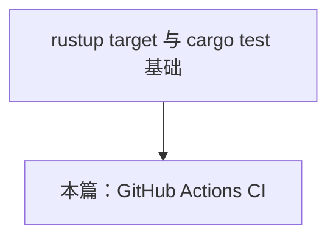
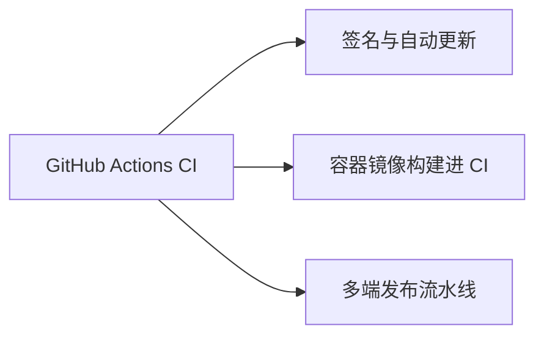

# GitHub Actions CI 指南

> **文档简介**: 为 Rust 项目搭建完整的 GitHub Actions 持续集成——rust-cache 加速、clippy+fmt 质量门禁、cargo test 测试步骤、多平台矩阵构建，以及 Tauri 官方 action 的使用概览。
>
> **目标读者**: 已掌握 `rustup target` 概念的中级开发者，需要为 Rust 服务端或 Tauri 桌面项目建立 CI 门的工程师。
>
> **前置知识**: [交叉编译 targets](./01-cross-compilation-targets.md)、GitHub Actions 的 job/step 基本模型。

## 📚 文档元数据

| 属性 | 内容 |
|------|------|
| **模块** | `11-rust-cross-platform` |
| **象限** | 操作指南 |
| **难度** | ⭐⭐ |
| **标签** | `#rust` `#deployment` `#github-actions` `#ci` |
| **更新日期** | `2026年9月` |

## 🎯 学习目标

完成本篇后，你将能够：

- ✅ **掌握核心概念**: 理解 Rust CI 的四层门禁顺序与缓存失效因素
- ✅ **实践能力**: 编写包含 lint/test/build 三 job 的工作流，并用矩阵覆盖三大桌面平台
- ✅ **解决问题**: 排查 rust-cache 未命中、clippy 本地与 CI 不一致等高频问题
- ✅ **进阶方向**: 用 tauri-action 把 Tauri 多端产物发布到 GitHub Releases，接入 [签名与自动更新](./03-signing-auto-update.md)

## 📋 目录

- [核心概念](#核心概念)
- [实践指南](#实践指南)
- [Tauri 官方 action 概览](#tauri-官方-action-概览)
- [最佳实践](#最佳实践)
- [常见问题](#常见问题)
- [相关资源](#相关资源)

---

## 🔍 核心概念

### 概念一：Rust CI 的四层门禁

**定义**: 一条按"最便宜的先跑"排序的质量流水：`cargo fmt --check` → `cargo clippy -D warnings` → `cargo test` → `cargo build`。

**关键特性**:

- fmt 秒级完成，放在最前面把格式问题挡在编译之前
- clippy 在编译的同时产出 lint 结果，`-D warnings` 把警告升级为失败——这是 Rust CI 最重要的门禁
- 测试与构建放后面，失败时日志里的信息量更大；顺序颠倒不会报错，但会浪费 CI 时间

**使用场景**:

- 场景 1：PR 必须四层全绿才允许合并；场景 2：release 分支额外追加产物构建与上传

### 概念二：rust-cache 与缓存失效

**定义**: [Swatinem/rust-cache](https://github.com/Swatinem/rust-cache) 是 Rust CI 的事实标准缓存 action，缓存对象是 `~/.cargo`（registry、git 依赖）与 `target/` 编译增量。

**关键特性**:

- 缓存键自动纳入 `Cargo.lock` 内容、`rustc` 版本与工作流文件——依赖一变即换新缓存，无需手工管 key
- `key` 参数可追加自定义维度（如矩阵的 target），避免不同平台互相污染
- 缓存只加速重复构建，首次运行必然全量编译；日常 PR 的 CI 时间可从十几分钟降到几分钟

**使用场景**:

- 场景 1：日常 PR 的增量 CI；场景 2：矩阵构建中按 target 分桶缓存

### 概念三：矩阵构建（matrix）

**定义**: 用 `strategy.matrix` 把同一个 job 复制到多个 `os`/`target` 组合上并行执行。

**关键特性**:

- 桌面三端的产物必须由对应 OS 的 runner native 构建（macOS 端无法交叉产出，原因见 [交叉编译 targets](./01-cross-compilation-targets.md) 的 Tauri 一节）
- `fail-fast: false` 让一个平台失败时其他平台继续跑完；macOS runner 默认即 Apple Silicon（`macos-latest`），产出 `aarch64-apple-darwin`

---

## 🛠️ 实践指南

### 步骤一：固定工具链版本

**目标**: 让 CI 与本地、与团队其他人构建同一把"尺子"。

**操作指南**:

1. 在仓库根添加 `rust-toolchain.toml`（见下方代码示例），锁定模块技术基线中的 stable 版本
2. CI 中用 [dtolnay/rust-toolchain](https://github.com/dtolnay/rust-toolchain) action 安装工具链——它会读取 `rust-toolchain.toml`

**验证方法**: CI 日志中 rustc 版本与 `rust-toolchain.toml` 声明一致。

### 步骤二：编写完整 CI 工作流

**目标**: lint / test / build 三个 job 一次到位。

**操作指南**: 将下方「代码示例」中的 `.github/workflows/ci.yml` 提交到仓库。

**验证方法**:

1. 推送到 GitHub，打开 Actions 页观察三个 job 并行
2. 故意留一处格式错误验证 fmt 门禁会红；在代码里加一个 `unwrap()` 观察 clippy 门禁告警

### 步骤三：接入矩阵构建与产物上传

**目标**: 每次推送产出三大平台的 release 二进制并上传为 artifact。

**操作指南**: 工作流中 `build` job 的矩阵部分（见代码示例）负责：

1. 每个 OS 安装工具链并指定 `targets: ${{ matrix.target }}`，rust-cache 追加 `key: ${{ matrix.target }}` 分桶
2. `cargo build --release --locked --target <triple>`
3. 用 `actions/upload-artifact` 按平台命名上传

**验证方法**: Actions 运行结束后在 summary 页下载 `bin-<triple>` 三个压缩包，本地解包 `file` 验证架构。

---

## 💻 代码示例

### 示例一：`rust-toolchain.toml`

```toml
# rust-toolchain.toml —— 仓库级工具链锁；版本对齐模块技术基线（README 顶部区块）
[toolchain]
channel = "1.98.1"
```

### 示例二：完整 CI 工作流

```yaml
# .github/workflows/ci.yml
# 注意：文中 action 的主版本 tag（@v4/@v2 等）为中性示意，
# 使用前请以各 action 官方仓库 README 推荐的最新主版本为准
name: CI

on:
  push:
    branches: [main]
  pull_request:

env:
  CARGO_TERM_COLOR: always

jobs:
  lint:
    runs-on: ubuntu-latest
    steps:
      - uses: actions/checkout@v4
      - uses: dtolnay/rust-toolchain@stable   # 自动读取 rust-toolchain.toml
        with:
          components: rustfmt, clippy
      - uses: Swatinem/rust-cache@v2
      - name: 格式检查
        run: cargo fmt --all -- --check
      - name: Clippy 门禁（警告即失败）
        run: cargo clippy --all-targets --all-features -- -D warnings

  test:
    runs-on: ubuntu-latest
    steps:
      - uses: actions/checkout@v4
      - uses: dtolnay/rust-toolchain@stable
      - uses: Swatinem/rust-cache@v2
      - name: 单元与集成测试
        run: cargo test --workspace --all-features

  build:
    needs: [lint, test]          # 门禁全绿才开始烧构建时间
    strategy:
      fail-fast: false
      matrix:
        include:
          - os: ubuntu-latest
            target: x86_64-unknown-linux-gnu
          - os: macos-latest     # Apple Silicon runner
            target: aarch64-apple-darwin
          - os: windows-latest
            target: x86_64-pc-windows-msvc
    runs-on: ${{ matrix.os }}
    steps:
      - uses: actions/checkout@v4
      - uses: dtolnay/rust-toolchain@stable
        with:
          targets: ${{ matrix.target }}
      - uses: Swatinem/rust-cache@v2
        with:
          key: ${{ matrix.target }}   # 按平台分桶，避免缓存互相覆盖
      - name: 构建 release 产物
        run: cargo build --release --locked --target ${{ matrix.target }}
      - name: 上传产物
        uses: actions/upload-artifact@v4
        with:
          name: bin-${{ matrix.target }}
          # myapp 换成你的包名；glob 同时命中 myapp 与 myapp.exe
          path: target/${{ matrix.target }}/release/myapp*
```

**关键点解析**:

- `--locked` 强制使用 `Cargo.lock` 现状构建，CI 结果与 lockfile 完全可复现
- `needs: [lint, test]` 是成本控制：格式都不对就没必要启动三个平台的编译
- Windows 产物同样以 `--target x86_64-pc-windows-msvc` 构建，runner 自带 MSVC 工具链，无需额外安装

### 示例三：Tauri 多端发布工作流（骨架）

```yaml
# .github/workflows/release.yml —— 完整版以 tauri-action 官方 README 模板为准
name: Release

on:
  push:
    tags: ['v*']

jobs:
  build-tauri:
    permissions:
      contents: write            # 允许 action 创建 Release
    strategy:
      fail-fast: false
      matrix:
        include:
          - platform: macos-latest
            args: --target aarch64-apple-darwin
            target: aarch64-apple-darwin
          - platform: macos-latest
            args: --target x86_64-apple-darwin
            target: x86_64-apple-darwin
          - platform: ubuntu-latest
            args: ''
          - platform: windows-latest
            args: ''
    runs-on: ${{ matrix.platform }}
    steps:
      - uses: actions/checkout@v4
      - uses: dtolnay/rust-toolchain@stable
        with:
          targets: ${{ matrix.target }}   # 非macOS条目未定义，取默认host目标
      # 前端项目在此处插入 node/pnpm 安装与构建步骤（Tauri 前端资源）
      # Linux runner 需安装 webkit2gtk 等系统依赖，清单以 Tauri 官方文档为准
      - uses: Swatinem/rust-cache@v2
        with:
          workspaces: src-tauri   # 只缓存 Tauri 的 Rust 工程
      - uses: tauri-apps/tauri-action@v0
        env:
          GITHUB_TOKEN: ${{ secrets.GITHUB_TOKEN }}
          TAURI_SIGNING_PRIVATE_KEY: ${{ secrets.TAURI_SIGNING_PRIVATE_KEY }}
          TAURI_SIGNING_PRIVATE_KEY_PASSWORD: ${{ secrets.TAURI_SIGNING_PRIVATE_KEY_PASSWORD }}
        with:
          tagName: v__VERSION__
          releaseName: MyApp v__VERSION__
          releaseDraft: true      # 先出草稿，人工检查后发布
          args: ${{ matrix.args }}
```

**关键点解析**:

- 双 `macos-latest` 条目通过 `--target` 分别产出 Apple Silicon 与 Intel 包，是 Tauri 官方模板的标准写法
- 两个 `TAURI_SIGNING_*` secret 语义见 [签名与自动更新](./03-signing-auto-update.md)；`releaseDraft: true` 把最终发布权留给人，是自动更新链路的安全阀

---

## 📱 Tauri 官方 action 概览

[tauri-apps/tauri-action](https://github.com/tauri-apps/tauri-action) 是 Tauri 团队维护的"打包+发布"一站式 action：

| 能力 | 说明 |
|------|------|
| 多端打包 | 按所在 runner OS 调用 `tauri build`，产出 .msi/.nsis、.app/.dmg、AppImage/deb/rpm |
| 发布 Release | 依 `tagName`/`releaseName` 在 GitHub Releases 创建草稿并附上全部安装包 |
| 更新器产物 | 检测到 `TAURI_SIGNING_PRIVATE_KEY` 时自动生成 `.sig` 签名文件与 latest.json 素材 |
| 版本策略 | 主版本 tag 长期停留在 `@v0`，具体用法以官方 README 为准 |

> 选择建议：纯 Rust 服务端用上文通用工作流；Tauri 应用直接采用 tauri-action 官方模板起步，再按需精简。

---

## 🎨 最佳实践

### ✅ 推荐做法

- **本地先行**：提交前跑一遍 `cargo fmt --all -- --check && cargo clippy -- -D warnings && cargo test`，CI 只做最后防线
- **`--locked` 进所有 CI 构建**：防止依赖漂移导致"昨天绿今天红"
- **矩阵加 `fail-fast: false`**：一次 PR 看到所有平台的失败，减少反复推送

### ❌ 避免陷阱

- **给缓存 key 手工塞时间戳**：会导致缓存永不命中，还占用存储配额；rust-cache 的自动键已覆盖主要失效因素
- **clippy 只在 CI 开 `-D warnings` 而本地不开**：门禁形同虚设——把同一参数写进 `Cargo.toml` 的 `[lints]` 或 `.cargo/config.toml`
- **把 macOS 构建交给 Linux runner 交叉编译**：产物无签名链且打包器不支持，见 [交叉编译 targets](./01-cross-compilation-targets.md) Q3

---

## ❓ 常见问题

### Q1: rust-cache 命中但每次仍大量重编译？
**A**: 常见原因有三：矩阵各平台未用 `key` 分桶，缓存反复被覆盖；工作流里改过 `env`，rust-cache 会把部分环境变量计入键；`cargo clean` 出现在缓存恢复之后。按顺序排查即可。

### Q2: clippy 本地通过、CI 却红？
**A**: 多半是版本差——CI 用了 `rust-toolchain.toml` 锁定版本而本地是旧 stable（或反之）。对齐 `rust-toolchain.toml` 并在本地跑 `rustup update` 后复现验证；少数情况是 CI 的 `--all-features` 打开了本地未启用的 feature 门 lint。

### Q3: Linux 构建报缺 `webkit2gtk`？
**A**: 这是 Tauri Linux 端的系统依赖，不属于 cargo 依赖。在 job 里用 `apt` 安装，具体包清单随 Tauri 版本演进，以官方"Prerequisites"文档为准，不要照抄旧教程的包名。

---

## 🔗 相关资源

### 📖 延伸阅读

- **官方文档**: [Tauri - GitHub Actions Guide](https://v2.tauri.app/distribute/ci/) - tauri-action 的官方工作流模板
- **工具文档**: [Swatinem/rust-cache](https://github.com/Swatinem/rust-cache) - 缓存键构成与参数
- **官方文档**: [GitHub Actions workflow syntax](https://docs.github.com/actions/using-workflows/workflow-syntax-for-github-actions) - 语法权威参考

### 🛠️ 工具资源

- **开发工具**: [dtolnay/rust-toolchain](https://github.com/dtolnay/rust-toolchain) - 工具链安装 action

---

## 🎯 练习与实践

### 练习一：给现有项目接入门禁

**目标**: 把四层门禁跑通。

**任务要求**:

1. 在任一 Rust 项目提交示例二工作流（可先只保留 lint/test）
2. 制造一次 fmt 违规与一次 clippy 警告，确认两个门禁分别拦截
3. 修复后观察全绿

**评估标准**: 两次故意违规均被对应 job 拦截，且失败日志能定位到文件行号。

### 练习二：三平台矩阵产物

**挑战任务**:

- 打开 `build` job 的矩阵，等 Actions 跑完下载三个 artifact
- 在本机 `file` 命令验证每个产物的架构与格式

**提示**: macOS 与 Windows runner 的免费额度比 Linux 少，验证阶段可先注释掉这两个矩阵项，确认流程无误后再打开。

---

## 📊 知识图谱

### 前置知识



### 后续学习



---

## 🔄 文档交叉引用

### 相关文档

- 📄 **[交叉编译 targets](./01-cross-compilation-targets.md)**: 矩阵中每个 target 的来历与 host 约束
- 📄 **[签名与自动更新](./03-signing-auto-update.md)**: tauri-action 的签名 secrets 如何产生
- 📄 **[容器化服务](./04-containerized-services.md)**: 在 CI 中追加 docker build 的衔接点
- 📄 **[多端发布流水线](../projects/05-multiplatform-release.md)**: 本篇工作流的完整实战版；亦可对照 [Go CI/CD 流水线](../../01-go-backend/deployment/02-ci-cd-pipelines.md) 比较门禁与缓存设计

---

## 📝 总结

### 核心要点回顾

1. **门禁排序即成本排序**：fmt → clippy → test → build，便宜的先跑，`-D warnings` 是 Rust CI 的灵魂参数
2. **缓存按 target 分桶**：rust-cache 自动键 + `key: ${{ matrix.target }}` 是矩阵场景的标准姿势
3. **Tauri 交给 tauri-action**：按 runner OS native 打包，签名与 Release 一步到位

### 学习成果检查

- [ ] 能默写四层门禁的命令与顺序
- [ ] 理解 rust-cache 缓存键的三个自动成分
- [ ] 知道 tauri-action 解决的是"打包+发布"而非"测试"

---

**文档版本**: v1.0.0
**最后更新**: 2026年9月
**维护团队**: Dev Quest Team

---

> 💡 **学习建议**: 示例二的通用工作流与示例三的 Tauri 骨架覆盖了本模块两条主线（Axum 服务端 / Tauri 桌面端），先跑通与你当前项目匹配的那条。
>
> 🎯 **下一步**: [签名与自动更新](./03-signing-auto-update.md)
