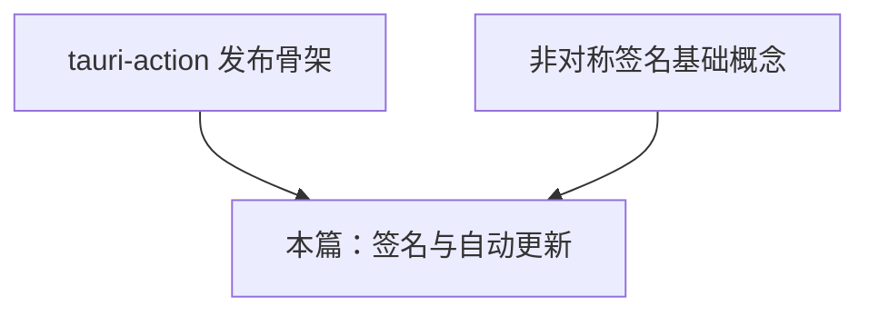
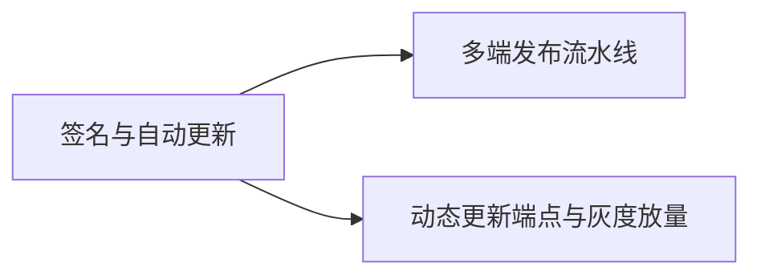

# 签名与自动更新指南

> **文档简介**: 打通 Tauri 应用的分发安全链路——tauri updater 插件、`tauri signer` 公钥/签名对、latest.json 更新清单结构，以及 macOS 公证与 Windows Authenticode 的平台签名流程概览。
>
> **目标读者**: 已能通过 CI 产出多端安装包的工程师，需要让用户"安装不报警、更新零操作"的桌面应用发布者。
>
> **前置知识**: [GitHub Actions CI](./02-github-actions-ci.md) 中的 tauri-action 骨架、[交叉编译 targets](./01-cross-compilation-targets.md) 的 Tauri host 约束。

## 📚 文档元数据

| 属性 | 内容 |
|------|------|
| **模块** | `11-rust-cross-platform` |
| **象限** | 操作指南 |
| **难度** | ⭐⭐⭐ |
| **标签** | `#rust` `#deployment` `#tauri` `#signing` `#updater` |
| **更新日期** | `2026年9月` |

## 🎯 学习目标

完成本篇后，你将能够：

- ✅ **掌握核心概念**: 理解 Tauri 更新器的"公钥内嵌 + 私钥签名"信任模型与两种更新端点模式
- ✅ **实践能力**: 生成密钥对、配置 updater 插件、在 CI 中产出带签名的更新产物与 latest.json
- ✅ **解决问题**: 处理签名校验失败、平台签名（公证/Authenticode）缺位导致的安装报警
- ✅ **进阶方向**: 在 [多端发布流水线](../projects/05-multiplatform-release.md) 中实现端到端的自动更新发布

## 📋 目录

- [核心概念](#核心概念)
- [实践指南](#实践指南)
- [平台签名流程概览](#平台签名流程概览)
- [最佳实践](#最佳实践)
- [常见问题](#常见问题)
- [相关资源](#相关资源)

---

## 🔍 核心概念

### 概念一：Tauri updater 插件的信任模型

**定义**: tauri 更新器采用 minisign 风格的签名验证——**私钥离线签产物，公钥内嵌进应用**，客户端只信"对应公钥验证通过的更新包"，与托管服务器是否被入侵无关。

**关键特性**:

- 公钥写在 `tauri.conf.json` 的 `plugins.updater.pubkey`，随应用分发给所有用户
- 私钥（`.key` 文件）只存在于本机或 CI secret，泄露即等同失去更新通道控制权
- 验证在应用内完成，因此更新源可以是任意的静态 CDN——不需要服务器端做任何验证逻辑

**使用场景**:

- 场景 1：安装包托管在 GitHub Releases / 对象存储上，客户端定期拉取检查
- 场景 2：私有部署场景下，用自家 Nginx 托管静态更新清单

### 概念二：两种更新端点模式

**定义**: updater 插件轮询 `endpoints` 配置的 URL 获取更新描述，支持两种形式。

**关键特性**:

- **静态 JSON**：一个手工/CI 生成的 `latest.json`，`platforms` 字段里列出各平台下载地址与签名，适合小型项目
- **动态端点**：URL 模板含 `{{target}}`、`{{arch}}`、`{{current_version}}` 占位符，由你的服务按请求方平台返回对应 JSON，适合灰度/分阶段放量
- 两种模式下，客户端拿到的都是同构的 `{ version, signature, url }` 三元组

### 概念三：平台签名 vs 更新器签名

**定义**: 两套独立机制——**更新器签名**（tauri signer）保证"更新包没被篡改"；**平台签名**（macOS 公证 / Windows Authenticode）保证"安装包出自可信开发者"，影响的是首次安装体验。

**关键特性**:

- 更新器签名是 Tauri 应用内的验证，跨平台机制统一
- 平台签名绑定各 OS 生态：macOS 要 Developer ID + 公证，Windows 要代码签名证书
- 二者缺一不可：没有平台签名，用户首次安装就过不去；没有更新器签名，装好后的自动更新被拒绝

---

## 🛠️ 实践指南

### 步骤一：生成更新器密钥对

**目标**: 拿到 `plugins.updater.pubkey` 需要的公钥与 CI 签名需要的私钥。

**操作指南**:

```bash
# 在项目根执行（-w 指定私钥输出路径）
cargo tauri signer generate -w ~/.tauri/myapp.key
# 命令会提示设置私钥密码（建议非空），随后输出：
#   私钥: ~/.tauri/myapp.key          —— 进 CI secret，绝不入库
#   公钥: ~/.tauri/myapp.key.pub      —— 内容贴进 tauri.conf.json
```

**验证方法**: 两个文件存在，`.key.pub` 内容为一段 `untrusted comment:` 开头的文本。

### 步骤二：配置 updater 插件

**目标**: 应用侧具备检查与安装更新的能力。

**操作指南**:

1. `tauri.conf.json` 写入公钥与端点、开启更新器产物生成（见代码示例一）
2. 安装插件并注册：Rust 侧 `tauri-plugin-updater`（版本对齐模块技术基线，随 Tauri 2 系列发布），前端侧调用其 API 触发检查与安装
3. 插件权限（capabilities）中放行 updater 相关权限，写法以插件文档为准

**验证方法**: 本地 `cargo tauri dev` 下手动指向一个测试端点，观察日志出现检查请求。

### 步骤三：CI 中注入签名私钥

**目标**: 让 tauri-action 在构建时自动签名更新产物。

**操作指南**:

1. 在仓库 Settings → Secrets 添加 `TAURI_SIGNING_PRIVATE_KEY`（私钥文件全文）与 `TAURI_SIGNING_PRIVATE_KEY_PASSWORD`（生成时设的密码）
2. 在发布工作流中把两个 secret 以环境变量传给 tauri-action（见 [GitHub Actions CI](./02-github-actions-ci.md) 示例三）
3. 构建完成后，产物旁会出现同名 `.sig` 文件——即更新器签名

**验证方法**: Release 草稿里每个安装包旁都有对应 `.sig`；产物文件在本地被改动哪怕一个字节，`.sig` 验证即失败。

### 步骤四：生成并校验 latest.json

**目标**: 静态端点模式下，把各平台产物织入一份更新清单。

**操作指南**:

1. 收集 CI 产出的各平台更新包与 `.sig` 文件内容
2. 按下方代码示例二的 `OS-ARCH` 键结构组装 JSON，`signature` 字段填 `.sig` 文件的**全文内容**（不是路径！）
3. 上传清单与更新包到同一 CDN，保证 URL 可公网直达
4. tauri-action 在 GitHub Releases 模式下会自动生成这份 latest.json，手工模式才需要自己组装

**验证方法**: `curl` 该 URL 返回合法 JSON；把其中 `version` 调高于当前安装版本后，应用能收到更新提示。

---

## 💻 代码示例

### 示例一：`tauri.conf.json` 更新器配置

```json
{
  "bundle": {
    "createUpdaterArtifacts": true
  },
  "plugins": {
    "updater": {
      "pubkey": "<~/.tauri/myapp.key.pub 的内容原样粘贴>",
      "endpoints": [
        "https://releases.example.com/myapp/latest.json",
        "https://github.com/your-org/myapp/releases/latest/download/latest.json"
      ]
    }
  }
}
```

**关键点解析**:

- `createUpdaterArtifacts: true` 让 `tauri build` 额外产出更新器专用包与 `.sig` 签名文件
- `endpoints` 按顺序轮询，前一个失败自动尝试下一个——静态 CDN 与 GitHub Releases 可以互为备份
- 动态端点写法形如 `https://api.example.com/updates/{{target}}/{{arch}}/{{current_version}}`

### 示例二：latest.json 静态更新清单

```json
{
  "version": "1.2.0",
  "notes": "修复深色模式崩溃，新增全局快捷键。",
  "pub_date": "2026-09-16T08:00:00Z",
  "platforms": {
    "darwin-aarch64": {
      "signature": "<MyApp.app.tar.gz.sig 文件的全文内容>",
      "url": "https://releases.example.com/myapp/1.2.0/MyApp_aarch64.app.tar.gz"
    },
    "darwin-x86_64": {
      "signature": "<MyApp_x64.app.tar.gz.sig 文件的全文内容>",
      "url": "https://releases.example.com/myapp/1.2.0/MyApp_x64.app.tar.gz"
    },
    "linux-x86_64": {
      "signature": "<MyApp.AppImage.sig 文件的全文内容>",
      "url": "https://releases.example.com/myapp/1.2.0/MyApp.AppImage"
    },
    "windows-x86_64": {
      "signature": "<MyApp_x64-setup.exe.sig 文件的全文内容>",
      "url": "https://releases.example.com/myapp/1.2.0/MyApp_x64-setup.exe"
    }
  }
}
```

**关键字段说明**:

| 字段 | 约束 |
|------|------|
| `version` | 合法 SemVer，`1.2.0` 与 `v1.2.0` 均可；高于客户端当前版本即触发更新 |
| `notes` | 可选，展示给用户的更新说明 |
| `pub_date` | 可选，RFC 3339 格式时间戳 |
| `platforms` | 键为 `OS-ARCH`（OS 取 `linux`/`darwin`/`windows`；ARCH 取 `x86_64`/`aarch64` 等） |
| `signature` | 对应 `.sig` 文件全文，**每次构建都会变，不能复用旧值** |
| `url` | 更新包直链，客户端下载后先验签再安装 |

> 注意：Tauri 会先整体校验 JSON 合法性再比对版本号，所以列出的每个平台条目都必须完整合法。

### 示例三：手动签名验证（发布前抽查）

```bash
# 用公钥抽查某个产物签名是否匹配（命令参数以 tauri signer --help 为准）
cargo tauri signer verify -p ~/.tauri/myapp.key.pub \
  MyApp_1.2.0_x64-setup.exe.sig MyApp_1.2.0_x64-setup.exe
```

---

## 🖥️ 平台签名流程概览

### macOS：签名 + 公证

macOS 分发要过两道门：**codesign 签名**（Developer ID Application 证书）与**公证**（notarization，Apple 云端扫描后票据回贴）。

- 本地签名：证书装进钥匙串后，在 `tauri.conf.json` 的 `bundle.macOS.signingIdentity` 指定身份，或用环境变量 `APPLE_SIGNING_IDENTITY` 覆盖
- CI 公证（tauri-action 自动完成）：提供以下 secrets 即可，全程不需要手工 Xcode 操作
  - `APPLE_CERTIFICATE` / `APPLE_CERTIFICATE_PASSWORD`：`.p12` 证书的 base64 内容与密码
  - `APPLE_ID` + `APPLE_PASSWORD` + `APPLE_TEAM_ID`：Apple 账号方式认证；或改用 `APPLE_API_KEY` + `APPLE_API_ISSUER`（App Store Connect API 密钥）
- 证书导入钥匙串的 keychain 步骤（`security import` 等）在 Tauri 官方 CI 模板中有现成脚本，直接采用

### Windows：Authenticode

Windows 用代码签名证书对安装包做 Authenticode 签名，否则 SmartScreen 会拦截下载与安装。

- 在 `tauri.conf.json` 的 `bundle.windows` 配置三项（见下），前提是签名证书已装入 **Windows 证书库**（构建机必须是 Windows runner，用户级证书存储即可）
- 证书来源两条路：OV 证书（组织验证，价格低但 SmartScreen 信誉积累慢）与云签名服务（如 Azure Trusted Signing，按调用计费、无需硬件）
- EV 证书传统上绑定硬件 U 盾，CI 场景下优先考虑云签名方案
- 注意：[交叉编译 targets](./01-cross-compilation-targets.md) 提到的 NSIS 交叉打包场景中，安装包签名需要外部签名工具，官方不支持走上述内置流程——又一个"Windows 端必须在 Windows 构建"的理由

```json
{
  "bundle": {
    "windows": {
      "certificateThumbprint": "<证书指纹，certmgr 查看详情页可得>",
      "digestAlgorithm": "sha256",
      "timestampUrl": "http://timestamp.digicert.com"
    }
  }
}
```

> `timestampUrl` 给签名附加时间戳，让证书过期后已发布的老安装包依然有效——不要省略。

---

## 🎨 最佳实践

### ✅ 推荐做法

- **公钥发布前冻结**：公钥随应用出厂，一旦发布就难以更换（换了=老用户全部收不到更新）；上生产前确认密钥对即为"最终密钥对"
- **私钥只活在 CI secret**：本机生成后立即转入 secret 存储，工作区不留副本；`.key` 文件加入 `.gitignore` 兜底
- **发布前抽查验签**：用示例三的 verify 命令抽查各平台产物，把"用户更新失败"挡在发布前
- **`releaseDraft: true` 人工放行**：自动更新一旦推错就是全量事故，草稿审核是最后一道闸

### ❌ 避免陷阱

- **`signature` 字段填了文件路径或 URL**：必须填 `.sig` 文件内容全文，这是新手最高频的翻车点
- **复用上一版的签名**：签名与产物一一对应，改了产物没换签名会直接校验失败
- **私钥密码设为空且私钥入库**：等于把更新通道的控制权交给任何能读仓库的人
- **latest.json 里只写部分平台**：Tauri 整体校验 JSON，某个已发布平台缺条目会让该平台用户收不到任何更新

---

## ❓ 常见问题

### Q1: 客户端报 "signature verification failed"？
**A**: 按序排查：`signature` 是否为 `.sig` 文件全文（而非路径）；该 `.sig` 是否对应当前这个产物文件（重新构建后签名会变）；客户端内嵌公钥与签名所用私钥是否为同一对。三者都对则检查产物在托管时是否被 CDN/网关二次压缩或篡改（对比字节大小与哈希）。

### Q2: 更新检查请求根本没发出？
**A**: 检查三处：插件是否在应用入口注册（不仅是加依赖）；capabilities 是否放行 updater 权限；`endpoints` 的 URL 是否为 HTTPS 且可从用户网络直达（公司内网环境常见误报）。

### Q3: macOS 用户安装时提示"已损坏"或开发者无法验证？
**A**: 产物未经签名公证。确认 CI 的 `APPLE_CERTIFICATE` 等 secrets 齐全、`signingIdentity` 指向 Developer ID Application（不是 Mac Developer 本地调试证书），并且 tauri-action 完成了公证等待环节；本地手工构建的包必须单独走 codesign + notarytool 流程。

### Q4: 换了电脑重新生成密钥对会怎样？
**A**: 新私钥签的更新，老客户端全部拒收——公钥已经固化在他们机器里。所以密钥对要当作长期资产管理：备份到安全介质（密码 + 私钥分开存），而不是"丢了再生成"。

---

## 🔗 相关资源

### 📖 延伸阅读

- **官方文档**: [Tauri - Updater Plugin](https://v2.tauri.app/plugin/updater/) - 插件配置与端点格式的权威来源
- **官方文档**: [Tauri - macOS Code Signing](https://v2.tauri.app/distribute/sign/macos/) - 公证 secrets 全集
- **官方文档**: [Tauri - Windows Code Signing](https://v2.tauri.app/distribute/sign/windows/) - 证书库与云签名说明

### 🛠️ 工具资源

- **开发工具**: [tauri signer](https://v2.tauri.app/cli/) - CLI 子命令文档（generate/verify/sign）
- **在线平台**: [tauri-action](https://github.com/tauri-apps/tauri-action) - 自动生成 latest.json 的 CI 集成

---

## 🎯 练习与实践

### 练习一：本地全链路更新演练

**目标**: 不依赖 CI，在单机上体验完整更新循环。

**任务要求**:

1. 生成密钥对，配置 `tauri.conf.json` 并 `createUpdaterArtifacts: true`
2. 构建 v1.0.0 并安装启动；把版本号改为 1.0.1 重新构建
3. 用 v1.0.1 的产物与签名组装本地 latest.json（可指向 `http://127.0.0.1` 的静态服务），观察 v1.0.0 收到更新并完成升级

**评估标准**: 更新前后应用版本变化，且全程日志无验签报错。

### 练习二：CI 接入签名

**挑战任务**:

- 将密钥对写入仓库 secrets，为 [GitHub Actions CI](./02-github-actions-ci.md) 示例三的工作流打 tag 触发
- 检查 Release 草稿中每个安装包旁是否出现 `.sig`，并下载抽查 verify

**提示**: 私钥内容是整个文件（含首尾 comment 行），粘贴时不要截断。

---

## 📊 知识图谱

### 前置知识



### 后续学习



---

## 🔄 文档交叉引用

### 相关文档

- 📄 **[GitHub Actions CI](./02-github-actions-ci.md)**: 提供 tauri-action 工作流骨架与 secrets 注入位置
- 📄 **[交叉编译 targets](./01-cross-compilation-targets.md)**: 各平台签名对 host OS 的约束
- 📄 **[桌面与多端打包](../frameworks/07-desktop-packaging.md)**: 安装包形态与打包器配置全景
- 📄 **[多端发布流水线](../projects/05-multiplatform-release.md)**: 本篇机制的实战整合
- 📄 **[Go 应用 Docker 部署](../../01-go-backend/deployment/01-containerization.md)**: 对照服务端"免签名容器分发"体会桌面分发的信任链差异

---

## 📝 总结

### 核心要点回顾

1. **两套签名各管一段**：平台签名管"装得上"，更新器签名管"更得动"，都不能省
2. **公钥是终身承诺**：内嵌即出厂，生成前想清楚；私钥即命脉，只活 secret 里
3. **latest.json 的三个细节**：`signature` 是全文不是路径、每次构建都变、所有已发布平台都要有条目

### 学习成果检查

- [ ] 能画出"私钥签名 → CDN 托管 → 客户端验签"的完整链路
- [ ] 说得出 macOS 公证与 Windows Authenticode 各自的证书与认证方式
- [ ] 完成过一次本地全链路更新演练

---

**文档版本**: v1.0.0
**最后更新**: 2026年9月
**维护团队**: Dev Quest Team

---

> 💡 **学习建议**: 签名链路的特点是"错一处全链路静默失败"，练习一的本地演练务必完整跑一遍，CI 集成才有调试基准。
>
> 🎯 **下一步**: [容器化服务](./04-containerized-services.md)
