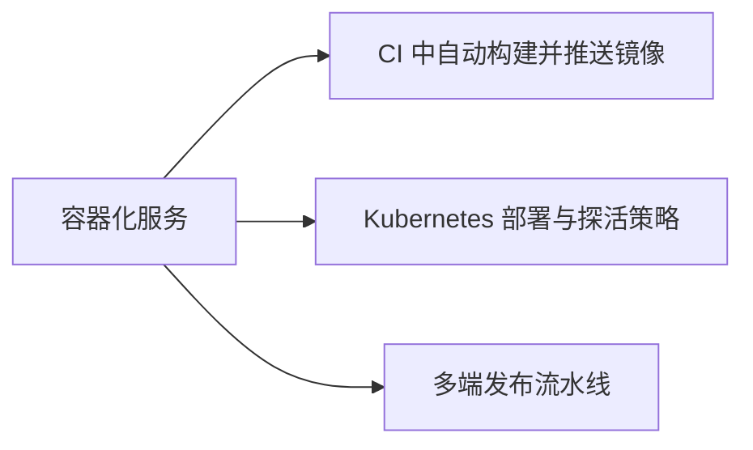

# Rust 服务容器化指南

> **文档简介**: 把 Axum 服务装进尽可能小的容器——多阶段 Dockerfile（rust 构建层 → distroless/alpine 运行层）、musl 静态链接、健康检查端点，以及 docker-compose 编排 Axum + Postgres 的完整示例。
>
> **目标读者**: 已掌握 [交叉编译 targets](./01-cross-compilation-targets.md) 基本概念的中级开发者，需要为 Rust 后端服务（Axum 0.8 + Tokio 技术栈）构建生产镜像的工程师。
>
> **前置知识**: Docker 镜像与 Dockerfile 基础语法、Axum 路由与 Tokio 异步基础（见 [Axum 字典](../reference/framework-essentials/11-axum-essentials.md)）。

<details>
<summary>文档信息（用途、难度与维护记录）</summary>

## 📚 文档元数据

| 属性 | 内容 |
|------|------|
| **模块** | `11-rust-cross-platform` |
| **象限** | 操作指南 |
| **难度** | ⭐⭐⭐ |
| **标签** | `#rust` `#deployment` `#docker` `#axum` |
| **更新日期** | `2026年9月` |

</details>

## 🎯 学习目标

完成本篇后，你将能够：

- ✅ **掌握核心概念**: 理解 Rust 镜像体积优势的来源与 distroless/alpine/musl 三种运行时方案的取舍
- ✅ **实践能力**: 编写多阶段 Dockerfile 并产出 10MB 级生产镜像
- ✅ **解决问题**: 处理 C 依赖链接失败、distroless 无 shell 的健康检查、容器内数据库连接等典型问题
- ✅ **进阶方向**: 用 compose 编排本地开发环境，接入 [GitHub Actions CI](./02-github-actions-ci.md) 自动构建镜像

## 📋 目录

- [核心概念](#-核心概念)
- [实践指南](#️-实践指南)
- [代码示例](#-代码示例)
- [最佳实践](#-最佳实践)
- [常见问题](#-常见问题)
- [相关资源](#-相关资源)

---

## 🔍 核心概念

### 概念一：多阶段构建

**定义**: 同一个 Dockerfile 分"构建层"与"运行层"两段——构建层装全套 rustc 与 C 工具链（GB 级），运行层只拷出最终二进制（MB 级）。

**关键特性**:

- `COPY --from=builder` 只搬产物，构建工具链、源码、`target/` 中间物全部留在废弃层
- Rust 无解释器、无运行时依赖，运行层理论上只需一个二进制文件——这是 Rust 容器比 Node/Python 容器小一个数量级的根本原因
- 构建层与运行层的基础镜像可以完全不同（glibc ↔ musl 需匹配，见概念二）

**使用场景**:

- 场景 1：Axum API 服务交付给 Kubernetes / 云容器平台；场景 2：内网工具镜像，要求最小攻击面

### 概念二：musl 静态链接与运行时镜像选择

**定义**: `x86_64-unknown-linux-musl` 产物自带 C 标准库，不依赖宿主 glibc，因此运行层可以用极简镜像。

**关键特性**:

- **distroless（glibc 路线）**：构建用默认 gnu target，运行层用 distroless——含 glibc 运行库与 CA 证书，无 shell、无包管理器，与依赖动态链接 glibc 的 C 库兼容
- **alpine（musl 路线）**：构建层用 rust alpine 镜像产出静态二进制，运行层用 alpine——保留 `apk`/`sh`，调试方便
- 选择判据一句话：**依赖里有动态 C 库选 distroless，追求极简且纯 Rust 选 alpine，极限体积选 scratch（静态二进制 + 手动拷入 CA 证书）**

### 概念三：容器内的网络与探活

**定义**: 容器化改变了进程的两个假设——监听地址与"进程活着"的判定方式。

**关键特性**:

- 服务必须绑定 `0.0.0.0` 而非 `127.0.0.1`：localhost 在容器内只有自己，健康检查与外部流量都会被拒
- 健康检查需要一个轻量 HTTP 端点（如 `/health`）或进程自检命令；distroless 无 shell，探活要么用镜像里唯一的二进制自检，要么换 alpine

---

## 🛠️ 实践指南

### 步骤一：编写多阶段 Dockerfile（distroless 变体）

**目标**: 产出无 shell、无包管理器的最小生产镜像。

**操作指南**:

1. 按下方代码示例一建立 `Dockerfile`，运行层用 distroless 与构建层的 glibc 产物天然匹配
2. 配套建立 `.dockerignore`，把 `target/`、`.git` 挡在构建上下文外（否则上下文上传巨大且会污染缓存）

**验证方法**: `docker build -t myapp .` 成功；`docker image ls myapp` 观察体积（通常 10-30MB）；`docker run --rm myapp` 后另开终端 `curl localhost:8080/health` 返回 `ok`。

### 步骤二：alpine + musl 变体

**目标**: 纯静态产物 + 可调试运行层。

**操作指南**:

1. 构建层换成 rust alpine 镜像并装 `musl-dev`，以 `--target x86_64-unknown-linux-musl` 构建（target 概念见 [交叉编译 targets](./01-cross-compilation-targets.md) 步骤三）
2. 运行层用 alpine，`apk add ca-certificates tzdata` 补齐 TLS 根证书与时区；依赖含 C 库（如 `openssl-sys`）时优先改用 rustls 系纯 Rust 实现

**验证方法**: 进入运行容器 `ldd /app` 显示 "not a dynamic executable"；镜像体积对比 distroless 变体记录差异。

### 步骤三：实现健康检查端点

**目标**: 给 Axum 服务加 `/health` 端点，作为所有探活的基础。

**操作指南**:

1. 路由挂载 `health` handler（代码示例三按 Axum 0.8 API 编写）；端点只做"进程能应答"这一件事——数据库连通性之类的重检查放 `/ready`。将它放入锁定版本的 Axum 工程后再编译。
2. 在 Dockerfile/compose 中配置 HEALTHCHECK 消费该端点（见示例一、四）

### 步骤四：compose 编排 Axum + Postgres

**目标**: 一条 `docker compose up` 拉起"应用 + 数据库"的完整本地环境。

**操作指南**:

1. 按代码示例四编写 `compose.yaml` 与 `.env`；`DATABASE_URL` 的 host 写**服务名** `db` 而非 `localhost`——容器网络中服务名即 DNS
2. `depends_on` 用 `condition: service_healthy` 等数据库真正就绪（默认只等启动，不等就绪）
3. 生产环境不要用 compose 直接跑 Postgres 数据卷管理，此处定位是**本地开发与集成测试**

**验证方法**: `docker compose up --build` 后 `curl localhost:8080/health` 返回 `ok`；`docker compose ps` 两个服务均 `healthy`。

---

## 💻 代码示例

### 示例一：多阶段 Dockerfile（distroless 运行层）

```dockerfile
# ---------- 构建层 ----------
# rust 镜像 tag 跟随模块技术基线（见模块 README 顶部区块）
FROM rust:1.98-slim AS builder

WORKDIR /build

# 先拷清单再拷源码：依赖不变时 Docker 层缓存直接命中（体量大后可引入 cargo-chef 精细缓存）
COPY Cargo.toml Cargo.lock ./
COPY src ./src

# --locked 严格按 Cargo.lock 构建，保证可复现
RUN cargo build --release --locked

# ---------- 运行层 ----------
# distroless 仅含 glibc 运行库与 CA 证书，无 shell；变体与 tag 以官方仓库为准
FROM gcr.io/distroless/cc-debian12

COPY --from=builder /build/target/release/myapp /app

# distroless 自带 nonroot 用户；监听 1024 以上端口无需特权
USER nonroot:nonroot

EXPOSE 8080

ENTRYPOINT ["/app"]
```

### 示例二：alpine + musl 静态变体

```dockerfile
# ---------- 构建层（musl 工具链） ----------
FROM rust:1.98-alpine AS builder

RUN apk add --no-cache musl-dev

WORKDIR /build
COPY Cargo.toml Cargo.lock ./
COPY src ./src

RUN cargo build --release --locked --target x86_64-unknown-linux-musl

# ---------- 运行层（alpine） ----------
FROM alpine:3
RUN apk add --no-cache ca-certificates tzdata

COPY --from=builder /build/target/x86_64-unknown-linux-musl/release/myapp /app

USER 65532:65532
EXPOSE 8080

# alpine 自带 wget（busybox），可直接探活
HEALTHCHECK --interval=30s --timeout=3s --start-period=5s --retries=3 \
    CMD wget -qO- http://127.0.0.1:8080/health || exit 1

ENTRYPOINT ["/app"]
```

### 示例三：Axum 健康检查端点

```toml
# Cargo.toml 相关片段：版本对齐模块技术基线（README 顶部区块）
[dependencies]
axum = "0.8"
tokio = { version = "1.53", features = ["full"] }
```

```rust
use axum::{http::StatusCode, routing::get, Router};

/// 健康检查端点：容器编排与负载均衡的探活依据
async fn health() -> (StatusCode, &'static str) {
    (StatusCode::OK, "ok")
}

#[tokio::main]
async fn main() {
    let app = Router::new().route("/health", get(health));
    // 监听 0.0.0.0：容器内必须绑定所有网卡而非 localhost
    let listener = tokio::net::TcpListener::bind("0.0.0.0:8080")
        .await
        .expect("端口 8080 绑定失败");
    axum::serve(listener, app).await.expect("服务器运行失败");
}
```

**关键点解析**: 返回值 `(StatusCode, &'static str)` 是 Axum 的 `IntoResponse` 组合用法；端口须与 `EXPOSE`、compose 映射、探活 URL 三处一致。将片段合入锁定依赖版本的项目后执行 `cargo check`。

### 示例四：compose 编排（Axum + Postgres）

```yaml
# compose.yaml —— 现代 Compose 规范已不需要顶层 version 字段
services:
  app:
    build: .
    ports:
      - "8080:8080"
    environment:
      # host 是服务名 db，不是 localhost
      DATABASE_URL: postgres://app:${DB_PASSWORD:?请在 .env 提供 DB_PASSWORD}@db:5432/appdb
      RUST_LOG: info
    depends_on:
      db:
        condition: service_healthy   # 等 Postgres 真正就绪再启动应用
    restart: unless-stopped
    # distroless 变体无 wget/shell，探活改用自检子命令：
    # healthcheck: { test: ["CMD", "/app", "health"], interval: 30s, timeout: 3s, retries: 3 }

  db:
    image: postgres:17-alpine   # 按需选用受支持的主版本
    environment:
      POSTGRES_USER: app
      POSTGRES_PASSWORD: ${DB_PASSWORD:?请在 .env 提供 DB_PASSWORD}
      POSTGRES_DB: appdb
    volumes:
      - pgdata:/var/lib/postgresql/data
    healthcheck:
      test: ["CMD-SHELL", "pg_isready -U app -d appdb"]
      interval: 10s
      timeout: 5s
      retries: 5

volumes:
  pgdata:

# 配套 .env（不进版本库，另建 .env.example 模板）：DB_PASSWORD=change-me-locally
```

### 示例五：distroless 探活自检子命令

distroless 里没有 `wget`/`curl`，让二进制自己支持探活子命令即可。以下 std 实现需要以 `rustc --edition 2024` 编译，并分别以健康和不健康输入检查两条退出路径：

```rust
// 供 distroless 镜像 HEALTHCHECK 调用的自检子命令（镜像内无 shell/wget）
use std::process::exit;

fn main() {
    let args: Vec<String> = std::env::args().collect();
    match args.get(1).map(|s| s.as_str()) {
        Some("health") => match std::net::TcpStream::connect("127.0.0.1:8080") {
            Ok(_) => exit(0),
            Err(e) => {
                eprintln!("health check failed: {e}");
                exit(1);
            }
        },
        _ => {
            eprintln!("usage: app [health]");
            exit(2);
        }
    }
}
```

---

## 🎨 最佳实践

构建层与运行层的 libc、架构、证书和动态依赖要匹配，锁文件并不覆盖这些条件。非特权运行后验证所需目录与监听端口权限；构建上下文只包含实际需要的输入。

只绑定容器内 127.0.0.1 通常无法通过外部端口映射访问，但同容器回环健康检查可能仍成功，因此健康探测位置很重要。数据库未就绪时应用应有明确失败或重试策略，启动顺序不能保证下游以后永不掉线。

---

## ❓ 常见问题

### Q1: 构建阶段报 `error: linker 'cc' not found`？
**A**: rust slim/alpine 基础镜像的工具链不齐。alpine 加 `apk add musl-dev`；debian 系若依赖含 C 代码加 `apt-get install -y build-essential`（或直接用非 slim 的 rust 镜像，代价是构建层更大，运行层不受影响）。

### Q2: distroless 镜像怎么调试？连 shell 都没有。
**A**: 设计上就是"不可 SSH 进去"——排查靠日志（确保 `RUST_LOG`/tracing 输出到 stdout）与临时换 debug 变体。急用时 `docker debug`（Docker Desktop）或临时把运行层换成 alpine 镜像排查，定位完换回。

### Q3: 容器里连不上 Postgres / 镜像还是太大？
**A**: 连不上按三步排查：`DATABASE_URL` 的 host 是否用了服务名（`db`）而不是 `localhost`；compose 里两服务是否在同一默认网络；数据库健康检查是否已通过（`docker compose ps` 看 STATUS）。镜像太大则依次检查：是否忘了多阶段（把 `target/` 拷进来了）；是否用 debug 产物（确认 `--release`）；进阶手段是 `cargo-chef` 缓存与 `[profile.release] strip = true`。
**A**: 依次检查：是否忘了多阶段（把 `target/` 整个拷进来了）；是否用 debug 产物（确认 `--release`）；依赖里是否混入庞大的 C 库；进阶手段是 `cargo-chef` 精细缓存层与 strip（`strip = true` 写进 `[profile.release]`）。

---

## 🔗 相关资源

### 📖 延伸阅读

- **官方文档**: [Docker 多阶段构建](https://docs.docker.com/build/building/multi-stage/) - 语法与缓存行为权威说明
- **官方文档**: [distroless](https://github.com/GoogleContainerTools/distroless) - 变体选择（cc/static）与 tag 说明
- **工具文档**: [cargo-chef](https://github.com/LukeMathWalker/cargo-chef) - Rust 依赖层缓存的经典方案
- **在线平台**: [Axum 官方示例集](https://github.com/tokio-rs/axum/tree/main/examples) - serve/TcpListener 写法来源

---

## 🎯 练习与实践

### 练习一：两种镜像的体积对决

**目标**: 直观感受 libc 路线对镜像的影响。

**任务要求**:

1. 用示例一、示例二分别构建同一项目，`docker image ls` 记录体积与构建时间
2. 给示例二追加 `strip = true` 到 `[profile.release]` 再构建一次，记录差值

**评估标准**: 能说清两条路线的体积差来源（glibc 动态 vs musl 静态 + strip）。

### 练习二：完整 compose 环境

**挑战任务**:

- 让 Axum 服务启动时用 `DATABASE_URL` 建连（SQLx 连接池），数据库就绪前应用给出明确错误而非 panic
- 组合 `condition: service_healthy` 与重试逻辑，验证 `docker compose up` 一次拉起全绿

**提示**: 运行期数据库连接失败属于重试范畴，用启动重试循环而非崩溃退出。

---

## 📊 知识图谱

### 后续学习



---

## 🔄 文档交叉引用

### 相关文档

- 📄 **[交叉编译 targets](./01-cross-compilation-targets.md)**: musl target 与 C 依赖的底层原理
- 📄 **[GitHub Actions CI](./02-github-actions-ci.md)**: 把本篇 Dockerfile 接进 CI 自动构建
- 📄 **[Axum 知识字典](../reference/framework-essentials/11-axum-essentials.md)**: 路由/中间件/响应模型的完整参考
- 📄 **[多端发布流水线](../projects/05-multiplatform-release.md)**: 服务端镜像 + 桌面端安装包的统一发布；亦可对照 [Go 应用 Docker 部署](../../01-go-backend/deployment/01-containerization.md) 体会 `CGO_ENABLED=0` 与 musl 路线的异同

---

## 📝 总结

### 核心要点回顾

1. **多阶段构建是骨架，libc 选型是灵魂**：distroless（glibc）与 alpine（musl）二选一，产物与运行层必须一致
2. **容器三件事**：绑 `0.0.0.0`、给探活端点（或自检子命令）、非 root 运行
3. **compose 是开发环境不是生产数据库方案**：`condition: service_healthy` 解决启动顺序，数据卷管理交专业系统

### 学习成果检查

- [ ] 能默写 distroless 变体的多阶段 Dockerfile 骨架
- [ ] 理解 distroless 无 shell 时 HEALTHCHECK 的两种出路
- [ ] 本地跑通过 Axum + Postgres 的 compose 全绿环境

---

**文档版本**: v1.0.0
**最后更新**: 2026年9月
**维护团队**: Dev Quest Team

---

> 💡 **学习建议**: 两条路线（distroless / alpine-musl）各构建一次并对比体积，比读十篇文章更能建立直觉；探活子命令是 distroless 场景的独门技巧。
>
> 🎯 **下一步**: 进入 [多端发布流水线](../projects/05-multiplatform-release.md)，把 deployment 四篇串成一条完整发布链。


<!-- learning-navigation -->
## 阅读导航

[本模块理解地图](../LEARNING_GUIDE.md) · [完整目录与版本](../README.md) · [通用术语](../../shared-resources/glossary.md)
