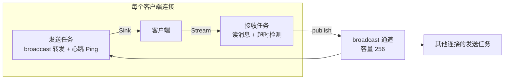

# 项目实战 4：realtime-chat —— WebSocket 实时聊天室（Axum + Tokio）

## 分阶段练习与验收

**最小阶段**：先做两个客户端同一房间的消息广播。

**验收结果**：慢客户端和断开的客户端不会阻塞所有人，关闭路径可观测。

**扩展顺序**：房间、历史、认证和跨实例广播分阶段引入。

建议保存一份正常输入、一份失败输入、实际输出和对应测试。先完成以上阶段再扩展正文中的完整设计；遇到省略实现或未定义依赖，应按文档上下文补齐，不能把代码片段拼接后当作已经验证的完整工程。

> **文档简介**: 在 Axum 0.8 上构建生产形态的 WebSocket 实时聊天室：`tokio::sync::broadcast` 广播消息、心跳保活检测假死连接、在线名单状态管理，理解"一条连接 = 两个任务"的并发模型
>
> **目标读者**: 完成 Axum REST 实战或具备 Tokio 异步基础的开发者
>
> **前置知识**: async/.await、`tokio::select!`、Axum 路由与 `State`；建议先读 [并发与 async](../basics/09-concurrency-async.md)

<details>
<summary>文档信息（用途、难度与维护记录）</summary>

## 📚 文档元数据

| 属性 | 内容 |
|------|------|
| **模块** | `11-rust-cross-platform` |
| **象限** | 操作指南（项目实战） |
| **难度** | ⭐⭐⭐ 精通 |
| **标签** | `#rust` `#axum` `#websocket` `#tokio` `#实时通信` |
| **更新日期** | `2026年9月` |
| **内容状态** | 教学设计已编写；按本文验收条件完成本地或目标环境验证 |

</details>

> 版本基线以 [模块 README 技术基线区块](../README.md) 为准：Axum 0.8、Tokio 1.53。本篇 Rust 块未做本机编译（需全链依赖），`ws::Message` 变体签名（`Text(Utf8Bytes)`/`Ping(Bytes)` 等）已按 Axum 0.8 docs.rs 核实。

## 🎯 学习目标

完成本项目后，你将能够：

- ✅ **掌握 WebSocket 升级**: `WebSocketUpgrade` 提取器把 HTTP 请求升级为长连接
- ✅ **设计广播拓扑**: 一条 `broadcast` 通道服务全部客户端，理解 Lagged 背压语义
- ✅ **实现心跳保活**: 服务端定时 Ping + 读超时检测，踢掉假死连接
- ✅ **管理客户端状态**: 在线名单的注册/注销与系统消息广播

## 📋 目录

- [并发模型与需求](#并发模型与需求)
- [分步实现](#分步实现)
- [运行与验证](#运行与验证)
- [最佳实践](#最佳实践)
- [常见问题](#常见问题)
- [扩展方向](#扩展方向)
- [相关资源](#相关资源)
- [总结](#-总结)

---

## 并发模型与需求

### 核心模型：一条连接，两个任务



WebSocket 是全双工流：`socket.split()` 拆成 `SplitSink`/`SplitStream` 两半后，发送与接收必须各占一个任务——接收侧阻塞等待时发送侧仍要能工作，`select!` 则在两侧任务间"谁先结束谁触发清理"。

### 功能需求

- 客户端连上后**第一条消息作为用户名**完成注册
- 任意客户端发出的消息广播给所有人（含 join/leave 系统消息）
- 同名用户可开多个窗口（在线名单记录连接数）
- 心跳：服务端每 15 秒 Ping，45 秒内收不到任何帧视为断线并清理状态

### 项目结构与依赖

```bash
cargo new realtime-chat
```

`Cargo.toml`（版本基线见模块 README）：

```toml
[package]
name = "realtime-chat"
version = "0.1.0"
edition = "2024"

[dependencies]
axum = { version = "0.8", features = ["ws"] }
tokio = { version = "1.53", features = ["full"] }
futures-util = "0.3"   # socket.split() 与 Stream/Sink 扩展 trait
```

---

## 分步实现

### 步骤 1：应用状态——广播通道 + 在线名单

```rust
use std::{
    collections::HashMap,
    sync::{Arc, Mutex},
    time::Duration,
};

use tokio::sync::broadcast;

const HEARTBEAT_INTERVAL: Duration = Duration::from_secs(15);
const HEARTBEAT_TIMEOUT: Duration = Duration::from_secs(45);

#[derive(Clone)]
struct AppState {
    /// 聊天消息总线：所有连接共享，容量 256 = 慢客户端最多积压 256 条
    tx: broadcast::Sender<String>,
    /// 在线名单：用户名 -> 活跃连接数（同名多窗口）
    online: Arc<Mutex<HashMap<String, u32>>>,
}

impl AppState {
    fn new() -> Self {
        let (tx, _) = broadcast::channel(256);
        Self {
            tx,
            online: Arc::new(Mutex::new(HashMap::new())),
        }
    }

    fn join(&self, user: &str) -> u32 {
        let mut online = self.online.lock().unwrap();
        let count = online.entry(user.to_string()).or_insert(0);
        *count += 1;
        *count
    }

    fn leave(&self, user: &str) -> u32 {
        let mut online = self.online.lock().unwrap();
        let Some(count) = online.get_mut(user) else {
            return 0;
        };
        *count -= 1;
        if *count == 0 {
            online.remove(user);
            0
        } else {
            *count
        }
    }
}
```

**关键点解析**：

- `broadcast::Sender` 是 Clone 的多生产多消费通道：`subscribe()` 得到独立接收端，消息会发给**每个**订阅者——正好匹配聊天广播
- 容量 256 的取舍：消费太慢的订阅者会收到 `RecvError::Lagged`（丢弃旧消息继续），而不是拖死整条总线
- 在线名单用同步 `Mutex`：临界区只有内存操作，不需要异步锁

### 步骤 2：路由与升级

```rust
use axum::{
    extract::{
        ws::{Message, WebSocket, WebSocketUpgrade},
        State,
    },
    response::Response,
    routing::get,
    Router,
};

#[tokio::main]
async fn main() {
    let state = AppState::new();

    let app = Router::new()
        .route("/", get(ws_handler))
        .with_state(state);

    let listener = tokio::net::TcpListener::bind("0.0.0.0:8080").await.unwrap();
    println!("realtime-chat listening on ws://0.0.0.0:8080");
    axum::serve(listener, app).await.unwrap();
}

async fn ws_handler(ws: WebSocketUpgrade, State(state): State<AppState>) -> Response {
    ws.on_upgrade(move |socket| handle_socket(socket, state))
}
```

**关键点解析**：

- `WebSocketUpgrade` 是提取器：握手（HTTP 101 Switching Protocols）由框架完成，`on_upgrade` 回调接管长连接
- 路由本身就是普通 GET 路由——WebSocket 从一个 HTTP 请求开始，与 REST 服务共存于同一个 Router
- 后续步骤还会用到两个导入：`use futures_util::{SinkExt, StreamExt};`（`split`/`send`/`next` 的 trait 方法）与 `use axum::body::Bytes;`（步骤 4 的 Ping 载荷类型）

### 步骤 3：连接处理——握手与注册

```rust
async fn handle_socket(socket: WebSocket, state: AppState) {
    let (mut sender, mut receiver) = socket.split();

    // 协议约定：第一条消息是用户名
    let Some(Ok(Message::Text(hello))) = receiver.next().await else {
        return; // 未按协议注册（或直接断开），不做任何状态登记
    };
    let username = hello.trim().to_string();
    if username.is_empty() {
        return;
    }

    let count = state.join(&username);
    let _ = state.tx.send(format!("【系统】{username} 加入了聊天室（在线 {count} 人）"));
```

**关键点解析**：

- `let Some(Ok(Message::Text(hello))) = ... else { return; }`：let-else 一次解包三层（Option/Result/枚举变体），非文本首帧直接放弃
- `Message::Text` 的载荷是 `Utf8Bytes`（Axum 0.8 变更，0.7 是 `String`），`Deref<str>` 可直接 `.trim()`
- 注册失败不 `join`——状态只登记"真正进入房间"的连接

### 步骤 4：发送任务——广播转发 + 心跳

```rust
    let mut rx = state.tx.subscribe();

    // 发送任务：select 转发广播消息与定时心跳 Ping
    let mut send_task = tokio::spawn(async move {
        let mut heartbeat = tokio::time::interval(HEARTBEAT_INTERVAL);
        heartbeat.set_missed_tick_behavior(tokio::time::MissedTickBehavior::Delay);
        loop {
            tokio::select! {
                _ = heartbeat.tick() => {
                    // Ping 载荷最多 125 字节；浏览器会自动回 Pong
                    if sender.send(Message::Ping(Bytes::from_static(b"hb"))).await.is_err() {
                        break;
                    }
                }
                msg = rx.recv() => {
                    match msg {
                        Ok(text) => {
                            if sender.send(Message::text(text)).await.is_err() {
                                break;
                            }
                        }
                        // 慢消费者：告知丢帧后继续，不杀死连接
                        Err(broadcast::error::RecvError::Lagged(skipped)) => {
                            let _ = sender
                                .send(Message::text(format!("【系统】你落后了，{skipped} 条消息未送达")))
                                .await;
                        }
                        Err(_) => break, // 总线关闭
                    }
                }
            }
        }
    });
```

**关键点解析**：

- `use axum::body::Bytes;` 后 `Bytes::from_static` 构造零拷贝 Ping 载荷（Axum 0.8 的 `Ping` 载荷类型是 `Bytes`）
- `Message::text(s)` 接受 `Into<Utf8Bytes>`，`String` 直通
- 心跳用 `interval` + `select!` 与广播转发并行：转发繁忙时心跳不会饿死；`MissedTickBehavior::Delay` 避免积压 tick 突发补发
- 收到 `Lagged` 的处理体现 broadcast 的契约：**背压由订阅者自己消化**，通道不为任何慢客户端阻塞

### 步骤 5：接收任务——读消息与失联检测

```rust
    // 接收任务：广播客户端消息；读超时判定假死连接
    let publish = state.tx.clone();
    let user = username.clone();
    let mut recv_task = tokio::spawn(async move {
        loop {
            match tokio::time::timeout(HEARTBEAT_TIMEOUT, receiver.next()).await {
                Ok(Some(Ok(Message::Text(text)))) => {
                    let _ = publish.send(format!("{user}: {text}"));
                }
                Ok(Some(Ok(Message::Pong(_)))) => {} // 心跳回应：连接健康
                Ok(Some(Ok(_))) => {}                // Binary/Ping 等其他帧暂不处理
                Ok(Some(Err(_))) | Ok(None) => break, // 协议错误 / 客户端正常关闭
                Err(_elapsed) => break,               // 超时：两个心跳周期无任何帧，判死
            }
        }
    });
```

**关键点解析**：

- `timeout` 包住 `receiver.next()`：**任何**帧（数据、Pong、Ping 回应）都会重置计时，因此活跃连接永不误杀
- 45 秒阈值 = 3 个心跳周期：丢 1-2 个 Ping 不判死，容忍移动网络抖动
- 接收到的 `Ping` 帧由 Axum 在协议层自动回 `Pong`，应用层无需处理

### 步骤 6：任务回收与离线广播

```rust
    // 任一任务结束即回收另一侧：对端断开时发送任务会因写失败退出，反之亦然
    tokio::select! {
        _ = &mut send_task => recv_task.abort(),
        _ = &mut recv_task => send_task.abort(),
    }

    let count = state.leave(&username);
    if count == 0 {
        let _ = state.tx.send(format!("【系统】{username} 离开了聊天室"));
    } else {
        let _ = state.tx.send(format!("【系统】{username} 关闭了一个窗口（仍在线 {count} 人）"));
    }
}
```

**关键点解析**：

- `select!` 里用 `&mut send_task`：未完成的那一侧 handle 仍归我们所有，可以 `abort()`
- `leave` 后才广播离线消息，且广播失败用 `let _ =` 忽略——对已死总线的清理不能反过来失败退出
- 系统消息的构造放在状态更新**之后**，保证"在线 N 人"数字与名单一致

---

## 运行与验证

```bash
cargo run
# 另开两个终端各连一个客户端
websocat ws://127.0.0.1:8080
```

浏览器 Console 也可直接测试：

```javascript
const ws = new WebSocket("ws://localhost:8080");
ws.onmessage = (e) => console.log(e.data);
ws.onopen = () => ws.send("alice");   // 首条消息 = 用户名
ws.send("大家好");                     // 之后每条都是聊天内容
```

验证清单：

1. 两个客户端先后注册 → 双方都收到两条 join 系统消息
2. alice 发消息 → bob 收到 `alice: 大家好`
3. `Ctrl-C` 掉一个 websocat → 另一方收到 leave 系统消息
4. 断网模拟假死（如断开 Wi-Fi 不发 close 帧）→ 45 秒后另一侧收到 leave 消息（心跳判死生效）

---

## 最佳实践

WebSocket 同时需要接收、发送和连接关闭协调，可以用拆分任务或单任务选择循环，重点是一个方向结束时另一个不会永久遗留。心跳间隔与超时依据网络和资源预算设置，不以固定比例保证健康判断。

broadcast 对慢消费者报告丢失，是否继续取决于消息语义：可丢行情可继续，聊天记录可能要补拉或重同步。每连接 mpsc 也可实现广播分发，但应用负责队列与慢客户端策略。测试慢读、断线和重复连接后在线状态能清理。

---

## 常见问题

### Q1: 客户端为什么"连上就断"？

**A**: 排查三处：① 首条消息不是文本帧（有些客户端库默认先发 Binary）；② 路由没加 `features = ["ws"]`；③ 反向代理（Nginx）未放行 `Upgrade`/`Connection` 头。先用 websocat 排除客户端因素，再看服务端日志。

### Q2: 消息量大了以后怎么办？

**A**: 三级演进：① 消息改 JSON 协议（`{type, from, body}`）区分聊天/命令/心跳；② 房间模型——每个房间一条 broadcast 通道，`HashMap<RoomId, Sender>` 管理订阅；③ 多实例部署时 broadcast 只覆盖单进程，跨节点需 Redis pub/sub 或 NATS 中转（对照 Go 版实时架构 [01-go-backend 实时应用](../../01-go-backend/projects/03-real-time-app.md) 的同一问题域）。

---

## 扩展方向

- **练习 1（基础）**: 加 `GET /online` REST 端点返回当前在线名单（提示：给 `AppState` 补 serde 序列化）
- **练习 2（进阶）**: 实现房间模型：URI 改为 `/room/{name}`，每房间独立 broadcast 通道与在线表
- **练习 3（挑战）**: 空闲连接主动断开——客户端 60 秒未发言即服务端发 `Message::Close`，体会优雅关闭握手；测试策略见 [单元与集成测试](../testing/01-unit-integration-tests.md)

---

## 相关资源

### 📖 交叉引用

- 📄 **[Tokio 指南](../reference/library-guides/12-tokio-guide.md)** — broadcast/select/interval 全量参考
- 📄 **[Axum 要点字典](../reference/framework-essentials/11-axum-essentials.md)** — 提取器体系与 ws 模块速查
- 📄 **[并发与 async（Tokio 入门）](../basics/09-concurrency-async.md)** — `select!` 与任务取消的原理层
- 📄 **[REST API 实战](./03-axum-rest-api.md)** — 本篇可视为其上的实时通道叠加
- 📄 **[多端发布流水线](./05-multiplatform-release.md)** — 服务端产物的发布路径
- 📄 **[Go 实时应用](../../01-go-backend/projects/03-real-time-app.md)** — 同一问题域的 Go 实现对照
- 📖 **[Axum ws 模块文档](https://docs.rs/axum/0.8/axum/extract/ws/index.html)** — `Message` 变体与握手配置权威参考

---

## 📝 总结

### 核心要点回顾

1. **广播拓扑**: 一条 `broadcast` 通道 + 每连接独立订阅，Lagged 背压由订阅者消化
2. **心跳保活**: 发送侧定时 Ping，接收侧读超时判死，间隔/超时 1:3 配对
3. **生命周期**: 握手注册 → 双任务服务 → select 回收 → 状态注销 + 离线广播

### 学习成果检查

- [ ] 能画出"一条连接两个任务 + 一条总线"的拓扑图
- [ ] 能解释 `Lagged` 为什么不是错误而是一种协议
- [ ] 能说清心跳判死为什么挂在接收任务的 timeout 上

---

**文档版本**: v1.0.0
**最后更新**: 2026年9月
**维护团队**: Dev Quest Team

> 🎯 **下一步**: 功能齐备之后是工程闭环——[项目实战 5：多端发布流水线](./05-multiplatform-release.md) 把 CLI、桌面、服务端三个产物交给 CI 统一发布。


<!-- learning-navigation -->
## 阅读导航

[本模块理解地图](../LEARNING_GUIDE.md) · [完整目录与版本](../README.md) · [通用术语](../../shared-resources/glossary.md)
