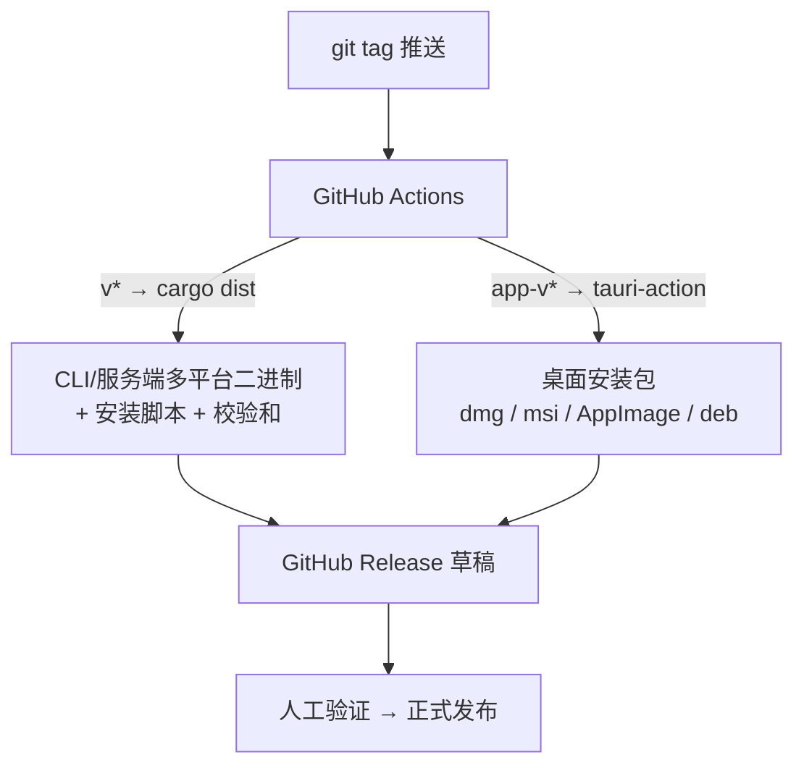

# 项目实战 5：rustwave —— 多端发布流水线（CLI + 桌面 + 服务端）

> **文档简介**: 把前三篇的产物（CLI、Tauri 桌面应用、Axum 服务端）收进一个 Cargo workspace，建立单一版本来源，用 cargo-dist 与 tauri-action 两条流水线产出多平台二进制与安装包，并沉淀一份可执行的发布检查清单
>
> **目标读者**: 已完成前三篇项目、要把作品交付给真实用户的开发者
>
> **前置知识**: Cargo workspace 概念、Git tag 与 GitHub Actions 基础；对应代码见 [项目 1](./01-cli-tool.md)、[项目 2](./02-tauri-notes-app.md)、[项目 3](./03-axum-rest-api.md)

## 📚 文档元数据

| 属性 | 内容 |
|------|------|
| **模块** | `11-rust-cross-platform` |
| **象限** | 操作指南（项目实战） |
| **难度** | ⭐⭐⭐ 精通 |
| **标签** | `#rust` `#cargo-dist` `#github-actions` `#release-engineering` `#多平台发布` |
| **更新日期** | `2026年9月` |
| **状态** | ✅ 已完成 |

> 版本基线以 [模块 README 技术基线区块](../README.md) 为准。本篇以工程配置与流程为主；cargo-dist / tauri-action 的具体字段随工具版本演进，以 `cargo dist init` 与官方 action 文档的生成结果为准。交叉编译 targets 与签名细节见模块 deployment/ 规划（[模块 README](../README.md)）。

## 🎯 学习目标

完成本项目后，你将能够：

- ✅ **组织多产物 workspace**: `workspace.package`/`workspace.dependencies` 消除版本漂移
- ✅ **制定版本策略**: 单一版本来源 + 双 tag 前缀区分发布节奏
- ✅ **跑通二进制分发**: cargo-dist 一键产出多平台 CLI/服务端可执行文件
- ✅ **跑通桌面分发**: tauri-action 产出 dmg/msi/AppImage 安装包草稿
- ✅ **执行发布检查清单**: 从测试到公告的完整交付闭环

## 📋 目录

- [流水线全景与 workspace 结构](#流水线全景与-workspace-结构)
- [分步实现](#分步实现)
- [本地排练与验证](#本地排练与验证)
- [最佳实践](#最佳实践)
- [常见问题](#常见问题)
- [扩展方向](#扩展方向)
- [相关资源](#相关资源)
- [总结](#总结)

---

## 流水线全景与 workspace 结构

### 发布流水线一图流



两类产物、两条流水线：**二进制/服务端**走 cargo-dist（它理解 Rust workspace），**桌面应用**走 tauri-action（它理解 Tauri 的 bundle 体系）。Release 一律先出草稿，人工冒烟后再公开。

### 目录结构：收编前三篇产物

```
rustwave/
├── Cargo.toml                 # workspace 根：成员、共享版本、共享依赖
├── crates/
│   ├── rtask/                 # ⭐ CLI（项目实战 1）
│   └── notes-api/             # ⭐⭐ Axum 服务端（项目实战 3）
└── apps/
    └── rustnotes/
        ├── package.json       # React 前端
        └── src-tauri/         # ⭐⭐ Tauri 桌面（项目实战 2）
```

---

## 分步实现

### 步骤 1：workspace 根 Cargo.toml

```toml
[workspace]
resolver = "3"   # edition 2024 的默认 resolver，虚拟 workspace 需显式声明
members = [
    "crates/rtask",
    "crates/notes-api",
    "apps/rustnotes/src-tauri",
]
# 日常 cargo build/test 默认只构建 CLI 与服务端，桌面应用按需显式构建
default-members = ["crates/*"]

[workspace.package]
version = "0.3.0"          # ★ 全仓单一版本来源
edition = "2024"
license = "MIT OR Apache-2.0"
repository = "https://github.com/your-name/rustwave"

[workspace.dependencies]
serde = { version = "1.0.229", features = ["derive"] }
serde_json = "1"
anyhow = "1"
tokio = { version = "1.53", features = ["full"] }
clap = { version = "4.6", features = ["derive"] }
axum = { version = "0.8", features = ["ws"] }
sqlx = { version = "0.9", features = [
    "runtime-tokio",
    "tls-rustls",
    "postgres",
    "chrono",
    "migrate",
] }
tracing = "0.1"
tauri = { version = "2.11", features = [] }
tauri-plugin-fs = "2"
```

**关键点解析**：

- `workspace.package.version` 是全仓版本号的**单一事实来源**；各成员用 `version.workspace = true` 继承，杜绝三处版本号漂移
- `workspace.dependencies` 集中声明依赖版本，成员以 `serde.workspace = true` 引用——升级基线只改一处（对应模块 README 的"技术基线区块"管理方式）
- `default-members` 让 `cargo test` 日常只跑核心 crates；桌面与前端由各自工具链负责

### 步骤 2：成员改写为继承版本

`crates/rtask/Cargo.toml`（notes-api 同理）：

```toml
[package]
name = "rtask"
version.workspace = true
edition.workspace = true
license.workspace = true
repository.workspace = true

[dependencies]
clap.workspace = true
serde.workspace = true
serde_json.workspace = true
anyhow.workspace = true
```

`apps/rustnotes/src-tauri/Cargo.toml` 关键段：

```toml
[package]
name = "rustnotes"
version.workspace = true        # 版本继续上溯到 workspace 根
edition.workspace = true

[dependencies]
tauri.workspace = true
tauri-plugin-fs.workspace = true
serde.workspace = true
serde_json.workspace = true
```

**版本回传桌面端**：`tauri.conf.json` 中**省略 `version` 字段**，Tauri 会回退读取 Cargo 包版本——即 workspace 版本。三个产物从此只有一个版本号。

### 步骤 3：版本策略

| 产物 | 版本来源 | 发布 tag | 节奏 |
|------|---------|---------|------|
| rtask（CLI） | workspace version | `v*` | 随仓 |
| notes-api（服务端） | workspace version | `v*` | 随仓 |
| rustnotes（桌面） | workspace version（经回退） | `app-v*` | 独立 |

三条原则：

1. **同仓同版本起步**：0.x 阶段全部产物一起 bump minor（0.x 语义下 minor 即 breaking），心智成本最低
2. **tag 前缀区分流水线**：`v0.4.0` 触发 cargo-dist，`app-v0.4.0` 触发 tauri-action；两个流水线互不误触发
3. **CHANGELOG 与版本同行**：每次 bump 同步更新 `CHANGELOG.md` 的对应小节，发布草稿正文直接引用

### 步骤 4：cargo-dist 概览（CLI + 服务端）

cargo-dist 面向 Rust workspace：一条 tag 流水线产出多平台二进制、安装脚本、校验和并上传 Github Release。

```bash
cargo install cargo-dist
cargo dist init          # 在 workspace 根写入发布配置并生成 CI workflow
```

`init` 之后检查根 `Cargo.toml` 里生成的 `[workspace.metadata.dist]`（以下为典型配置，字段以生成结果为准）：

```toml
[workspace.metadata.dist]
# 目标平台（Rust target-triple）
targets = [
    "aarch64-apple-darwin",
    "x86_64-apple-darwin",
    "x86_64-unknown-linux-gnu",
    "x86_64-pc-windows-msvc",
]
# 生成安装脚本（curl | sh / iwr | iex）
installers = ["shell", "powershell"]
ci = ["github"]
# PR 上只出"计划"不真发布，防误触
pr-run-mode = "plan"
```

**要点**：

- workspace 内所有**二进制成员**（rtask、notes-api）都会成为发布对象；Tauri 应用被排除在外（它的打包交给 tauri-action）
- `cargo dist generate` 生成/更新 `.github/workflows/release.yml` 与 `upload.yml`，触发条件是 `v*` tag
- 服务端产物（notes-api）通常还需要容器镜像，走模块 deployment/ 的容器化路线，与本篇二进制分发互补

### 步骤 5：tauri-action 概览（桌面安装包）

桌面安装包需要各 OS 原生构建环境（macOS 的签名工具链、Windows 的 WebView2、Linux 的 WebKitGTK），tauri-action 封装了 Tauri 的 bundle 流程：

```yaml
# .github/workflows/release-desktop.yml
name: release-desktop
on:
  push:
    tags: ["app-v*"]

jobs:
  build-tauri:
    permissions:
      contents: write
    strategy:
      fail-fast: false
      matrix:
        include:
          - platform: macos-latest
            args: --target aarch64-apple-darwin
          - platform: macos-latest
            args: --target x86_64-apple-darwin
          - platform: ubuntu-22.04
            args: ""
          - platform: windows-latest
            args: ""
    runs-on: ${{ matrix.platform }}
    steps:
      - uses: actions/checkout@v4
      - uses: actions/setup-node@v4
        with:
          node-version: 22
      - uses: dtolnay/rust-toolchain@stable
        with:
          targets: aarch64-apple-darwin,x86_64-apple-darwin
      - name: 安装 Linux 系统依赖（Tauri 2）
        if: matrix.platform == 'ubuntu-22.04'
        run: |
          sudo apt-get update
          sudo apt-get install -y libwebkit2gtk-4.1-dev build-essential curl wget \
            file libxdo-dev libssl-dev libayatana-appindicator3-dev librsvg2-dev
      - name: 前端依赖
        run: npm ci
        working-directory: apps/rustnotes
      - uses: tauri-apps/tauri-action@v0
        env:
          GITHUB_TOKEN: ${{ secrets.GITHUB_TOKEN }}
        with:
          tagName: app-v__VERSION__          # __VERSION__ 由 action 从 tauri 配置注入
          releaseName: "RustNotes v__VERSION__"
          releaseBody: "请按平台下载对应安装包；此为草稿，冒烟通过后发布。"
          releaseDraft: true
          prerelease: false
          args: ${{ matrix.args }}
```

**要点**：

- `releaseDraft: true` 是关键安全垫：CI 只上传到草稿 Release，人工验证后才点发布
- macOS 双 target 复用同一台 runner 交叉编译；Linux 必须装 WebKitGTK 系依赖（Tauri 2 对应 `4.1` 版本包）
- 公开分发时补签名与自动更新：macOS 公证、Windows 代码签名、`tauri-plugin-updater` 检查更新——属 deployment/ 签名与自动更新篇的主题

### 步骤 6：发布检查清单

每次发版按序执行（可复制进 PR 描述）：

```markdown
## Release Checklist v0.X.0

- [ ] `cargo test --workspace` 全绿（含桌面 Rust 侧：cargo test -p rustnotes）
- [ ] `cargo clippy --workspace -- -D warnings` 无警告
- [ ] `cargo fmt --check` 通过
- [ ] 桌面端 `npm run tauri build` 本机冒烟一次
- [ ] CHANGELOG.md 增加本版本小节（breaking 变显式标注）
- [ ] workspace 根 Cargo.toml bump `version`，`cargo update -w` 同步 Cargo.lock 并提交
- [ ] commit + 推送 `v0.X.0` 与 `app-v0.X.0` 两个 tag
- [ ] CI 全绿；Release 草稿产物齐全（二进制 4 平台 + 校验和 + 桌面安装包）
- [ ] 每平台下载产物冒烟：CLI 三条命令 / notes-api healthz / 桌面增删笔记
- [ ] 校验和核对（`sha256sum -c`）
- [ ] 正式发布 + 公告（Release Notes 引用 CHANGELOG）
```

---

## 本地排练与验证

CI 之前先本地过一遍，避免 tag 反复打：

```bash
# workspace 健康检查：三个成员都能编译
cargo check --workspace

# cargo-dist 排练：plan 只输出将要做什么，不构建
cargo dist plan

# cargo-dist 本地真构建（产物在 target/distrib/）
cargo dist build

# 桌面端本机打包（产物在 target/release/bundle/）
cd apps/rustnotes && npm run tauri build
```

验证点：

1. `cargo dist build` 后 `target/distrib/` 出现当前平台的 rtask 与 notes-api 产物及校验和
2. 版本一致性：`rtask --version`、`notes-api` 日志、tauri 窗口"关于"三处显示同一版本号
3. 桌面安装包可安装、可卸载、数据目录（identifier 对应）残留可清理

---

## 最佳实践

### ✅ 推荐做法

- **版本号只有一处**：workspace 根定义、成员继承、tauri.conf.json 回退——任何一处手写版本号都是未来的事故
- **草稿制发布**：所有 CI 产物先进 Release 草稿，人工冒烟通过才公开
- **锁文件入库**：`Cargo.lock` 随 bump 一起提交，保证 CI 构建与本地一致

### ❌ 避免陷阱

- **不要手改生成文件**：`cargo dist generate` 与 tauri-action 的产物以工具为准，手工热修会在下次生成时丢失
- **不要跳过本地排练**：CI 分钟级计费且失败一轮就是十几分钟；`cargo dist plan` + 本机 `tauri build` 能拦住 80% 的问题
- **不要在同一次发布里混用版本号**：桌面端晚于服务端发版时，桌面 bundle 内仍显示 workspace 版本，对外口径必须统一说明

### 模式不变量

- 单一事实来源原则对版本号同样成立：所有派生版本必须可追溯到一处定义
- 发布是可重复的过程而非手工技艺：tag 触发、产物进草稿、人工验证后公开，每步可回退
- 构建环境即契约：桌面打包依赖各 OS 原生工具链，流水线必须显式声明这些依赖（如 Linux 的 WebKitGTK）

---

## 常见问题

### Q1: 桌面端想跳过一个版本怎么办？

**A**: 保持版本号递增但不打 `app-v*` tag 即可——cargo-dist 流水线照常发 `v*`，桌面端缺席该版本。若桌面端需要独立 hotfix 节奏，改为桌面版本独立自增（`app-v0.4.1` 对应 workspace `0.5.0` 也可），但必须在 CHANGELOG 中建立映射表，否则用户支持时对不上版本。

### Q2: 交叉编译（如 x86_64 的 macOS 产物在 ARM 机器上构建）总是链接失败？

**A**: 纯 Rust 依赖通常 `rustup target add` 即可；失败的几乎都是 C 依赖（OpenSSL、数据库驱动）需要目标平台工具链。优先用纯 Rust 替代（如 SQLx 选 `tls-rustls` feature 而非依赖 OpenSSL 的 `tls-native-tls`），其次用 `cross` 或 CI 的原生 runner。系统级依赖清单与交叉编译矩阵详见模块 deployment/ 的交叉编译篇（见 [模块 README](../README.md) 规划）。

---

## 扩展方向

- **练习 1（基础）**: 给流水线加"版本一致性守门"——CI 首个 job 用脚本断言 workspace 版本与 CHANGELOG 最新小节一致
- **练习 2（进阶）**: 引入 release-please / changesets 类工具，从 conventional commits 自动生成 CHANGELOG 与版本 PR
- **练习 3（挑战）**: 打通桌面自动更新：接入 `tauri-plugin-updater` + 签名密钥托管，实现"发布即推更"，为 deployment/ 签名与自动更新篇积累素材

---

## 相关资源

### 📖 交叉引用

- 📄 **[CLI 工具实战](./01-cli-tool.md)** — rtask 产物的来源与 `cargo install` 分发
- 📄 **[Tauri 桌面笔记](./02-tauri-notes-app.md)** — rustnotes 产物与 `tauri.conf.json` 版本回退
- 📄 **[Axum REST API](./03-axum-rest-api.md)** — notes-api 产物；容器化属于 deployment/ 范畴
- 📄 **[Cargo 工程化与单元测试](../basics/10-cargo-testing.md)** — workspace 与发布字段详解
- 📖 **[cargo-dist 文档](https://opensource.axo.dev/cargo-dist/)** — 配置字段与 CI 生成权威来源
- 📖 **[tauri-action](https://github.com/tauri-apps/tauri-action)** — 输入参数与多平台矩阵官方说明

---

## 📝 总结

### 核心要点回顾

1. **workspace 收编**: `workspace.package`/`workspace.dependencies` 让版本与依赖各只有一处定义
2. **双流水线**: cargo-dist 管二进制（`v*`），tauri-action 管安装包（`app-v*`），草稿制交付
3. **清单驱动**: 发布 = 可重复的检查序列，每一步本地可排练、CI 可复现

### 学习成果检查

- [ ] 能解释 `version.workspace = true` 与 tauri.conf.json 回退如何串成单一版本链
- [ ] 能说清两条流水线分别产出什么、为何分开
- [ ] 能独立走完一遍"排练 → tag → 草稿 → 冒烟 → 发布"的闭环

---

**文档版本**: v1.0.0
**最后更新**: 2026年9月
**维护团队**: Dev Quest Team

> 🎯 **下一步**: projects/ 五篇至此完成。继续深入测试工程（testing/）与部署运维（deployment/），把作品推向生产。
