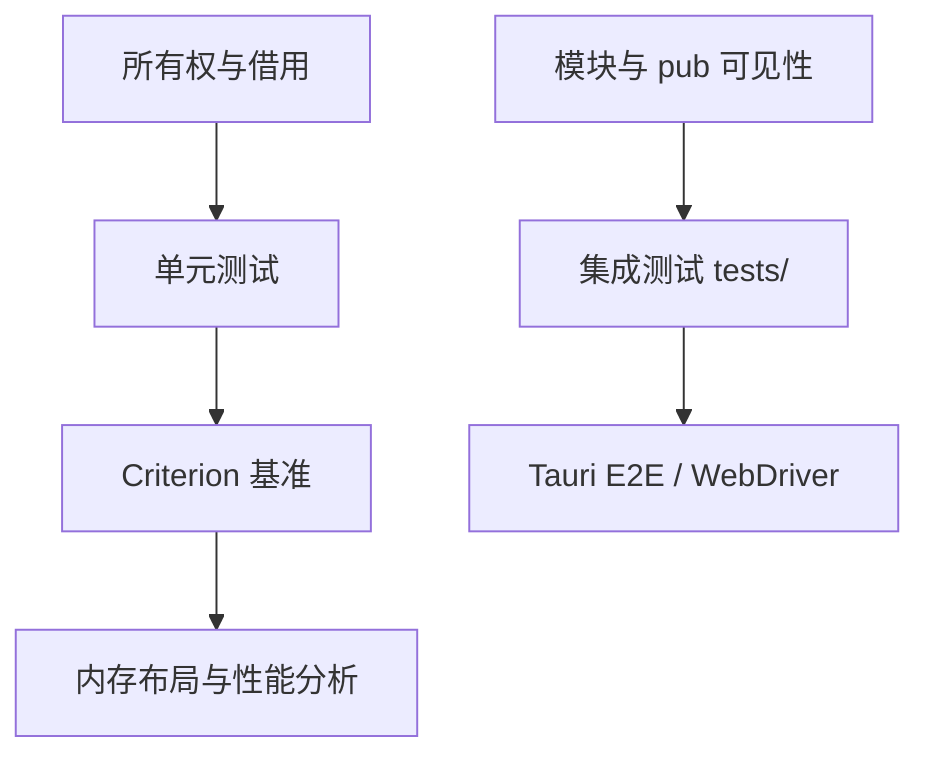

# Rust 单元与集成测试：#[test] 到 tests/ 目录

> **文档简介**: 只用 Rust 内建测试设施——`#[test]`、`#[cfg(test)]`、`tests/` 集成测试、文档测试——搭建三层测试防线。请将完整示例放入 Cargo 项目，以 `cargo test` 在自己的工具链中验证；单个片段不代表完整工程已通过。
>
> **目标读者**: 已理解所有权与模块系统、开始写真实工程的 Rust 学习者（中级）
>
> **前置知识**: Cargo 工程结构（basics 第 10 篇，建设中）；[所有权字典](../reference/language-concepts/01-ownership-dictionary.md) 的借用与生命周期基础

<details>
<summary>文档信息（用途、难度与维护记录）</summary>

## 📚 文档元数据

| 属性 | 内容 |
|------|------|
| **模块** | `11-rust-cross-platform` |
| **象限** | 操作指南 |
| **难度** | ⭐⭐ |
| **标签** | `#rust` `#testing` |
| **更新日期** | `2026年9月` |

</details>

> 工具链版本以模块 README「技术基线」区块为准（Rust 1.98.1 / edition 2024）。本篇不引入任何第三方测试库。

## 🎯 学习目标

完成本篇后，你将能够：

- ✅ **掌握核心概念**: 理解单元测试、集成测试、文档测试三层的编译模型与分工
- ✅ **实践能力**: 用 `#[cfg(test)]`、`#[should_panic]`、`tests/` 目录与 doctest 写出完整测试
- ✅ **解决问题**: 正确选择测试层级、共享测试代码、按名过滤与跳过慢速测试
- ✅ **进阶方向**: 为 [Criterion 基准](./02-criterion-benchmarks.md) 与 [Tauri E2E](./03-tauri-e2e-webdriver.md) 打基础

## 📋 目录

- [核心概念](#-核心概念)
- [实践指南](#️-实践指南)
- [代码示例](#-代码示例)
- [最佳实践](#-最佳实践)
- [常见问题](#-常见问题)
- [相关资源](#-相关资源)

---

## 🔍 核心概念

### 概念一：内建测试的三层结构

**定义**: Rust 把测试分成三个层次，全部由 `cargo test` 一条命令驱动，测试框架（libtest harness）内置于工具链，无需引入第三方断言库。

| 层次 | 位置 | 可见性 | 测什么 |
|------|------|--------|--------|
| 单元测试 | 与源码同文件，`#[cfg(test)]` 模块内 | 可访问私有项 | 单个函数/结构体的逻辑正确性 |
| 集成测试 | `tests/*.rs` | 只能访问公开 API | 库的对外契约，从使用者视角 |
| 文档测试 | 文档注释中的代码块 | 编译成独立用例 | 示例代码不过期 |

基准测试（性能测量）是第四个独立维度，见 [Criterion 基准](./02-criterion-benchmarks.md)。

### 概念二：`#[cfg(test)]` 与测试编译模型

**定义**: 测试代码通过条件编译与普通构建隔离——`cargo build` 完全不编译 `#[cfg(test)]` 模块，`cargo test` 才会把它接进来。

**关键特性**:

- `cargo test` 会让 libtest harness 接管程序的 `main`，逐个运行 `#[test]` 函数
- 测试失败的判定有两种等价途径：断言宏 `panic!`（`assert!`/`assert_eq!`/`assert_ne!`），或测试函数返回 `Err`
- 断言宏失败时自动打印两侧表达式的源码与值（`assert_eq!` 要求两侧实现 `PartialEq` 与 `Debug`）

**使用场景**:

- 场景1：纯函数、状态机、解析器——单元测试密度最高
- 场景2：对外发布的库——集成测试保证公开 API 的承诺不被破坏

---

## 🛠️ 实践指南

### 步骤一：单元测试

**目标**: 在 `src/lib.rs`（或任意模块文件）内建立与被测代码同包的测试模块。

**操作指南**（此处是节选，含 4 个代表性测试；将它们与被测代码放入同一个 Cargo 项目，再用 `cargo test` 验收）:

```rust
#[derive(Debug, PartialEq)]
pub struct Rectangle {
    width: u32,
    height: u32,
}

impl Rectangle {
    pub fn new(width: u32, height: u32) -> Result<Self, String> {
        if width == 0 || height == 0 {
            return Err(String::from("宽高必须为正数"));
        }
        Ok(Self { width, height })
    }

    pub fn area(&self) -> u32 {
        self.width * self.height
    }

    pub fn can_hold(&self, other: &Rectangle) -> bool {
        self.width > other.width && self.height > other.height
    }

    // 严格构造：契约破坏直接 panic（用于演示 #[should_panic]）
    // 与返回 Result 的 new 形成对照：两种错误风格各有测试写法
    pub fn strict_new(width: u32, height: u32) -> Self {
        assert!(width > 0 && height > 0, "宽高必须为正数");
        Self { width, height }
    }
}

#[cfg(test)] // 只在 cargo test / --test 编译时进入，release 构建零开销
mod tests {
    use super::*;

    #[test]
    fn larger_can_hold_smaller() {
        let larger = Rectangle::new(10, 8).unwrap();
        let smaller = Rectangle::new(5, 1).unwrap();
        assert!(larger.can_hold(&smaller));
    }

    #[test]
    fn smaller_cannot_hold_larger() {
        let larger = Rectangle::new(10, 8).unwrap();
        let smaller = Rectangle::new(5, 1).unwrap();
        assert!(!smaller.can_hold(&larger));
    }

    #[test]
    #[should_panic(expected = "宽高必须为正数")]
    fn zero_width_panics() {
        let _ = Rectangle::strict_new(0, 5);
    }

    #[test]
    fn rectangle_new_returns_result() -> Result<(), String> {
        let rect = Rectangle::new(3, 4)?; // 返回 Err 会直接判定测试失败
        assert_eq!(rect.area(), 12);
        Ok(())
    }
}
```

**关键点解析**:

- `#[should_panic(expected = "…")]` 校验的是 panic 消息的**子串**，不是全等。返回 `Result` 的函数不会触发 `#[should_panic]`；把 `strict_new` 换成返回 `Err` 的 `new` 后，这个用例应失败并显示 `test did not panic as expected`。两种错误风格要配两种测试写法
- 返回 `Result<(), E>` 的测试体内可用 `?`，让断言前的准备工作更干净
- 单元测试与被测代码同包（`use super::*`），因此**私有函数也可以直接测**——这是与集成测试的本质差异

**验证方法**: `rustc --test --edition 2024 xxx.rs && ./xxx`，或直接 `cargo test`

### 步骤二：集成测试 `tests/` 目录

**目标**: 建立从外部使用者视角验证公开 API 的测试。

**操作指南**: 在工程根目录创建 `tests/`，其下每个 `.rs` 文件都是一个**独立 crate**：

```rust
// tests/it.rs —— tests/ 目录下每个 .rs 文件都是独立 crate：只能看到库的公开 API
mod common;

use mylib::add_two;

#[test]
fn add_two_works_across_crate_boundary() {
    assert_eq!(add_two(40), 42);
}

#[test]
fn shared_setup_from_common_module() {
    let users = common::setup();
    assert_eq!(users.len(), 2);
}
```

```rust
// tests/common/mod.rs —— mod.rs 命名让 cargo 不把它当独立测试文件执行
pub fn setup() -> Vec<&'static str> {
    // 公共初始化逻辑：测试数据、临时环境、fixture……
    vec!["alice", "bob"]
}
```

```rust
// src/lib.rs（被测库）
/// 把输入加二。
///
/// # 示例
///
/// ```
/// let result = mylib::add_two(2);
/// assert_eq!(result, 4);
/// ```
///
/// 带断言的文档注释本身就是测试（doctest），由 `cargo test` 一并执行。
pub fn add_two(a: i32) -> i32 {
    a + 2
}
```

**关键点解析**:

- 共享代码必须放在 `tests/common/mod.rs`（或 `tests/common/` 目录形式）。如果写成 `tests/common.rs`，cargo 会把它当作一个独立集成测试去执行；建立最小项目后可用 `cargo test -- --list` 观察这个差异
- 集成测试只认 `pub` 项：私有实现细节测不到，这正是它测「契约」而非「实现」的价值

### 步骤三：文档测试（doctest）

**目标**: 让文档里的示例代码成为可执行测试，杜绝「示例过期」。

**操作指南**: 在 `///` 或 `//!` 文档注释中写 ```` ```rust ```` 代码块（如上方 `src/lib.rs` 所示）。执行 `cargo test` 后，输出通常分成单元、集成和文档测试三段；以下仅展示一种输出格式：

```text
running 0 tests          # src/lib.rs 内没有 #[test]（单元段）

running 2 tests          # tests/it.rs（集成段）
test add_two_works_across_crate_boundary ... ok
test shared_setup_from_common_module ... ok

   Doc-tests mylib        # 文档测试段

running 1 test
test src/lib.rs - add_two (line 5) ... ok
```

**关键点解析**:

- doctest 被编译为独立 crate：示例里必须写完整可用路径（如 `mylib::add_two`）
- 适合放「一句话能说清的 API 用法」；需要运行时环境的示例用 ```` ```ignore ```` 或 ```` ```no_run ```` 标注

### 步骤四：运行与过滤

```bash
cargo test                     # 全部：单元 + 集成 + doctest
cargo test can_hold            # 按名称子串过滤（对三层全部生效）
cargo test --lib               # 只跑单元测试
cargo test --test it           # 只跑 tests/it.rs 这个集成测试
cargo test -- --nocapture      # 双横线后的参数透传给测试二进制：显示 println 输出
cargo test -- --test-threads=1 # 串行执行（测试共享文件/端口/环境变量时）
cargo test -- --ignored        # 只跑被 #[ignore] 标记的测试
```

**验证方法**: 过滤器命中数会体现在 `test result` 行的 `filtered out` 计数中（本机实测确认）。

---

## 💻 代码示例

### 示例一：表驱动测试与 `#[ignore]`

```rust
// 表驱动测试：Rust 惯用形态（数据表 + 循环断言），无需第三方宏
fn parse_rank(s: &str) -> Result<u8, String> {
    match s {
        "a" => Ok(1),
        "b" => Ok(2),
        _ => Err(format!("未知等级: {s}")),
    }
}

#[cfg(test)]
mod tests {
    use super::*;

    #[test]
    fn parse_rank_table_driven() {
        let cases = [("a", Some(1)), ("b", Some(2)), ("c", None)];
        for (input, want) in cases {
            let got = parse_rank(input).ok();
            assert_eq!(got, want, "输入 {input} 的解析结果不符");
        }
    }

    #[test]
    #[ignore = "连接外部服务，本地手动跑"] // cargo test -- --ignored 才会执行
    fn expensive_external_check() {
        assert!(true);
    }
}
```

**关键点解析**:

- 数据表用元组数组表达「输入 → 期望」，循环断言携带上下文信息，失败信息自解释
- `#[ignore = "原因"]` 让慢速/外部依赖测试默认跳过，CI 需要时单独拉起

---

## 🎨 最佳实践

单元测试可覆盖模块内逻辑，集成测试从公开入口验证协作，doctest 维护 API 用法。Result 函数的错误路径应断言 Err，不因返回类型是 Result 就认为内部绝不可能 panic；只有明确契约要求 panic 时使用 should_panic。

共享测试辅助代码放合适子模块，避免被当作独立测试目标。每个用例独立建立状态，串行执行只是诊断或特定资源约束手段，不能掩盖用例之间不该存在的依赖。

---

## ❓ 常见问题

### Q1: 单元测试和集成测试，什么时候该写哪种？

**A**: 判断标准是「可见性」而非「大小」。测内部算法、私有辅助函数 → 单元测试；测一个使用者的完整调用路径（只经公开 API）→ 集成测试。同一个 bug 两层都能暴露时，放单元测试（定位更快、跑得更短）。

### Q2: 为什么 `cargo test` 会把我的辅助文件当测试跑？

**A**: `tests/` 下每个 `.rs` 文件都是独立测试 crate。共享代码必须放子目录：`tests/common/mod.rs`。`mod.rs` 形式不会被 cargo 识别为测试入口。

### Q3: doctest 和普通测试冲突吗？什么时候不用 doctest？

**A**: 不冲突，但 doctest 编译开销大且只能测公开 API。需要运行时环境（数据库、网络、GUI）的示例不要用 doctest——用 `no_run`（编译不运行）或 `ignore`（连编译都跳过）标注，并用真实集成测试补上验证。

---

## 🔗 相关资源

### 📖 延伸阅读

- **官方文档**: [The Rust Book · Ch.11 Testing](https://doc.rust-lang.org/book/ch11-00-testing.html) - 单元/集成测试的权威教程
- **官方文档**: [rustc book · Tests](https://doc.rust-lang.org/rustc/tests/index.html) - libtest harness 的命令行参数全集
- **官方文档**: [rustdoc book · Documentation tests](https://doc.rust-lang.org/rustdoc/write-documentation/documentation-tests.html) - doctest 标注（`no_run`/`ignore`/`should_panic`）

### 🛠️ 工具资源

- **开发工具**: [cargo](https://doc.rust-lang.org/cargo/) - `cargo test` 全部子命令参数
- **标准库**: [`std::assert_eq!`](https://doc.rust-lang.org/std/macro.assert_eq.html) - 断言宏语义与自定义消息

---

## 🎯 练习与实践

### 练习一：补全错误路径测试

**任务要求**:

1. 为 `Rectangle::new` 写一组表驱动测试，覆盖「合法」「宽为 0」「高为 0」三种输入
2. 用 `assert!(result.is_err())` 或返回 `Result` 的测试写法各实现一遍

**评估标准**: 六个断言全部通过；`cargo test` 输出中单元测试计数 +2

### 练习二：把文档变成测试

**挑战任务**:

- 给 `parse_rank` 补写 doctest，展示合法与非法输入各一例
- 故意在 doctest 里写错期望值，观察 `cargo test` 报告的失败输出如何指向文档行号

**提示**: doctest 失败报告会显示 `src/lib.rs - parse_rank (line N)`，这正是「文档即测试」的定位能力。

---

## 📊 知识图谱



---

## 🔄 文档交叉引用

### 相关文档

- 📄 **[Criterion 基准](./02-criterion-benchmarks.md)** - 测试金字塔的第四层：性能测量
- 📄 **[Tauri E2E 测试](./03-tauri-e2e-webdriver.md)** - 测试金字塔顶端：真窗口端到端
- 📄 **[所有权字典](../reference/language-concepts/01-ownership-dictionary.md)** - 测试中断言的借用前提
- 📄 **[unsafe 字典](../reference/language-concepts/06-unsafe.md)** - unsafe 代码的测试边界设计

---

## 📝 总结

### 核心要点回顾

1. **三层各司其职**: `#[cfg(test)]` 单元测试测私有逻辑，`tests/` 集成测试测公开契约，doctest 防示例过期
2. **错误风格决定测试风格**: panic 风格配 `#[should_panic]`，`Result` 风格配返回 `Err` 的测试
3. **共享代码用 `tests/common/mod.rs`**: 单文件形式会被误当测试执行

### 学习成果检查

- [ ] 能独立写出含 `#[should_panic]` 与 `Result` 测试的单元测试模块
- [ ] 能搭建 `tests/` + `common/mod.rs` 的集成测试结构并解释独立 crate 语义
- [ ] 能用 `cargo test` 的过滤参数定位单个测试

---

**文档版本**: v1.0.0
**最后更新**: 2026年9月
**维护团队**: Dev Quest Team


<!-- learning-navigation -->
## 阅读导航

[本模块理解地图](../LEARNING_GUIDE.md) · [完整目录与版本](../README.md) · [通用术语](../../shared-resources/glossary.md)
