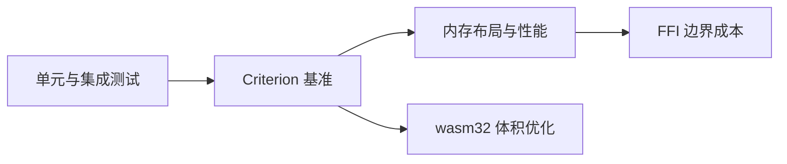

# Criterion 基准测试：科学测量 Rust 性能

> **文档简介**: 用 Criterion 在 stable 工具链上做统计学意义的性能基准——基线对比、噪声识别、HTML 报告解读，告别 `println!` + 秒表式「测性能」
>
> **目标读者**: 需要量化优化效果、验证性能回归的 Rust 开发者（高级）
>
> **前置知识**: [单元与集成测试](./01-unit-integration-tests.md) 的 cargo 命令体系；了解 release/bench 编译档位的存在

<details>
<summary>文档信息（用途、难度与维护记录）</summary>

## 📚 文档元数据

| 属性 | 内容 |
|------|------|
| **模块** | `11-rust-cross-platform` |
| **象限** | 操作指南 |
| **难度** | ⭐⭐⭐ |
| **标签** | `#rust` `#testing` `#benchmark` `#performance` |
| **更新日期** | `2026年9月` |

</details>

> Criterion 是第三方 crate，**不在模块技术基线表内**，本篇不落具体版本号；接入时以 `cargo add` 解析到的最新 stable 为准。Rust 工具链基线见模块 README。

## 🎯 学习目标

完成本篇后，你将能够：

- ✅ **掌握核心概念**: 理解采样-统计-对比的基准工作流，以及为什么手写 `Instant` 计时不可靠
- ✅ **实践能力**: 用 `criterion_group!`/`criterion_main!` 搭建基准，用基线机制捕捉性能回归
- ✅ **解决问题**: 读懂置信区间、变化百分比与异常点分析，不被噪声误导
- ✅ **进阶方向**: 为 [内存布局与性能](../advanced-topics/01-memory-layout-performance.md) 的优化工作提供测量手段

## 📋 目录

- [核心概念](#-核心概念)
- [实践指南](#️-实践指南)
- [代码示例](#-代码示例)
- [最佳实践](#-最佳实践)
- [常见问题](#-常见问题)
- [相关资源](#-相关资源)

---

## 🔍 核心概念

### 概念一：为什么不用 `Instant` 手测

**定义**: Criterion 是一个统计学驱动的基准框架：多次采样 → 剔除异常 → 拟合分布 → 与历史基线对比 → 输出带置信区间的结论。

**关键特性**:

- **stable 可用**: 内建的 `#[bench]` 属性依赖 nightly 工具链，Criterion 自带 main 函数（`harness = false`），stable 即可运行
- **统计结论而非单次数字**: 输出均值/中位数/斜率的 95% 置信区间，以及「有变化/无变化」的判定
- **自动基线对比**: 每次运行默认与上一次比较；也支持命名基线（`--save-baseline`/`--baseline`）做跨版本对比
- **HTML 报告与图表**: 报告落在 `target/criterion/report/index.html`

**使用场景**:

- 场景1：优化前后的 A/B 对比（改动前后各跑一次，报告自动给出变化幅度）
- 场景2：CI 中的性能回归门禁（保存基线产物，后续运行对比）

### 概念二：基准的编译档位

**定义**: `cargo bench` 以 `bench` profile 编译基准代码，该档位继承 `release` 的优化级别——测出来的性能代表发布形态。

**关键特性**:

- 基准代码与被测代码都会全量优化，不要用 debug 形态的结论外推
- 优化器可能删除「结果无人使用」的计算，必须用 `std::hint::black_box` 阻止

---

## 🛠️ 实践指南

### 步骤一：接入工程

**目标**: 三处配置让 Criterion 接管 `cargo bench`。

**操作指南**:

```bash
# 添加开发依赖并启用 HTML 报告（版本由 cargo 解析最新 stable）
cargo add --dev criterion --features html_reports
```

```toml
# Cargo.toml（节选）
[dev-dependencies]
# 版本由上面 cargo add 写入；本篇不落具体版本号
criterion = "*"

# 声明基准目标：harness = false 关闭 libtest，交由 criterion 的 main 接管
[[bench]]
name = "fib_bench"
harness = false
```

**验证方法**: `cargo bench` 能编译并输出第一份统计报告（首次运行没有历史基线，变化列显示为无对比）。

### 步骤二：编写第一个基准

**目标**: 用 `b.iter` + `black_box` 包住被测逻辑。

**操作指南**（文件：`benches/fib_bench.rs`）:

```rust
use criterion::{criterion_group, criterion_main, BenchmarkId, Criterion, Throughput};
use std::hint::black_box;

// 被测函数：递归斐波那契（故意低效，便于观察优化前后差异）
fn fib(n: u64) -> u64 {
    match n {
        0 | 1 => 1,
        n => fib(n - 1) + fib(n - 2),
    }
}

fn bench_fib(c: &mut Criterion) {
    // 分组：报告中聚合为 fib/10、fib/15、fib/20 三条曲线
    let mut group = c.benchmark_group("fib");
    for size in [10u64, 15, 20] {
        group.throughput(Throughput::Elements(size)); // 报告可换算为单元素耗时
        group.bench_with_input(BenchmarkId::from_parameter(size), &size, |b, &n| {
            b.iter(|| fib(black_box(n))) // black_box 阻止编译器把调用优化掉
        });
    }
    group.finish();
}

criterion_group!(benches, bench_fib);
criterion_main!(benches); // harness = false 时，这里就是基准的 main
```

**关键点解析**:

- `b.iter(|| …)` 的闭包返回值会被 Criterion 吞掉（用 `black_box` 消费），防止「算了个寂寞」的假基准
- `BenchmarkId` + `benchmark_group` 让多输入规模共享一组配置，报告按 `组名/参数` 命名

**验证方法**: `cargo bench --bench fib_bench` 只运行这一个基准目标。

### 步骤三：基线管理

**目标**: 让「改动前后」的对比落在同一参照物上。

```bash
# 首次运行并保存命名基线
cargo bench -- --save-baseline main

# 日常迭代：与 main 基线对比，报告给出变化方向与幅度
cargo bench -- --baseline main

# 只跑名称匹配的基准（正则）
cargo bench --bench fib_bench -- "fib/20"

# 快速冒烟：缩短采样时间，CI 预检或本地快速确认用
cargo bench -- --quick
```

**验证方法**: 报告中 `Change` 行出现「Performance has regressed/improved.」或「No change in performance detected.」即基线机制生效。

### 步骤四：解读报告

**目标**: 读懂 `target/criterion/report/index.html`（以及终端输出）的四类信息。

| 报告要素 | 含义 | 怎么用 |
|----------|------|--------|
| 均值 / 中位数 / 斜率 | 三种中心估计，各附 95% 置信区间 | 斜率适合线性增长的工作量；三者背离说明分布偏斜 |
| Change（±%） | 与基线估计差异及其置信区间 | 默认噪声阈值 1%，区间跨零 → 判定「无变化」 |
| Outliers | 温和/严重异常点计数（Tukey 法） | 异常多 → 环境噪声大，先降频干扰再下结论 |
| Throughput | 元素/字节每秒 | `Throughput::Elements/Bytes` 声明后自动换算 |

**关键点解析**:

- 置信区间跨零的变化**不构成结论**——Criterion 会诚实地说「No change」，不要手工解读 ±0.4% 这种噪声量级
- 绘图（PDF/回归线/相对对比）依赖 `html_reports` feature；关闭时仅终端统计

---

## 💻 代码示例

### 示例一：需要构造输入的基准（`iter_batched`）

```rust
use criterion::{criterion_group, criterion_main, BatchSize, Criterion};
use std::hint::black_box;

fn sum_with_scratch(v: &Vec<u64>) -> u64 {
    let mut scratch = Vec::with_capacity(v.len());
    let mut acc = 0u64;
    for x in v {
        scratch.push(x.wrapping_mul(2));
        acc = acc.wrapping_add(*x);
    }
    acc
}

fn bench_with_setup(c: &mut Criterion) {
    c.bench_function("sum_with_scratch", |b| {
        // iter_batched：每轮先 setup 造输入，避免上一轮的输出污染下一轮
        b.iter_batched(
            || vec![1u64; 10_000],           // setup：构造输入（不计入耗时）
            |v| sum_with_scratch(black_box(&v)), // routine：被测逻辑
            BatchSize::SmallInput,           // 批处理策略：小输入高频重建
        )
    });
}

criterion_group!(benches, bench_with_setup);
criterion_main!(benches);
```

**关键点解析**:

- 输入构造放进 `setup` 闭包才不计入测量时间；`BatchSize` 控制每批测量的输入重建频率，是对「输入构造成本」与「状态污染」的折中
- 被测逻辑若会消耗输入（如 `into_iter`），用 `iter_batched_ref` 或让 setup 克隆

---

## 🎨 最佳实践

基准先定义测量对象：初始化、单次计算还是完整请求。black_box 帮助降低优化器消除基准工作的机会，但不是绝对屏障；输入分布与结果消费仍应接近真实任务。

固定构建模式和环境，比较分布及波动，冷启动若是产品问题就应单独测量，不能一概排除。保存基线不自动产生 CI 门禁，还需实现比较、阈值和失败策略，并考虑共享 runner 噪声。

---

## ❓ 常见问题

### Q1: 同一台机器两次运行结果为什么不一样？

**A**: CPU 频率漂移、缓存状态、调度噪声都在贡献方差。Criterion 的置信区间就是为了诚实呈现这个方差：区间内的波动不是结论。需要更稳的对比时延长采样（`--measurement-time`）或提高样本数（`--sample-size`）。

### Q2: 报告说 "Performance has regressed"，但改动明明是中性的？

**A**: 先看 Change 的置信区间与异常点计数——区间略过零且异常偏多时，重跑一次通常回到「No change」。持续 regressed 才值得回溯：用 `--baseline` 对比最近几个命名基线，二分定位引入点。

### Q3: 怎么测「分配了多少内存」而不只是时间？

**A**: 时间基准之外另建计数：用自定义全局分配器统计分配次数/字节（`std::alloc::GlobalAlloc` 包装，计数后转发），在基准闭包前后读计数差值。Criterion 管 wall time，分配口径自己定义。

---

## 🔗 相关资源

### 📖 延伸阅读

- **官方文档**: [Criterion.rs User Guide](https://bheisler.github.io/criterion.rs/book/) - 基线、命令行参数与报告细节的权威来源
- **官方文档**: [std::hint::black_box](https://doc.rust-lang.org/std/hint/fn.black_box.html) - 阻断优化的标准原语
- **工具链**: [Binaryen / wasm-opt](https://github.com/WebAssembly/binaryen) - wasm 侧的体积与速度优化（配合 [wasm32 target](../advanced-topics/03-wasm32-target.md)）

### 🛠️ 工具资源

- **开发工具**: [cargo bench 文档](https://doc.rust-lang.org/cargo/commands/cargo-bench.html) - 与 Criterion 透传参数的关系
- **报告示例**: Criterion 仓库自带的示例报告，可直接感受 HTML 结构

---

## 🎯 练习与实践

### 练习一：建立个人基线习惯

**任务要求**:

1. 给任一现有工程接入 Criterion，保存基线 `main`
2. 故意引入一个低效改动（如把 `Vec` 换成 `into_iter().collect::<Vec<_>>().iter()` 绕一圈）
3. 用 `--baseline main` 观察报告如何指认回归

**评估标准**: 报告出现明确的 regressed 结论，且回退改动后回到「No change」。

### 练习二：多规模基准

**挑战任务**:

- 用 `benchmark_group` + `BenchmarkId` 对同一算法测 10/100/1000 三种规模
- 声明 `Throughput::Elements` 后，检查报告中单元素耗时是否随规模线性

**提示**: 规模跳跃处的单元素耗时变化，往往是缓存层级切换的信号。

---

## 📊 知识图谱



---

## 🔄 文档交叉引用

### 相关文档

- 📄 **[单元与集成测试](./01-unit-integration-tests.md)** - `cargo test` 与 `cargo bench` 的命令体系同源
- 📄 **[内存布局与性能](../advanced-topics/01-memory-layout-performance.md)** - 布局对齐与零成本抽象的原理侧
- 📄 **[wasm32 target](../advanced-topics/03-wasm32-target.md)** - Criterion 也可用于 wasm 产物的基准（`--target wasm32-unknown-unknown`）

---

## 📝 总结

### 核心要点回顾

1. **三件套接入**: dev-dependencies + `[[bench]] harness = false` + `criterion_main!`
2. **`black_box` 是底线**: 不阻断优化器，基准测的是「什么都不做」
3. **结论只认置信区间**: 噪声阈值内的变化交给 Criterion 判定，不做人工微解读

### 学习成果检查

- [ ] 能解释 `harness = false` 的作用
- [ ] 能用命名基线完成一次「改动前 → 改动后」的对比并复述报告结论
- [ ] 能说出均值、中位数、斜率三种估计各适合什么场景

---

**文档版本**: v1.0.0
**最后更新**: 2026年9月
**维护团队**: Dev Quest Team


<!-- learning-navigation -->
## 阅读导航

[本模块理解地图](../LEARNING_GUIDE.md) · [完整目录与版本](../README.md) · [通用术语](../../shared-resources/glossary.md)
