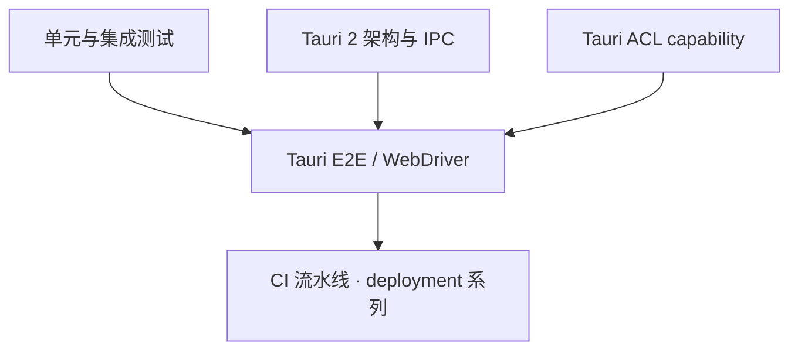

# Tauri E2E 测试：tauri-driver 与 WebDriver

> **文档简介**: 用 tauri-driver 把标准 WebDriver 协议接入 Tauri 应用——真窗口、真 WebView、真 IPC 的端到端测试，含 capability 配置与可直接落地的用例
>
> **目标读者**: 已能构建 Tauri 2 应用、需要自动化验收测试的开发者（高级）
>
> **前置知识**: [单元与集成测试](./01-unit-integration-tests.md)；模块 frameworks 线的 Tauri 2 架构篇（建设中）；对 WebDriver 协议的初步了解

## 📚 文档元数据

| 属性 | 内容 |
|------|------|
| **模块** | `11-rust-cross-platform` |
| **象限** | 操作指南 |
| **难度** | ⭐⭐⭐ |
| **标签** | `#rust` `#testing` `#tauri` `#e2e` `#webdriver` |
| **更新日期** | `2026年9月` |

> Tauri 版本基线见模块 README（Tauri 2.11）；`tauri-driver` 本身是独立发布的 CLI 工具，本篇不落具体版本号。

## 🎯 学习目标

完成本篇后，你将能够：

- ✅ **掌握核心概念**: 理解 tauri-driver 作为 WebDriver 中介节点的架构与平台依赖
- ✅ **实践能力**: 安装驱动、构建调试二进制、用 WebdriverIO 编写并运行 E2E 用例
- ✅ **解决问题**: 区分 WebDriver capability 与 Tauri ACL capability 两套同名概念；排查应用不被拉起的常见原因
- ✅ **进阶方向**: 把 E2E 用例接入 CI 流水线（配合 deployment 系列篇目）

## 📋 目录

- [核心概念](#核心概念)
- [实践指南](#实践指南)
- [代码示例](#代码示例)
- [最佳实践](#最佳实践)
- [常见问题](#常见问题)
- [相关资源](#相关资源)

---

## 🔍 核心概念

### 概念一：E2E 在测试金字塔中的位置

**定义**: E2E 测试把「构建产物」当作黑盒启动：真实进程、真实窗口、真实 WebView 渲染、真实 IPC 通道，从外部用协议驱动 UI 断言结果。

**关键特性**:

- 单元/集成测试（见 [01 篇](./01-unit-integration-tests.md)）跑的是 Rust 函数与库；E2E 跑的是**用户看到的东西**
- 成本最高、最慢、最脆，因此数量最少——金字塔尖，只放关键用户路径
- WebDriver 是 W3C 标准协议：同一套用例思路可迁移到任意支持 WebDriver 的应用

### 概念二：tauri-driver 的中介架构

**定义**: tauri-driver 不是驱动本身，而是 **WebDriver 中介节点（Intermediary Node）**：客户端连它，它按平台拉起并代理真正的原生驱动。

**关键特性**:

- **两个端口**: `tauri-driver` 默认监听 `4444`（`--port` 可改），内部代理的原生驱动占 `4445`（`--native-port` 可改）
- **平台映射**: Linux 用 WebKitWebDriver（webkit2gtk），Windows 用 Microsoft Edge Driver（WebView2）
- **桌面直连的平台限制**: 直接驱动模式下，桌面端仅支持 Windows 与 Linux——macOS 没有可用的 WKWebView 驱动工具；macOS 需走 WebdriverIO 的 `@wdio/tauri-service`（内嵌 WebDriver 服务）
- **移动端**: iOS 与 Android 通过 Appium 2 接入，流程尚未一体化

**一个容易混淆的命名**:

| 名字 | 层次 | 作用 |
|------|------|------|
| WebDriver capability | 协议会话参数 | `tauri:options: { application: 二进制路径 }`，告诉 tauri-driver 拉起哪个应用 |
| Tauri ACL capability | 应用安全配置 | `src-tauri/capabilities/*.json`，声明前端可调用哪些命令/权限 |

E2E 测试里配置的是前者；若测试需要调用受 ACL 保护的命令，先确认应用的 ACL capability 已放行——两件事都要对。

---

## 🛠️ 实践指南

### 步骤一：安装驱动与平台依赖

**目标**: 让本机具备「中介 + 原生驱动」的完整链路。

```bash
# 安装 tauri-driver（mediator 本体）
cargo install tauri-driver --locked

# Linux：确认原生驱动存在（webkit2gtk 系）
which WebKitWebDriver
# 缺失时（Debian/Ubuntu 系）：
#   sudo apt install webkit2gtk-driver

# Windows：Edge Driver 版本须与应用所用 Edge 匹配，
# 否则会话会一直挂起。可用 msedgedriver-tool 保持同步：
#   cargo install --git https://github.com/chippers/msedgedriver-tool
# tauri-driver 会在 PATH 中查找 msedgedriver.exe，
# 也可用 --native-driver 显式指定可执行文件路径
```

**验证方法**: `tauri-driver --help` 正常输出；`which WebKitWebDriver`（Linux）有结果。

### 步骤二：构建可供驱动的应用二进制

**目标**: 拿到一个「不带安装器」的应用可执行文件，供 capability 指向。

```bash
# 在项目根目录：构建 debug 二进制且跳过打包
npm run tauri build -- --debug --no-bundle
# 产物：src-tauri/target/debug/<应用名>
# （非 npm 项目直接调用 tauri CLI 时去掉多余的 --）
```

**关键点解析**:

- `--debug` 保留调试信息与未压缩资源，E2E 只关心行为正确性，不需要 release 优化
- `--no-bundle` 跳过 dmg/msi/deb 打包步骤，直接拿裸二进制，速度更快

### 步骤三：编写 WebdriverIO 用例

**目标**: 用官方推荐的 WebdriverIO 路线（直连 tauri-driver 模式）跑通第一组断言。

```js
// wdio.conf.js —— WebdriverIO 直连 tauri-driver 的最小配置
exports.config = {
    specs: ['./tests/specs/**/*.e2e.js'],
    framework: 'mocha',
    reporters: ['spec'],
    host: '127.0.0.1',
    port: 4444, // tauri-driver 默认端口
    capabilities: [
        {
            maxInstances: 1,
            'tauri:options': {
                // WebDriver capability：指向步骤二的构建产物
                application: '../src-tauri/target/debug/tauri-app',
            },
        },
    ],
    // 会话前拉起 tauri-driver、会话后收尾，可参考官方 webdriver-example
    // 仓库的 onPrepare / afterSession 钩子实现（spawnSync 拉起、退出时关闭）
};
```

```js
// tests/specs/hello.e2e.js —— 断言渲染结果与样式
const luma = (hex) => {
    const r = parseInt(hex.slice(1, 3), 16);
    const g = parseInt(hex.slice(3, 5), 16);
    const b = parseInt(hex.slice(5, 7), 16);
    // WCAG 相对亮度的简化式：各通道按人眼敏感度加权
    return 0.2126 * r + 0.7152 * g + 0.0722 * b;
};

describe('Hello Tauri', () => {
    it('应显示欢迎标题', async () => {
        const header = await $('body > h1');
        await expect(header).toHaveText(/^[hH]ello/);
    });

    it('背景色应足够柔和（luma < 100）', async () => {
        const body = await $('body');
        const backgroundColor = await body.getCSSProperty('background-color');
        expect(luma(backgroundColor.parsed.hex)).toBeLessThan(100);
    });
});
```

**关键点解析**:

- 选择器作用于 WebView 的 DOM：E2E 客户端「看到」的就是前端页面
- `tauri:options` 是 Tauri 扩展的 capability 命名空间；其余键遵循 W3C WebDriver 标准

**验证方法**: 会话建立时应用窗口被自动拉起，用例通过后进程被回收。

### 步骤四（可选）：Rust 侧客户端

**目标**: 不离开 Rust 技术栈时，用任意 WebDriver 客户端库（如 thirtyfour，异步运行时可用本模块基线内的 Tokio）直连 `http://127.0.0.1:4444`，capability 用同一个 `tauri:options` 对象。示意结构：

```rust
// Rust 客户端示意（以 thirtyfour 文档为准，API 随版本演进）
// use thirtyfour::prelude::*;
//
// let caps = serde_json::json!({
//     "tauri:options": { "application": "../src-tauri/target/debug/tauri-app" }
// });
// let driver = WebDriver::new("http://127.0.0.1:4444", caps).await?;
// let header = driver.find(By::css("body > h1")).await?;
// assert!(header.text().await?.starts_with('H'));
// driver.quit().await?;
```

---

## 💻 代码示例

上节已给出完整可落地的配置与用例。这里补充**用例拆分原则**：

### 示例一：关键路径用例的组织

```js
// tests/specs/navigation.e2e.js —— 每个文件一条用户旅程
describe('笔记应用 · 新建与保存', () => {
    it('新建笔记并输入内容', async () => {
        await $('#new-note-btn').click();
        await $('#editor').setValue('第一条 E2E 笔记');
        await expect($('#note-title')).toHaveText('未命名笔记');
    });

    it('保存后侧栏出现条目', async () => {
        await $('#save-btn').click();
        await expect($$('.sidebar .note-item')).toBeElementsArrayOfSize(1);
    });
});
```

**关键点解析**:

- 一个 `describe` = 一条用户旅程；断言的是用户可感知的结果，而不是内部状态
- 涉及应用命令（IPC）的旅程，确认 Tauri ACL capability 已允许对应命令，否则前端调用会被拒绝——这是 E2E 失败的高频根因

---

## 🎨 最佳实践

### ✅ 推荐做法

- **先稳住下层再上 E2E**: 单元/集成测试覆盖逻辑正确性，E2E 只守护「应用作为整体能被使用」的关键路径
- **固定等待策略**: 优先用条件等待（元素出现/文本变化），避免裸 `sleep` 导致的时序脆弱
- **CI 中提供虚拟显示**: Linux 流水线用 `xvfb-run` 包裹测试命令，让原生驱动有可用的显示环境

### ❌ 避免陷阱

- **拿 release 精简产物当被测对象**: 剥符号、压缩资源会放大偶发问题且不可诊断——E2E 用 debug 构建
- **在 E2E 里测计算逻辑**: 纯算法走单元测试即可，E2E 重复断言只会拖慢反馈
- **Edge Driver 与 WebView2 版本错位（Windows）**: 症状是会话挂起无报错，先核对版本再查用例

---

## ❓ 常见问题

### Q1: 会话建立成功但应用没被拉起？

**A**: 按序排查：`tauri:options.application` 路径是否正确（相对路径以测试工作目录为基准）；二进制是否有执行权限；Linux 上 `WebKitWebDriver` 是否安装；Windows 上 Edge Driver 是否与 Edge 版本匹配。四项覆盖绝大多数案例。

### Q2: 能在 E2E 里直接调用 Tauri 命令吗？

**A**: 直连 tauri-driver 模式下，客户端只能通过 DOM 间接观察命令效果。需要「从测试侧直接调命令/IPC mock/日志采集」时，改用 WebdriverIO 的 `@wdio/tauri-service` 路线：配置 `appBinaryPath` 与 `driverProvider: 'embedded'`，它提供 `browser.tauri` 访问通道，并顺带补齐了 macOS 支持。

### Q3: macOS 桌面为什么不能直连 tauri-driver？

**A**: WKWebView 没有官方 WebDriver 实现可被中介。替代方案即上一问的 `@wdio/tauri-service` 内嵌驱动，或 CrabNebula 维护的 tauri-driver 分支（macOS 需付费 API key）。

---

## 🔗 相关资源

### 📖 延伸阅读

- **官方文档**: [Tauri · WebDriver Testing](https://v2.tauri.app/develop/tests/webdriver/) - 总览、推荐路线与平台支持矩阵
- **官方文档**: [Tauri · tauri-driver Manual Setup](https://v2.tauri.app/develop/tests/webdriver/manual-setup/) - 安装与平台依赖细节
- **示例仓库**: [tauri-apps/webdriver-example](https://github.com/tauri-apps/webdriver-example) - 可直接运行的完整配置（onPrepare/afterSession 钩子）
- **协议标准**: [W3C WebDriver](https://www.w3.org/TR/webdriver/) - capability 与会话语义的规范原文

### 🛠️ 工具资源

- **开发工具**: [WebdriverIO](https://webdriver.io/) - 本篇采用的客户端框架
- **开发工具**: [thirtyfour](https://docs.rs/thirtyfour) - Rust 侧 WebDriver 客户端库

---

## 🎯 练习与实践

### 练习一：跑通官方示例骨架

**任务要求**:

1. 用 `create-tauri-app` 生成一个默认应用，构建 debug 二进制
2. 安装 tauri-driver 与平台依赖，配置 wdio.conf.js 指向产物
3. 运行本篇的标题断言用例

**评估标准**: 应用窗口在会话建立时自动弹出，两条断言通过。

### 练习二：守护一条真实用户路径

**挑战任务**:

- 为自己的应用选一条关键旅程（如「登录 → 建档 → 保存」）写成 E2E
- 故意破坏一个 Tauri ACL capability，观察用例失败形态，再修复并转绿

**提示**: 这是在演练 ACL 与 E2E 的联动——失败信息会指向前端命令调用被拒。

---

## 📊 知识图谱



---

## 🔄 文档交叉引用

### 相关文档

- 📄 **[单元与集成测试](./01-unit-integration-tests.md)** - 金字塔中下层：先快后慢的分工
- 📄 **[Criterion 基准](./02-criterion-benchmarks.md)** - 同属 testing/ 的性能维度
- 📄 **[安全实践](../advanced-topics/04-security-practices.md)** - ACL/机密与 E2E 环境的交叉地带
- 📄 **模块 README** - Tauri 2.11 基线与 frameworks/ 线的架构篇规划

---

## 📝 总结

### 核心要点回顾

1. **中介架构**: 客户端 → tauri-driver(4444) → 原生驱动(4445) → 应用 WebView
2. **两套 capability**: WebDriver 的 `tauri:options.application` 负责拉起应用，Tauri ACL capability 负责放行命令
3. **平台依赖先于用例**: Linux webkit2gtk-driver、Windows Edge Driver 版本匹配，是 E2E 稳定的前置条件

### 学习成果检查

- [ ] 能画出 tauri-driver 的三方链路并说明两个端口
- [ ] 能用 WebdriverIO 完成「构建 debug 产物 → capability 配置 → 断言」闭环
- [ ] 能区分并排查「应用不被拉起」的四类原因

---

**文档版本**: v1.0.0
**最后更新**: 2026年9月
**维护团队**: Dev Quest Team
