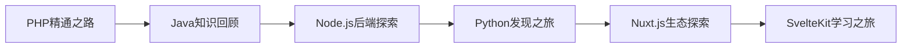

# Dev Quest - 开发者探索之旅

> **难度**: ⭐⭐⭐ | **学习方式**: 双轨制学习 | **目标**: 全栈开发能力
>
> **项目简介**: Dev Quest是一个面向开发者的综合性学习项目，采用双轨制学习模式，帮助学习者掌握现代化全栈开发技能。

## 📚 文档元数据

| 属性 | 内容 |
|------|------|
| **项目类型** | 综合性技术学习项目 |
| **学习模式** | 双轨制学习（深度+广度） |
| **难度等级** | ⭐⭐⭐ (适合有基础的开发者) |
| **技术栈** | Go, Next.js, React, TypeScript, 云原生 |
| **更新日期** | 2025年10月 |
| **作者** | Dev Quest Team |
| **状态** | ✅ 持续更新中 |

## 🎯 学习目标

完成本学习项目后，你将能够：

- ✅ **掌握全栈开发**: 从后端API到前端界面的完整开发能力
- ✅ **构建商业应用**: 具备开发可商业化应用产品的技能
- ✅ **理解现代架构**: 掌握微服务、云原生等现代架构模式
- ✅ **技术深度与广度**: 既深入掌握核心技术，又了解多种技术栈
- ✅ **工程化能力**: 具备测试、部署、运维等完整工程实践能力

## 🚀 模块概览

### 🏆 应用帝国矩阵 (核心重点)
**系统性学习路径**: 深度掌握每个技术栈，构建完整的应用开发生态

#### 🎯 学习路线


### 🔍 技术探索系列 (零散时间)
**广度学习路径**: 利用零散时间了解新兴技术，拓展技术视野

#### 🎯 探索路线


## 📁 完整目录结构

```
dev-quest/
├── 🏆 应用帝国矩阵 (核心重点)
│   ├── 01-go-backend/                    # Go 后端开发学习路线
│   │   ├── advanced-topics/              # 高级主题深度内容
│   │   │   ├── go-general/               # Go核心技术深入
│   │   │   │   ├── 01-concurrency/       # 并发编程高级专题
│   │   │   │   ├── 02-patterns/          # 设计模式与架构模式
│   │   │   │   ├── 03-performance/       # 性能优化专题
│   │   │   │   └── 04-engineering/       # 工程化实践
│   │   │   ├── gin/                      # Gin框架高级专题
│   │   │   │   ├── 01-basics/            # Gin基础进阶
│   │   │   │   ├── 02-advanced/         # Gin高级特性
│   │   │   │   ├── 03-testing/           # 测试工程
│   │   │   │   ├── 04-integration/       # 集成应用
│   │   │   │   └── 05-project/           # 项目实战
│   │   │   └── architecture/             # 系统架构设计
│   │   │       ├── 01-architecture-patterns/ # 架构模式
│   │   │       ├── 02-system-design/     # 系统设计
│   │   │       └── 03-distributed-systems/ # 分布式系统
│   │   ├── knowledge-points/             # 知识点速查手册
│   │   │   ├── 01-go-keywords.md         # Go关键字详解
│   │   │   ├── 02-go-built-in-functions.md # Go内置函数手册
│   │   │   ├── 03-go-standard-library.md # Go标准库速查
│   │   │   ├── 04-go-popular-libraries.md # Go流行库指南
│   │   │   ├── 05-go-programming-knowledge-points.md # Go编程知识点
│   │   │   ├── 06-gin-framework-knowledge-points.md # Gin框架知识点
│   │   │   └── 07-gorm-orm-knowledge-points.md # GORM ORM知识点
│   │   ├── basics/                       # Go基础
│   │   │   ├── 01-environment-setup.md
│   │   │   ├── 02-basic-syntax.md
│   │   │   ├── 03-data-types.md
│   │   │   ├── 04-control-flow.md
│   │   │   └── 05-oop-concepts.md
│   │   ├── standard-library/             # 标准库深入
│   │   │   ├── 01-fmt-io.md
│   │   │   ├── 02-net-http.md
│   │   │   ├── 03-encoding-json.md
│   │   │   └── 04-database-sql.md
│   │   ├── frameworks/                   # Go框架生态
│   │   │   ├── 01-gin-framework.md
│   │   │   ├── 02-echo-framework.md
│   │   │   ├── 03-fiber-framework.md
│   │   │   └── 04-gqlgen-graphql.md
│   │   ├── projects/                     # 实战项目
│   │   │   ├── 01-rest-api-server.md
│   │   │   ├── 02-microservices-demo.md
│   │   │   ├── 03-real-time-chat.md
│   │   │   └── 04-cli-tool.md
│   │   ├── testing/                      # 测试工程
│   │   │   ├── 01-unit-testing.md
│   │   │   ├── 02-benchmark-testing.md
│   │   │   ├── 03-integration-testing.md
│   │   │   └── 04-test-driven-development.md
│   │   ├── deployment/                   # 部署运维
│   │   │   ├── 01-docker-deployment.md
│   │   │   ├── 02-kubernetes-deployment.md
│   │   │   ├── 03-cloud-deployment.md
│   │   │   └── 04-monitoring-observability.md
│   │   ├── best-practices/               # 最佳实践
│   │   │   ├── 01-code-organization.md
│   │   │   ├── 02-performance-optimization.md
│   │   │   ├── 03-security-practices.md
│   │   │   └── 04-design-patterns.md
│   │   └── README.md                     # 模块详细说明
│   ├── 02-nextjs-frontend/               # Next.js 前端开发学习路线
│   │   ├── advanced-topics/              # 高级应用深度内容
│   │   │   ├── react-advanced/           # React 19高级特性
│   │   │   ├── nextjs-advanced/          # Next.js 15深度专题
│   │   │   ├── architecture/             # 现代前端架构
│   │   │   ├── performance/              # 性能优化专项
│   │   │   └── engineering/              # 工程化实践
│   │   ├── knowledge-points/             # 知识点速查手册
│   │   │   ├── react-concepts/           # React核心概念
│   │   │   ├── nextjs-features/          # Next.js功能速查
│   │   │   ├── typescript-patterns/      # TypeScript模式
│   │   │   ├── modern-tools/             # 现代工具速查
│   │   │   └── best-practices/           # 最佳实践
│   │   ├── basics/                       # Next.js基础
│   │   ├── frameworks/                   # 现代框架集成
│   │   ├── projects/                     # 实战项目
│   │   ├── testing/                      # 测试工程
│   │   ├── deployment/                   # 部署运维
│   │   └── README.md                     # 模块详细说明
│   ├── 03-taro-miniprogram/              # Taro 小程序开发学习路线
│   ├── 04-multiplatform-apps/            # 多端应用开发学习路线
│   ├── 05-android-native/               # Android 原生开发学习路线
│   ├── 06-ios-native/                   # iOS 原生开发学习路线
│
├── 🔍 技术探索系列 (零散时间学习)
│   ├── 07-php-mastery/                   # PHP 精通之路
│   ├── 08-java-revisited/                # Java 知识回顾与现代化
│   ├── 09-nodejs-backend/                # Node.js 后端开发技术探索
│   ├── 10-python-discovery/              # Python 发现之旅
│   ├── 11-nuxtjs-exploration/            # Nuxt.js 生态与技术探索
│   └── 12-sveltekit-journey/             # SvelteKit 现代前端学习之旅
│
├── 📚 共享资源和工具
│   ├── DOCUMENT_TEMPLATE.md              # 文档标准模板
│   ├── QUICK_TEMPLATE.md                 # 快速应用模板
│   ├── DOCUMENTATION_GUIDELINES.md       # 文档规范指南
│   ├── CROSS_REFERENCE_SYSTEM.md         # 交叉引用系统
│   ├── DOCUMENT_INDEX.md                 # 智能文档索引
│   └── README.md                         # 本文件
```

## 🎯 学习策略

### 双轨制学习模式

**应用帝国矩阵** (主要精力):
- 🎯 **深度学习**: 系统掌握每个技术栈的核心概念和最佳实践
- 💼 **项目驱动**: 围绕实际项目进行学习和实践，解决真实问题
- 🏗️ **完整生态**: 构建从前端到后端的完整能力体系
- ⚡ **商业导向**: 考虑技术选型的商业价值和可维护性

**技术探索系列** (零散时间):
- 🔍 **广度优先**: 了解多种技术栈，拓展技术视野
- ⏰ **碎片学习**: 利用工作间隙、周末等零散时间学习
- 🚀 **趋势把握**: 跟踪技术发展趋势和行业动态
- 🔄 **知识关联**: 将新知识与已有经验建立联系

## 📋 学习进度跟踪

### 🏆 应用帝国矩阵 (核心重点)
- [ ] 01. [Go 后端开发](01-go-backend/README.md) - 高性能后端开发
- [ ] 02. [Next.js 前端开发](02-nextjs-frontend/README.md) - 现代前端框架
- [ ] 03. Taro 小程序开发 - 多端小程序开发
- [ ] 04. 多端应用开发 - 跨平台应用技术
- [ ] 05. Android 原生开发 - Android应用开发
- [ ] 06. iOS 原生开发 - iOS应用开发

### 🔍 技术探索系列 (零散时间)
- [ ] 07. PHP 精通之路 - PHP深度掌握
- [ ] 08. Java 知识回顾 - Java现代化学习
- [ ] 09. Node.js 后端探索 - Node.js技术栈
- [ ] 10. Python 发现之旅 - Python多领域应用
- [ ] 11. Nuxt.js 生态探索 - Vue生态技术
- [ ] 12. SvelteKit 学习之旅 - 现代前端框架

## 🛠️ 技术栈概览

### 核心技术
- **后端**: Go 1.21+, Gin, Echo, gRPC, GraphQL
- **前端**: Next.js 15, React 19, TypeScript 5.x
- **数据库**: PostgreSQL, Redis, MongoDB, MySQL
- **云原生**: Docker, Kubernetes, Helm, Istio
- **监控**: Prometheus, Grafana, OpenTelemetry
- **CI/CD**: GitHub Actions, ArgoCD, GitOps

### 开发工具
- **IDE**: VS Code, GoLand, WebStorm
- **版本控制**: Git, GitHub, GitLab
- **包管理**: Go Modules, npm, pnpm
- **容器化**: Docker, Podman, Buildah
- **测试**: Go test, Vitest, Playwright

## 📚 学习资源

### 📖 官方文档
- [Go Documentation](https://go.dev/doc/) - Go语言官方文档
- [Next.js Documentation](https://nextjs.org/docs) - Next.js官方文档
- [React Documentation](https://react.dev) - React官方文档
- [TypeScript Handbook](https://www.typescriptlang.org/docs/) - TypeScript官方文档

### 🛠️ 开发工具
- [Go Playground](https://go.dev/play/) - Go在线运行环境
- [CodeSandbox](https://codesandbox.io/) - 在线代码编辑器
- [StackBlitz](https://stackblitz.com/) - 在线开发环境
- [GitHub](https://github.com) - 代码托管平台

### 📹 学习平台
- [YouTube技术频道](https://youtube.com) - 技术视频教程
- [B站技术区](https://bilibili.com) - 中文技术视频
- [慕课网](https://imooc.com) - IT技能学习平台
- [掘金](https://juejin.cn) - 技术社区

## 🎨 学习建议

### 🎯 应用帝国学习建议
- **深度优先**: 每个技术栈都要深入学习，不要浅尝辄止
- **项目驱动**: 围绕实际项目学习，解决真实问题
- **代码实践**: 理论学习后立即动手编写代码
- **总结反思**: 定期总结学习心得和技术要点

### 🔍 技术探索学习建议
- **碎片化学习**: 利用零散时间学习概念和基础
- **趋势敏感**: 关注技术发展趋势和行业动态
- **知识关联**: 将新知识与已有经验建立联系
- **实用导向**: 学以致用，尝试解决实际问题

### 📚 通用学习建议
- **循序渐进**: 按照推荐路径逐步学习，避免跳跃式学习
- **理论与实践结合**: 每个概念都要通过代码实践来巩固
- **建立知识体系**: 主动构建知识图谱，理解技术间的关系
- **持续学习**: 技术更新快速，保持学习的连续性

## 🔄 文档体系与导航

### 📚 标准化文档系统
Dev Quest项目建立了完整的文档标准化体系，确保高质量的学习体验：

- 📋 **[文档模板系统](shared-resources/DOCUMENT_TEMPLATE.md)** - 详细的标准文档模板，确保内容质量一致性
- ⚡ **[快速应用模板](shared-resources/QUICK_TEMPLATE.md)** - 简化的快速模板，适用于速查和参考文档
- 📝 **[文档规范指南](shared-resources/DOCUMENTATION_GUIDELINES.md)** - 完整的写作规范和质量标准
- 🔗 **[交叉引用系统](shared-resources/CROSS_REFERENCE_SYSTEM.md)** - 智能的知识关联和引用规范
- 📖 **[智能文档索引](shared-resources/DOCUMENT_INDEX.md)** - 多维度的文档导航和搜索系统

### 🎯 快速导航
- 🚀 **[开始学习](#开始学习之旅)** - 如何开始你的学习旅程
- 📊 **[学习路径](#学习策略)** - 双轨制学习策略详解
- 🔍 **[内容索引](shared-resources/DOCUMENT_INDEX.md)** - 按需查找学习内容
- 🛠️ **[工具资源](#学习资源)** - 推荐的学习工具和资源
- 📝 **[贡献指南](#贡献与反馈)** - 如何参与项目贡献

## 🎯 开始学习之旅

### 第一步：选择学习路径
1. **确定目标**: 明确你的学习目标和职业发展方向
2. **评估基础**: 根据现有技术基础选择合适的起点
3. **制定计划**: 按照双轨制模式制定学习计划

### 第二步：开始核心模块
1. **Go后端开发**: 如果你想专注于后端技术，从[01-go-backend](01-go-backend/README.md)开始
2. **Next.js前端开发**: 如果你想专注于前端技术，从[02-nextjs-frontend](02-nextjs-frontend/README.md)开始

### 第三步：实践与探索
1. **完成项目**: 每个模块都包含实战项目，务必动手完成
2. **技术探索**: 利用零散时间探索其他技术栈
3. **知识整合**: 将所学知识整合成完整的技能体系

## 📝 总结

### 核心价值
- 🎯 **系统性**: 从基础到高级的完整学习路径
- 🚀 **前沿性**: 使用2025年最新的技术和最佳实践
- 💼 **实用性**: 项目驱动，解决实际开发问题
- 🔄 **持续性**: 持续更新，跟上技术发展

### 学习成果
完成Dev Quest学习项目后，你将具备：
- **全栈开发能力**: 能够独立开发现代Web应用
- **架构设计思维**: 理解现代软件架构模式
- **工程实践能力**: 掌握完整的软件开发流程
- **技术广度视野**: 了解多种技术栈和应用场景

---

## 🤝 贡献与反馈

### 🐛 问题反馈
如果你发现任何问题或有改进建议，欢迎：
- 提交Issue报告具体问题
- 提出改进建议和补充内容
- 参与文档内容的完善

### 📝 内容贡献
我们欢迎社区贡献：
- 补充缺失的技术内容
- 更新过时的技术信息
- 分享学习心得和最佳实践
- 提供项目案例和代码示例

---

**文档状态**: ✅ 持续更新中
**最后更新**: 2025年10月
**版本**: v2.0.0
**维护团队**: Dev Quest Team

### 🎉 最新更新 (v2.0.0)
- ✅ **文档标准化**: 建立了完整的文档模板和质量标准体系
- ✅ **交叉引用系统**: 实现了智能的知识关联和导航系统
- ✅ **时间规划优化**: 移除了固定时间规划，提供更灵活的学习方式
- ✅ **结构一致性**: 统一了文档结构，确保实际目录与规划一致
- ✅ **项目独立性**: 移除了外部依赖，成为完全独立的学习项目

> 💡 **学习提示**:
> 建议先阅读[文档索引](shared-resources/DOCUMENT_INDEX.md)了解整体内容结构，然后根据你的技术背景和学习目标选择合适的模块开始学习。记住，技术学习是一个持续的过程，保持耐心和坚持是成功的关键！🚀

> 🔧 **贡献提示**:
> 本项目采用标准化的文档模板，如果你有兴趣贡献内容，请先阅读[文档规范指南](shared-resources/DOCUMENTATION_GUIDELINES.md)了解我们的写作标准和要求。