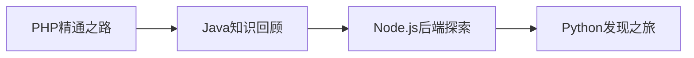

# Dev Quest - 开发者探索之旅

> **难度**: ⭐⭐⭐ | **学习方式**: 双轨制学习 | **目标**: 全栈开发能力
>
> **项目简介**: Dev Quest是一个面向开发者的综合性学习项目，采用双轨制学习模式，帮助学习者掌握现代化全栈开发技能。

## 📚 文档元数据

| 属性 | 内容 |
|------|------|
| **项目类型** | 综合性技术学习项目 |
| **学习模式** | 双轨制学习（深度+广度） |
| **难度等级** | ⭐⭐⭐ (适合有基础的开发者) |
| **技术栈** | Go, Next.js, React, TypeScript, 云原生 |
| **更新日期** | 2026年9月 |
| **作者** | Dev Quest Team |
| **状态** | ✅ 持续更新中 |

## 🎯 学习目标

完成本学习项目后，你将能够：

- ✅ **掌握全栈开发**: 从后端API到前端界面的完整开发能力
- ✅ **构建商业应用**: 具备开发可商业化应用产品的技能
- ✅ **理解现代架构**: 掌握微服务、云原生等现代架构模式
- ✅ **技术深度与广度**: 既深入掌握核心技术，又了解多种技术栈
- ✅ **工程化能力**: 具备测试、部署、运维等完整工程实践能力

## 🚀 模块概览

### 🏆 应用帝国矩阵 (核心重点)
**系统性学习路径**: 深度掌握每个技术栈，构建完整的应用开发生态

#### 🎯 学习路线 (数据层+跨平台+原生覆盖)

```mermaid
graph LR
    A[Go后端开发] --> B[Next.js前端开发]
    B --> C[TanStack数据层]
    C --> D[React Native三端App]
    D --> E[Kotlin Compose原生]
    E --> F[SwiftUI原生]
```

**📈 技术进阶策略**:
- 🥇 **数据层先行**: TanStack Query/Table/Router构建类型安全的数据层
- 🥈 **跨平台原生**: React Native三端(App+iOS+鸿蒙)，实现原生级体验
- 🥉 **原生深度**: Jetpack Compose与SwiftUI，掌握官方原生开发能力
- 🎯 **生态全覆盖**: 从数据层到跨平台再到深度原生，技术栈完整覆盖

**📍 学习重点**:
- 🔧 **类型安全数据层**: TanStack Query缓存管理 + Table表格 + Router类型安全路由
- 📱 **跨平台原生**: React Native一次开发，Android+iOS+鸿蒙三端部署
- 🚀 **渐进式扩展**: 从数据层到跨平台App到原生开发，从效率到深度体验
- 🔄 **设备优势利用**: Android设备优先，鸿蒙生态布局，iOS全球化扩展
- 💼 **技术栈平衡**: 跨平台效率与原生深度并重，生态全覆盖策略

### 🔍 技术探索系列 (零散时间)
**广度学习路径**: 利用零散时间了解新兴技术，拓展技术视野

#### 🎯 探索路线

```mermaid
graph LR
    G[PHP精通之路] --> H[Java知识回顾]
    H --> I[Node.js后端探索]
    I --> J[Python发现之旅]
```

## 📁 完整目录结构

```
dev-quest/
├── 🏆 应用帝国矩阵 (核心重点)
│   ├── 01-go-backend/                    # Go 后端开发学习路线 (已重构)
│   │   ├── basics/                       # Go基础
│   │   │   ├── 01-environment-setup.md
│   │   │   ├── 02-first-program.md
│   │   │   ├── 03-variables-constants.md
│   │   │   ├── 04-functions-methods.md
│   │   │   ├── 05-control-structures.md
│   │   │   └── 06-error-handling.md
│   │   ├── advanced-topics/              # 高级主题深度内容
│   │   │   ├── api-advanced/             # API高级专题
│   │   │   ├── architecture/             # 系统架构设计
│   │   │   ├── performance/             # 性能优化专题
│   │   │   └── security/                 # 安全最佳实践
│   │   ├── reference/  # 知识字典（全量参考）
│   │   │   ├── language-concepts/        # 语言核心概念
│   │   │   ├── framework-essentials/     # 框架核心要点
│   │   │   ├── library-guides/           # 标准库与三方库指南
│   │   │   └── quick-references/         # 快速参考速查
│   │   ├── frameworks/                   # Go框架生态
│   │   │   ├── 01-gin-framework-basics.md
│   │   │   ├── 02-gin-framework-advanced.md
│   │   │   ├── 03-gorm-orm-complete.md
│   │   │   ├── 04-mongodb-go-driver.md
│   │   │   └── 05-go-redis-complete.md
│   │   ├── projects/                     # 实战项目
│   │   │   ├── 01-rest-api-server.md
│   │   │   ├── 02-microservices-demo.md
│   │   │   ├── 03-real-time-app.md
│   │   │   └── 04-cli-tool.md
│   │   ├── testing/                      # 测试工程
│   │   │   ├── 01-unit-testing.md
│   │   │   ├── 02-mocking-stubbing.md
│   │   │   ├── 03-integration-testing.md
│   │   │   ├── 04-benchmarking.md
│   │   │   └── 05-test-driven-development.md
│   │   ├── deployment/                   # 部署运维
│   │   │   ├── 01-containerization.md
│   │   │   ├── 02-ci-cd-pipelines.md
│   │   │   ├── 03-kubernetes-deployment.md
│   │   │   └── 04-observability.md
│   │   └── README.md                     # 模块详细说明
│   ├── 02-nextjs-frontend/               # Next.js 前端开发学习路线 (已重构)
│   │   ├── basics/                       # Next.js基础
│   │   ├── advanced-topics/              # 高级应用深度内容
│   │   │   ├── api-integration/          # API集成
│   │   │   ├── architecture/             # 现代前端架构
│   │   │   ├── performance/              # 性能优化专项
│   │   │   └── security/                 # 安全实践
│   │   ├── reference/  # 知识字典（全量参考）
│   │   │   ├── language-concepts/        # 语言核心概念
│   │   │   ├── framework-patterns/       # 框架模式
│   │   │   ├── development-tools/        # 开发工具
│   │   │   └── performance-optimization/  # 性能优化
│   │   ├── frameworks/                   # 现代框架集成
│   │   ├── projects/                     # 实战项目
│   │   ├── testing/                      # 测试工程
│   │   ├── deployment/                   # 部署运维
│   │   └── README.md                     # 模块详细说明
│   ├── 03-tanstack-stack/                # TanStack 全家桶学习路线
│   ├── 04-multiplatform-apps/            # React Native 三端原生App (Android+iOS+鸿蒙)
│   ├── 05-kotlin-compose/               # Kotlin Jetpack Compose 原生开发
│   └── 06-swift-swiftui/                # Swift SwiftUI 原生开发
│
├── 🔍 技术探索系列 (零散时间学习)
│   ├── 07-php-mastery/                   # PHP 精通之路
│   ├── 08-java-revisited/                # Java 知识回顾与现代化
│   ├── 09-nodejs-backend/                # Node.js 后端开发技术探索
│   └── 10-python-discovery/              # Python 发现之旅
│
├── 📚 共享资源和工具
│   ├── standards/                        # 项目规范标准
│   │   ├── module-structure-guide.md     # 模块结构设计指南
│   │   ├── module-development-standards.md # 模块开发标准
│   │   ├── documentation-guidelines.md   # 文档规范指南
│   │   └── cross-reference-system.md     # 交叉引用系统
│   ├── templates/                        # 文档模板
│   │   ├── document-template.md          # 标准文档模板
│   │   └── quick-template.md              # 快速应用模板
│   ├── tools/                            # 工具与索引
│   │   ├── document-index.md             # 智能文档索引
│   │   └── development-tools.md          # 开发工具指南
│   ├── progress/                         # 进度跟踪
│   │   └── learning-progress.md          # 学习进度总览
│   └── README.md                         # 共享资源说明
│
├── 🗄️ 重构归档
│   └── refactor-archives/                # 重构计划与日志归档
│       ├── completed/                    # 已完成的重构记录
│       └── README.md                     # 归档系统说明
│
└── README.md                             # 本文件
```

## 🎯 学习策略

### 双轨制学习模式

**应用帝国矩阵** (主要精力):
- 🎯 **深度学习**: 系统掌握每个技术栈的核心概念和最佳实践
- 💼 **项目驱动**: 围绕实际项目进行学习和实践，解决真实问题
- 🏗️ **完整生态**: 构建从前端到后端的完整能力体系
- ⚡ **商业导向**: 技术选型服务于商业目标和市场占有策略
- 📈 **市场优先**: 优先选择高流量平台和快速验证路径

**技术探索系列** (零散时间):
- 🔍 **广度优先**: 了解多种技术栈，拓展技术视野
- ⏰ **碎片学习**: 利用工作间隙、周末等零散时间学习
- 🚀 **趋势把握**: 跟踪技术发展趋势和行业动态
- 🔄 **知识关联**: 将新知识与已有经验建立联系
- 💡 **创新思维**: 探索新兴技术和商业模式

## 📋 学习进度跟踪

### 🏆 应用帝国矩阵 (核心重点)
- [ ] 01. [Go 后端开发](01-go-backend/README.md) - 高性能后端开发
- [ ] 02. [Next.js 前端开发](02-nextjs-frontend/README.md) - 现代前端框架
- [ ] 03. [TanStack 全家桶](03-tanstack-stack/README.md) - 类型安全数据层
- [ ] 04. [React Native 三端App](04-multiplatform-apps/README.md) - Android+iOS+鸿蒙原生开发
- [ ] 05. [Kotlin Compose](05-kotlin-compose/README.md) - Android官方原生开发
- [ ] 06. [Swift SwiftUI](06-swift-swiftui/README.md) - iOS官方原生开发

### 🔍 技术探索系列 (零散时间)
- [ ] 07. PHP 精通之路 - PHP深度掌握
- [ ] 08. Java 知识回顾 - Java现代化学习
- [ ] 09. Node.js 后端探索 - Node.js技术栈
- [ ] 10. Python 发现之旅 - Python多领域应用

## 🛠️ 技术栈概览

### 核心技术
- **后端**: Go 1.21+, Gin, gRPC, GraphQL
- **前端**: Next.js 15, React 19, TypeScript 5.x, TanStack (Query/Table/Router/Form)
- **移动端**: React Native, Jetpack Compose (Kotlin), SwiftUI (Swift)
- **数据库**: PostgreSQL, Redis, MongoDB, MySQL
- **云原生**: Docker, Kubernetes, Helm, Istio
- **监控**: Prometheus, Grafana, OpenTelemetry
- **CI/CD**: GitHub Actions, ArgoCD, GitOps

### 开发工具
- **IDE**: VS Code, GoLand, WebStorm
- **版本控制**: Git, GitHub, GitLab
- **包管理**: Go Modules, npm, pnpm
- **容器化**: Docker, Podman, Buildah
- **测试**: Go test, Vitest, Playwright

## 📚 学习资源

### 📖 官方文档
- [Go Documentation](https://go.dev/doc/) - Go语言官方文档
- [Next.js Documentation](https://nextjs.org/docs) - Next.js官方文档
- [React Documentation](https://react.dev) - React官方文档
- [TypeScript Handbook](https://www.typescriptlang.org/docs/) - TypeScript官方文档

### 🛠️ 开发工具
- [Go Playground](https://go.dev/play/) - Go在线运行环境
- [CodeSandbox](https://codesandbox.io/) - 在线代码编辑器
- [StackBlitz](https://stackblitz.com/) - 在线开发环境
- [GitHub](https://github.com) - 代码托管平台

### 📹 学习平台
- [YouTube技术频道](https://youtube.com) - 技术视频教程
- [B站技术区](https://bilibili.com) - 中文技术视频
- [慕课网](https://imooc.com) - IT技能学习平台
- [掘金](https://juejin.cn) - 技术社区

## 🎨 学习建议

### 🎯 应用帝国学习建议
- **深度优先**: 每个技术栈都要深入学习，不要浅尝辄止
- **项目驱动**: 围绕实际项目学习，解决真实问题
- **代码实践**: 理论学习后立即动手编写代码
- **总结反思**: 定期总结学习心得和技术要点

### 🔍 技术探索学习建议
- **碎片化学习**: 利用零散时间学习概念和基础
- **趋势敏感**: 关注技术发展趋势和行业动态
- **知识关联**: 将新知识与已有经验建立联系
- **实用导向**: 学以致用，尝试解决实际问题

### 📚 通用学习建议
- **循序渐进**: 按照推荐路径逐步学习，避免跳跃式学习
- **理论与实践结合**: 每个概念都要通过代码实践来巩固
- **建立知识体系**: 主动构建知识图谱，理解技术间的关系
- **持续学习**: 技术更新快速，保持学习的连续性

## 🔄 文档体系与导航

### 📚 标准化文档系统
Dev Quest项目建立了完整的文档标准化体系，确保高质量的学习体验：

- 📋 **[文档模板系统](shared-resources/templates/document-template.md)** - 详细的标准文档模板，确保内容质量一致性
- ⚡ **[快速应用模板](shared-resources/templates/quick-template.md)** - 简化的快速模板，适用于速查和参考文档
- 📝 **[文档规范指南](shared-resources/standards/documentation-guidelines.md)** - 完整的写作规范和质量标准
- 🔗 **[交叉引用系统](shared-resources/standards/cross-reference-system.md)** - 智能的知识关联和引用规范
- 📖 **[智能文档索引](shared-resources/tools/document-index.md)** - 多维度的文档导航和搜索系统

### 🎯 快速导航
- 🚀 **[开始学习](#开始学习之旅)** - 如何开始你的学习旅程
- 📊 **[学习路径](#学习策略)** - 双轨制学习策略详解
- 🔍 **[内容索引](shared-resources/tools/document-index.md)** - 按需查找学习内容
- 🛠️ **[工具资源](#学习资源)** - 推荐的学习工具和资源
- 📝 **[贡献指南](#贡献与反馈)** - 如何参与项目贡献

## 🎯 开始学习之旅

### 第一步：选择学习路径
1. **确定目标**: 明确你的学习目标和职业发展方向
2. **评估基础**: 根据现有技术基础选择合适的起点
3. **制定计划**: 按照双轨制模式制定学习计划

### 第二步：开始核心模块
1. **Go后端开发**: 如果你想专注于后端技术，从[01-go-backend](01-go-backend/README.md)开始
2. **Next.js前端开发**: 如果你想专注于前端技术，从[02-nextjs-frontend](02-nextjs-frontend/README.md)开始

### 第三步：实践与探索
1. **完成项目**: 每个模块都包含实战项目，务必动手完成
2. **技术探索**: 利用零散时间探索其他技术栈
3. **知识整合**: 将所学知识整合成完整的技能体系

## 📝 总结

### 核心价值
- 🎯 **系统性**: 从基础到高级的完整学习路径
- 🚀 **前沿性**: 使用2025年最新的技术和最佳实践
- 💼 **实用性**: 项目驱动，解决实际开发问题
- 🔄 **持续性**: 持续更新，跟上技术发展

### 学习成果
完成Dev Quest学习项目后，你将具备：
- **全栈开发能力**: 能够独立开发现代Web应用
- **架构设计思维**: 理解现代软件架构模式
- **工程实践能力**: 掌握完整的软件开发流程
- **技术广度视野**: 了解多种技术栈和应用场景

---

## 🤝 贡献与反馈

### 🐛 问题反馈
如果你发现任何问题或有改进建议，欢迎：
- 提交Issue报告具体问题
- 提出改进建议和补充内容
- 参与文档内容的完善

### 📝 内容贡献
我们欢迎社区贡献：
- 补充缺失的技术内容
- 更新过时的技术信息
- 分享学习心得和最佳实践
- 提供项目案例和代码示例

---

**文档状态**: ✅ 持续更新中
**最后更新**: 2026年9月
**版本**: v2.1.0
**维护团队**: Dev Quest Team

### 🎉 最新更新 (v2.1.0)
- ✅ **文档体系整理**: 修正根 README 与实际目录结构不一致的问题
- ✅ **模块布局调整**: 按兴趣技术栈重组为 10 个模块（新增 TanStack，聚焦 Compose/SwiftUI，移除 Taro/Nuxt/SvelteKit）
- ✅ **工程文档补齐**: 新增 CLAUDE.md、CONTRIBUTING.md、CHANGELOG.md、LICENSE

<details>
<summary>历史更新 (v2.0.0)</summary>

- ✅ **文档标准化**: 建立了完整的文档模板和质量标准体系
- ✅ **交叉引用系统**: 实现了智能的知识关联和导航系统
- ✅ **时间规划优化**: 移除了固定时间规划，提供更灵活的学习方式
- ✅ **结构一致性**: 统一了文档结构，确保实际目录与规划一致
- ✅ **项目独立性**: 移除了外部依赖，成为完全独立的学习项目
- ✅ **三端原生覆盖**: 重新设计跨平台模块React Native三端App开发
- ✅ **生态完整布局**: 从跨平台效率到深度体验的技术栈全覆盖

</details>

> 💡 **学习提示**:
> 建议先阅读[文档索引](shared-resources/tools/document-index.md)了解整体内容结构，然后根据你的技术背景和学习目标选择合适的模块开始学习。记住，技术学习是一个持续的过程，保持耐心和坚持是成功的关键！🚀

> 🔧 **贡献提示**:
> 本项目采用标准化的文档模板，如果你有兴趣贡献内容，请先阅读[文档规范指南](shared-resources/standards/documentation-guidelines.md)和[贡献指南](CONTRIBUTING.md)了解我们的写作标准和要求。