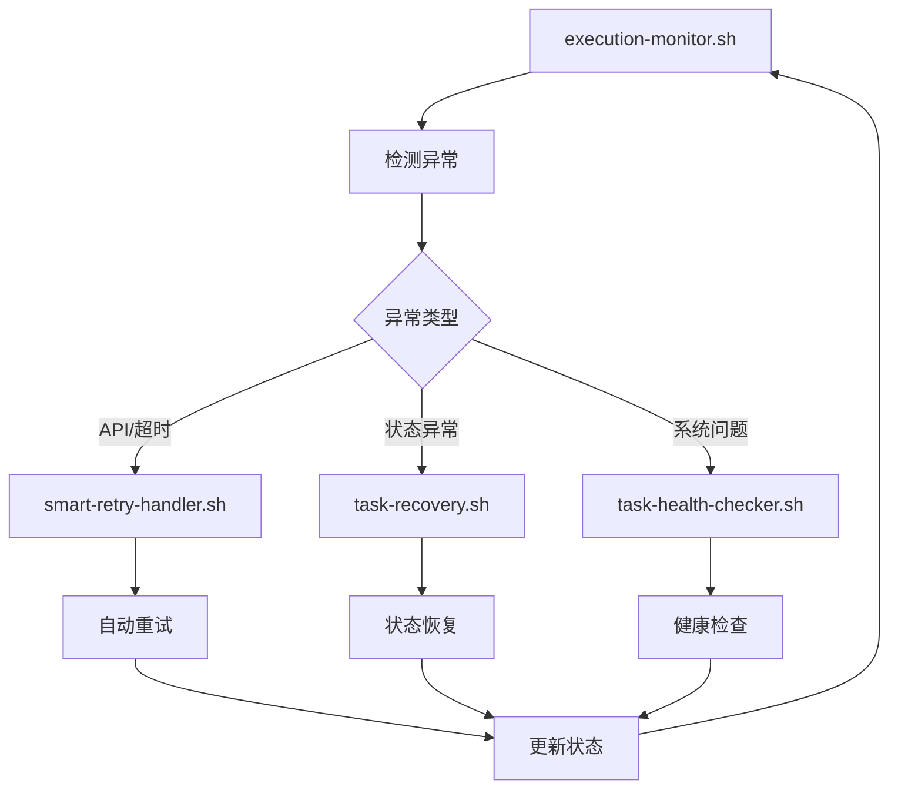

# 脚本工具说明

本目录包含Claude Code工作流系统的所有执行脚本和监控工具。

## 📁 脚本文件概览

### 📋 文档指南
- **workflow-starter.md** - 工作流启动指南 (增强版)
- **status-monitor.md** - 状态监控指南
- **recovery-guide.md** - 恢复指南

### 🛠️ 可执行脚本 (核心工具)
- **smart-retry-handler.sh** - 智能重试处理器 ⭐
- **task-health-checker.sh** - 任务健康检查器 ⭐
- **task-recovery.sh** - 任务恢复管理器 ⭐
- **execution-monitor.sh** - 综合监控器 ⭐

## 🚀 核心脚本详细说明

### 1. smart-retry-handler.sh - 智能重试处理器

**功能**: 自动处理任务执行过程中的异常和重试逻辑

**主要特性**:
- ✅ 智能错误分析和分类
- ✅ 多层重试限制 (全局+单任务)
- ✅ 指数退避重试策略
- ✅ 恢复点自动创建
- ✅ 避免无限重试机制

**使用方法**:
```bash
# 启动智能重试监控
./smart-retry-handler.sh --monitor

# 手动重试指定任务
./smart-retry-handler.sh --retry T001-002

# 查看重试统计
./smart-retry-handler.sh --stats

# 清理旧恢复点
./smart-retry-handler.sh --cleanup

# 显示帮助
./smart-retry-handler.sh --help
```

**配置参数**:
- `MAX_TOTAL_RETRIES=10` - 全局最大重试次数
- `MAX_RETRY_PER_TASK=3` - 单个任务最大重试次数
- `RETRY_DELAY_BASE=30` - 基础延迟(秒)
- `RETRY_DELAY_MAX=1800` - 最大延迟(30分钟)

**适用场景**:
- API错误自动重试
- 任务超时处理
- 网络异常恢复
- 临时性故障处理

---

### 2. task-health-checker.sh - 任务健康检查器

**功能**: 全面监控Claude Code任务执行的健康状态

**主要特性**:
- ✅ 任务执行时间监控
- ✅ API错误计数监控
- ✅ 系统资源使用监控
- ✅ 网络连接状态检查
- ✅ 异常模式识别
- ✅ 健康报告生成

**使用方法**:
```bash
# 执行单次健康检查
./task-health-checker.sh --check

# 启动持续健康监控
./task-health-checker.sh --monitor

# 生成健康检查报告
./task-health-checker.sh --report

# 显示帮助
./task-health-checker.sh --help
```

**检查项目**:
- 任务超时检测 (30分钟阈值)
- API错误统计 (5次阈值)
- 网络连接测试
- CPU/内存/磁盘使用率
- 执行进度异常检测
- 错误模式分析

**输出文件**:
- `HEALTH_REPORT_*.md` - 详细健康检查报告
- `HEALTH_CHECK_LOG.md` - 健康检查日志
- `ALERT_LOG.md` - 告警日志

---

### 3. task-recovery.sh - 任务恢复管理器

**功能**: 从各种异常情况中恢复Claude Code任务执行

**主要特性**:
- ✅ 智能状态恢复
- ✅ 任务完整性验证
- ✅ 多级恢复策略
- ✅ 恢复点管理
- ✅ 交互式恢复界面

**使用方法**:
```bash
# 自动恢复模式
./task-recovery.sh --auto

# 交互式恢复 (推荐)
./task-recovery.sh --interactive

# 智能状态恢复
./task-recovery.sh --smart-recovery

# 继续中断的任务
./task-recovery.sh --continue T001-002

# 从恢复点恢复
./task-recovery.sh --recover-point rp_20251006_120000

# 验证任务完整性
./task-recovery.sh --verify T001-002

# 列出可用恢复点
./task-recovery.sh --list-points

# 显示帮助
./task-recovery.sh --help
```

**恢复策略**:
1. **自动恢复**: 简单异常自动重试
2. **智能恢复**: 复杂情况智能分析后恢复
3. **交互恢复**: 需要用户决策的情况
4. **人工恢复**: 完全由用户处理的情况

**恢复点管理**:
- 自动创建恢复点 (任务开始/完成/异常时)
- 手动创建恢复点
- 恢复点列表和详细信息查看
- 从指定恢复点恢复状态

---

### 4. execution-monitor.sh - 综合监控器

**功能**: 提供统一的任务执行监控界面和告警系统

**主要特性**:
- ✅ 实时监控界面
- ✅ 系统状态监控
- ✅ 任务进度跟踪
- ✅ 异常检测和告警
- ✅ 监控仪表板生成
- ✅ 后台监控模式

**使用方法**:
```bash
# 启动实时监控界面 (推荐)
./execution-monitor.sh --interface

# 后台监控模式
./execution-monitor.sh --background &

# 生成监控仪表板
./execution-monitor.sh --dashboard

# 执行一次性状态检查
./execution-monitor.sh --check

# 清理日志文件
./execution-monitor.sh --cleanup

# 显示帮助
./execution-monitor.sh --help
```

**监控指标**:
- 执行性能指标 (任务完成速度、成功率)
- 重试统计 (总重试次数、成功率)
- 资源使用指标 (CPU、内存、磁盘)
- 质量指标 (质量评分、验证通过率)
- 异常指标 (错误计数、超时计数)

**输出文件**:
- `MONITOR_LOG.md` - 监控系统日志
- `ALERT_HISTORY.md` - 告警历史记录
- `MONITOR_DASHBOARD.md` - 监控仪表板

## 🔧 脚本使用最佳实践

### 1. 启动顺序建议
```bash
# 1. 首先启动综合监控 (主终端)
./execution-monitor.sh --interface

# 2. 在需要时启动其他组件 (其他终端)
./smart-retry-handler.sh --monitor &
./task-health-checker.sh --monitor &
```

### 2. 异常处理流程
```bash
# 1. 检测到异常时
./execution-monitor.sh --check

# 2. 分析具体问题
./task-health-checker.sh --report

# 3. 尝试自动恢复
./task-recovery.sh --auto

# 4. 如需要，交互式恢复
./task-recovery.sh --interactive
```

### 3. 定期维护
```bash
# 清理旧恢复点
./smart-retry-handler.sh --cleanup

# 清理监控日志
./execution-monitor.sh --cleanup

# 生成健康报告
./task-health-checker.sh --report
```

## 📊 脚本协作关系



## ⚠️ 重要注意事项

### 依赖要求
所有脚本都需要以下工具：
- `jq` - JSON处理工具
- `claude` - Claude Code CLI
- 基础Linux工具 (`grep`, `awk`, `sed`, `date`等)

### 权限设置
```bash
# 确保所有脚本有执行权限
chmod +x *.sh
```

### 日志管理
- 监控日志会自动轮转，避免过大
- 恢复点有数量限制，自动清理旧文件
- 建议定期备份重要的状态文件

### 性能考虑
- 监控间隔可根据需要调整
- 后台监控模式资源占用较低
- 实时界面模式会占用一个终端

## 🆘 故障排除

### 常见问题

1. **脚本无法执行**
   ```bash
   # 检查权限
   ls -la *.sh

   # 添加执行权限
   chmod +x *.sh
   ```

2. **依赖工具缺失**
   ```bash
   # 检查jq
   which jq

   # 安装jq (Ubuntu/Debian)
   sudo apt-get install jq

   # 安装jq (CentOS/RHEL)
   sudo yum install jq
   ```

3. **监控界面异常**
   ```bash
   # 检查终端支持
   echo $TERM

   # 使用简单模式
   ./execution-monitor.sh --check
   ```

4. **恢复点损坏**
   ```bash
   # 检查恢复点
   ./task-recovery.sh --list-points

   # 智能恢复
   ./task-recovery.sh --smart-recovery
   ```

## 📚 相关文档

- **workflow-starter.md** - 完整的工作流启动指南
- **status-monitor.md** - 状态监控的详细说明
- **recovery-guide.md** - 恢复操作的详细指南
- **QUICK_START_GUIDE.md** - 快速启动指南
- **USAGE_GUIDE.md** - 完整使用指南

---

**💡 提示**: 建议首次使用时先阅读 `workflow-starter.md` 和 `QUICK_START_GUIDE.md`，熟悉基本操作后再使用高级功能。