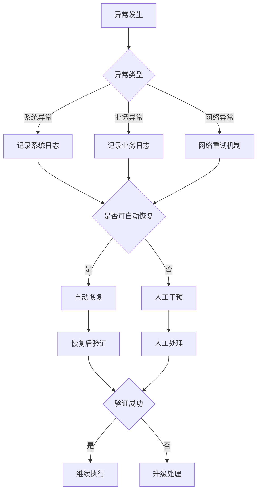
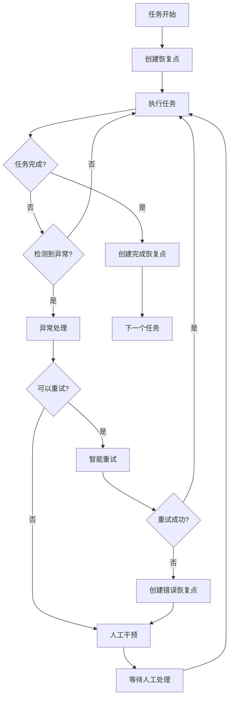
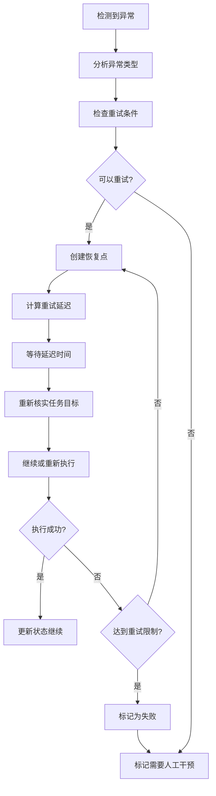

# 异常处理和恢复机制 (增强版)

> **使用说明**: 定义项目执行过程中可能遇到的各种异常情况及其处理策略。包含智能重试、自动恢复和异常监控机制。

## 🚨 异常分类体系

### 系统级异常
```markdown
## 系统资源异常

### 磁盘空间不足
- **检测方法**: 检查可用磁盘空间 < 1GB
- **处理策略**:
  - 清理临时文件
  - 压缩已有文件
  - 暂停执行并通知
- **预防措施**: 定期检查磁盘使用情况

### 内存不足
- **检测方法**: 系统内存使用率 > 90%
- **处理策略**:
  - 释放缓存内存
  - 减少并行任务数量
  - 暂停非关键任务
- **预防措施**: 监控内存使用趋势

### 网络连接问题
- **检测方法**: 网络请求超时或失败
- **处理策略**:
  - 自动重试机制
  - 切换备用资源
  - 本地缓存策略
- **预防措施**: 网络连接健康检查
```

### 文件操作异常
```markdown
## 文件系统异常

### 权限不足
- **检测方法**: 文件操作返回 Permission Denied
- **处理策略**:
  - 检查文件权限
  - 请求权限提升
  - 使用备用路径
- **解决方案**: 确保执行账户有足够权限

### 文件锁定
- **检测方法**: 文件被其他进程占用
- **处理策略**:
  - 等待并重试
  - 使用临时文件
  - 强制解锁（谨慎）
- **预防措施**: 避免长时间文件锁定

### 路径不存在
- **检测方法**: 目录或文件路径不存在
- **处理策略**:
  - 创建缺失的目录
  - 使用绝对路径
  - 验证路径有效性
- **预防措施**: 执行前检查路径存在性
```

## 🛠️ 错误处理策略

### 重试机制
```javascript
// 智能重试策略
const retryStrategy = {
  maxAttempts: 3,
  baseDelay: 1000, // 1秒
  maxDelay: 30000, // 30秒
  backoffFactor: 2,
  retryableErrors: [
    'NetworkError',
    'TimeoutError',
    'TemporaryFailure'
  ]
};

async function executeWithRetry(operation, context) {
  let lastError;

  for (let attempt = 1; attempt <= retryStrategy.maxAttempts; attempt++) {
    try {
      return await operation(context);
    } catch (error) {
      lastError = error;

      if (!isRetryableError(error)) {
        throw error;
      }

      if (attempt === retryStrategy.maxAttempts) {
        throw new Error(`Operation failed after ${attempt} attempts. Last error: ${error.message}`);
      }

      const delay = Math.min(
        retryStrategy.baseDelay * Math.pow(retryStrategy.backoffFactor, attempt - 1),
        retryStrategy.maxDelay
      );

      console.log(`Attempt ${attempt} failed, retrying in ${delay}ms...`);
      await new Promise(resolve => setTimeout(resolve, delay));
    }
  }

  throw lastError;
}
```

### 熔断机制
```javascript
// 熔断器模式，防止连续失败
class CircuitBreaker {
  constructor(failureThreshold = 5, resetTimeout = 60000) {
    this.failureThreshold = failureThreshold;
    this.resetTimeout = resetTimeout;
    this.failureCount = 0;
    this.lastFailureTime = null;
    this.state = 'CLOSED'; // CLOSED, OPEN, HALF_OPEN
  }

  async execute(operation) {
    if (this.state === 'OPEN') {
      if (Date.now() - this.lastFailureTime > this.resetTimeout) {
        this.state = 'HALF_OPEN';
      } else {
        throw new Error('Circuit breaker is OPEN');
      }
    }

    try {
      const result = await operation();
      this.onSuccess();
      return result;
    } catch (error) {
      this.onFailure();
      throw error;
    }
  }

  onSuccess() {
    this.failureCount = 0;
    this.state = 'CLOSED';
  }

  onFailure() {
    this.failureCount++;
    this.lastFailureTime = Date.now();

    if (this.failureCount >= this.failureThreshold) {
      this.state = 'OPEN';
      console.log(`Circuit breaker opened after ${this.failureCount} failures`);
    }
  }
}
```

## 📋 异常处理流程

### 标准异常处理流程


### 异常处理检查清单
```markdown
## 异常处理标准流程

### 1. 异常检测
- [ ] 异常类型识别正确
- [ ] 异常信息记录完整
- [ ] 上下文信息保存
- [ ] 影响范围评估

### 2. 异常分类
- [ ] 按严重程度分类
- [ ] 按影响范围分类
- [ ] 按处理方式分类
- [ ] 按紧急程度分类

### 3. 处理执行
- [ ] 选择合适的处理策略
- [ ] 执行处理操作
- [ ] 记录处理过程
- [ ] 验证处理结果

### 4. 恢复验证
- [ ] 系统状态恢复正常
- [ ] 数据完整性检查
- [ ] 功能测试通过
- [ ] 性能指标正常
```

## 🔄 状态恢复机制

### 执行状态恢复
```javascript
class ExecutionStateRecovery {
  constructor() {
    this.stateFile = 'EXECUTION_STATE.json';
    this.backupFile = 'EXECUTION_STATE.backup.json';
  }

  // 保存当前执行状态
  saveState(state) {
    try {
      // 保存主状态文件
      this.writeStateFile(this.stateFile, state);

      // 创建备份
      if (this.shouldCreateBackup()) {
        this.writeStateFile(this.backupFile, state);
      }

      return true;
    } catch (error) {
      console.error('Failed to save execution state:', error);
      return false;
    }
  }

  // 恢复执行状态
  loadState() {
    try {
      // 首先尝试主状态文件
      let state = this.readStateFile(this.stateFile);

      if (!state) {
        // 尝试从备份恢复
        state = this.readStateFile(this.backupFile);
        if (state) {
          console.log('Recovered from backup state file');
        }
      }

      return state;
    } catch (error) {
      console.error('Failed to load execution state:', error);
      return null;
    }
  }

  // 验证状态完整性
  validateState(state) {
    const requiredFields = [
      'currentTask',
      'completedTasks',
      'failedTasks',
      'startTime',
      'executionContext'
    ];

    for (const field of requiredFields) {
      if (!state[field]) {
        throw new Error(`Missing required field in state: ${field}`);
      }
    }

    return true;
  }
}
```

### 数据一致性检查
```javascript
// 数据一致性验证
async function verifyDataConsistency() {
  const checks = [
    {
      name: 'File Existence Check',
      check: verifyFileExistence,
      critical: true
    },
    {
      name: 'Content Integrity Check',
      check: verifyContentIntegrity,
      critical: true
    },
    {
      name: 'Task Dependency Check',
      check: verifyTaskDependencies,
      critical: true
    },
    {
      name: 'Permission Check',
      check: verifyPermissions,
      critical: false
    }
  ];

  const results = [];

  for (const check of checks) {
    try {
      const result = await check.check();
      results.push({
        name: check.name,
        passed: result,
        critical: check.critical
      });
    } catch (error) {
      results.push({
        name: check.name,
        passed: false,
        error: error.message,
        critical: check.critical
      });
    }
  }

  const failedCriticalChecks = results.filter(r => !r.passed && r.critical);

  if (failedCriticalChecks.length > 0) {
    throw new Error(`Critical consistency checks failed: ${failedCriticalChecks.map(c => c.name).join(', ')}`);
  }

  return results;
}
```

## 📞 人工干预机制

### 人工干预触发条件
```markdown
## 需要人工干预的情况

### 立即干预
- [ ] 系统安全风险检测
- [ ] 数据完整性严重损坏
- [ ] 执行逻辑错误
- [ ] 资源耗尽风险

### 短期干预 (1小时内)
- [ ] 多次重试失败的任务
- [ ] 质量验证持续失败
- [ ] 外部依赖服务中断
- [ ] 配置参数需要调整

### 计划干预
- [ ] 阶段性质量检查
- [ ] 执行策略调整
- [ ] 新需求集成
- [ ] 性能优化调优
```

### 人工干预流程
```markdown
## 人工干预标准流程

### 1. 干预请求
**触发条件**: 检测到需要人工处理的情况
**信息提供**:
- 问题描述
- 影响范围
- 建议解决方案
- 操作风险提示

### 2. 状态保护
**数据备份**: 保存当前执行状态
**环境快照**: 记录系统环境状态
**任务暂停**: 安全暂停所有执行任务

### 3. 人工处理
**权限验证**: 确认操作权限
**影响评估**: 评估操作影响范围
**操作执行**: 执行必要的人工操作
**结果验证**: 验证操作结果

### 4. 恢复执行
**状态恢复**: 从中断点恢复
**环境检查**: 验证执行环境
**继续执行**: 重新启动自动执行
**监控观察**: 密切监控执行状态
```

## 📊 异常监控和报告

### 实时监控指标
```javascript
const monitoringMetrics = {
  // 执行性能指标
  executionSpeed: 'tasks_per_hour',
  successRate: 'percentage',
  errorRate: 'percentage',

  // 资源使用指标
  cpuUsage: 'percentage',
  memoryUsage: 'percentage',
  diskUsage: 'percentage',

  // 质量指标
  qualityScore: 'average_score',
  validationPassRate: 'percentage',

  // 异常指标
  errorCount: 'count',
  retryCount: 'count',
  interventionCount: 'count'
};
```

### 异常报告模板
```markdown
## 异常报告格式

### 异常摘要
- **异常ID**: [唯一标识符]
- **异常类型**: [异常分类]
- **严重程度**: [高/中/低]
- **发生时间**: [YYYY-MM-DD HH:MM:SS]
- **影响范围**: [描述影响范围]

### 异常详情
- **错误信息**: [详细错误信息]
- **堆栈跟踪**: [错误堆栈信息]
- **执行上下文**: [发生时的执行环境]
- **相关文件**: [涉及的文件列表]

### 处理过程
- **检测时间**: [异常检测时间]
- **处理方式**: [自动/人工]
- **处理结果**: [成功/失败/进行中]
- **处理时间**: [处理耗时]

### 后续措施
- **预防措施**: [防止再次发生的措施]
- **改进建议**: [系统改进建议]
- **相关任务**: [需要关注的任务]
```

## 🛡️ 预防措施

### 系统预防
```markdown
## 系统级预防措施

### 环境检查
- [ ] 执行前环境检查
- [ ] 依赖服务健康检查
- [ ] 资源可用性验证
- [ ] 权限验证

### 执行保护
- [ ] 执行前数据备份
- [ ] 事务性操作支持
- [ ] 原子性操作保证
- [ ] 状态一致性检查

### 监控告警
- [ ] 实时性能监控
- [ ] 异常情况自动告警
- [ ] 趋势分析预测
- [ ] 容量规划告警
```

### 操作预防
```markdown
## 操作级预防措施

### 输入验证
- [ ] 参数有效性检查
- [ ] 数据类型验证
- [ ] 范围值检查
- [ ] 格式规范检查

### 输出验证
- [ ] 输出文件存在性检查
- [ ] 内容格式验证
- [ ] 逻辑正确性验证
- [ ] 质量标准验证

### 过程监控
- [ ] 执行步骤跟踪
- [ ] 中间结果检查
- [ ] 性能指标监控
- [ ] 异常情况捕获
```

## 🔄 智能重试和恢复系统

### 自动重试机制
```javascript
// 智能重试策略配置
const retryConfig = {
    maxTotalRetries: 10,           // 全局最大重试次数
    maxRetriesPerTask: 3,          // 单个任务最大重试次数
    baseDelay: 30,                 // 基础延迟(秒)
    maxDelay: 1800,                // 最大延迟(30分钟)
    backoffFactor: 2,              // 退避因子
    retryableErrors: [
        'API_ERROR',
        'TIMEOUT',
        'NETWORK_ERROR',
        'TEMPORARY_FAILURE'
    ]
};

// 智能重试决策流程
function shouldRetry(errorType, taskRetries, totalRetries) {
    // 检查全局重试限制
    if (totalRetries >= retryConfig.maxTotalRetries) {
        return { shouldRetry: false, reason: 'GLOBAL_LIMIT_EXCEEDED' };
    }

    // 检查单任务重试限制
    if (taskRetries >= retryConfig.maxRetriesPerTask) {
        return { shouldRetry: false, reason: 'TASK_LIMIT_EXCEEDED' };
    }

    // 检查错误类型
    if (!retryConfig.retryableErrors.includes(errorType)) {
        return { shouldRetry: false, reason: 'NON_RETRYABLE_ERROR' };
    }

    return { shouldRetry: true, reason: 'RETRY_ALLOWED' };
}
```

### 任务恢复点管理
```bash
# 创建恢复点的时机
CREATE_RECOVERY_POINT_TRIGGERS=(
    "任务开始前"
    "任务完成后"
    "检测到异常时"
    "手动触发时"
    "定期自动创建"
)

# 恢复点内容结构
RECOVERY_POINT_STRUCTURE=(
    "EXECUTION_STATUS.json"     # 执行状态
    "EXECUTION_LOG.md"          # 执行日志
    "ERROR_REPORT.md"           # 错误报告
    "recovery_info.md"          # 恢复信息
)
```

### 健康检查机制
```bash
# 健康检查项目
HEALTH_CHECK_ITEMS=(
    "任务执行时间监控"           # 检测超时任务
    "API错误计数监控"            # 检测API异常
    "网络连接状态检查"           # 检测网络问题
    "系统资源使用监控"           # 检测资源不足
    "执行进度验证"               # 检测进度异常
    "错误模式分析"               # 检测异常模式
)

# 健康检查触发条件
HEALTH_CHECK_TRIGGERS=(
    "定期自动检查 (60秒间隔)"
    "异常发生时立即检查"
    "用户手动触发检查"
)
```

## 🛠️ 实际使用脚本

### 1. 智能重试处理器
```bash
# 启动智能重试监控
./smart-retry-handler.sh --monitor

# 手动重试指定任务
./smart-retry-handler.sh --retry T001-002

# 查看重试统计
./smart-retry-handler.sh --stats

# 清理旧恢复点
./smart-retry-handler.sh --cleanup
```

### 2. 任务健康检查器
```bash
# 执行单次健康检查
./task-health-checker.sh --check

# 启动持续健康监控
./task-health-checker.sh --monitor

# 生成健康检查报告
./task-health-checker.sh --report
```

### 3. 任务恢复管理器
```bash
# 自动恢复模式
./task-recovery.sh --auto

# 交互式恢复
./task-recovery.sh --interactive

# 智能状态恢复
./task-recovery.sh --smart-recovery

# 继续中断的任务
./task-recovery.sh --continue T001-002

# 从恢复点恢复
./task-recovery.sh --recover-point rp_20251006_120000

# 验证任务完整性
./task-recovery.sh --verify T001-002
```

## 📊 异常监控和告警

### 实时监控指标
```javascript
const monitoringMetrics = {
    // 执行性能指标
    executionSpeed: 'tasks_per_hour',
    successRate: 'percentage',
    errorRate: 'percentage',

    // 重试统计
    totalRetries: 'count',
    retrySuccessRate: 'percentage',
    averageRetryAttempts: 'number',

    // 资源使用指标
    cpuUsage: 'percentage',
    memoryUsage: 'percentage',
    diskUsage: 'percentage',

    // 质量指标
    qualityScore: 'average_score',
    validationPassRate: 'percentage',

    // 异常指标
    errorCount: 'count',
    timeoutCount: 'count',
    recoveryCount: 'count'
};
```

### 告警级别定义
```markdown
## 告警级别

### 🔴 CRITICAL (严重)
- 系统崩溃或无法恢复的错误
- 执行状态文件损坏或丢失
- 连续重试失败超过限制

### 🟡 WARNING (警告)
- 任务执行时间超过阈值
- API错误次数过多
- 系统资源使用率过高
- 网络连接不稳定

### 🔵 INFO (信息)
- 任务正常完成
- 恢复点创建成功
- 重试操作执行
```

## 🔄 完整的异常处理流程

### 正常执行流程


### 恢复流程


## 📝 异常处理最佳实践

### 1. 预防性措施
```markdown
## 执行前预防检查
- [ ] 系统资源充足
- [ ] 网络连接稳定
- [ ] API配额充足
- [ ] 磁盘空间足够
- [ ] 权限设置正确
- [ ] 依赖工具可用
```

### 2. 监控策略
```markdown
## 多层次监控
1. **实时监控**: 任务执行状态和进度
2. **健康检查**: 系统资源和网络状态
3. **异常检测**: 错误模式和性能异常
4. **定期审计**: 执行日志和质量报告
```

### 3. 恢复策略
```markdown
## 分级恢复
1. **自动恢复**: 简单异常自动重试
2. **智能恢复**: 复杂情况智能分析后恢复
3. **交互恢复**: 需要用户决策的情况
4. **人工恢复**: 完全由用户处理的情况
```

## 🎯 异常处理配置示例

### 项目级配置文件
```json
{
  "error_handling": {
    "retry_policy": {
      "max_total_retries": 10,
      "max_retries_per_task": 3,
      "base_delay": 30,
      "max_delay": 1800,
      "backoff_factor": 2
    },
    "health_check": {
      "interval": 60,
      "timeout_threshold": 1800,
      "api_error_threshold": 5,
      "network_error_threshold": 3
    },
    "recovery": {
      "max_recovery_points": 20,
      "auto_recovery_enabled": true,
      "interactive_recovery_fallback": true
    },
    "monitoring": {
      "log_level": "INFO",
      "alert_threshold": {
        "error_rate": 0.1,
        "timeout_rate": 0.05,
        "retry_failure_rate": 0.3
      }
    }
  }
}
```

---

**重要提示**:

1. **避免无限重试**: 系统内置了多层重试限制，包括全局限制和单任务限制
2. **智能错误分析**: 只有可重试的错误类型才会触发自动重试
3. **指数退避策略**: 重试延迟会逐渐增加，避免频繁重试造成问题
4. **恢复点机制**: 每次重试前都会创建恢复点，确保可以回滚
5. **人工干预机制**: 当自动处理无法解决问题时，会暂停等待人工处理
6. **监控和告警**: 实时监控系统状态，及时发现问题并告警

这套异常处理机制能够确保Claude Code在遇到各种异常情况时，都能够智能地恢复执行，避免任务中断或无限重试的问题。