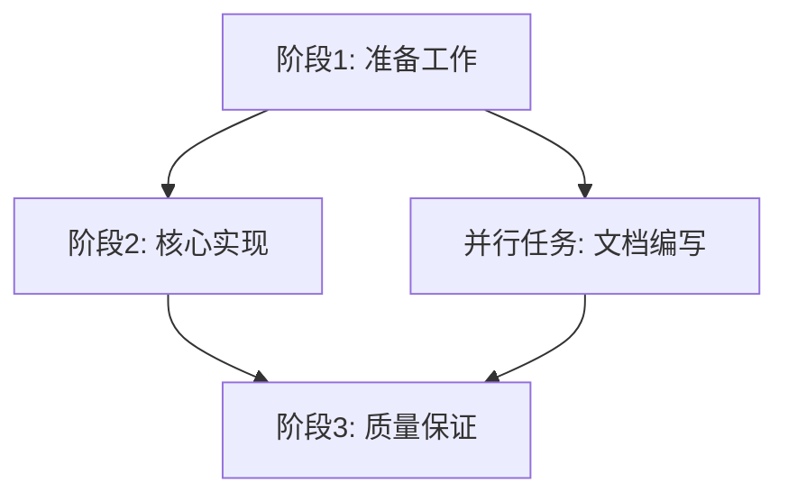

# 执行计划确认书

> **使用说明**: 基于任务讨论结果，Claude Code生成详细的执行计划供用户检查确认。用户确认后才能开始长时间任务执行。

## 📋 基本信息

**任务编号**: TASK-[日期]-[序号]
**计划生成时间**: [YYYY-MM-DD HH:MM:SS]
**讨论完成时间**: [YYYY-MM-DD HH:MM:SS]
**预估执行时长**: [数字] 小时/天
**复杂度评级**: [低/中/高/极高]

## 🎯 任务执行摘要

### 核心目标
基于我们的讨论，本任务将实现：

**主要目标**:
- [目标1的具体描述]
- [目标2的具体描述]

**成功标准**:
- [标准1]: [具体可衡量的标准]
- [标准2]: [具体可衡量的标准]

### 交付成果清单
- [ ] [交付物1]: [详细描述]
- [ ] [交付物2]: [详细描述]
- [ ] [交付物3]: [详细描述]

## 🏗️ 技术架构方案

### 技术栈选择
```markdown
**核心技术**:
- [技术1]: [版本] - [选择理由]
- [技术2]: [版本] - [选择理由]

**辅助工具**:
- [工具1]: [用途]
- [工具2]: [用途]

**依赖关系**:
- [依赖1]: [版本要求]
- [依赖2]: [版本要求]
```

### 整体架构设计
```markdown
**架构模式**: [选择的架构模式]
**目录结构**: [简要说明或附图]
**模块划分**: [主要模块及其职责]
**数据流**: [数据流向和处理逻辑]
```

### 关键设计决策
| 决策项 | 选择 | 理由 | 影响 |
|--------|------|------|------|
| [决策1] | [选择] | [用户需求/技术考虑] | [影响范围] |
| [决策2] | [选择] | [用户需求/技术考虑] | [影响范围] |

## 📅 详细执行计划

### 执行阶段划分
```markdown
## 阶段1: [阶段名称] - [预估时间]
**目标**: [阶段目标]
**主要任务**:
- T001: [任务描述] - [预估时间]
- T002: [任务描述] - [预估时间]
- T003: [任务描述] - [预估时间]

**验收标准**:
- [ ] [标准1]
- [ ] [标准2]

## 阶段2: [阶段名称] - [预估时间]
**目标**: [阶段目标]
**主要任务**:
- T004: [任务描述] - [预估时间]
- T005: [任务描述] - [预估时间]

**验收标准**:
- [ ] [标准1]
- [ ] [标准2]

## 阶段3: [阶段名称] - [预估时间]
**目标**: [阶段目标]
**主要任务**:
- T006: [任务描述] - [预估时间]
- T007: [任务描述] - [预估时间]

**验收标准**:
- [ ] [标准1]
- [ ] [标准2]
```

### 任务依赖关系


## ⚡ 质量保证计划

### 质量标准
```markdown
**技术质量** (权重40%):
- 代码规范遵循度: [具体标准]
- 功能实现正确性: [验证方法]
- 性能指标达标: [具体指标]

**内容质量** (权重30%):
- 技术准确性: [验证标准]
- 内容完整性: [覆盖范围]
- 实用性: [应用价值]

**用户体验** (权重20%):
- 文档可读性: [评估标准]
- 示例清晰度: [示例要求]
- 学习曲线: [复杂度控制]

**维护性** (权重10%):
- 代码可维护性: [设计原则]
- 扩展性考虑: [架构支持]
- 文档完整性: [文档要求]
```

### 验证检查点
```markdown
**自动检查**:
- [ ] 语法正确性验证
- [ ] 功能完整性测试
- [ ] 性能基准测试
- [ ] 安全性扫描

**人工检查**:
- [ ] 代码质量审查
- [ ] 用户体验测试
- [ ] 技术准确性验证
- [ ] 文档完整性检查
```

## ⚠️ 风险评估和应对

### 已识别风险
| 风险类别 | 风险描述 | 概率 | 影响 | 应对策略 |
|----------|----------|------|------|----------|
| 技术风险 | [具体风险] | [高/中/低] | [高/中/低] | [应对措施] |
| 时间风险 | [具体风险] | [高/中/低] | [高/中/低] | [应对措施] |
| 质量风险 | [具体风险] | [高/中/低] | [高/中/低] | [应对措施] |

### 应急预案
```markdown
**Plan B**: 如果[主要方案]失败，将采用[备用方案]
**Plan C**: 如果[主要方案和备用方案都失败]，将[最终应对策略]
```

## 📊 资源需求评估

### 时间资源
- **总预估时间**: [小时数] 小时
- **关键路径时间**: [小时数] 小时
- **缓冲时间**: [小时数] 小时 (20%缓冲)

### 技术资源
- **计算资源**: [CPU/内存要求]
- **存储空间**: [磁盘空间要求]
- **网络要求**: [带宽/连接要求]
- **外部依赖**: [需要的外部服务]

## 🔄 执行监控方案

### 进度监控
```markdown
**监控频率**: [每小时/每阶段]
**监控指标**:
- 任务完成进度 (%)
- 质量评分趋势
- 资源使用情况
- 风险触发情况

**报告机制**:
- 实时状态更新: EXECUTION_STATUS.json
- 详细执行日志: EXECUTION_LOG.md
- 问题报告: ERROR_REPORT.md
```

### 质量监控
```markdown
**检查点设置**:
- 每个阶段完成时: 全面质量检查
- 关键任务完成后: 专项验证
- 每[时间间隔]: 常规质量抽查

**质量预警机制**:
- 质量分数低于[阈值]: 自动预警
- 连续[数量]个任务未达标: 暂停执行
```

## 💰 成本效益分析

### 投入成本
- **时间成本**: [预估小时数] 小时 × [时薪] = [总成本]
- **机会成本**: [在此期间无法做的其他事情]
- **风险成本**: [可能的返工或修复成本]

### 预期收益
- **直接收益**: [具体收益描述]
- **间接收益**: [学习/经验/工具提升]
- **长期价值**: [对未来项目的帮助]

## ✅ 确认检查清单

### 技术方案确认
- [ ] 技术栈选择合理且可行
- [ ] 架构设计满足需求
- [ ] 关键设计决策已考虑周全
- [ ] 技术风险有应对策略

### 执行计划确认
- [ ] 时间安排合理
- [ ] 任务分解充分
- [ ] 依赖关系清晰
- [ ] 质量标准明确

### 资源和风险确认
- [ ] 资源需求可满足
- [ ] 风险识别完整
- [ ] 应急方案可行
- [ ] 成本效益可接受

### 最终确认
- [ ] 我已仔细阅读整个执行计划
- [ ] 理解所有技术选择和设计决策
- [ ] 同意时间安排和质量标准
- [ ] 接受已识别的风险和应对策略
- [ ] 确认可以开始执行

## 📝 用户确认书

### 确认声明
> 我，[用户姓名/标识]，已仔细阅读并完全理解上述执行计划。我确认：
>
> 1. 技术方案符合我的需求和期望
> 2. 执行计划的时间安排和质量标准合理
> 3. 已识别的风险和应对策略可接受
> 4. 授权Claude Code按照此计划开始执行
>
> 我理解在执行过程中如遇重大问题，Claude Code会暂停并寻求我的进一步指示。

### 确认信息
**用户确认**: ________________ (签名或明确同意声明)
**确认时间**: ________________
**计划版本**: v1.0
**生效条件**: 用户确认后立即生效

### 修改机制
```markdown
**计划修改条件**:
- 发现重大技术障碍
- 用户需求发生重要变化
- 外部环境发生重大变化

**修改流程**:
1. 识别需要修改的内容
2. 评估修改的影响
3. 与用户讨论修改方案
4. 更新执行计划
5. 重新获得用户确认
```

---

**重要提醒**:
- 请用户仔细阅读每一项内容，确保完全理解
- 如有任何疑问或不明确的地方，请在确认前提出
- 一旦确认，Claude Code将严格按照此计划执行
- 执行过程中如需变更，需要重新确认修改后的计划