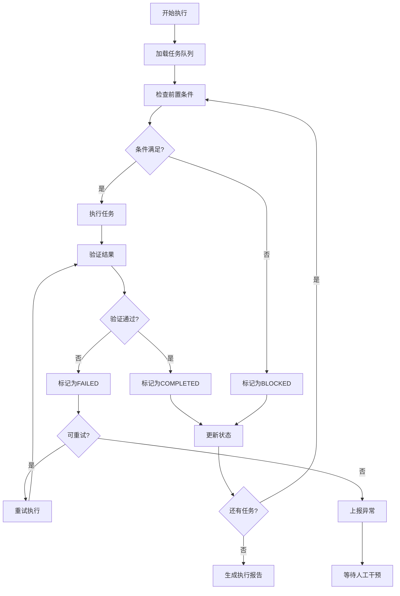

# 自动化执行计划

> **使用说明**: 这是Claude Code执行自动化任务时的详细计划，包含状态跟踪和异常处理机制。

## 🚀 执行启动

### 环境检查
```bash
# 执行前必须检查的环境条件
- [ ] 项目路径正确: [当前项目路径]
- [ ] 必要文件存在: PROJECT_PLAN.md, TASK_DEFINITIONS.md
- [ ] 权限充足: 读写权限
- [ ] 磁盘空间充足: 至少 [预估大小] GB
- [ ] 网络连接稳定: [如果需要]
- [ ] 工具版本正确: [列出版本要求]
```

### 执行初始化
```markdown
## 执行环境初始化步骤

1. **加载项目配置**
   - 读取 PROJECT_PLAN.md
   - 解析 TASK_DEFINITIONS.md
   - 加载 QUALITY_STANDARDS.md

2. **创建执行状态文件**
   - EXECUTION_STATUS.json (执行状态跟踪)
   - EXECUTION_LOG.md (执行日志)
   - ERROR_REPORT.md (错误报告)

3. **设置执行参数**
   - 并行执行数量: [数字]
   - 错误重试次数: [数字]
   - 检查点间隔: [时间]
   - 日志级别: [DEBUG/INFO/WARN/ERROR]
```

## 📋 任务执行流程

### 主执行循环


### 任务执行步骤
```markdown
## 每个任务的执行步骤

### 1. 任务准备阶段
```javascript
function prepareTask(taskId) {
  // 1.1 加载任务定义
  const task = loadTaskDefinition(taskId);

  // 1.2 检查前置条件
  const prerequisites = checkPrerequisites(task);
  if (!prerequisites.satisfied) {
    return { status: 'BLOCKED', reason: prerequisites.reason };
  }

  // 1.3 准备执行环境
  const environment = prepareEnvironment(task);

  // 1.4 记录任务开始
  logTaskStart(taskId, environment);

  return { status: 'READY', environment };
}
```

### 2. 任务执行阶段
```javascript
function executeTask(task, environment) {
  try {
    // 2.1 更新任务状态为 IN_PROGRESS
    updateTaskStatus(task.id, 'IN_PROGRESS');

    // 2.2 执行任务步骤
    for (const step of task.steps) {
      const result = executeStep(step, environment);
      if (!result.success) {
        throw new Error(`步骤失败: ${step.description}`);
      }
    }

    // 2.3 执行自动验证
    const validation = validateTaskOutput(task);
    if (!validation.passed) {
      return { status: 'VALIDATION_FAILED', errors: validation.errors };
    }

    return { status: 'SUCCESS', output: validation.output };

  } catch (error) {
    return { status: 'FAILED', error: error.message };
  }
}
```

### 3. 任务验证阶段
```javascript
function validateTaskOutput(task) {
  const results = [];

  // 3.1 文件存在性验证
  for (const file of task.expectedFiles) {
    const exists = checkFileExists(file.path);
    results.push({ type: 'file_exists', path: file.path, passed: exists });
  }

  // 3.2 内容质量验证
  for (const file of task.expectedFiles) {
    const content = readFile(file.path);
    const quality = checkContentQuality(content, task.qualityStandards);
    results.push({ type: 'content_quality', path: file.path, ...quality });
  }

  // 3.3 格式规范验证
  for (const file of task.expectedFiles) {
    const format = checkFileFormat(file.path, task.formatStandards);
    results.push({ type: 'format_validation', path: file.path, ...format });
  }

  const allPassed = results.every(r => r.passed);
  const errors = results.filter(r => !r.passed);

  return { passed: allPassed, results, errors };
}
```

## 📊 状态跟踪系统

### 状态文件结构
```json
{
  "execution_info": {
    "start_time": "2025-10-04T10:00:00Z",
    "current_task": "T001-001",
    "total_tasks": 50,
    "completed_tasks": 15,
    "failed_tasks": 2,
    "blocked_tasks": 1
  },
  "tasks": {
    "T001-001": {
      "status": "COMPLETED",
      "start_time": "2025-10-04T10:05:00Z",
      "end_time": "2025-10-04T10:08:00Z",
      "duration": 180,
      "attempts": 1,
      "validation_results": {
        "passed": true,
        "checks_performed": 5,
        "checks_passed": 5
      }
    },
    "T001-002": {
      "status": "FAILED",
      "start_time": "2025-10-04T10:10:00Z",
      "end_time": "2025-10-04T10:12:00Z",
      "duration": 120,
      "attempts": 3,
      "last_error": "权限不足，无法创建目录",
      "blocking_reason": "requires_manual_intervention"
    }
  },
  "checkpoints": [
    {
      "timestamp": "2025-10-04T11:00:00Z",
      "progress_percentage": 30,
      "tasks_completed": 15,
      "quality_score": 8.5
    }
  ]
}
```

### 进度报告格式
```markdown
## 执行进度报告

### 总体进度
- **开始时间**: 2025-10-04 10:00:00
- **当前时间**: 2025-10-04 11:30:00
- **总进度**: 32% (16/50 任务完成)
- **预计完成时间**: 2025-10-04 18:00:00

### 任务状态分布
- ✅ 已完成: 16 个任务
- 🔄 进行中: 1 个任务
- ⏸️ 被阻塞: 1 个任务
- ❌ 失败: 2 个任务
- ⏳ 等待中: 30 个任务

### 质量统计
- **平均质量分数**: 8.7/10
- **验证通过率**: 94%
- **重试次数**: 平均 1.2 次/任务

### 当前执行任务
**任务ID**: T002-005
**任务名称**: 创建API文档结构
**开始时间**: 2025-10-04 11:25:00
**预计完成**: 2025-10-04 11:35:00

### 需要关注的问题
1. **T001-002** - 权限不足导致失败，需要人工干预
2. **T002-003** - 网络连接不稳定，正在重试
```

## ⚠️ 异常处理机制

### 异常分类和处理策略
```markdown
## 异常处理策略

### 🟢 轻微异常 (自动处理)
**定义**: 不影响主要功能的临时性问题
**处理方式**: 自动重试或使用备选方案
**重试次数**: 3次
**重试间隔**: 30秒

**示例**:
- 网络暂时不可用
- 文件暂时被占用
- 临时磁盘空间不足
- 外部服务暂时不可达

### 🟡 中等异常 (条件处理)
**定义**: 需要判断处理方式的异常
**处理方式**: 根据预设规则选择处理策略
**人工干预**: 可能需要
**响应时间**: 5分钟内

**示例**:
- 部分文件创建失败
- 内容验证未完全通过
- 格式规范轻微偏差
- 依赖文件缺失

### 🔴 严重异常 (立即停止)
**定义**: 影响项目核心功能的严重问题
**处理方式**: 立即停止并等待人工干预
**响应时间**: 立即
**影响范围**: 整个执行流程

**示例**:
- 系统权限严重不足
- 关键文件损坏或丢失
- 项目结构被破坏
- 安全风险检测到
```

### 错误恢复流程
```javascript
function handleError(taskId, error) {
  // 1. 分析错误类型
  const errorType = classifyError(error);

  // 2. 根据错误类型选择处理策略
  switch (errorType) {
    case 'MINOR':
      return handleMinorError(taskId, error);
    case 'MODERATE':
      return handleModerateError(taskId, error);
    case 'SEVERE':
      return handleSevereError(taskId, error);
    default:
      return handleUnknownError(taskId, error);
  }
}

function handleMinorError(taskId, error) {
  // 轻微错误自动重试
  if (getRetryCount(taskId) < 3) {
    incrementRetryCount(taskId);
    scheduleRetry(taskId, 30); // 30秒后重试
    return { action: 'retry', scheduled_time: Date.now() + 30000 };
  } else {
    // 重试次数过多，升级为中等错误
    return handleModerateError(taskId, error);
  }
}

function handleModerateError(taskId, error) {
  // 中等错误记录并可能需要人工干预
  logError(taskId, error);
  updateTaskStatus(taskId, 'NEEDS_REVIEW');

  // 检查是否有自动修复方案
  const autoFix = getAutoFix(error);
  if (autoFix) {
    applyAutoFix(taskId, autoFix);
    return { action: 'auto_fix_applied', task: taskId };
  } else {
    // 等待人工处理
    notifyHumanOperator(taskId, error);
    return { action: 'awaiting_human_intervention', task: taskId };
  }
}

function handleSevereError(taskId, error) {
  // 严重错误立即停止所有执行
  logSevereError(taskId, error);
  stopAllExecution();
  notifyEmergencyContact(taskId, error);

  return {
    action: 'emergency_stop',
    task: taskId,
    reason: error.message,
    timestamp: Date.now()
  };
}
```

## 🔄 断点续传机制

### 状态保存策略
```markdown
## 状态保存机制

### 保存时机
- 每个任务完成后立即保存
- 每个检查点时刻保存 (默认每30分钟)
- 检测到异常情况时保存
- 系统正常关闭前保存

### 保存内容
- 当前执行状态
- 已完成任务列表
- 失败任务记录
- 环境状态信息
- 执行日志片段

### 恢复机制
1. **加载上次状态**: 读取状态文件
2. **验证环境一致性**: 检查文件和目录状态
3. **恢复执行位置**: 从中断点继续
4. **验证恢复成功**: 确认状态正确
```

### 恢复验证清单
```markdown
## 断点恢复验证

### 环境一致性检查
- [ ] 项目路径存在且可访问
- [ ] 必要文件未被修改
- [ ] 执行权限充足
- [ ] 磁盘空间可用
- [ ] 网络连接正常

### 状态一致性检查
- [ ] 状态文件完整性
- [ ] 任务状态逻辑正确
- [ ] 进度信息准确
- [ ] 错误记录完整

### 恢复决策
- [ ] 从中断点继续
- [ ] 回滚到上一个检查点
- [ ] 重新开始当前任务
- [ ] 完全重新开始执行
```

## 📈 性能监控和优化

### 执行性能指标
```javascript
const performanceMetrics = {
  // 任务执行效率
  tasks_per_hour: 12.5,
  average_task_duration: 240, // 秒
  success_rate: 0.95,

  // 资源使用情况
  cpu_usage: 0.15, // 15%
  memory_usage: 0.08, // 8%
  disk_io: 1024, // MB/s

  // 质量指标
  quality_score: 8.7,
  validation_pass_rate: 0.94,
  retry_rate: 0.12
};
```

### 优化策略
```markdown
## 性能优化方法

### 并行执行优化
- 识别独立任务进行并行处理
- 动态调整并行任务数量
- 避免资源竞争和冲突

### 缓存机制
- 缓存常用模板和示例
- 缓存验证结果
- 缓存外部资源下载

### 资源管理
- 监控系统资源使用
- 动态调整执行策略
- 预防资源耗尽情况
```

---

**注意**: 执行计划需要根据具体项目特点进行调整，定期回顾执行效果并优化执行策略。