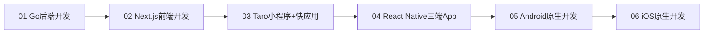

# Dev Quest 学习进度跟踪系统

> **难度**: ⭐⭐ | **学习方式**: 自主进度跟踪 | **目标**: 可视化学习进展

> **简介**: Dev Quest项目的学习进度跟踪系统，帮助你了解整体学习进展，调整学习策略，保持学习动力。

## 📊 整体学习进度概览

### 🎯 应用帝国矩阵学习路线 (核心重点)


### 📈 学习进度仪表板
- **总体完成度**: _% (0/6 模块完成)
- **核心模块进度**: _% (0/4 核心模块完成)
- **当前学习模块**: __________
- **累计学习时长**: _______ 小时
- **预计完成时间**: 根据个人学习节奏调整

## 🎯 模块化进度跟踪

### 🏆 应用帝国矩阵 (核心重点)

#### 01. Go 后端开发 ⭐⭐⭐
**目标**: 高性能现代Go后端开发能力

**双路径学习体系** ⭐⭐
- [ ] **系统化学习**: [basics/](../../01-go-backend/basics/) - 从零开始的渐进式学习
- [ ] **快速参考**: [knowledge-points/](../../01-go-backend/knowledge-points/) - 高效速查手册

**基础阶段** ⭐⭐
- [x] **环境搭建**: [01-environment-setup.md](../../01-go-backend/basics/01-environment-setup.md) - Go 1.21+ 开发环境配置
- [x] **第一个程序**: [02-first-program.md](../../01-go-backend/basics/02-first-program.md) - Go语言入门实践
- [x] **变量常量**: [03-variables-constants.md](../../01-go-backend/basics/03-variables-constants.md) - 变量、常量和基础数据类型
- [x] **函数方法**: [04-functions-methods.md](../../01-go-backend/basics/04-functions-methods.md) - 函数定义与方法调用
- [x] **控制结构**: [05-control-structures.md](../../01-go-backend/basics/05-control-structures.md) - 条件语句与循环控制
- [x] **错误处理**: [06-error-handling.md](../../01-go-backend/basics/06-error-handling.md) - Go错误处理机制

**语言概念速查** ⭐
- [x] **Go关键字**: [knowledge-points/language-concepts/01-go-keywords.md](../../01-go-backend/knowledge-points/language-concepts/01-go-keywords.md) - Go关键字详解
- [x] **内置函数**: [knowledge-points/language-concepts/02-go-built-in-functions.md](../../01-go-backend/knowledge-points/language-concepts/02-go-built-in-functions.md) - Go内置函数
- [x] **数据类型**: [knowledge-points/language-concepts/03-go-data-types.md](../../01-go-backend/knowledge-points/language-concepts/03-go-data-types.md) - 数据类型详解
- [x] **控制流程**: [knowledge-points/language-concepts/04-go-control-flow.md](../../01-go-backend/knowledge-points/language-concepts/04-go-control-flow.md) - 控制流程详解
- [x] **面向对象**: [knowledge-points/language-concepts/05-go-oop-concepts.md](../../01-go-backend/knowledge-points/language-concepts/05-go-oop-concepts.md) - 面向对象概念

**标准库指南** ⭐
- [x] **标准库**: [knowledge-points/library-guides/01-go-standard-library.md](../../01-go-backend/knowledge-points/library-guides/01-go-standard-library.md) - 标准库核心API
- [x] **第三方库**: [knowledge-points/library-guides/02-third-party-libs.md](../../01-go-backend/knowledge-points/library-guides/02-third-party-libs.md) - 第三方库精选

**快速参考** ⭐
- [x] **语法速查**: [knowledge-points/quick-references/01-syntax-cheatsheet.md](../../01-go-backend/knowledge-points/quick-references/01-syntax-cheatsheet.md) - Go语法速查表
- [x] **Web工具**: [knowledge-points/quick-references/02-web-tools.md](../../01-go-backend/knowledge-points/quick-references/02-web-tools.md) - 其他Web工具
- [x] **问题排查**: [knowledge-points/quick-references/03-troubleshooting.md](../../01-go-backend/knowledge-points/quick-references/03-troubleshooting.md) - 常见问题排查

**框架技术栈** ⭐⭐⭐
- [x] **Gin框架基础**: [frameworks/01-gin-framework-basics.md](../../01-go-backend/frameworks/01-gin-framework-basics.md) - Web框架入门
- [x] **Gin框架进阶**: [frameworks/02-gin-framework-advanced.md](../../01-go-backend/frameworks/02-gin-framework-advanced.md) - 高级特性
- [x] **GORM完整学习**: [frameworks/03-gorm-orm-complete.md](../../01-go-backend/frameworks/03-gorm-orm-complete.md) - MySQL+PostgreSQL
- [x] **MongoDB驱动**: [frameworks/04-mongodb-go-driver.md](../../01-go-backend/frameworks/04-mongodb-go-driver.md) - 文档数据库
- [x] **Redis缓存**: [frameworks/05-go-redis-complete.md](../../01-go-backend/frameworks/05-go-redis-complete.md) - 缓存数据库

**框架速查** ⭐
- [x] **Gin框架速查**: [knowledge-points/framework-essentials/01-gin-framework.md](../../01-go-backend/knowledge-points/framework-essentials/01-gin-framework.md) - Gin框架速查
- [x] **GORM速查**: [knowledge-points/framework-essentials/02-gorm-orm.md](../../01-go-backend/knowledge-points/framework-essentials/02-gorm-orm.md) - ORM速查

**实战项目** ⭐⭐⭐
- [x] **REST API服务器**: [projects/01-rest-api-server.md](../../01-go-backend/projects/01-rest-api-server.md) - Gin+GORM+MySQL
- [x] **微服务演示**: [projects/02-microservices-demo.md](../../01-go-backend/projects/02-microservices-demo.md) - Gin+Redis+服务发现
- [x] **实时应用**: [projects/03-real-time-app.md](../../01-go-backend/projects/03-real-time-app.md) - WebSocket+MongoDB
- [x] **CLI工具**: [projects/04-cli-tool.md](../../01-go-backend/projects/04-cli-tool.md) - Cobra+文件操作+配置管理

**现代测试工程** ⭐⭐⭐
- [x] **单元测试**: [testing/01-unit-testing.md](../../01-go-backend/testing/01-unit-testing.md) - testing + testify
- [x] **Mock和桩测试**: [testing/02-mocking-stubbing.md](../../01-go-backend/testing/02-mocking-stubbing.md) - gomock + mockery
- [x] **集成测试**: [testing/03-integration-testing.md](../../01-go-backend/testing/03-integration-testing.md) - testcontainers + 数据库
- [x] **基准测试**: [testing/04-benchmarking.md](../../01-go-backend/testing/04-benchmarking.md) - 性能基准测试

**云原生部署** ⭐⭐⭐⭐
- [x] **容器化**: [deployment/01-containerization.md](../../01-go-backend/deployment/01-containerization.md) - Docker多阶段构建
- [x] **CI/CD流水线**: [deployment/02-ci-cd-pipelines.md](../../01-go-backend/deployment/02-ci-cd-pipelines.md) - GitHub Actions自动化
- [x] **K8s部署**: [deployment/03-kubernetes-deployment.md](../../01-go-backend/deployment/03-kubernetes-deployment.md) - 集群部署管理
- [x] **监控可观测性**: [deployment/04-observability.md](../../01-go-backend/deployment/04-observability.md) - Prometheus + Grafana

**高级主题** ⭐⭐⭐⭐
- [x] **并发模式**: [advanced-topics/performance/01-concurrency-patterns.md](../../01-go-backend/advanced-topics/performance/01-concurrency-patterns.md) - 高级并发模式
- [x] **性能调优**: [advanced-topics/performance/02-performance-tuning.md](../../01-go-backend/advanced-topics/performance/02-performance-tuning.md) - 系统性能优化
- [x] **安全最佳实践**: [advanced-topics/security/01-security-best-practices.md](../../01-go-backend/advanced-topics/security/01-security-best-practices.md) - 应用安全
- [x] **微服务架构**: [advanced-topics/architecture/01-microservices-design.md](../../01-go-backend/advanced-topics/architecture/01-microservices-design.md) - 微服务与云原生
- [x] **API设计模式**: [advanced-topics/api-advanced/01-restful-patterns.md](../../01-go-backend/advanced-topics/api-advanced/01-restful-patterns.md) - RESTful API最佳实践
- [x] **GraphQL开发**: [advanced-topics/api-advanced/02-graphql-apis.md](../../01-go-backend/advanced-topics/api-advanced/02-graphql-apis.md) - 现代API开发

#### 02. Next.js 前端开发 ⭐⭐⭐
**目标**: 现代前端全栈开发能力

**基础阶段** ⭐⭐
- [ ] **环境配置**: Node.js 18+ + TypeScript 环境
- [ ] **TypeScript基础**: 类型系统、接口、泛型
- [ ] **React 19基础**: 组件、Hooks、状态管理
- [ ] **Next.js 15入门**: App Router、路由系统

**框架阶段** ⭐⭐⭐
- [ ] **样式解决方案**: Tailwind CSS + CSS Modules
- [ ] **状态管理**: Zustand/Redux Toolkit 状态管理
- [ ] **数据获取**: Server Components、数据缓存
- [ ] **API集成**: RESTful API 和 GraphQL 集成

**进阶阶段** ⭐⭐⭐⭐
- [ ] **性能优化**: Core Web Vitals、代码分割
- [ ] **认证安全**: NextAuth.js、安全最佳实践
- [ ] **测试策略**: Jest + Testing Library + E2E
- [ ] **国际化和SEO**: i18n、metadata优化

**全栈阶段** ⭐⭐⭐⭐⭐
- [ ] **数据库集成**: Prisma ORM + PostgreSQL
- [ ] **认证授权**: 完整的用户认证系统
- [ ] **支付集成**: Stripe 支付系统集成
- [ ] **部署运维**: Vercel/Netlify 部署和监控

#### 03. Taro 小程序+快应用全覆盖 ⭐⭐⭐⭐
**目标**: 流量优先全覆盖策略，触达所有高流量平台

**第一阶段梯队**: 核心大流量平台 (微信+支付宝)
- [ ] **微信小程序** (10亿+用户)
  - [ ] 微信开发者工具和环境配置
  - [ ] Taro 微信小程序开发基础
  - [ ] 微信支付和用户系统
  - [ ] 社交功能实现 (分享、裂变)
  - [ ] 微信生态整合 (公众号、视频号)

- [ ] **支付宝小程序** (8亿+用户)
  - [ ] 支付宝开发者工具配置
  - [ ] Taro 支付宝小程序适配
  - [ ] 支付宝支付和信用体系
  - [ ] 生活服务功能实现
  - [ ] B端客户管理系统

**第二阶段梯队**: 高增长潜力平台 (抖音+百度)
- [ ] **抖音小程序** (6亿+用户)
  - [ ] 抖音开发者工具和环境
  - [ ] 短视频内容集成
  - [ ] 直播带货功能实现
  - [ ] 达人经济和MCN合作
  - [ ] 算法推荐系统优化

- [ ] **百度智能小程序** (2亿+用户)
  - [ ] 百度开发者工具配置
  - [ ] 搜索入口和AI功能
  - [ ] 信息流内容分发
  - [ ] 知识服务功能实现

**第三阶段梯队**: 细分市场平台 (快应用+QQ)
- [ ] **快应用联盟** (数亿+用户)
  - [ ] 华为、小米、OPPO、vivo快应用开发
  - [ ] 系统预装和厂商渠道
  - [ ] 系统级API调用
  - [ ] 厂商合作资源对接

- [ ] **QQ小程序** (5亿+用户)
  - [ ] QQ小程序开发环境
  - [ ] 社交娱乐功能
  - [ ] 游戏化运营
  - [ ] 年轻用户群体定位

**商业化实战**
- [ ] **社交电商项目**: 微信+支付宝社交电商
- [ ] **内容电商项目**: 抖音+快应用内容电商
- [ ] **本地生活服务**: 全平台本地生活服务
- [ ] **增长黑客策略**: 用户获取和留存策略

#### 04. React Native 三端原生应用 ⭐⭐⭐⭐⭐
**目标**: Android+iOS+鸿蒙三端原生App全覆盖

**第一阶段**: React Native基础掌握
- [ ] **环境搭建**: React Native CLI + 开发工具配置
- [ ] **RN基础概念**: 组件系统、Props、State
- [ ] **样式和布局**: Flexbox布局、样式系统
- [ ] **导航系统**: React Navigation 6.x
- [ ] **调试工具**: Flipper、React Native Debugger

**第二阶段**: Android深度开发 (优先级🥇)
- [ ] **Android环境**: Android Studio + SDK配置
- [ ] **Android特性**: 原生模块、系统集成
- [ ] **性能优化**: Android平台性能调优
- [ ] **发布上架**: Google Play发布流程
- [ ] **MVP验证**: Android应用快速验证

**第三阶段**: HarmonyOS适配开发 (优先级🥈)
- [ ] **鸿蒙开发环境**: DevEco Studio + HarmonyOS SDK
- [ ] **RNOH框架**: React Native for OpenHarmony
- [ ] **鸿蒙特性**: 系统级功能、华为生态
- [ ] **应用市场上架**: 华为应用市场发布
- [ ] **生态整合**: 华为生态特性利用

**第四阶段**: iOS扩展开发 (优先级🥉)
- [ ] **iOS开发环境**: Xcode + iOS SDK
- [ ] **iOS特性**: 苹果生态特性、系统集成
- [ ] **App Store发布**: iOS应用上架流程
- [ ] **全球化支持**: 国际化和本地化
- [ ] **三端统一**: 跨平台架构优化

**高级开发**
- [ ] **原生模块开发**: Kotlin/Swift原生模块
- [ ] **状态管理**: Redux Toolkit + RTK Query
- [ ] **性能优化**: 三端性能调优
- [ ] **测试工程**: E2E测试、自动化测试
- [ ] **CI/CD**: 三端自动化构建发布

### 🔍 技术探索系列 (零散时间学习)

#### 07. PHP 精通之路
- [ ] **PHP 8.3 新特性**: JIT编译器、类型系统完善、Fibers并发
- [ ] **现代PHP框架**: Laravel 11.x、Symfony 7.x、Livewire实时应用
- [ ] **Composer生态**: 包管理、Filament Admin、现代工具链
- [ ] **性能优化**: JIT编译、OPcache调优、无服务器PHP
- [ ] **企业级架构**: 微服务、容器化、Kubernetes部署

#### 08. Java 知识回顾
- [ ] **Java 21+ 新特性**: 虚拟线程、结构化并发、外部函数API
- [ ] **Spring Boot 3.x**: 现代化Java开发、Spring AI集成
- [ ] **Spring Native**: GraalVM原生镜像、云原生Java
- [ ] **微服务架构**: Spring Cloud 2024、服务网格、可观测性
- [ ] **企业级开发**: 领域驱动设计、测试驱动开发

#### 09. Node.js 后端探索
- [ ] **Node.js 20+**: ES模块、Worker Threads、性能优化
- [ ] **现代框架**: Fastify v4、NestJS 10、TypeScript 5.x
- [ ] **数据库生态**: Prisma、TypeORM、GraphQL联邦
- [ ] **云原生架构**: Serverless、边缘计算、微服务
- [ ] **AI时代后端**: AI Agent集成、零信任架构

#### 10. Python 发现之旅
- [ ] **Python 3.12+**: 结构化模式匹配、类型系统完善
- [ ] **现代Web框架**: FastAPI异步框架、Django 5.x、GraphQL
- [ ] **AI和数据科学**: Transformers库、LLM应用、MLOps
- [ ] **云原生Python**: Serverless、容器化、自动化
- [ ] **智能自动化**: AI驱动工具、智能脚本

#### 11. Nuxt.js 生态探索
- [ ] **Nuxt 3.12+**: Vue 3.4+、Nitro引擎、服务器组件
- [ ] **现代渲染**: 边缘渲染、混合渲染、岛屿架构
- [ ] **AI集成**: AI驱动的前端、智能化组件
- [ ] **模块生态**: Nuxt Modules、Nuxt Hooks系统
- [ ] **企业级部署**: 边缘计算、Serverless、可观测性

#### 12. SvelteKit 学习之旅
- [ ] **Svelte 5.x**: 编译时框架、响应式编程
- [ ] **SvelteKit**: 全栈框架、路由系统
- [ ] **性能优化**: 编译优化、运行时性能
- [ ] **生态系统**: Svelte stores、适配器

## 📈 学习进度可视化

### 🎯 进度统计模板
```markdown
## 模块完成度统计
- [ ] 01. Go 后端开发: ___% (___/___ 项完成)
- [ ] 02. Next.js 前端开发: ___% (___/___ 项完成)
- [ ] 03. Taro 小程序+快应用: ___% (___/___ 项完成)
- [ ] 04. React Native 三端App: ___% (___/___ 项完成)
- [ ] 05. Android 原生开发: ___% (___/___ 项完成)
- [ ] 06. iOS 原生开发: ___% (___/___ 项完成)

## 技术探索进度
- [ ] 07. PHP 精通之路: ___% (___/___ 项完成)
- [ ] 08. Java 知识回顾: ___% (___/___ 项完成)
- [ ] 09. Node.js 后端探索: ___% (___/___ 项完成)
- [ ] 10. Python 发现之旅: ___% (___/___ 项完成)
- [ ] 11. Nuxt.js 生态探索: ___% (___/___ 项完成)
- [ ] 12. SvelteKit 学习之旅: ___% (___/___ 项完成)
```

## 📝 学习记录模板

### 每日学习记录
```markdown
📅 **日期**: 2025-XX-XX
🎯 **学习模块**: [模块名称]
⏱️ **学习时长**: X小时 X分钟

✅ **今日完成**:
- [ ] 具体任务1
- [ ] 具体任务2
- [ ] 具体任务3

🔥 **核心收获**:
- 学到的知识点1
- 学到的知识点2
- 掌握的技能1

❌ **遇到问题**:
- 问题描述1
- 问题描述2

💡 **解决方案**:
- 解决方法1
- 解决方法2

📋 **明日计划**:
- 明日任务1
- 明日任务2
- 明日任务3
```

### 模块完成总结
```markdown
🏆 **模块**: [模块名称] 完成总结
📅 **开始日期**: 2025-XX-XX
📅 **完成日期**: 2025-XX-XX
⏱️ **总学习时长**: XXX小时

🎯 **学习目标完成度**: ___%

✅ **主要成就**:
- 成就1
- 成就2
- 完成的项目

🛠️ **掌握的技能**:
- 技能1 (掌握程度: ⭐⭐⭐⭐⭐)
- 技能2 (掌握程度: ⭐⭐⭐⭐)
- 技能3 (掌握程度: ⭐⭐⭐)

📚 **完成的实践项目**:
- 项目1: [简述]
- 项目2: [简述]
- 项目3: [简述]

🔍 **需要改进的地方**:
- 改进点1
- 改进点2
- 改进点3

🚀 **下一步计划**:
- 下一模块: [模块名称]
- 重点学习方向: [方向]
- 预期目标: [目标]
```

## 🎯 学习策略调整

### 学习节奏优化
1. **定期评估**: 每周回顾学习进度，调整学习计划
2. **重点突破**: 根据市场需求调整学习重点
3. **实践为主**: 理论学习与实践项目比例保持在 3:7
4. **持续反馈**: 根据项目反馈调整学习方向

### 模块优先级调整
- **市场需求变化**: 根据就业市场和技术趋势调整
- **个人兴趣发展**: 结合个人兴趣选择深度方向
- **项目需求驱动**: 根据实际项目需求调整学习重点
- **技术生态发展**: 关注新技术发展和生态变化

## 📊 学习效果评估

### 知识掌握度评估
- **理论理解**: ⭐⭐⭐⭐⭐ (完全理解到完全不理解)
- **实践能力**: ⭐⭐⭐⭐⭐ (熟练应用到完全不会)
- **问题解决**: ⭐⭐⭐⭐⭐ (独立解决到需要帮助)
- **知识迁移**: ⭐⭐⭐⭐⭐ (灵活应用到生搬硬套)

### 项目质量评估
- **功能完整性**: ⭐⭐⭐⭐⭐ (功能完备到功能缺失)
- **代码质量**: ⭐⭐⭐⭐⭐ (代码优雅到代码混乱)
- **用户体验**: ⭐⭐⭐⭐⭐ (体验优秀到体验糟糕)
- **性能表现**: ⭐⭐⭐⭐⭐ (性能优异到性能堪忧)

---

**文档版本**: v2.0.0
**最后更新**: 2025年10月
**维护团队**: Dev Quest Team

> 💡 **学习提示**:
> - 学习进度不是竞赛，保持自己的节奏最重要
> - 定期回顾和总结，确保知识真正消化吸收
> - 实践项目是最好的学习方式，多做项目多实践
> - 遇到困难时及时寻求帮助，不要钻牛角尖
> - 保持学习的连续性，每天进步一点点就是成功！🚀