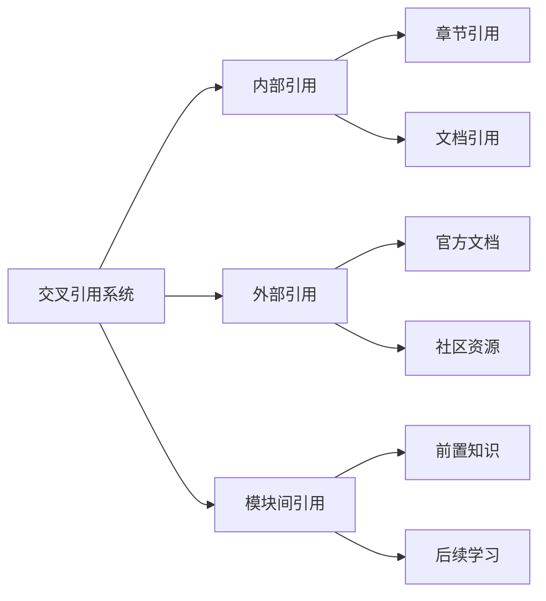
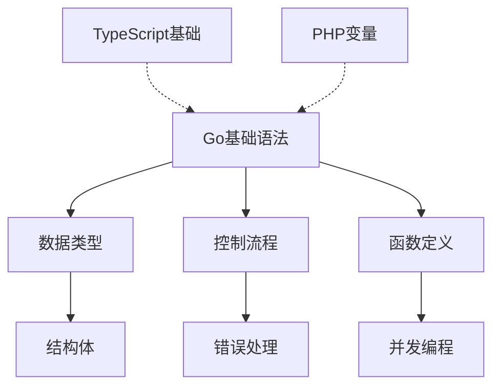

# Dev Quest 交叉引用系统

> 本文档定义了Dev Quest项目的文档交叉引用规范，帮助学习者快速找到相关内容，建立知识关联。

## 🎯 引用系统概览

### 引用类型


## 📋 引用格式规范

### 1. 内部引用

#### 章节引用
```markdown
### 当前文档内引用
- **基础概念**: [Go基础语法](#go基础语法)
- **实践指南**: [环境搭建](#环境搭建)
- **代码示例**: [Hello World示例](#hello-world示例)
```

#### 文档引用
```markdown
### 同模块内引用
- **相关概念**: [Go并发编程](../advanced-topics/go-general/01-concurrency/01-goroutine-patterns.md)
- **实战项目**: [REST API服务器](../../projects/01-rest-api-server.md)

### 跨模块引用
- **前端相关**: [Next.js基础教程](../../02-nextjs-frontend/basics/01-environment-setup.md)
- **部署指南**: [Docker部署](../../01-go-backend/deployment/01-docker-deployment.md)
```

### 2. 外部引用

#### 官方文档
```markdown
### Go生态
- **Go官方文档**: [Go Documentation](https://go.dev/doc/) - Go语言官方文档
- **Go标准库**: [Standard Library](https://pkg.go.dev/std) - Go标准库文档
- **Go模块**: [Go Modules](https://go.dev/blog/using-go-modules) - Go依赖管理

### Next.js生态
- **Next.js文档**: [Next.js 15 Documentation](https://nextjs.org/docs) - Next.js官方文档
- **React文档**: [React 19 Documentation](https://react.dev) - React官方文档
- **TypeScript**: [TypeScript Handbook](https://www.typescriptlang.org/docs/) - TypeScript官方文档
```

### 3. 模块间关联

#### 前置知识引用
```markdown
### 学习路径
**前置要求**:
- [ ] **Go基础**: [Go语言基础](../01-go-backend/basics/02-basic-syntax.md) ⭐⭐
- [ ] **Web基础**: [HTTP协议](../01-go-backend/standard-library/02-net-http.md) ⭐⭐
- [ ] **数据库**: [SQL基础](../01-go-backend/knowledge-points/07-gorm-orm-knowledge-points.md) ⭐⭐⭐
```

#### 后续学习引用
```markdown
### 进阶学习
**推荐后续**:
- 🚀 **微服务架构**: [微服务设计](../01-go-backend/advanced-topics/architecture/03-microservices-architecture.md)
- 🚀 **性能优化**: [Go性能调优](../01-go-backend/advanced-topics/go-general/03-performance/01-performance-tuning.md)
- 🚀 **云原生部署**: [Kubernetes部署](../01-go-backend/deployment/02-kubernetes-deployment.md)
```

## 🔗 智能引用系统

### 1. 自动引用标签

在文档头部添加引用信息：
```markdown
---
# 文档元数据
**模块**: 01-go-backend
**分类**: 基础知识
**难度**: ⭐⭐
**前置**: [Go环境搭建](01-environment-setup.md)
**后续**: [数据类型](03-data-types.md), [控制流程](04-control-flow.md)
**相关**: [02-nextjs-frontend TypeScript基础](../../02-nextjs-frontend/basics/02-typescript-fundamentals.md)
**标签**: #go #basics #syntax #variables
---
```

### 2. 知识图谱引用

```markdown
### 知识关联


### 3. 学习路径引用

```markdown
### 学习路径
**当前阶段**: Go基础 ⭐⭐
**学习进度**: 2/10 完成

**前后关联**:
- ⬅️ **上一课**: [环境搭建](01-environment-setup.md)
- ➡️ **下一课**: [数据类型](03-data-types.md)

**平行学习**:
- 🔄 **前端对应**: [TypeScript基础](../../02-nextjs-frontend/basics/02-typescript-fundamentals.md)
- 🔄 **语言对比**: [PHP变量](../../07-php-mastery/basics/02-variables-data-types.md)
```

## 📊 引用质量标准

### 引用有效性检查
- ✅ **链接可访问**: 目标文档存在且可访问
- ✅ **内容相关**: 引用内容与当前文档相关
- ✅ **难度匹配**: 引用文档难度适合当前学习者
- ✅ **版本一致**: 引用内容使用最新版本

### 引用频率优化
- ✅ **适度引用**: 避免过度引用影响阅读体验
- ✅ **重点突出**: 优先引用最相关的资源
- ✅ **分类清晰**: 按重要性分组引用
- ✅ **更新及时**: 定期检查和更新引用链接

## 🛠️ 实现方案

### 1. 文档结构映射

```
dev-quest/
├── 01-go-backend/
│   ├── basics/
│   │   ├── 01-environment-setup.md      → 前置: README.md
│   │   ├── 02-basic-syntax.md           → 前置: 01-environment-setup.md
│   │   ├── 03-data-types.md             → 前置: 02-basic-syntax.md
│   │   ├── 04-control-flow.md           → 前置: 03-data-types.md
│   │   └── 05-oop-concepts.md           → 前置: 04-control-flow.md
│   ├── frameworks/
│   │   ├── 01-gin-framework.md          → 前置: basics/
│   │   └── 02-echo-framework.md         → 平行: 01-gin-framework.md
│   └── advanced-topics/
│       ├── go-general/                  → 前置: frameworks/
│       ├── gin/                         → 前置: frameworks/01-gin-framework.md
│       └── architecture/                → 前置: advanced-topics/go-general/
├── 02-nextjs-frontend/
│   ├── basics/
│   │   ├── 01-environment-setup.md      → 前置: README.md
│   │   ├── 02-typescript-fundamentals.md → 前置: 01-environment-setup.md
│   │   └── 03-react-basics.md           → 前置: 02-typescript-fundamentals.md
│   └── frameworks/
│       └── 01-tailwind-css.md           → 前置: basics/
└── shared-resources/
    ├── cross-reference-system.md        ← 本文档
    ├── templates/document-template.md   ← 模板引用
    └── documentation-guidelines.md      ← 规范引用
```

### 2. 引用模板

#### README文档引用模板
```markdown
### 🔗 快速导航
**开始学习**:
- 📖 **新手入门**: [基础概念](basics/01-environment-setup.md) ⭐⭐
- 🛠️ **框架学习**: [Gin框架](frameworks/01-gin-framework.md) ⭐⭐⭐
- 🚀 **项目实战**: [REST API](projects/01-rest-api-server.md) ⭐⭐⭐⭐

**知识拓展**:
- 🔍 **深度专题**: [高级主题](advanced-topics/) ⭐⭐⭐⭐⭐
- 📚 **速查手册**: [知识点](knowledge-points/) ⭐⭐
- 🧪 **测试指南**: [测试工程](testing/) ⭐⭐⭐

**相关模块**:
- 🌐 **前端开发**: [Next.js教程](../02-nextjs-frontend/README.md)
- 📱 **小程序开发**: [Taro教程](../03-taro-miniprogram/README.md)
```

#### 具体文档引用模板
```markdown
### 📍 当前位置
**模块**: 01-go-backend → basics → 02-basic-syntax.md

**学习路径**:
- ⬅️ **上一课**: [环境搭建](01-environment-setup.md)
- 📍 **当前课**: **基础语法** ⭐⭐
- ➡️ **下一课**: [数据类型](03-data-types.md)

**相关内容**:
- 🔄 **练习**: [语法练习题](../../projects/01-rest-api-server.md#基础语法部分)
- 📖 **参考**: [Go官方语法文档](https://go.dev/ref/spec)
- 🔗 **对比**: [PHP语法对比](../../07-php-mastery/basics/03-syntax-control-structures.md)
```

## 🔄 维护和更新

### 定期检查任务
```markdown
### 月度检查清单
- [ ] 检查所有内部链接的有效性
- [ ] 验证外部链接的可访问性
- [ ] 更新过时的技术版本引用
- [ ] 补充缺失的相关引用
- [ ] 优化引用分类和组织

### 季度维护任务
- [ ] 全面审核引用系统的完整性
- [ ] 更新知识图谱和依赖关系
- [ ] 优化引用模板和格式
- [ ] 收集用户反馈并改进
- [ ] 同步最新技术发展动态
```

---

**文档版本**: v1.0.0
**最后更新**: 2025年10月
**维护团队**: Dev Quest Team

> 💡 **使用建议**:
> - 在编写新文档时，先确定相关的引用关系
> - 定期检查引用链接的有效性
> - 根据学习反馈优化引用结构和内容
> - 保持引用系统的简洁和实用性