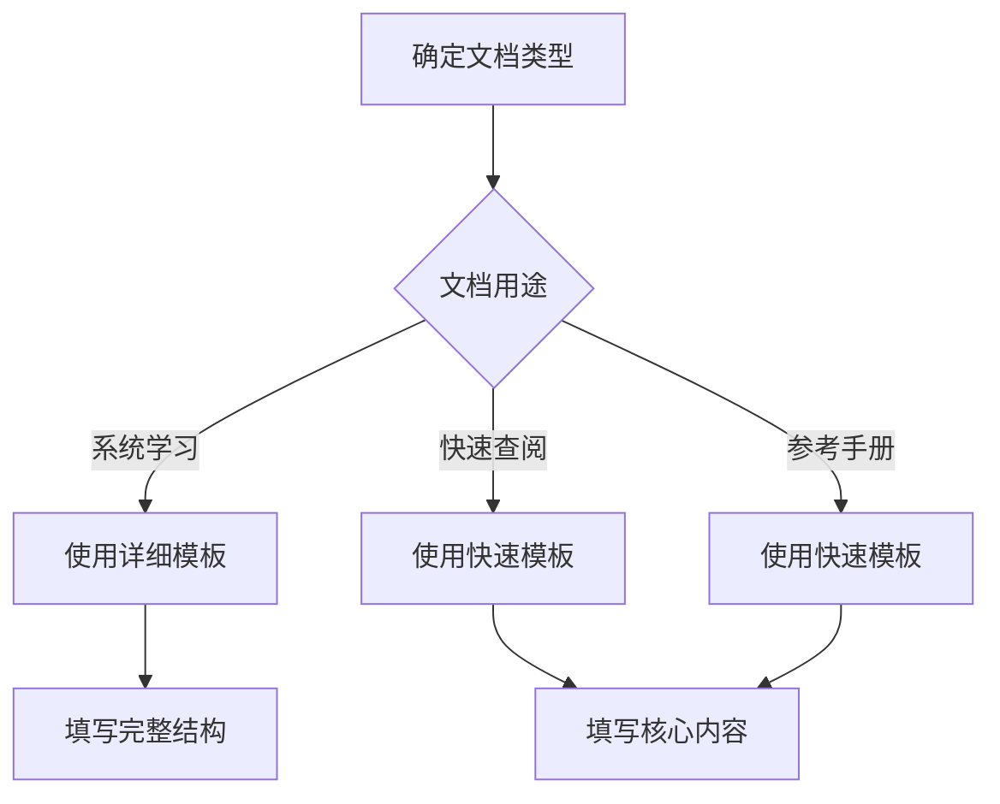

# Dev Quest 文档规范指南

> 本文档定义了Dev Quest项目的技术文档标准，确保所有文档保持高质量、一致性和易用性。

## 📋 文档分类与模板

### 1. 详细文档 (使用 [templates/document-template.md](../templates/document-template.md))
**适用场景**:
- 模块README文档
- 核心技术概念文档
- 完整教程和指南
- 项目实战文档

**特点**:
- 结构完整，内容丰富
- 包含学习目标、练习、最佳实践
- 适合系统学习

### 2. 快速参考文档 (使用 [templates/quick-template.md](../templates/quick-template.md))
**适用场景**:
- reference/ 字典条目（本模块知识字典）
- 速查表与故障排除
- API参考文档
- 配置说明

**特点**:
- 简洁明了，重点突出
- 快速查找和使用
- 适合日常查阅

## 🎯 文档质量标准

### 内容要求
- ✅ **准确性**: 技术内容准确无误
- ✅ **完整性**: 覆盖必要知识点
- ✅ **实用性**: 提供可操作的建议
- ✅ **时效性**: 使用最新版本技术
- ✅ **可读性**: 语言清晰，结构合理

### 结构要求
- ✅ **标题层次**: 使用标准的Markdown标题层级
- ✅ **目录结构**: 包含清晰的导航目录
- ✅ **代码示例**: 提供可运行的代码
- ✅ **图表支持**: 适当使用Mermaid图表
- ✅ **交叉引用**: 链接到相关文档

### 格式要求
- ✅ **Markdown语法**: 遵循标准Markdown语法
- ✅ **代码高亮**: 使用正确的语言标识
- ✅ **链接格式**: 使用相对路径链接
- ✅ **图片规范**: 使用适当的图片格式和大小

### 模式不变量小结（框架/版本绑定类文档必填）

凡以框架 API、版本绑定特性为主题的文档（`frameworks/`、`reference/framework-patterns/`、`framework-essentials/` 等），文末须附 **「模式不变量」** 小结：

- 3-5 条，每条一个**独立于框架与版本的架构原则**（如"缓存边界归服务端所有"、"状态归属其最小必要作用域"）
- 与正文中的版本绑定 API 形成对照：版本升级时只需核对 API 层，不变量层天然抗过时
- 不变量必须是本篇内容真实支撑的结论，不得为凑数泛化（宁缺毋滥）
- 反例：✗"好的代码很重要"；✓"服务端组件默认不参与 hydration，任何交互状态必须显式下沉到客户端边界"

## 📝 文档模板使用指南

### 模板选择


### 必填字段
**所有文档必须包含**:
- 文档标题和简介
- 难度评级和前置知识
- 最后更新日期
- 相关资源链接
- 交叉引用

**详细文档额外要求**:
- 学习目标清单
- 实践步骤
- 代码示例
- 练习任务

## 🔗 交叉引用系统

### 引用格式
```markdown
### 内部引用
- **章节引用**: [章节名称](#章节名称)
- **文档引用**: [文档标题](../path/to/document.md)

### 外部引用
- **官方文档**: [Go官方文档](https://go.dev/doc/)
- **GitHub项目**: [项目名称](https://github.com/user/repo)
```

### 引用规范
- ✅ 使用描述性链接文本
- ✅ 保持链接有效性
- ✅ 优先使用相对路径
- ✅ 添加链接说明

## 🏷️ 标签和分类系统

### 难度评级
与 [module-structure-guide.md](./module-structure-guide.md) 的三级标准保持一致：
- ⭐ **入门**: 首次学习该技术，基础概念
- ⭐⭐ **进阶**: 完成入门路径后，需要一些基础知识
- ⭐⭐⭐ **精通**: 生产实践与深度优化，需要扎实的编程基础

### 技术标签
```markdown
# 后端技术
`#go` `#gin` `#docker` `#kubernetes` `#microservices`

# 前端技术
`#react` `#nextjs` `#typescript` `#tailwindcss` `#vercel`

# 通用概念
`#best-practices` `#performance` `#security` `#testing` `#deployment`
```

## 📊 文档状态管理

### 状态标记
- ✅ **已完成**: 内容完整，经过审核
- 🚧 **进行中**: 正在编写或更新
- 📋 **计划中**: 已规划，待开始编写
- ⚠️ **需要更新**: 内容可能过时，需要维护
- ❌ **已废弃**: 不再维护，有替代方案

### 版本控制
```markdown
## 版本历史
- v1.0.0 (2025-10-10): 初始版本
- v1.1.0 (2025-XX-XX): 更新内容
- v2.0.0 (2025-XX-XX): 重大更新
```

### 🕐 技术基线声明（抗过时三层原则）

知识库内容按过时速度分三层，写作时先判断层级：

| 层级 | 内容类型 | 版本号 | 过时速度 |
|------|---------|--------|---------|
| **稳定层** | 概念定义、运行模型、权衡判断、选型对比（如"ORM vs SQL-first"） | ❌ 禁止出现具体版本号 | 5-10 年 |
| **半稳定层** | 架构模式、最佳实践、工程方法（如"测试金字塔"） | ⚠️ 尽量避免 | 2-5 年 |
| **易变层** | 版本号、安装命令、特性清单、API 签名 | ✅ 必须写，但**指向模块基线区块** | 6-18 个月 |

**基线声明规则**：

1. 每个模块 README 顶部维护"技术基线"区块（技术 / 版本 / 核实日期表格），是该模块全部版本号的**单一事实来源**
2. 易变层内容写版本号时，正文中注明"基线见模块 README"；模块整体刷新时只需更新基线区块 + `grep` 定位的易变层引用
3. 稳定层内容（选型判断、模型对比）是抗过时核心资产——主角框架更换时依然成立，优先投入
4. 基线核实日期使用 `YYYY-MM-DD` 格式，来源须为官方发布页或官方文档

## 🎨 写作风格指南

### 语言风格
- ✅ 使用简洁明了的语言
- ✅ 避免冗长复杂的句子
- ✅ 使用主动语态
- ✅ 保持一致的术语使用

### 代码示例
```go
// ✅ 好的示例
package main

import "fmt"

func main() {
    // 简单的Go程序
    fmt.Println("Hello, Dev Quest!")
}

// ❌ 避免的示例
package main
import "fmt";func main(){fmt.Println("Hello")} // 缺乏注释，格式不规范
```

### 注释说明
- ✅ 解释代码的作用
- ✅ 说明关键决策原因
- ✅ 提供使用场景
- ✅ 指出潜在问题

## 📋 文档审核清单

### 内容审核
- [ ] 技术内容准确无误
- [ ] 代码示例可正常运行
- [ ] 链接有效可访问
- [ ] 术语使用一致
- [ ] 结构层次清晰

### 格式审核
- [ ] Markdown语法正确
- [ ] 代码高亮正确
- [ ] 图片显示正常
- [ ] 目录链接有效
- [ ] 交叉引用完整

### 质量审核
- [ ] 学习目标明确
- [ ] 实践步骤清晰
- [ ] 示例具有代表性
- [ ] 练习难度适中
- [ ] 资源推荐有价值

## 🔄 维护流程

### 创建新文档
1. 选择合适的模板
2. 填写文档内容
3. 添加交叉引用
4. 更新相关索引
5. 提交审核

### 更新现有文档
1. 评估更新范围
2. 更新内容
3. 检查引用链接
4. 更新版本信息
5. 通知相关维护者

### 定期维护
- **每月**: 检查链接有效性
- **每季度**: 评估内容时效性
- **每半年**: 全面审核和更新

---

**文档版本**: v1.0.0
**最后更新**: 2026年9月
**维护团队**: Dev Quest Team

> 💡 **提示**: 本指南会根据项目发展持续更新，建议定期查阅最新版本。