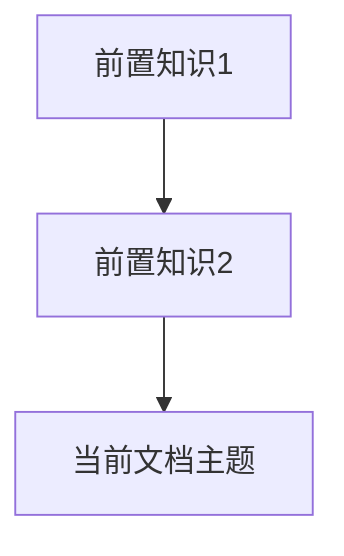
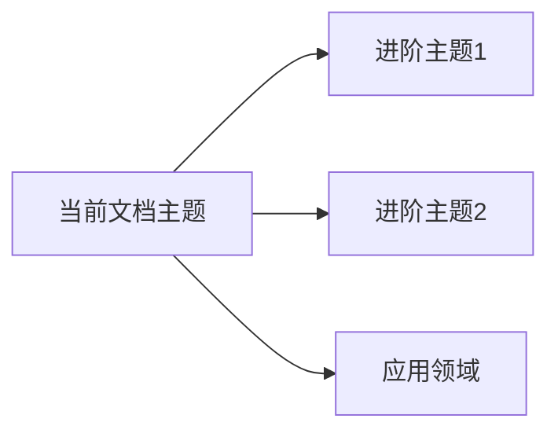

# 文档标题

> **文档简介**: 一句话概括本文档的核心内容和价值
>
> **目标读者**: 明确本文档适合哪类学习者（初级/中级/高级开发者）
>
> **前置知识**: 学习本文档需要具备的基础知识
>
> **预计时长**: 预计学习和实践所需时间

## 📚 文档元数据

| 属性 | 内容 |
|------|------|
| **模块** | `[所属模块]` |
| **分类** | `[知识分类]` |
| **难度** | ⭐⭐⭐ (1-5星评级) |
| **标签** | `#技术标签` `#概念标签` |
| **更新日期** | `YYYY年MM月` |
| **作者** | Dev Quest Team |
| **状态** | ✅ 已完成 / 🚧 进行中 / 📋 计划中 |

## 🎯 学习目标

完成本模块后，你将能够：

- ✅ **掌握核心概念**: [具体要掌握的概念]
- ✅ **实践能力**: [能够完成的实际任务]
- ✅ **解决问题**: [能够解决的具体问题类型]
- ✅ **进阶方向**: [为后续学习奠定的基础]

## 📋 目录

<!-- 使用TOC或手动维护目录 -->
- [核心概念](#核心概念)
- [实践指南](#实践指南)
- [代码示例](#代码示例)
- [最佳实践](#最佳实践)
- [常见问题](#常见问题)
- [相关资源](#相关资源)

---

## 🔍 核心概念

### 概念一：概念名称
**定义**: 清晰准确的概念定义

**关键特性**:
- 特性1：详细说明
- 特性2：详细说明
- 特性3：详细说明

**使用场景**:
- 场景1：具体应用情况
- 场景2：具体应用情况

### 概念二：概念名称
[按照相同结构继续]

---

## 🛠️ 实践指南

### 步骤一：准备工作
**目标**: 明确本步骤要达成的目标

**操作指南**:
1. 具体操作步骤1
2. 具体操作步骤2
3. 具体操作步骤3

**验证方法**: 如何确认本步骤完成正确

### 步骤二：核心实践
[按照相同结构继续]

---

## 💻 代码示例

### 示例一：基础用法
```go
// Go语言示例
package main

import "fmt"

func main() {
    // 代码注释说明
    fmt.Println("Hello, World!")
}
```

**关键点解析**:
- 代码结构说明
- 关键函数/方法解释
- 注意事项

### 示例二：高级用法
```typescript
// TypeScript示例
// 高级功能演示
```

---

## 🎨 最佳实践

### ✅ 推荐做法
- **实践1**: 具体的推荐做法及原因
- **实践2**: 具体的推荐做法及原因
- **实践3**: 具体的推荐做法及原因

### ❌ 避免陷阱
- **陷阱1**: 常见错误及解决方案
- **陷阱2**: 性能问题及优化建议
- **陷阱3**: 安全风险及防范措施

---

## ❓ 常见问题

### Q1: 常见问题标题？
**A**: 详细解答，包含：
- 问题分析
- 解决方案
- 代码示例（如需要）
- 预防措施

### Q2: 另一个常见问题？
[按照相同结构继续]

---

## 🔗 相关资源

### 📖 延伸阅读
- **官方文档**: [链接名称](URL) - 简要说明
- **推荐书籍**: 《书名》- 推荐理由
- **技术博客**: [文章标题](URL) - 核心价值

### 🛠️ 工具资源
- **开发工具**: [工具名称](URL) - 用途说明
- **在线平台**: [平台名称](URL) - 功能介绍
- **调试工具**: [工具名称](URL) - 使用场景

### 📹 学习资源
- **视频教程**: [教程标题](URL) - 时长和难度
- **在线课程**: [课程名称](URL) - 课程特色
- **实践项目**: [项目描述](URL) - 技术栈

---

## 🎯 练习与实践

### 练习一：基础练习
**目标**: 巩固基础概念

**任务要求**:
1. 具体任务1
2. 具体任务2
3. 具体任务3

**评估标准**: 如何判断练习完成质量

### 练习二：进阶练习
**目标**: 提升实战能力

**挑战任务**:
- 挑战1：具体挑战内容
- 挑战2：具体挑战内容

**提示**: 完成挑战的思路指导

---

## 📊 知识图谱

### 前置知识


### 后续学习


---

## 🔄 文档交叉引用

### 相关文档
- 📄 **[相关文档1]**: [链接到相关文档](../path/to/doc.md) - 关联说明
- 📄 **[相关文档2]**: [链接到相关文档](../path/to/doc.md) - 关联说明

### 参考章节
- 📖 **[本模块其他章节]**: [内部链接](#章节名称)
- 📖 **[其他模块相关内容]**: [外部链接](../../module/path/to/doc.md)

---

## 📝 总结

### 核心要点回顾
1. **要点1**: [总结关键学习点]
2. **要点2**: [总结关键学习点]
3. **要点3**: [总结关键学习点]

### 学习成果检查
- [ ] 是否理解了核心概念？
- [ ] 是否能够独立完成实践操作？
- [ ] 是否能够解决相关问题？
- [ ] 是否具备了进一步学习的基础？

---

## 🤝 贡献与反馈

### 内容改进
如果你发现本文档有改进空间，欢迎：
- 🐛 **报告问题**: 在Issues中提出具体问题
- 💡 **建议改进**: 提出修改建议和补充内容
- 📝 **参与贡献**: 提交PR完善文档内容

### 学习反馈
分享你的学习体验：
- ✅ **有用内容**: 哪些部分对你最有帮助
- ❓ **疑问点**: 哪些内容需要进一步澄清
- 🎯 **建议**: 希望增加什么内容

---

**文档状态**: ✅ 已完成 | 🚧 进行中 | 📋 计划中
**最后更新**: 2025年10月
**版本**: v1.0.0

---

> 💡 **学习建议**:
> - 建议先通读全文，了解整体结构
> - 重点阅读核心概念和最佳实践部分
> - 动手完成所有代码示例和练习
> - 遇到问题时查阅相关资源或提问
>
> 🎯 **下一步**: 完成本文档学习后，建议继续学习 [相关文档](相关链接)