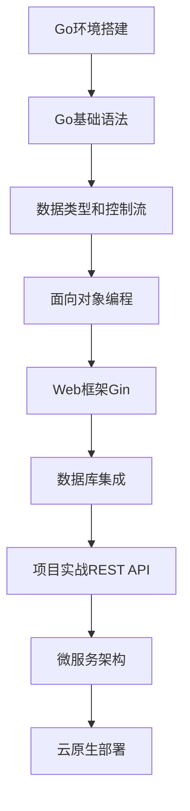
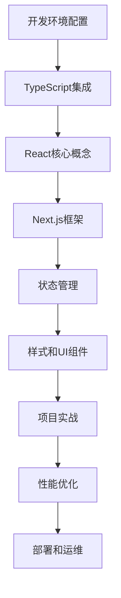
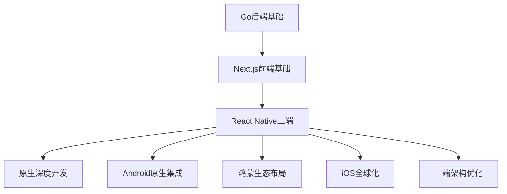
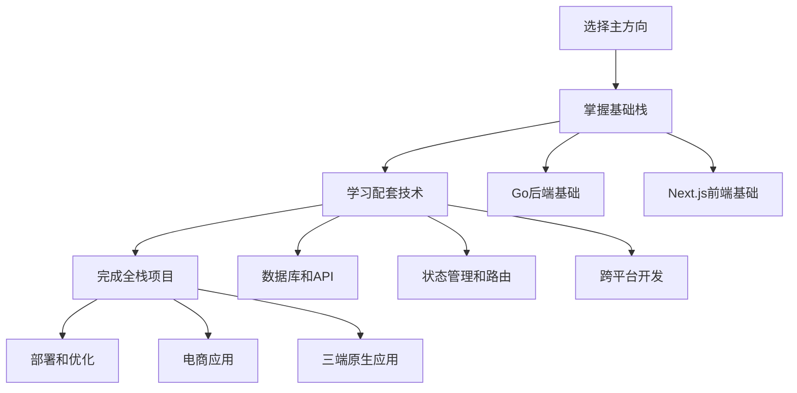

# Dev Quest 文档索引系统

> 📚 **智能文档导航**: 快速找到你需要的学习资源，建立知识关联，优化学习路径。

## 🎯 快速导航

### 按模块浏览
- 🚀 **[01 Go后端开发](#01-go后端开发)** - Go语言及后端技术 (已建设)
- 🌐 **[02 Next.js前端开发](#02-nextjs前端开发)** - React/Next.js现代前端 (已建设)
- 🔧 **[03 TanStack全家桶](#03-tanstack全家桶)** - 类型安全数据层 (已建设)
- 📱 **[04 React Native三端原生App](#04-react-native三端原生app)** - Android+iOS+鸿蒙原生开发 (已建设)
- 🤖 **[05 Kotlin Compose](#05-kotlin-compose)** - Android官方原生开发 (已建设)
- 🍎 **[06 SwiftUI](#06-swiftui)** - iOS官方原生开发 (已建设)
- 🐘 **[07-10 技术探索系列](#技术探索系列-07-10)** - PHP/Java/Node.js/Python (已建设)

### 按内容类型
- 📖 **[基础概念](#基础概念)** - 入门基础内容
- 🛠️ **[框架工具](#框架工具)** - 开发框架和工具
- 🚀 **[项目实战](#项目实战)** - 实际项目案例
- 📚 **[知识字典](#知识字典-reference)** - 全量参考手册
- 🔧 **[测试与部署](#测试与部署)** - 工程实践

---

## 01 Go后端开发

> 模块入口: [01-go-backend/README.md](../../01-go-backend/README.md) | 已按标准结构重构

### 📖 基础概念 (basics/)
| 文档 | 说明 |
|------|------|
| [环境搭建](../../01-go-backend/basics/01-environment-setup.md) | 开发环境配置 |
| [第一个程序](../../01-go-backend/basics/02-first-program.md) | Hello World与项目结构 |
| [变量与常量](../../01-go-backend/basics/03-variables-constants.md) | 类型系统基础 |
| [函数与方法](../../01-go-backend/basics/04-functions-methods.md) | 函数定义与使用 |
| [控制结构](../../01-go-backend/basics/05-control-structures.md) | 条件与循环 |
| [错误处理](../../01-go-backend/basics/06-error-handling.md) | Go错误处理哲学 |

### 🛠️ 框架工具 (frameworks/)
| 框架 | 文档 | 应用场景 |
|------|------|----------|
| **Gin基础** | [Gin框架基础](../../01-go-backend/frameworks/01-gin-framework-basics.md) | Web API开发入门 |
| **Gin进阶** | [Gin框架高级](../../01-go-backend/frameworks/02-gin-framework-advanced.md) | 中间件、路由进阶 |
| **GORM** | [GORM ORM完全指南](../../01-go-backend/frameworks/03-gorm-orm-complete.md) | 数据库ORM |
| **MongoDB** | [MongoDB Go驱动](../../01-go-backend/frameworks/04-mongodb-go-driver.md) | 文档数据库 |
| **Redis** | [Go Redis完全指南](../../01-go-backend/frameworks/05-go-redis-complete.md) | 缓存与消息 |

### 🚀 项目实战 (projects/)
| 项目 | 技术栈 | 说明 |
|------|--------|------|
| [REST API服务器](../../01-go-backend/projects/01-rest-api-server.md) | Gin + PostgreSQL | 完整的RESTful API |
| [微服务演示](../../01-go-backend/projects/02-microservices-demo.md) | Go + gRPC + Docker | 微服务架构示例 |
| [实时应用](../../01-go-backend/projects/03-real-time-app.md) | WebSocket + Redis | 实时通信应用 |
| [CLI工具](../../01-go-backend/projects/04-cli-tool.md) | Cobra + Viper | 命令行工具开发 |

### 📊 高级主题 (advanced-topics/)
| 文档 | 说明 |
|------|------|
| [RESTful设计模式](../../01-go-backend/advanced-topics/api-advanced/01-restful-patterns.md) | API设计最佳实践 |
| [GraphQL API](../../01-go-backend/advanced-topics/api-advanced/02-graphql-apis.md) | 现代API开发 |
| [微服务设计](../../01-go-backend/advanced-topics/architecture/01-microservices-design.md) | 分布式架构 |
| [并发编程模式](../../01-go-backend/advanced-topics/performance/01-concurrency-patterns.md) | 高级并发 |
| [性能调优](../../01-go-backend/advanced-topics/performance/02-performance-tuning.md) | 系统优化 |
| [安全最佳实践](../../01-go-backend/advanced-topics/security/01-security-best-practices.md) | 应用安全 |

### 📚 知识字典 (reference/)
| 分类 | 文档 |
|------|------|
| [语言核心概念](../../01-go-backend/reference/language-concepts/01-go-keywords.md) | Go关键字、内置函数、编程要点等6篇 |
| [框架核心要点](../../01-go-backend/reference/framework-essentials/01-gin-framework.md) | Gin、GORM要点2篇 |
| [库指南](../../01-go-backend/reference/library-guides/01-go-standard-library.md) | 标准库与三方库2篇 |
| [快速参考](../../01-go-backend/reference/quick-references/01-syntax-cheatsheet.md) | 语法速查、Web工具、故障排查3篇 |

### 🔧 测试与部署
| 分类 | 文档 |
|------|------|
| [测试工程](../../01-go-backend/testing/01-unit-testing.md) | 单元测试、Mock、集成测试、基准、TDD共5篇 |
| [部署运维](../../01-go-backend/deployment/01-containerization.md) | 容器化、CI/CD、K8s、可观测性共4篇 |

---

## 02 Next.js前端开发

> 模块入口: [02-nextjs-frontend/README.md](../../02-nextjs-frontend/README.md) | 已按标准结构重构

### 📖 基础概念 (basics/)
| 文档 | 说明 |
|------|------|
| [环境搭建](../../02-nextjs-frontend/basics/01-environment-setup.md) | 开发环境配置 |
| [第一个Next.js应用](../../02-nextjs-frontend/basics/02-first-nextjs-app.md) | 项目创建与结构 |
| [TypeScript集成](../../02-nextjs-frontend/basics/03-typescript-integration.md) | 类型系统集成 |
| [布局与路由](../../02-nextjs-frontend/basics/04-layouts-routing.md) | App Router路由体系 |
| [Tailwind样式](../../02-nextjs-frontend/basics/05-styling-with-tailwind.md) | 样式解决方案 |
| [数据获取基础](../../02-nextjs-frontend/basics/06-data-fetching-basics.md) | Server/Client组件数据流 |
| [状态管理](../../02-nextjs-frontend/basics/07-state-management.md) | 应用状态管理 |
| [第一个项目](../../02-nextjs-frontend/basics/08-first-project.md) | 综合练习项目 |

### 🛠️ 框架工具 (frameworks/)
| 框架 | 文档 | 应用场景 |
|------|------|----------|
| **Next.js 15** | [Next.js 15完全指南](../../02-nextjs-frontend/frameworks/01-nextjs-15-complete.md) | 框架全貌 |
| **React 19** | [React 19集成](../../02-nextjs-frontend/frameworks/02-react-19-integration.md) | 新特性应用 |
| **全栈模式** | [全栈开发模式](../../02-nextjs-frontend/frameworks/03-full-stack-patterns.md) | 前后端一体开发 |
| **性能优化** | [性能优化实践](../../02-nextjs-frontend/frameworks/04-performance-optimization.md) | 框架级优化 |

### 🚀 项目实战 (projects/)
| 项目 | 技术栈 | 说明 |
|------|--------|------|
| [企业官网](../../02-nextjs-frontend/projects/01-corporate-landing.md) | Next.js + Tailwind | 营销页面 |
| [电商商店](../../02-nextjs-frontend/projects/02-ecommerce-store.md) | Next.js + 支付集成 | 电商平台 |
| [数据仪表板](../../02-nextjs-frontend/projects/03-dashboard-analytics.md) | Next.js + 图表 | 数据可视化 |
| [SaaS平台](../../02-nextjs-frontend/projects/04-saas-platform.md) | Next.js + 认证 + 多租户 | 完整全栈应用 |

### 📊 高级主题 (advanced-topics/)
| 文档 | 说明 |
|------|------|
| [GraphQL与Apollo](../../02-nextjs-frontend/advanced-topics/api-integration/01-graphql-apollo.md) | API集成 |
| [扩展模式](../../02-nextjs-frontend/advanced-topics/architecture/01-scaling-patterns.md) | 大型应用架构 |
| [微前端](../../02-nextjs-frontend/advanced-topics/architecture/02-micro-frontends.md) | 前端架构 |
| [Core Web Vitals](../../02-nextjs-frontend/advanced-topics/performance/01-core-web-vitals.md) | Web性能 |
| [高级优化](../../02-nextjs-frontend/advanced-topics/performance/02-advanced-optimization.md) | 深度性能优化 |
| [安全最佳实践](../../02-nextjs-frontend/advanced-topics/security/01-security-best-practices.md) | 前端安全 |

### 📚 知识字典 (reference/)
| 分类 | 文档 |
|------|------|
| [语言概念](../../02-nextjs-frontend/reference/language-concepts/01-react-syntax-cheatsheet.md) | React语法、Next.js API、TS类型等5篇 |
| [框架模式](../../02-nextjs-frontend/reference/framework-patterns/01-app-router-patterns.md) | 路由、组件、数据获取等7篇 |
| [开发工具](../../02-nextjs-frontend/reference/development-tools/01-testing-tools.md) | 测试、样式、包管理、调试工具4篇 |
| [性能优化](../../02-nextjs-frontend/reference/performance-optimization/01-rendering-optimization.md) | 渲染与包体积优化2篇 |

### 🔧 测试与部署
| 分类 | 文档 |
|------|------|
| [测试工程](../../02-nextjs-frontend/testing/01-unit-testing.md) | 单元、组件、E2E、性能测试共4篇 |
| [部署运维](../../02-nextjs-frontend/deployment/01-vercel-deployment.md) | Vercel、Docker、CI/CD、监控共4篇 |

---

## 03 TanStack全家桶

> 模块入口: [03-tanstack-stack/README.md](../../03-tanstack-stack/README.md) | 已按标准结构建设（38篇）

| 目录 | 象限 | 篇数 | 入口 |
|------|------|------|------|
| 📖 [basics/](../../03-tanstack-stack/basics/) | 教程 | 8 | [环境搭建](../../03-tanstack-stack/basics/01-environment-setup.md) |
| 📚 [reference/](../../03-tanstack-stack/reference/) | 字典 | 11 | [language-concepts/](../../03-tanstack-stack/reference/language-concepts/) |
| 🏗️ [frameworks/](../../03-tanstack-stack/frameworks/) | 操作指南 | 4 | [Query入门](../../03-tanstack-stack/frameworks/01-tanstack-query-basics.md) |
| 🚀 [projects/](../../03-tanstack-stack/projects/) | 操作指南 | 4 | [TODO应用](../../03-tanstack-stack/projects/01-todo-app.md) |
| 🧪 [testing/](../../03-tanstack-stack/testing/) | 操作指南 | 4 | [单元测试](../../03-tanstack-stack/testing/01-unit-testing.md) |
| 🚀 [deployment/](../../03-tanstack-stack/deployment/) | 操作指南 | 3 | [CI/CD流水线](../../03-tanstack-stack/deployment/01-ci-cd-pipelines.md) |
| 🎓 [advanced-topics/](../../03-tanstack-stack/advanced-topics/) | 解释 | 4 | [缓存架构](../../03-tanstack-stack/advanced-topics/architecture/01-cache-architecture.md) |

---

## 04 React Native三端原生App

> 模块入口: [04-multiplatform-apps/README.md](../../04-multiplatform-apps/README.md) | 已按标准结构建设（37篇 + 历史规划文档）

| 目录 | 象限 | 篇数 | 入口 |
|------|------|------|------|
| 📖 [basics/](../../04-multiplatform-apps/basics/) | 教程 | 8 | [环境搭建](../../04-multiplatform-apps/basics/01-environment-setup.md) |
| 📚 [reference/](../../04-multiplatform-apps/reference/) | 字典 | 11 | [language-concepts/](../../04-multiplatform-apps/reference/language-concepts/) |
| 🏗️ [frameworks/](../../04-multiplatform-apps/frameworks/) | 操作指南 | 4 | [React Native入门](../../04-multiplatform-apps/frameworks/01-react-native-basics.md) |
| 🚀 [projects/](../../04-multiplatform-apps/projects/) | 操作指南 | 4 | [TODO应用](../../04-multiplatform-apps/projects/01-todo-app.md) |
| 🧪 [testing/](../../04-multiplatform-apps/testing/) | 操作指南 | 3 | [单元测试](../../04-multiplatform-apps/testing/01-unit-testing.md) |
| 🚀 [deployment/](../../04-multiplatform-apps/deployment/) | 操作指南 | 3 | [EAS构建](../../04-multiplatform-apps/deployment/01-eas-build.md) |
| 🎓 [advanced-topics/](../../04-multiplatform-apps/advanced-topics/) | 解释 | 4 | [新架构解析](../../04-multiplatform-apps/advanced-topics/architecture/01-new-architecture.md) |

---

## 05 Kotlin Compose

> 模块入口: [05-kotlin-compose/README.md](../../05-kotlin-compose/README.md) | 已按标准结构建设（37篇 + 历史规划文档）

| 目录 | 象限 | 篇数 | 入口 |
|------|------|------|------|
| 📖 [basics/](../../05-kotlin-compose/basics/) | 教程 | 8 | [环境搭建](../../05-kotlin-compose/basics/01-environment-setup.md) |
| 📚 [reference/](../../05-kotlin-compose/reference/) | 字典 | 11 | [language-concepts/](../../05-kotlin-compose/reference/language-concepts/) |
| 🏗️ [frameworks/](../../05-kotlin-compose/frameworks/) | 操作指南 | 4 | [Compose入门](../../05-kotlin-compose/frameworks/01-compose-basics.md) |
| 🚀 [projects/](../../05-kotlin-compose/projects/) | 操作指南 | 4 | [笔记应用](../../05-kotlin-compose/projects/01-notes-app.md) |
| 🧪 [testing/](../../05-kotlin-compose/testing/) | 操作指南 | 3 | [单元测试](../../05-kotlin-compose/testing/01-unit-testing.md) |
| 🚀 [deployment/](../../05-kotlin-compose/deployment/) | 操作指南 | 3 | [发布构建](../../05-kotlin-compose/deployment/01-release-build.md) |
| 🎓 [advanced-topics/](../../05-kotlin-compose/advanced-topics/) | 解释 | 4 | [应用架构](../../05-kotlin-compose/advanced-topics/architecture/01-app-architecture.md) |

---

## 06 SwiftUI

> 模块入口: [06-swift-swiftui/README.md](../../06-swift-swiftui/README.md) | 已按标准结构建设（37篇 + 历史规划文档）

| 目录 | 象限 | 篇数 | 入口 |
|------|------|------|------|
| 📖 [basics/](../../06-swift-swiftui/basics/) | 教程 | 8 | [环境搭建](../../06-swift-swiftui/basics/01-environment-setup.md) |
| 📚 [reference/](../../06-swift-swiftui/reference/) | 字典 | 11 | [language-concepts/](../../06-swift-swiftui/reference/language-concepts/) |
| 🏗️ [frameworks/](../../06-swift-swiftui/frameworks/) | 操作指南 | 4 | [SwiftUI入门](../../06-swift-swiftui/frameworks/01-swiftui-basics.md) |
| 🚀 [projects/](../../06-swift-swiftui/projects/) | 操作指南 | 4 | [笔记应用](../../06-swift-swiftui/projects/01-notes-app.md) |
| 🧪 [testing/](../../06-swift-swiftui/testing/) | 操作指南 | 3 | [单元测试](../../06-swift-swiftui/testing/01-unit-testing.md) |
| 🚀 [deployment/](../../06-swift-swiftui/deployment/) | 操作指南 | 3 | [应用发布](../../06-swift-swiftui/deployment/01-app-release.md) |
| 🎓 [advanced-topics/](../../06-swift-swiftui/advanced-topics/) | 解释 | 4 | [应用架构](../../06-swift-swiftui/advanced-topics/architecture/01-app-architecture.md) |

---

## 技术探索系列 (07-10)

### 07 PHP精通之路

> 模块入口: [07-php-mastery/README.md](../../07-php-mastery/README.md) | 已按标准结构建设（37篇）

| 目录 | 象限 | 篇数 | 入口 |
|------|------|------|------|
| 📖 [basics/](../../07-php-mastery/basics/) | 教程 | 8 | [环境搭建](../../07-php-mastery/basics/01-environment-setup.md) |
| 📚 [reference/](../../07-php-mastery/reference/) | 字典 | 11 | [language-concepts/](../../07-php-mastery/reference/language-concepts/) |
| 🏗️ [frameworks/](../../07-php-mastery/frameworks/) | 操作指南 | 4 | [Laravel入门](../../07-php-mastery/frameworks/01-laravel-basics.md) |
| 🚀 [projects/](../../07-php-mastery/projects/) | 操作指南 | 4 | [TODO API](../../07-php-mastery/projects/01-todo-api.md) |
| 🧪 [testing/](../../07-php-mastery/testing/) | 操作指南 | 3 | [单元测试](../../07-php-mastery/testing/01-unit-testing.md) |
| 🚀 [deployment/](../../07-php-mastery/deployment/) | 操作指南 | 3 | [容器化部署](../../07-php-mastery/deployment/01-docker-deployment.md) |
| 🎓 [advanced-topics/](../../07-php-mastery/advanced-topics/) | 解释 | 4 | [Laravel架构](../../07-php-mastery/advanced-topics/architecture/01-laravel-architecture.md) |

### 08 Java知识回顾

> 模块入口: [08-java-revisited/README.md](../../08-java-revisited/README.md) | 已按标准结构建设（37篇）

| 目录 | 象限 | 篇数 | 入口 |
|------|------|------|------|
| 📖 [basics/](../../08-java-revisited/basics/) | 教程 | 8 | [环境搭建](../../08-java-revisited/basics/01-environment-setup.md) |
| 📚 [reference/](../../08-java-revisited/reference/) | 字典 | 11 | [language-concepts/](../../08-java-revisited/reference/language-concepts/) |
| 🏗️ [frameworks/](../../08-java-revisited/frameworks/) | 操作指南 | 4 | [Spring Boot入门](../../08-java-revisited/frameworks/01-spring-boot-basics.md) |
| 🚀 [projects/](../../08-java-revisited/projects/) | 操作指南 | 4 | [TODO API](../../08-java-revisited/projects/01-todo-api.md) |
| 🧪 [testing/](../../08-java-revisited/testing/) | 操作指南 | 3 | [单元测试](../../08-java-revisited/testing/01-unit-testing.md) |
| 🚀 [deployment/](../../08-java-revisited/deployment/) | 操作指南 | 3 | [容器化部署](../../08-java-revisited/deployment/01-docker-deployment.md) |
| 🎓 [advanced-topics/](../../08-java-revisited/advanced-topics/) | 解释 | 4 | [分层架构](../../08-java-revisited/advanced-topics/architecture/01-layered-architecture.md) |

### 09 Node.js后端探索

> 模块入口: [09-nodejs-backend/README.md](../../09-nodejs-backend/README.md) | 已按标准结构建设（37篇）

| 目录 | 象限 | 篇数 | 入口 |
|------|------|------|------|
| 📖 [basics/](../../09-nodejs-backend/basics/) | 教程 | 8 | [环境搭建](../../09-nodejs-backend/basics/01-environment-setup.md) |
| 📚 [reference/](../../09-nodejs-backend/reference/) | 字典 | 11 | [language-concepts/](../../09-nodejs-backend/reference/language-concepts/) |
| 🏗️ [frameworks/](../../09-nodejs-backend/frameworks/) | 操作指南 | 4 | [Express入门](../../09-nodejs-backend/frameworks/01-express-basics.md) |
| 🚀 [projects/](../../09-nodejs-backend/projects/) | 操作指南 | 4 | [TODO API](../../09-nodejs-backend/projects/01-todo-api.md) |
| 🧪 [testing/](../../09-nodejs-backend/testing/) | 操作指南 | 3 | [单元测试](../../09-nodejs-backend/testing/01-unit-testing.md) |
| 🚀 [deployment/](../../09-nodejs-backend/deployment/) | 操作指南 | 3 | [容器化部署](../../09-nodejs-backend/deployment/01-docker-deployment.md) |
| 🎓 [advanced-topics/](../../09-nodejs-backend/advanced-topics/) | 解释 | 4 | [服务架构](../../09-nodejs-backend/advanced-topics/architecture/01-service-architecture.md) |

### 10 Python发现之旅

> 模块入口: [10-python-discovery/README.md](../../10-python-discovery/README.md) | 已按标准结构建设（37篇）

| 目录 | 象限 | 篇数 | 入口 |
|------|------|------|------|
| 📖 [basics/](../../10-python-discovery/basics/) | 教程 | 8 | [环境搭建](../../10-python-discovery/basics/01-environment-setup.md) |
| 📚 [reference/](../../10-python-discovery/reference/) | 字典 | 11 | [language-concepts/](../../10-python-discovery/reference/language-concepts/) |
| 🏗️ [frameworks/](../../10-python-discovery/frameworks/) | 操作指南 | 4 | [FastAPI入门](../../10-python-discovery/frameworks/01-fastapi-basics.md) |
| 🚀 [projects/](../../10-python-discovery/projects/) | 操作指南 | 4 | [TODO API](../../10-python-discovery/projects/01-todo-api.md) |
| 🧪 [testing/](../../10-python-discovery/testing/) | 操作指南 | 3 | [单元测试](../../10-python-discovery/testing/01-unit-testing.md) |
| 🚀 [deployment/](../../10-python-discovery/deployment/) | 操作指南 | 3 | [容器化部署](../../10-python-discovery/deployment/01-docker-deployment.md) |
| 🎓 [advanced-topics/](../../10-python-discovery/advanced-topics/) | 解释 | 4 | [项目架构](../../10-python-discovery/advanced-topics/architecture/01-project-architecture.md) |

---

## 🔍 智能搜索

### 按技术标签搜索
- `#go` - Go语言相关内容
- `#nextjs` - Next.js框架内容
- `#react` - React相关内容
- `#typescript` - TypeScript类型系统
- `#react-native` - React Native跨平台
- `#harmonyos` - 鸿蒙操作系统
- `#cross-platform` - 跨平台开发
- `#docker` - 容器化技术
- `#kubernetes` - K8s编排
- `#database` - 数据库相关
- `#api` - API开发
- `#testing` - 测试相关
- `#deployment` - 部署运维

### 按应用场景搜索
- **Web开发**: Web应用、API服务
- **移动开发**: 跨平台应用、三端原生
- **微服务**: 分布式系统、服务间通信
- **数据处理**: 数据库、缓存、消息队列
- **DevOps**: 部署、监控、运维
- **性能优化**: 调优、缓存、负载均衡

### 按学习目标搜索
- **入门**: 从零开始学习某技术
- **进阶**: 提升现有技能
- **实战**: 完成具体项目
- **架构**: 系统设计能力
- **跨平台**: 三端应用开发能力

---

## 📚 学习路径推荐

### 后端开发路径

```mermaid
graph TD
    A[Go环境搭建] --> B[Go基础语法]
    B --> C[数据类型和控制流]
    C --> D[面向对象编程]
    D --> E[Web框架Gin]
    E --> F[数据库集成]
    F --> G[项目实战REST API]
    G --> H[微服务架构]
    H --> I[云原生部署]
```

### 前端开发路径

```mermaid
graph TD
    A[开发环境配置] --> B[TypeScript集成]
    B --> C[React核心概念]
    C --> D[Next.js框架]
    D --> E[状态管理]
    E --> F[样式和UI组件]
    F --> G[项目实战]
    G --> H[性能优化]
    H --> I[部署和运维]
```

### 移动开发路径 (跨平台+原生覆盖)

```mermaid
graph TD
    A[Go后端基础] --> B[Next.js前端基础]
    B --> C[React Native三端]
    C --> D[原生深度开发]

    C --> D1[Android原生集成]
    C --> D2[鸿蒙生态布局]
    C --> D3[iOS全球化]
    C --> D4[三端架构优化]
```

### 全栈开发路径 (现代化技术栈)

```mermaid
graph TD
    A[选择主方向] --> B[掌握基础栈]
    B --> C[学习配套技术]
    C --> D[完成全栈项目]
    D --> E[部署和优化]

    B --> B1[Go后端基础]
    B --> B2[Next.js前端基础]

    C --> C1[数据库和API]
    C --> C2[状态管理和路由]
    C --> C4[跨平台开发]

    D --> D1[电商应用]
    D --> D4[三端原生应用]
```

---

## 📖 使用指南

### 如何使用本索引
1. **确定学习目标**: 根据你的目标和当前水平选择合适的内容
2. **遵循学习路径**: 按推荐路径循序渐进，确保基础扎实
3. **结合实战项目**: 理论学习与实践项目相结合
4. **利用交叉引用**: 通过相关链接建立知识关联
5. **定期回顾总结**: 定期回顾已学内容，巩固知识

### 学习建议
- 🎯 **目标明确**: 每次学习都有明确的目标
- 📝 **做好笔记**: 记录重要概念和代码片段
- 🛠️ **动手实践**: 理论学习后立即动手实践
- 🔗 **建立关联**: 主动寻找知识点之间的关联
- 📊 **跟踪进度**: 定期检查学习进度和效果
- 🚀 **技术平衡**: 跨平台效率与原生深度的平衡

---

**索引版本**: v3.0.0
**最后更新**: 2026年9月
**维护团队**: Dev Quest Team

> 💡 **提示**: 本索引与实际目录结构对齐，01-10 全部模块已按 Diátaxis 双轴标准建设（basics 教程 + reference 字典 + 工程域 + advanced-topics）。建议结合[学习进度](../progress/learning-progress.md)选择合适的模块开始学习！
