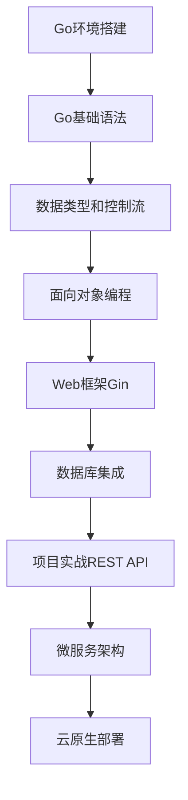
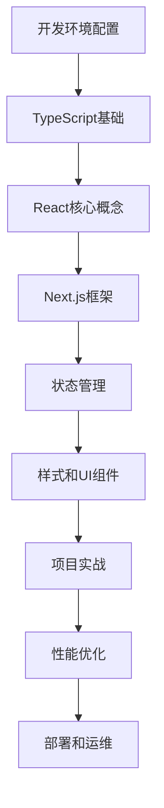
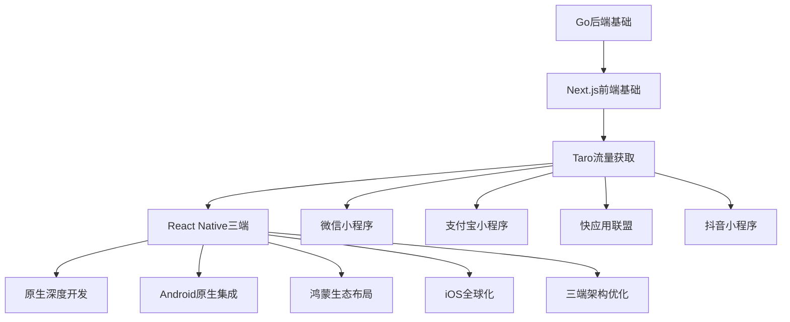
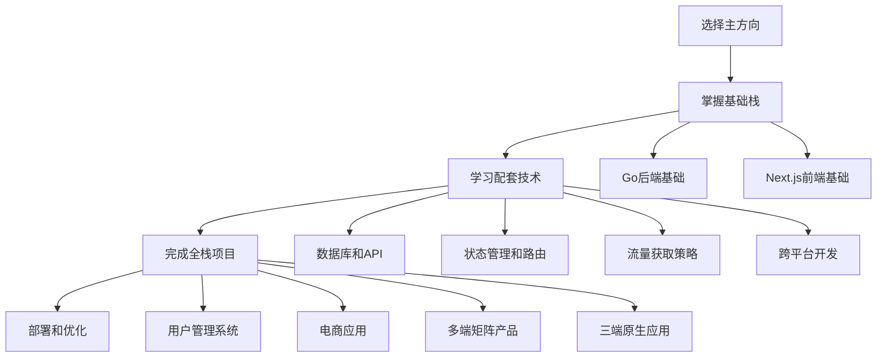
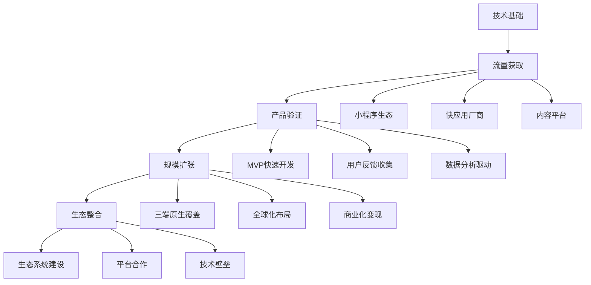

# Dev Quest 文档索引系统

> 📚 **智能文档导航**: 快速找到你需要的学习资源，建立知识关联，优化学习路径。

## 🎯 快速导航

### 按模块浏览
- 🚀 **[01 Go后端开发](#01-go后端开发)** - Go语言及后端技术
- 🌐 **[02 Next.js前端开发](#02-nextjs前端开发)** - React/Next.js现代前端
- 📱 **[03 Taro小程序+快应用全覆盖](#03-taro小程序+快应用全覆盖)** - 流量优先全覆盖策略
- 🔧 **[04 React Native三端原生App](#04-react-native三端原生app)** - Android+iOS+鸿蒙原生开发
- 📱 **[05 Android原生开发](#05-android原生开发)** - Android应用开发
- 🍎 **[06 iOS原生开发](#06-ios原生开发)** - iOS应用开发

### 按技能水平
- ⭐ **[初级内容](#初级内容⭐)** - 入门基础概念
- ⭐⭐ **[初中级内容](#初中级内容⭐⭐)** - 基础进阶
- ⭐⭐⭐ **[中级内容](#中级内容⭐⭐⭐)** - 核心技能
- ⭐⭐⭐⭐ **[中高级内容](#中高级内容⭐⭐⭐⭐)** - 高级特性
- ⭐⭐⭐⭐⭐ **[高级内容](#高级内容⭐⭐⭐⭐⭐)** - 专家级主题

### 按内容类型
- 📖 **[基础概念](#基础概念)** - 核心知识点
- 🛠️ **[框架工具](#框架工具)** - 开发框架和工具
- 🚀 **[项目实战](#项目实战)** - 实际项目案例
- 📊 **[架构设计](#架构设计)** - 系统架构和设计
- 🔧 **[工程实践](#工程实践)** - 开发流程和最佳实践

---

## 01 Go后端开发

### 📖 基础概念
| 文档 | 难度 | 前置知识 | 预计时长 | 关联内容 |
|------|------|----------|----------|----------|
| [环境搭建](../01-go-backend/basics/01-environment-setup.md) | ⭐⭐ | 无 | 1小时 | [环境配置](../01-go-backend/knowledge-points/01-go-keywords.md) |
| [基础语法](../01-go-backend/basics/02-basic-syntax.md) | ⭐⭐ | 环境搭建 | 2小时 | [数据类型](../01-go-backend/basics/03-data-types.md) |
| [数据类型](../01-go-backend/basics/03-data-types.md) | ⭐⭐ | 基础语法 | 2小时 | [控制流程](../01-go-backend/basics/04-control-flow.md) |
| [控制流程](../01-go-backend/basics/04-control-flow.md) | ⭐⭐ | 数据类型 | 3小时 | [函数定义](../01-go-backend/basics/05-oop-concepts.md) |
| [面向对象](../01-go-backend/basics/05-oop-concepts.md) | ⭐⭐⭐ | 控制流程 | 3小时 | [接口设计](../01-go-backend/knowledge-points/05-go-programming-knowledge-points.md) |

### 🛠️ 框架工具
| 框架 | 文档 | 难度 | 应用场景 | 相关项目 |
|------|------|------|----------|----------|
| **Gin** | [Gin框架指南](../01-go-backend/frameworks/01-gin-framework.md) | ⭐⭐⭐ | Web API开发 | [REST API服务器](../01-go-backend/projects/01-rest-api-server.md) |
| **Echo** | [Echo框架指南](../01-go-backend/frameworks/02-echo-framework.md) | ⭐⭐⭐ | 高性能Web服务 | [微服务演示](../01-go-backend/projects/02-microservices-demo.md) |
| **Fiber** | [Fiber框架指南](../01-go-backend/frameworks/03-fiber-framework.md) | ⭐⭐⭐⭐ | 极速Web框架 | [实时聊天应用](../01-go-backend/projects/03-real-time-chat.md) |
| **gqlgen** | [GraphQL开发](../01-go-backend/frameworks/04-gqlgen-graphql.md) | ⭐⭐⭐⭐ | GraphQL API | [全栈应用](../01-go-backend/projects/04-fullstack-app.md) |

### 🚀 项目实战
| 项目 | 技术栈 | 难度 | 功能描述 | 学习重点 |
|------|--------|------|----------|----------|
| [REST API服务器](../01-go-backend/projects/01-rest-api-server.md) | Gin + PostgreSQL | ⭐⭐⭐ | 完整的RESTful API | API设计、数据库集成 |
| [微服务演示](../01-go-backend/projects/02-microservices-demo.md) | Go + gRPC + Docker | ⭐⭐⭐⭐ | 微服务架构示例 | 服务通信、容器化 |
| [实时聊天应用](../01-go-backend/projects/03-real-time-chat.md) | WebSocket + Redis | ⭐⭐⭐⭐ | 实时通信应用 | WebSocket、并发处理 |
| [CLI工具](../01-go-backend/projects/04-cli-tool.md) | Cobra + Viper | ⭐⭐⭐ | 命令行工具开发 | CLI框架、配置管理 |

### 📊 架构设计
| 主题 | 文档 | 难度 | 应用场景 | 相关技术 |
|------|------|------|----------|----------|
| [分层架构](../01-go-backend/advanced-topics/architecture/01-architecture-patterns/01-layered-architecture.md) | ⭐⭐⭐⭐ | 企业应用 | DDD、Clean Architecture |
| [微服务架构](../01-go-backend/advanced-topics/architecture/01-architecture-patterns/03-microservices-architecture.md) | ⭐⭐⭐⭐⭐ | 分布式系统 | gRPC、服务发现、负载均衡 |
| [系统设计](../01-go-backend/advanced-topics/architecture/02-system-design/01-system-design-principles.md) | ⭐⭐⭐⭐ | 大型系统 | 可扩展性、高可用性 |
| [分布式系统](../01-go-backend/advanced-topics/architecture/03-distributed-systems/01-distributed-fundamentals.md) | ⭐⭐⭐⭐⭐ | 云原生应用 | 分布式存储、一致性算法 |

---

## 02 Next.js前端开发

### 📖 基础概念
| 文档 | 难度 | 前置知识 | 预计时长 | 关联内容 |
|------|------|----------|----------|----------|
| [环境搭建](../02-nextjs-frontend/basics/01-environment-setup.md) | ⭐⭐ | Node.js基础 | 1小时 | [TypeScript基础](../02-nextjs-frontend/basics/02-typescript-fundamentals.md) |
| [TypeScript基础](../02-nextjs-frontend/basics/02-typescript-fundamentals.md) | ⭐⭐ | JavaScript基础 | 3小时 | [React基础](../02-nextjs-frontend/basics/03-react-basics.md) |
| [React基础](../02-nextjs-frontend/basics/03-react-basics.md) | ⭐⭐⭐ | TypeScript | 4小时 | [Next.js路由](../02-nextjs-frontend/basics/04-nextjs-routing.md) |
| [Next.js路由](../02-nextjs-frontend/basics/04-nextjs-routing.md) | ⭐⭐⭐ | React基础 | 3小时 | [样式解决方案](../02-nextjs-frontend/basics/05-styling-solutions.md) |
| [样式解决方案](../02-nextjs-frontend/basics/05-styling-solutions.md) | ⭐⭐ | 路由基础 | 2小时 | [Tailwind CSS](../02-nextjs-frontend/frameworks/01-tailwind-css.md) |

### 🛠️ 框架工具
| 框架 | 文档 | 难度 | 应用场景 | 相关项目 |
|------|------|------|----------|----------|
| **Tailwind CSS** | [Tailwind指南](../02-nextjs-frontend/frameworks/01-tailwind-css.md) | ⭐⭐ | 样式框架 | [博客平台](../02-nextjs-frontend/projects/01-blog-platform.md) |
| **状态管理** | [状态管理方案](../02-nextjs-frontend/frameworks/02-state-management.md) | ⭐⭐⭐ | 应用状态 | [电商仪表板](../02-nextjs-frontend/projects/02-ecommerce-dashboard.md) |
| **表单处理** | [表单处理指南](../02-nextjs-frontend/frameworks/03-form-handling.md) | ⭐⭐⭐ | 表单开发 | [用户管理系统](../02-nextjs-frontend/projects/04-fullstack-app.md) |
| **UI组件库** | [UI组件库集成](../02-nextjs-frontend/frameworks/05-ui-libraries.md) | ⭐⭐⭐ | 组件开发 | [设计系统](../02-nextjs-frontend/projects/03-real-time-app.md) |

### 🚀 项目实战
| 项目 | 技术栈 | 难度 | 功能描述 | 学习重点 |
|------|--------|------|----------|----------|
| [博客平台](../02-nextjs-frontend/projects/01-blog-platform.md) | Next.js + MDX | ⭐⭐⭐ | 静态博客系统 | SSG、MDX集成 |
| [电商仪表板](../02-nextjs-frontend/projects/02-ecommerce-dashboard.md) | Next.js + Chart.js | ⭐⭐⭐⭐ | 数据可视化 | 图表集成、数据管理 |
| [实时应用](../02-nextjs-frontend/projects/03-real-time-app.md) | WebSocket + Pusher | ⭐⭐⭐⭐ | 实时协作应用 | 实时通信、状态同步 |
| [全栈应用](../02-nextjs-frontend/projects/04-fullstack-app.md) | Next.js + Prisma | ⭐⭐⭐⭐⭐ | 完整全栈应用 | 数据库、认证、部署 |

---

## 03 Taro小程序+快应用全覆盖

### 📖 基础概念
| 文档 | 难度 | 前置知识 | 预计时长 | 关联内容 |
|------|------|----------|----------|----------|
| [环境搭建](../03-taro-miniprogram/basics/01-environment-setup.md) | ⭐⭐ | Node.js基础 | 1小时 | [Taro基础概念](../03-taro-miniprogram/basics/02-taro-fundamentals.md) |
| [Taro基础概念](../03-taro-miniprogram/basics/02-taro-fundamentals.md) | ⭐⭐ | 环境搭建 | 2小时 | [React在Taro中](../03-taro-miniprogram/basics/03-react-in-taro.md) |
| [React在Taro中](../03-taro-miniprogram/basics/03-react-in-taro.md) | ⭐⭐⭐ | Taro基础 | 3小时 | [UI样式解决方案](../03-taro-miniprogram/basics/04-ui-styling.md) |
| [UI样式解决方案](../03-taro-miniprogram/basics/04-ui-styling.md) | ⭐⭐ | React基础 | 2小时 | [平台适配原理](../03-taro-miniprogram/basics/05-platform-adapter.md) |
| [平台适配原理](../03-taro-miniprogram/basics/05-platform-adapter.md) | ⭐⭐⭐ | UI样式 | 3小时 | [Taro框架概述](../03-taro-miniprogram/knowledge-points/taro-core/01-framework-overview.md) |

### 🛠️ 框架工具
| 框架 | 文档 | 难度 | 应用场景 | 相关项目 |
|------|------|------|----------|----------|
| **Taro UI组件库** | [UI组件库集成](../03-taro-miniprogram/frameworks/01-ui-component-libraries.md) | ⭐⭐ | 小程序UI开发 | [社交电商](../03-taro-miniprogram/projects/01-social-ecommerce.md) |
| **状态管理方案** | [状态管理方案](../03-taro-miniprogram/frameworks/02-state-management-solutions.md) | ⭐⭐⭐ | 应用状态管理 | [内容电商](../03-taro-miniprogram/projects/02-content-commerce.md) |
| **数据获取** | [数据获取](../03-taro-miniprogram/frameworks/03-data-fetching.md) | ⭐⭐⭐ | API集成 | [本地生活服务](../03-taro-miniprogram/projects/03-local-services.md) |
| **表单处理** | [表单处理](../03-taro-miniprogram/frameworks/04-form-handling.md) | ⭐⭐⭐ | 表单开发 | [快应用策略](../03-taro-miniprogram/projects/04-quickapp-strategy.md) |

### 🚀 项目实战
| 项目 | 技术栈 | 难度 | 功能描述 | 学习重点 |
|------|--------|------|----------|----------|
| [社交电商](../03-taro-miniprogram/projects/01-social-ecommerce.md) | Taro + 微信+支付宝 | ⭐⭐⭐ | 社交功能+电商 | 微信生态、支付集成 |
| [内容电商](../03-taro-miniprogram/projects/02-content-commerce.md) | Taro + 抖音+快应用 | ⭐⭐⭐⭐ | 内容+电商融合 | 短视频内容、厂商合作 |
| [本地生活服务](../03-taro-miniprogram/projects/03-local-services.md) | Taro + 全平台覆盖 | ⭐⭐⭐⭐⭐ | 本地服务+多端 | 全平台适配、地理位置 |

### 📊 平台策略
| 平台 | 文档 | 难度 | 用户规模 | 商业价值 |
|------|------|------|----------|----------|
| [微信小程序](../03-taro-miniprogram/knowledge-points/platform-apis/01-wechat-apis.md) | ⭐⭐ | 10亿+用户 | 社交生态、支付体系 |
| [支付宝小程序](../03-taro-miniprogram/knowledge-points/platform-apis/02-alipay-apis.md) | ⭐⭐ | 8亿+用户 | 支付场景、B端服务 |
| [抖音小程序](../03-taro-miniprogram/knowledge-points/platform-apis/03-douyin-apis.md) | ⭐⭐⭐ | 6亿+用户 | 内容流量、年轻用户 |
| [快应用联盟](../03-taro-miniprogram/knowledge-points/platform-apis/04-quickapp-apis.md) | ⭐⭐⭐ | 数亿+用户 | 系统预装、厂商支持 |

---

## 04 React Native三端原生App

### 📖 基础概念
| 文档 | 难度 | 前置知识 | 预计时长 | 关联内容 |
|------|------|----------|----------|----------|
| [环境搭建](../04-multiplatform-apps/basics/01-environment-setup.md) | ⭐⭐⭐ | Node.js + React基础 | 2小时 | [RN基础概念](../04-multiplatform-apps/basics/02-react-native-fundamentals.md) |
| [React Native基础](../04-multiplatform-apps/basics/02-react-native-fundamentals.md) | ⭐⭐⭐ | 环境搭建 | 3小时 | [组件和属性](../04-multiplatform-apps/basics/03-components-and-props.md) |
| [组件和属性](../04-multiplatform-apps/basics/03-components-and-props.md) | ⭐⭐⭐ | RN基础 | 4小时 | [状态和生命周期](../04-multiplatform-apps/basics/04-state-and-lifecycle.md) |
| [状态和生命周期](../04-multiplatform-apps/basics/04-state-and-lifecycle.md) | ⭐⭐⭐⭐ | 组件开发 | 3小时 | [导航基础](../04-multiplatform-apps/basics/05-navigation-basics.md) |
| [导航基础](../04-multiplatform-apps/basics/05-navigation-basics.md) | ⭐⭐⭐ | 状态管理 | 2小时 | [导航库](../04-multiplatform-apps/frameworks/01-navigation-libraries.md) |

### 🛠️ 框架工具
| 框架 | 文档 | 难度 | 应用场景 | 相关项目 |
|------|------|------|----------|----------|
| **React Navigation** | [导航库](../04-multiplatform-apps/frameworks/01-navigation-libraries.md) | ⭐⭐⭐ | 路由导航 | [社交网络App](../04-multiplatform-apps/projects/01-social-networking-app.md) |
| **状态管理** | [状态管理方案](../04-multiplatform-apps/frameworks/02-state-management-solutions.md) | ⭐⭐⭐⭐ | 应用状态 | [生产力工具App](../04-multiplatform-apps/projects/02-productivity-app.md) |
| **UI组件库** | [UI组件库](../04-multiplatform-apps/frameworks/03-ui-component-libraries.md) | ⭐⭐⭐ | UI开发 | [电商App](../04-multiplatform-apps/projects/03-ecommerce-app.md) |
| **网络库** | [网络库](../04-multiplatform-apps/frameworks/04-networking-libraries.md) | ⭐⭐ | API调用 | [教育App](../04-multiplatform-apps/projects/04-education-app.md) |

### 🚀 项目实战
| 项目 | 技术栈 | 难度 | 功能描述 | 学习重点 |
|------|--------|------|----------|----------|
| [社交网络App](../04-multiplatform-apps/projects/01-social-networking-app.md) | RN + 三端原生模块 | ⭐⭐⭐⭐ | 三端社交网络 | 相机集成、消息推送 |
| [生产力工具App](../04-multiplatform-apps/projects/02-productivity-app.md) | RN + 原生功能 | ⭐⭐⭐⭐ | 效率工具应用 | 文件管理、系统集成 |
| [电商App](../04-multiplatform-apps/projects/03-ecommerce-app.md) | RN + 支付集成 | ⭐⭐⭐⭐⭐ | 移动电商平台 | 支付SDK、安全认证 |
| [教育App](../04-multiplatform-apps/projects/04-education-app.md) | RN + 多媒体 | ⭐⭐⭐⭐ | 在线教育平台 | 音视频、实时交互 |

### 📊 平台集成
| 平台 | 文档 | 难度 | 特色功能 | 学习重点 |
|------|------|------|----------|----------|
| [Android深度集成](../04-multiplatform-apps/advanced-topics/platform-integration/01-android-deep-integration.md) | ⭐⭐⭐⭐ | 原生模块、系统API | Kotlin开发、性能优化 |
| [鸿蒙生态集成](../04-multiplatform-apps/advanced-topics/platform-integration/02-harmony-ecosystem.md) | ⭐⭐⭐⭐⭐ | RNOH、新兴生态 | 鸿蒙特性、厂商合作 |
| [iOS生态集成](../04-multiplatform-apps/advanced-topics/platform-integration/03-ios-ecosystem.md) | ⭐⭐⭐⭐ | Swift原生模块 | iOS特性、App Store |

---

## 按难度分类

### 初级内容 ⭐
适合编程初学者或刚接触该技术栈的学习者

**Go后端**:
- [环境搭建](../01-go-backend/basics/01-environment-setup.md) - 开发环境配置
- [基础语法](../01-go-backend/basics/02-basic-syntax.md) - Go语言基础
- [数据类型](../01-go-backend/basics/03-data-types.md) - 类型系统

**前端开发**:
- [环境搭建](../02-nextjs-frontend/basics/01-environment-setup.md) - 开发工具配置
- [样式解决方案](../02-nextjs-frontend/basics/05-styling-solutions.md) - CSS基础

**移动开发**:
- [Taro环境搭建](../03-taro-miniprogram/basics/01-environment-setup.md) - Taro开发环境
- [React Native环境搭建](../04-multiplatform-apps/basics/01-environment-setup.md) - RN开发环境

### 初中级内容 ⭐⭐
需要一些编程基础，适合有一定经验的学习者

**Go后端**:
- [控制流程](../01-go-backend/basics/04-control-flow.md) - 条件和循环
- [标准库](../01-go-backend/standard-library/01-fmt-io.md) - 常用库使用
- [Gin框架基础](../01-go-backend/frameworks/01-gin-framework.md) - Web框架入门

**前端开发**:
- [TypeScript基础](../02-nextjs-frontend/basics/02-typescript-fundamentals.md) - 类型系统
- [Tailwind CSS](../02-nextjs-frontend/frameworks/01-tailwind-css.md) - 样式框架

**移动开发**:
- [Taro基础概念](../03-taro-miniprogram/basics/02-taro-fundamentals.md) - Taro框架基础
- [React Native基础](../04-multiplatform-apps/basics/02-react-native-fundamentals.md) - RN核心概念

### 中级内容 ⭐⭐⭐
需要扎实的编程基础，适合有经验的开发者

**Go后端**:
- [面向对象编程](../01-go-backend/basics/05-oop-concepts.md) - Go的OOP
- [并发编程](../01-go-backend/advanced-topics/go-general/01-concurrency/01-goroutine-patterns.md) - Goroutine和Channel
- [数据库集成](../01-go-backend/projects/01-rest-api-server.md) - 实战项目

**前端开发**:
- [React基础](../02-nextjs-frontend/basics/03-react-basics.md) - 组件和Hooks
- [状态管理](../02-nextjs-frontend/frameworks/02-state-management.md) - 应用状态
- [API集成](../02-nextjs-frontend/frameworks/04-data-fetching.md) - 数据获取

**移动开发**:
- [Taro React组件开发](../03-taro-miniprogram/basics/03-react-in-taro.md) - Taro中React应用
- [React Native组件开发](../04-multiplatform-apps/basics/03-components-and-props.md) - RN组件系统
- [小程序平台适配](../03-taro-miniprogram/basics/05-platform-adapter.md) - 多平台适配

### 中高级内容 ⭐⭐⭐⭐
需要项目经验，适合高级开发者

**Go后端**:
- [微服务架构](../01-go-backend/advanced-topics/architecture/01-architecture-patterns/03-microservices-architecture.md) - 分布式系统
- [性能优化](../01-go-backend/advanced-topics/go-general/03-performance/01-performance-tuning.md) - 性能调优
- [容器化部署](../01-go-backend/deployment/01-docker-deployment.md) - Docker和K8s

**前端开发**:
- [Next.js高级特性](../02-nextjs-frontend/advanced-topics/nextjs-advanced/01-app-router-advanced.md) - App Router深入
- [性能优化](../02-nextjs-frontend/advanced-topics/performance/01-core-web-vitals.md) - Web性能
- [企业级应用](../02-nextjs-frontend/projects/04-fullstack-app.md) - 大型项目

**移动开发**:
- [小程序商业化实战](../03-taro-miniprogram/projects/01-social-ecommerce.md) - 社交电商开发
- [React Native三端集成](../04-multiplatform-apps/projects/01-social-networking-app.md) - 三端原生应用
- [鸿蒙生态集成](../04-multiplatform-apps/advanced-topics/platform-integration/02-harmony-ecosystem.md) - 鸿蒙新兴生态

### 高级内容 ⭐⭐⭐⭐⭐
需要深入理解，适合专家级开发者

**Go后端**:
- [分布式系统](../01-go-backend/advanced-topics/architecture/03-distributed-systems/01-distributed-fundamentals.md) - 分布式理论
- [系统设计](../01-go-backend/advanced-topics/architecture/02-system-design/01-system-design-principles.md) - 大型系统设计
- [云原生实践](../01-go-backend/deployment/03-cloud-deployment.md) - 云平台部署

**前端开发**:
- [微前端架构](../02-nextjs-frontend/advanced-topics/architecture/01-micro-frontends.md) - 前端架构
- [工程化实践](../02-nextjs-frontend/advanced-topics/engineering/01-monorepo-management.md) - 前端工程
- [DevOps集成](../02-nextjs-frontend/advanced-topics/engineering/04-dev-ops-integration.md) - 部署运维

**移动开发**:
- [全平台矩阵运营](../03-taro-miniprogram/projects/05-multiplatform-matrix.md) - 全平台商业化
- [React Native原生模块](../04-multiplatform-apps/advanced-topics/native-modules/01-android-native-modules.md) - 深度原生集成
- [三端架构优化](../04-multiplatform-apps/advanced-topics/cross-platform-architecture/01-code-sharing-strategies.md) - 跨平台架构

---

## 🔍 智能搜索

### 按技术标签搜索
- `#go` - Go语言相关内容
- `#nextjs` - Next.js框架内容
- `#react` - React相关内容
- `#typescript` - TypeScript类型系统
- `#taro` - Taro跨平台框架
- `#react-native` - React Native跨平台
- `#harmonyos` - 鸿蒙操作系统
- `#cross-platform` - 跨平台开发
- `#miniprogram` - 小程序开发
- `#docker` - 容器化技术
- `#kubernetes` - K8s编排
- `#database` - 数据库相关
- `#api` - API开发
- `#testing` - 测试相关
- `#deployment` - 部署运维

### 按应用场景搜索
- **Web开发**: Web应用、API服务
- **流量获取**: 小程序、快应用、内容平台
- **移动开发**: 跨平台应用、三端原生
- **商业化**: 电商、社交、支付、广告
- **微服务**: 分布式系统、服务间通信
- **数据处理**: 数据库、缓存、消息队列
- **DevOps**: 部署、监控、运维
- **性能优化**: 调优、缓存、负载均衡
- **新兴生态**: 鸿蒙应用、厂商合作

### 按学习目标搜索
- **入门**: 从零开始学习某技术
- **进阶**: 提升现有技能
- **实战**: 完成具体项目
- **架构**: 系统设计能力
- **面试**: 技术面试准备
- **流量获取**: 小程序和快应用用户增长
- **跨平台**: 三端应用开发能力
- **商业化**: 产品变现和市场策略

---

## 📚 学习路径推荐

### 后端开发路径

### 前端开发路径

### 移动开发路径 (流量优先+三端覆盖)

### 全栈开发路径 (现代化技术栈)

### 商业化产品路径 (市场导向)

---

## 📖 使用指南

### 如何使用本索引
1. **确定学习目标**: 根据你的目标和当前水平选择合适的内容
2. **遵循学习路径**: 按推荐路径循序渐进，确保基础扎实
3. **结合实战项目**: 理论学习与实践项目相结合
4. **利用交叉引用**: 通过相关链接建立知识关联
5. **定期回顾总结**: 定期回顾已学内容，巩固知识

### 学习建议
- 🎯 **目标明确**: 每次学习都有明确的目标
- 📝 **做好笔记**: 记录重要概念和代码片段
- 🛠️ **动手实践**: 理论学习后立即动手实践
- 🔗 **建立关联**: 主动寻找知识点之间的关联
- 📊 **跟踪进度**: 定期检查学习进度和效果
- 📱 **流量思维**: 优先考虑用户获取和平台特性
- 🚀 **技术平衡**: 跨平台效率与原生深度的平衡
- 💼 **商业导向**: 技术学习结合商业目标

---

**索引版本**: v2.1.0
**最后更新**: 2025年10月
**维护团队**: Dev Quest Team

> 💡 **提示**: 本索引已更新至最新03-04模块设计，包含"流量优先+三端覆盖"的新学习策略。建议结合新的学习路径，从流量获取开始，逐步掌握跨平台原生开发能力！